# Практическое задание 1. Организация удалённого доступа в OC Linux.

## Основные теоретические сведения

**Цель:** Ознакомиться на практике со средствами удаленного управления в операционной системе Linux. Приобрести опыт и навыки управления удаленным доступом посредством ssh.

## Теоретическая часть

## Задания к практической работе

Каждую выполненную вам команду и результат её работы поместите в отчёт в виде скриншота.

1. Создайте новую виртуальную машину и установите Ubuntu Desktop или используйте существующую. Образ можно скачать на официальном [сайте](https://ubuntu.com/download/desktop). В процессе установки можно оставить настройки по умолчанию. Инструкцию с комментариями по каждому шагу можно найти тут: https://losst.pro/ustanovka-ubuntu-22-04.  
   В процессе установки укажите **уникальное** имя пользователя. Совпадение вашего имени пользователя с чужим будет расцениваться как не выполнение работы.  
   Не забудьте установить Дополнения гостевой ОС, для более комфортной работы с системой.
   
2. Создайте новую виртуальную машину и установите Ubuntu Server или используйте существующую. Образ можно скачать на официальном [сайте](https://ubuntu.com/server). В процессе установки можно оставить настройки по умолчанию. Инструкцию с комментариями по каждому шагу можно найти тут: https://losst.pro/ustanovka-ubuntu-server-20-04.  
   В процессе установки укажите уникальное имя пользователя.

3. После установки, перезагрузите сервер и залогиньтесь используя имя пользователя и пароль указанные в процессе установки.

4. Обновление индекса пакетов и обновите устаревшие: `sudo apt-get update && sudo apt-get upgrade`

5. Затем убедитесь, что ssh-сервер установлен и запущен: `systemctl status ssh`. Вывод должен быть примерно такой:  
   

6. Если ssh-сервер не установлен, то установите его и добавьте в автозагрузку ([подробнее](https://losst.pro/ustanovka-ssh-ubuntu-16-04)):  
   ```bash
   sudo apt install openssh-server
   sudo systemctl enable sshd
   ```

7. Прежде чем заняться настройкой ssh-подключения попробуем просто подключится к серверу с другой машины. Но прямо сейчас мы не сможем это сделать, т.к. VirtualBox по умолчанию для каждой виртуальной машины создаёт отдельную сеть с [NAT](https://youtu.be/L1JtmAiSaFQ). Т.е. машина имеет доступ из сети наружу, а снаружи к машине никто доступ не имеет.

### Доступ за NAT через проброс портов

Периодически возникает задача подучить доступ к машине, которая находится за NAT. Например у вас белый внешний IP-адрес и роутер, который создаёт локальную сеть. Вы хотите разрешить доступ из интернета к серверу, который у вас находится во внутренней сети и соответственно не имеет своего внешнего IP. Большинство современных роутеров позволяют настроить проброс порта *N* с внешнего (белого) IP на порт *K* внутреннего IP, что позволит подключится к серверу прослушивающему порт *K* на внутреннем IP посылая запросы на порт *N* внешнего IP.

8. В VirtualBox откройте настройки машины с Ubuntu Server (саму машину можно не выключать) и на вкладке "Сеть" в настройках первого адаптера, в разделе "Дополнительно" нажмите кнопку "Проброс портов":  
   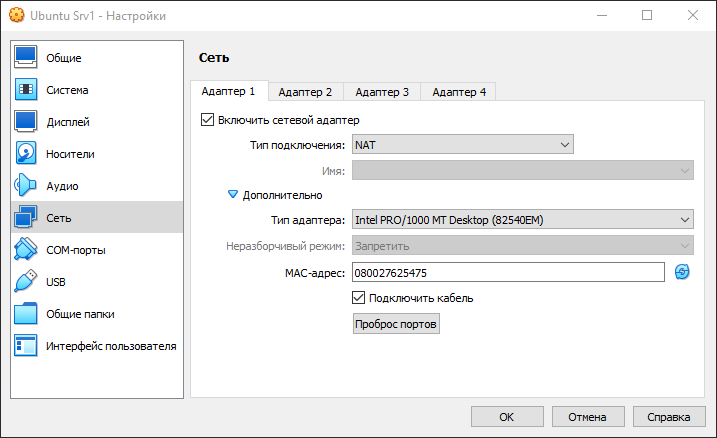

9. В появившемся окне нажмите иконку с "+" и введите требуемую информацию:  
   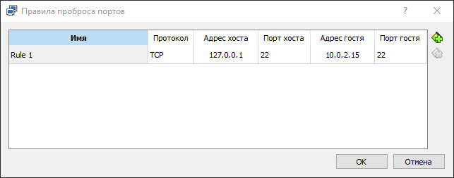
   - Адрес хоста - ip-адрес машины на которой запущен VirtualBox. Можно указать конкретный ip присвоенный вашей машине, а можно 127.0.0.1 - стандартный ip-адрес, который есть у каждой машины и указывающий на текущую машину;
   - Порт хоста - порт на хвостовой машине который пробрасываем в виртуальную. К этому порту мы будем подключатся. В принципе можно указать любой **не занятый** порт, но для простоты, укажем 22 (порт по умолчанию для подключения по ssh);
   - Адрес гостя - ip-адрес виртуальной машины. Чтобы его узнать посмотрите список сетевых интерфейсов командой `ip a`. Кроме интерфейса с ip-адресом 127.0.0.1 (это НЕ тот, что мы вводили ранее) должен быть второй - реальный ip-адрес который был выдан Ubuntu Server-у в локальной сети которую создал для него VirtualBox:  
     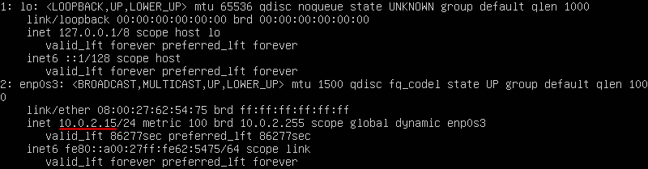
   - Порт гостя - порт на виртуальной машине, который пробрасываем наружу. Здесь нужно указать тот порт который слушает наш ssh-сервер. По умолчанию - это 22 порт;

#### Проверка подключения по ssh

10. Теперь убедимся, что мы можем из хостовой системы подключится к серверу по ssh. Для выполнения этого пункта выберите один из указанных ниже ssh-клиентов.  
    В Unix подобных ОС можно воспользоваться стандартной утилитой `ssh`. Если у вас **хостовая** система Linux или MacOS, то введите в терминале:  
    
    ```bash
    ssh имя_пользователя@ip_адрес_сервера
    ```
    
    Здесь, в качестве имени пользователя нужно ввести ваш логин на Ubuntu Server-е, а, вместо ip-адреса сервера нужно ввести `127.0.0.1` (т.е. эта машина). Т.к. мы пробросили 22 порт этой хостовой машины на 22 порт виртуальной, то все пакеты пойдут туда и мы подключимся к Ubuntu Server-у.
    
    Для подключения из Windows, можно воспользоваться одним из вариантов:
    
       - Начиная с Windows 10 в системе присутствует компонент OpenSSH (хотя может быть отключён), поэтому в ней присутствуют все утилиты из этого набора (т.е. такие же как и в Unix системах). Поэтому вы можете воспользоваться утилитой `ssh` которая доступна через терминал cmd или PowerShell;
    
       - Если вы установили утилиту git, то в комплекте с ней обычно устанавливается терминал, который можно открыть через пункт контекстного меню "Git Bash Here". В этом терминале тоже есть стандартный ssh-клиент;
    
       - В качестве альтернативы можно воспользоваться клиентом PuTTY или его улучшенной версией [KiTTY](https://www.fosshub.com/KiTTY.html) (есть portable версия, чтобы не устанавливать). Запустите его и укажите ip-адрес сервера и  22:  
         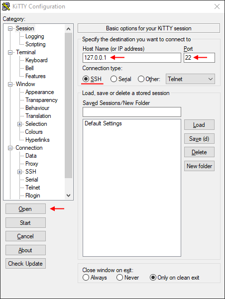
         
         Преимущество KiTTY заключается в том, что можно полностью настроить соединение и сохранить его при помощи кнопки Save. В дальнейшем можно будет подключиться просто дважды щелкнув по имени нужного сервера в списке.
    
11. Если подключение будет установлено успешно, то вы увидите предупреждение, о том, что вы первый раз подключаетесь к указанному хосту и вопрос, действительно ли мы уверены, что это тот самый компьютер, к которому мы хотим подключаться. Ответьте согласием (нужно ввести yes полностью) и в дальнейшем это предупреждение не будет выводится, т.к. клиент запомнит указанный хост.  
    Информация о всех известных хостах, на Unix-системах, хранится в рабочем каталоге в файле `~/.ssh/known_hosts`. Каждый раз, когда мы подключаемся по протоколу ssh к серверу, ssh клиент проверяет совпадает ли **публичный ключ**, который нам прислал сервер в этот раз, с тем который был прошлый раз и если это не так, то в подключении будет отказано (возможно это злые хацкеры прикидываются вашим сервером).

12. В зависимости от того при помощи какой программы вы подключались у вас запросят имя пользователя и пароль или только пароль. Если всё прошло успешно, вы должны увидеть приветственное сообщение и изменение приглашения к вводу. Теперь все ваши команды будут выполняться на сервере.

13. Введите команду `exit`, чтобы отключится от сервера.

### Доступ к серверу в сети без NAT

В большинстве случаев вы будете подключатся к серверам у которых есть либо белый ip (например VDS) либо отдельный ip в пределах вашей локальной сети. Смоделируем эту ситуацию.

14. Измените тип сетевого подключения виртуальной машины на **Сетевой мост**. Это приведёт к тому, что виртуальная машина подключится к вашему роутеру как отдельное устройство и в результате хостовая и виртуальная машины будут в одной локальной сети которую создаёт роутер.  
    Чтобы это сделать и окне VurtualBox откройте "Настройки" виртуальной машины и в разделе "Сеть" выберите [Тип подключения](https://losst.pro/nastrojka-seti-virtualbox) "Сетевой мост":  
    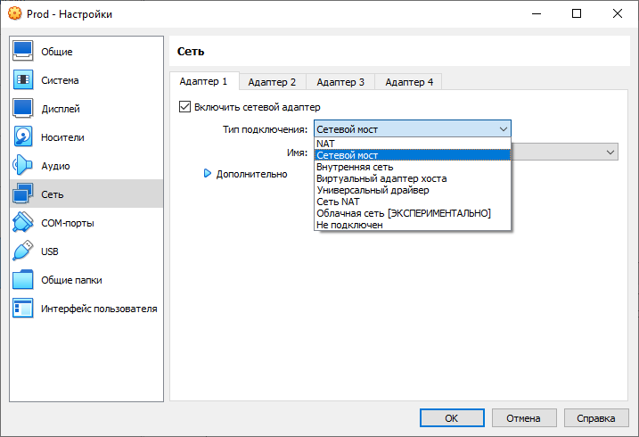

15. Посмотрите список сетевых интерфейсов: `ip a` чтобы узнать новый ip-адрес Ubuntu Server-а. В моём случае роутер выдал серверу такой ip:  
    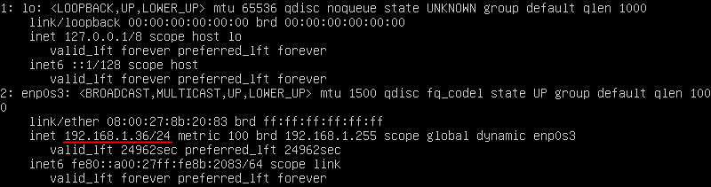

16. Проверьте, что сервер доступен из хостовой ОС при помощи утилиты `ping`:   `ping 192.168.1.36`. Здесь и далее вместо `192.168.1.36` используйте ip адрес **своего** сервера.  
    Вообще говоря можно пропинговать и в обратную сторону, но в случае, если вы работаете на Windows 8 и старше, то настройки по умолчанию запрещают Windows отвечать на ping-запросы. При желании вы может эту блокировку [отключить](https://help.keenetic.com/hc/ru/articles/213966229-Отключение-блокировки-ответа-на-ping-запросы-в-ОС-Windows-8-10).  
    Получить список сетевых интересов и их ip-адреса в Windows можно командой `ipconfig`.

17. Используйте один из ssh-клиентов перечисленных ранее чтобы проверить подключение.  
    В моём случае я воспользуюсь терминалом:  

    ```bash
    ssh boss@192.168.1.36
    ```

18. Выполните команду `ls`. От сервера пока не отключайтесь.

### Обмен файлами с удалённым сервером

При подключении через ssh-клиент вы можете выполнять команды на удалённом сервере, в том числе создавать/удалять/перемещать файл. Но всё это будет происходить в пределах сервера. Периодически возникает необходимость отправить файлы с локальной машины на удалённую или наоборот забрать что-то с сервера себе, при этом безопасным способом.  

#### Простое копирование (scp)

19. Чтобы переслать файлы безопасным образом через ssh туннель существует [утилита scp](https://losst.pro/kopirovanie-fajlov-scp) (Secure Copy Command).  `scp` входит в состав стандартных для Unix-систем OpenSSH утилит и не требует дополнительной установки.  
    Для Windows, можно воспользоваться одним из вариантов:

    - Как говорилось ранее в Windows 10 доступны все утилиты из пакета OpenSSH, поэтому `scp` тоже можно использовать;
    - В терминале поставляемый с git утилита `scp` тоже доступна;
    - Также можно скачать утилиту `pscp` с [сайта PuTTY ](https://www.chiark.greenend.org.uk/~sgtatham/putty/latest.html)и положите её в какую ни будь папку (как вариант C:\ssh). Чтобы запускать `pscp` просто по имени, можно добавит путь C:\ssh в системную переменную PATH или же запускать так: C:\ssh\pscp.

20. На *сервере* в домашнем каталоге создайте папку "info".

21. На *хостовой* машине создайте файл "get_info.py" со следующим содержимым:  
    ```python
    import platform
    print(platform.uname())
    ```

    Я создам его на рабочем столе.

22. Воспользуйтесь утилитой `scp` или `pscp`  (у них одинаковый синтаксис) чтобы скопировать файл "get_info.py" с хостовой машины на сервер в каталог "info".  
    Я воспользуюсь `pscp` (для разнообразия), команду буду выполнять в `cmd`, при этом мой текущий каталог - это рабочий стол. Команда будет выглядеть так:

    ```bash
    C:\ssh\pscp get_info.py boss@192.168.1.36:/home/boss/info/
    ```

    В начале указан путь к источнику, а затем путь к приёмнику. Источник у меня локальный файл "get_info.py" на рабочем столе, а приёмник - это каталог "/home/boss/info/" на удалённой машине с хостом 192.168.1.36. Файл будет создан от имени пользователя "boss" (этого пользователя я создал во время установки Ubuntu Server).

23. Если соединение установится успешно, вы снова получите уведомление и вопрос про доверие хосту (т.к. это уже другая утилита и у неё свой кэш). Согласитесь, а затем введите пароль.

24. Проверьте, что файл "get_info.py" появился на сервере в каталоге "info" и его содержимое соответствует исходному.

25. Перейдите в каталог "info" и запустите скрипт, при этом результат его работы перенаправьте в файл "log.txt":  
    ```bash
    python3 get_info.py > log.txt
    ```

26. Теперь выполним копирование файлов с сервера на хостовую машину. Для этого снова перейдите в терминал на хостовой машине (у мне это по прежнему `cmd`) и выполните команду:  
    ```bash
    C:\ssh\pscp -r boss@192.168.1.36:/home/boss/info .
    ```

    Этой командой мы копируем с удалённой машины 192.168.1.36 от имени пользователя "boss" каталог "/home/boss/info" (поэтому нужен ключ `-r`, т.е. копировать рекурсивно) в текущую папку на хостовой машине ".". В моём случае я по прежнему нахожусь на рабочем столе, поэтому там и появится каталог "info" со всеми файлами внутри.

27. Откройте файл "log.txt" на хостовой системе.

#### Обмен файлами с сервером в интерактивном режиме (sftp)

Когда нужно что-то посложнее, чем просто скопировать файл/папку на сервер или обратно, то лучше воспользоваться утилитой `sftp`. Она входит в комплект утилит OpenSSH, поэтому также доступна в Unix системах из коробки.  
Для Windows, можно воспользоваться одним из вариантов:

- В Windows 10 используем `sftp`;
- В терминале git, аналогично;
- Также можно скачать утилиту `psftp` с [сайта PuTTY ](https://www.chiark.greenend.org.uk/~sgtatham/putty/latest.html). Это тоже аналог утилиты из пакета OpenSSH для Windows, поэтому набор параметров у неё идентичный.

28. На *хостовой* машине модифицируйте файл "get_info.py" со следующим содержимым:  

    ```python
    import platform
    uname = platform.uname()
    print(f"System: {uname.system}")
    print(f"Node Name: {uname.node}")
    print(f"Release: {uname.release}")
    print(f"Version: {uname.version}")
    print(f"Machine: {uname.machine}")
    print(f"Processor: {uname.processor}")
    ```

29. Подключитесь к серверу при помощи утилиты `sftp`.  
    В моём случае это будет выглядеть так:  

    ```bash
    sftp boss@192.168.1.36
    ```

    После ввода пароля вы попадёте в интерактивный режим работы с утилитой `sftp`.

30. Введите команду `help` и изучите справку по доступным в `sftp` командам.  
    Как видно, здесь есть почти все команды, что и в обычном терминале. Обычные команды (например `ls`, `cd`) выполняются на удалённой машине, а команды с префиксом `l` (local) на локальной. Поэтому команда `ls` - покажет список файлов на удалённой машине, а `lls` - на локальной; аналогично команда `cd` - перейдёт в указанный каталог на удалённой машине, а `lcd` - на локальной;

31. Используйте команду `put`, чтобы скопировать локальный файл "get_info.py" на сервер.

32. Запустите его через обычный ssh-терминал также как и ранее. 

33. Используйте команду `get` в терминале с запущенным sftp, чтобы забрать с сервера файл "log.txt" с выводом программы.

34. Завершите сеанс командой `exit`.

#### Обмен файлами в графическом режиме (sftp)

Не всегда удобно работать с файлами в терминале, и хочется привычный оконный интерфейс. Существует множество программ поддерживающих работу с sftp.

35. Запустите виртуальную машину с Ubuntu Desktop;

36. В настройках VirtualBox, для этой машины, установите "Тип подключения" - "Сетевой мост";

37. Встроенный файловый менеджер Ubuntu Desktop может без проблем подключится к удалённому серверу и с удалёнными файлами можно будет работать также, как и со своими собственными:  
    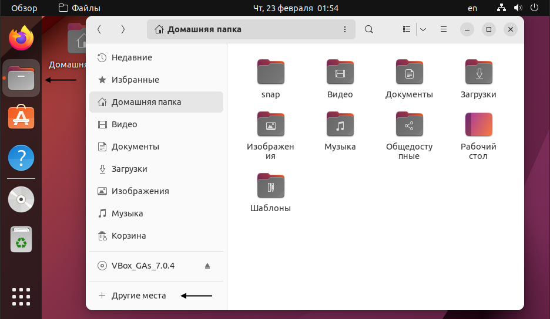  
    Для этого откройте файловый менеджер и щёлкните по пункту "Другие места" (иногда "Подключится к серверу") и укажите куда нужно подключится: `sftp://boss@192.168.1.36/~`.  
    В данном случае я хочу подключится к серверу 192.168.1.36 под пользователем "boss" по протоколу "sftp" (можно ssh) по стандартному порту (можно указать другой через двоеточие после хоста) и открыть домашний каталог пользователя (в дальнейшем можно будет переходить в другие).  
    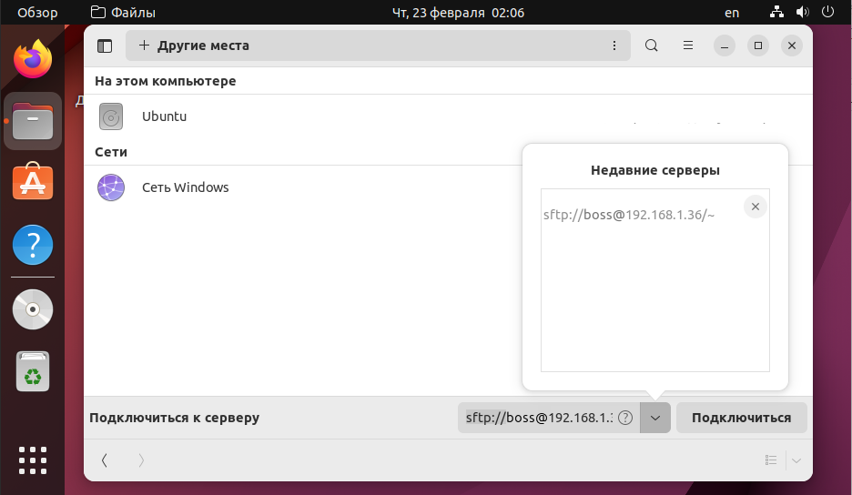  
    После подключения введите пароль.

38. Рассмотрим вариант решения этой задачи под Windows. Проще всего воспользоваться программой WinSCP. Скачайте и установите последнюю версию с [официального сайта ](https://winscp.net/eng/download.php)(или portable версию). Может понадобится VPN.  
    После запуска вам предложат начать новую сессию. Заполните поля и подключитесь к серверу.  
    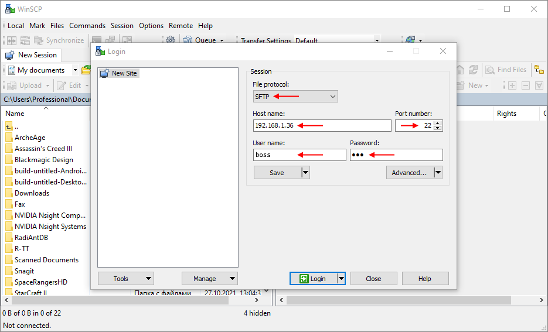  
    После подключения можно работать с файлами обычным образом. WinSCP поддерживает drag and drop, поэтому копировать файлы можно обычным перетаскивание мышью.  
    Функционал WinSCP довольно широк, тут же можно выполнить команды на удалённом сервере через встроенный терминал, настроить интеграцию с PuTTY и т.д.

39. К сожалению, стандартный проводник Windows, без дополнительных телодвижений, не умеет подключатся по `sftp`, но зато может по обычному не защищённому `ftp`.

### Настройка ssh подключения

40. Теперь рассмотрим следующую ситуацию:

    У нас есть:

    - Свежий удалённый Ubuntu **Server** с установленным ssh-сервером. Предполагается, что он запущен, но физического доступа к нему у нас нет, только через ssh.
    - Машина с которой мы **админ**истрируем сервер. Машина всегда одна и та же и у неё фиксированный ip-адрес. В нашем случае это будет хвостовая машина (т.е. та, на которой установлен VitrualBox).
    - **Пользователь** которому нужно дать доступ к серверу. Пользователь может работать с разных машин и у него динамический ip. Это будет виртуальная машина c Ubuntu Desktop.

    Мы хотим:

    - Настроить сервер так, чтобы доступ к пользователю-админу был только с нашей админской машины;
    - Изменить способ доступа с админской машины на доступ по ключу, а не по паролю (для безопасности).
    - Дать доступ к серверу обычному пользователю с любой машины по паролю. Предполагается, что у него ограниченные права, поэтому не проблема даже если пароль утечёт.

41. Запустите виртуальную машину с Ubuntu Server-ом, если она остановлена (логиниться не обязательно).

42. Из хостовой машины подключитесь к серверу по ssh через любой клиент и залогиньтесь.

43. Для начала выполним базовые настройки безопасности ssh-сервера. Для этого отредактируем конфигурационный файл "/etc/ssh/sshd_config" (**не перепутайте с** ssh_config). Откройте его в любой текстовом редакторе (через `sudo`):

    - Довольно часто боты сканируют 22 порт на наличие ответа от ssh-сервера и пытаются подобрать пароль к нему по базе самых популярных паролей. Изменим порт для ssh на любой свободный, например на 6543. Это не спасёт нас от взлома, если этого сильно захотят, но зато мы не будем тратить ресурсы нашего сервера на установку "мусорных" подключений со случайными ботами.  
      Для этого найдите строку `#Port 22`, уберите символ `#` и укажите выбранный порт.
    - Запретим устанавливать связь по протоколу версии 1.  
      Для этого добавьте: `Protocol 2`.
    - В Ubuntu, по умолчанию, мы не сможем сразу подключится по ssh как пользователь root с использованием пароля (т.к. для root пароль не задан), но в других дистрибутивах такая возможность есть. Поэтому, на всякий случай, вообще отключим возможность подключения по ssh для root, хоть по паролю, хоть по чему угодно другому.  
      Для этого найдите:  `#PermitRootLogin prohibit-password` и замените на `PermitRootLogin no`.
    - Иногда пользователям очень удобно создавать пустые пароли, чтобы не запоминать сложные пароли. Такая практика может нанести ущерб безопасности вашего сервера. Следовательно, вам необходимо отклонить все попытки аутентификации с пустыми паролями.  
      Для этого найдите:  `#PermitEmptyPasswords no` и уберите `#`.

    Теперь сохраните файл и выполните команду `sudo sshd –t`. Если вывода не будет, то значит тестовый запуск ssh-сервера прошёл успешно и в конфиге ошибок нет.  
    **Примечание:** файл `ssh_config` используется ssh-клиентом, т.е. когда вы подключаетесь с этой машины куда-то. Файл `sshd_config` используется ssh-сервером, т.е. когда кото-то подключается к вам.

44. Перезапустите ssh-сервер, чтобы настройки вступили в силу: `sudo systemctl reload sshd`. Пока вы работаете вас не отключит, но при последующий соединениях нужно будет указывать новый порт.

    - В утилите `ssh` это делается при помощи ключа `-p`: `ssh boss@192.168.1.36 -p 6543`;
    - В утилите `scp` и `pscp`, также, но большая P `-P`: `scp -P 6543 src boss@192.168.1.36:dst `;
    - В утилите `sftp` и `psftp`, также, большая P `-P`: `sftp -P 6543 boss@192.168.1.36 `;
    - В файловом менеджере Ubuntu, через `:` после хоста: `sftp://boss@192.168.1.36:6543/~`;
    - В KiTTY и WinSCP есть специальное поле для ввода порта.

45. Теперь настроим доступ для нашей админской машины. Для начала ограничим доступ для админского аккаунта (у меня это "boss") только своим ip-адресом (у меня это 192.168.1.38). Это можно делать, т.к. по условию у нас фиксированный ip и он внезапно не изменится. Если это произойдёт, мы потеряем удалённый доступ к машине.  
    Для этого снова откройте файл "/etc/ssh/sshd_config" и добавьте строку:  

    ```
    AllowUsers = boss@192.168.1.38
    ```

    Здесь мы разрешаем подключаться по ssh только как пользователь "boss" и только с ip - 192.168.1.38. Выполните тестовый запуск sshd чтобы убедится в отсутствии ошибок, а затем перезапустите sshd.

    **Внимание**: 192.168.1.38 - это ip-адрес **не** виртуальной машины с Ubuntu сервером, а ip хостовой машины, т.е. в моём случае Windows, т.к. с неё я планирую заходить на этот сервер. У самого сервера ip - 192.168.1.36, и если написать `AllowUsers = boss@192.168.1.36`, то на сервер можно будет зайти **только** с него самого, а нам это не нужно.

46. Завершите подключение к серверу (команда `exit`), а затем снова попробуйте подключиться к нему по новому порту. Если всё пройдёт успешно, то можно пока не отключаться, чуть позже нам понадобится доступ к серверу.

47. Следующим шагом настроим доступ для админского хоста 192.168.1.38 по ключу, а не по паролю. Эта процедура будет выполнятся в несколько шагов:  

    - Сначала сгенерируем на локальной машине новую пару приватный-публичный ключ. Приватный ключ используется для расшифровки сообщений и должен держатся в секрете. Публичный ключ используется для зашифровки сообщений и не является секретным.  
      Чтобы сгенерировать ключи:
      
      - в Linux обычно используется стандартная утилита из набора OpenSSH - "ssh-keygen". 
      
      - На Windows до 10, как правило использовали "puttygen" (есть графический интерфейс).

      - Начиная с Windows 10 можно использовать и "ssh-keygen" и "puttygen" в зависимости от того чем вы пользуетесь для подключения к серверу.
      
      Все перечисленные утилиты выполняют одинаковую задачу, но генерируют ключи в разных форматах. "puttygen" может преобразовать свои ключи в формат OpenSSH и обратно.  
      Linux утилиты работают с ключами в формате OpenSSH, а  KiTTY и WinSCP в формате puttygen.  
      Стандартные расширения для ssh-keygen: приватный ключ - без расширения, публичный - ".pub". Для puttygen: приватный ключ - ".ppk", публичный - ."pub".  
      В принципе вы можете держать свои ключи где угодно, но обычно они располагаются в рабочем каталоге пользователя в папе ".ssh": на Windows - `C:\Users\USERNAME\.ssh\` (где USERNAME – имя вашего пользователя); на Linux - `~/.ssh/`.  
      Если вы работаете под Linux или Windows 10, то введите в терминале:  
      
      - ```bash
        ssh-keygen -t rsa -b 4096
        ```
      
        В результате будут сгенерирован rsa ключи длиной 4096 бит. На все вопросы утилиты можно нажимать Enter тогда будут созданы и сохранены ключи со стандартными именами без парольной фразы (обычно рекомендуют её задавать, но для простоты мы не будем это делать).
      
      - Если вы работаете под Windows до 10, то воспользуйтесь эмулятором Linux терминала (например git bash) или скачайте [puttygen](https://www.chiark.greenend.org.uk/~sgtatham/putty/latest.html) (например в ту же папку C:\ssh\\) и запустите её. Поменяйте значение 2048 на 4096 и нажмите Generate. Двигайте мышкой, пока зелёная полоса не заполнится. Сохраните приватный ключ в формате ".ppk", но публичный скопируйте в файл из поля сверху (в формате OpenSSH).  
        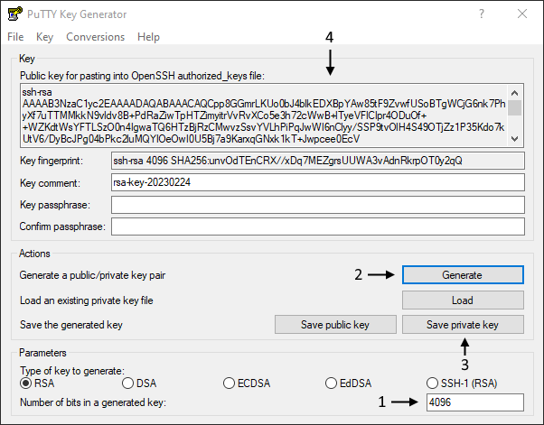
      
      Обычно у публичного и приватного ключа указывают одно и тоже имя, но разное расширение, я назову свои "prod_rsa", чтобы была возможность отличить их от других.
      
    - Теперь когда у нас есть ключи нужно передать серверу **публичный** ключ. В этом случае сервер автоматически переключится на авторизацию по ключу. Т.е. он будет шифровать пакеты этим ключом и только тот, у кого есть приватный ключ сможет их расшифровать.  
      Для этого скопируйте публичный ключ на сервер в каталог `~/.ssh/` любым способом, который мы использовали выше.

    - Наличие публичного ключа в каталоге `~/.ssh/` никак не повлияет на поведение сервера. Содержимое ключа нужно добавить в файл `~/.ssh/authorized_keys` (по умолчанию), только тогда ssh-сервер будет о нём знать. Например выполнив команду в терминале (используйте своё имя файл-ключа):  
      ```bash
      cat ~/.ssh/prod_rsa.pub >> ~/.ssh/authorized_keys
      ```

      Если вы посмотрите содержимое публичного ключа ("prod_rsa.pub") то заметите, что в конце есть поле в формате — user@machine. Оно не имеет никакого отношения к авторизации и служит только для удобства определения где чей ключ. Это поле может быть поменяно (или даже удалено) без нарушения структуры ключа.

    Теперь можно завершить старую ssh-сессию и попробовать подключится заново. 

48. Если вы попробуете подключится таким же образом как и ранее, то заметите, что сервер по прежнему просит у вас пароль. Дело в том, что по умолчанию, если не удаётся подключится по ключу, то сервер переходит на подключение по паролю. Тут может возникнуть вопрос: в чём безопасность доступа по ключу, если доступ по паролю всё равно остаётся?  
    На самом деле такое поведение прописано в настройках ssh-сервера и мы отключим авторизацию по паролю, но только после того, как убедимся, что авторизация по ключу проходит нормально.

49. Чтобы подключится к серверу по ключу нужно указать ssh-клиенту расположение **приватного** ключа:

    - В утилите `ssh` это делается при помощи опции `-i` путь к ключу (в формате OpenSSH):  
      ```bash
      ssh boss@192.168.1.36 -p 6543 -i ~/.ssh/prod_rsa
      ```

    - В утилите `scp` и `pscp` аналогично (для scp ключ в формате OpenSSH, для pscp в формате puttygen):  
      ```bash
      scp -P 6543 -i ~/.ssh/prod_rsa src boss@192.168.1.36:dst
      ```

    - В утилите `sftp` и `psftp` аналогично (для sftp ключ в формате OpenSSH, для psftp в формате puttygen):  
      ```bash
      sftp -P 6543 -i ~/.ssh/prod_rsa boss@192.168.1.36
      ```

    - В файловом менеджере Ubuntu нет возможности это сделать непосредственно в окне. Для этого придётся воспользоваться командой `ssh-add путь_к_ключу` утилиты [`ssh-agent`](http://linux.yaroslavl.ru/docs/conf/security/ssh/OpenSSH_2.html). Данная утилита - это менеджер ключей и если добавить туда приватный ключ, то он будет автоматически подставляется при ssh-подключении (в команды ssh и scp тоже);

    - В KiTTY нужно дополнительно указать имя пользователя и путь к ключу в формате puttygen:  
      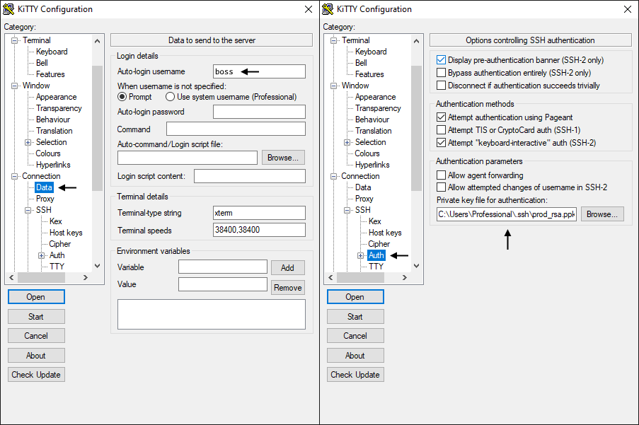

    -  В WinSCP нужно заполнить все поля, кроме пароля, затем нажать "Advanced..." и указать путь к приватному ключу в формате puttygen в пункте меню "Authentication":  
      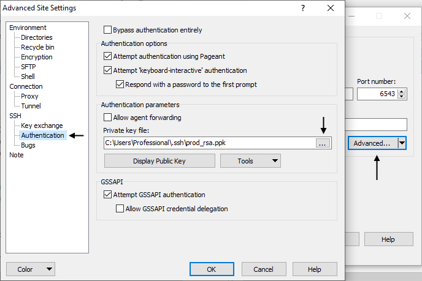

50. Выполните подключение в серверу через ssh или KiTTY при помощи ключа.  
    **Внимание:** при успешном подключении запроса пароля быть не должно. Если вас просят вести пароль, значит что-то не так. Проверьте правильность команд и ключей.

51. После того, как вы успешно подключились к серверу отключим возможность авторизации по паролю.  
    Для этого откройте файл "/etc/ssh/sshd_config" и замените `PasswordAuthentication yes` на `PasswordAuthentication no`. Сохраните файл и перезапустите службу ssh: `sudo systemctl reload sshd`.  
    Теперь, при попытке зайти по паролю вы получите сообщение, о неподдерживаемом способе входа.

52. Настройки доступа для админа закончены. Теперь нужно выдать доступу обычному пользователю.  
    Для этого создадим нового пользователя, например с именем "proger": `sudo adduser proger`. Установите пользователю пароль, а на все остальные вопросы можете нажимать Enter.  
    В результате будет создан обычный пользователь без особых права. Он сможет работать только в своём домашнем каталоге. Прав на использование `sudo` у него тоже нет.  
    Если вам захочется позволить этому пользователю исполнять какие ни будь команды или дать ему возможность использовать `sudo`, нужно будет отредактировать файл [`/etc/sudoers`](https://itnots.ru/linux/sudoers-pravila-vyborochno-razreshit-vypolnenie-komand-polzovatelyam-bez-root), но для нашей задачи достаточно стандартных прав.

53. На данный момент пользователь "proger" не имеет возможности зайти на сервер, т.к.:

    - доступ по паролю отключён и у пользователя в рабочем каталоге в файле authorized_keys (`~/.ssh/authorized_keys`) нет никаких доверенных ключей. Ключ есть только у пользователя "boss".
    - даже если мы разрешим доступ по паролю в файле настроек shh-сервера "/etc/ssh/sshd_config" присутствует параметр AllowUsers, для которого мы задали значение: boss@192.168.1.38. Т.е. только этому пользователю и с этого хоста разрешено подключение.

54. Сделаем для пользователя "proger" исключение и разрешим ему доступ по паролю, при этом для всех остальных пользователей (если их создадут и добавляет в список AllowUser) всё равно будет запрашиваться ключ.  
    Для этого откройте файл "/etc/ssh/sshd_config" и добавьте пользователя "proger" в строку AllowUser через пробел:  

    ```bash
    AllowUser = boss@192.168.1.38 proger
    ```

    Для этого пользователя нет ограничений по ip-адресам.  
    Затем пролистайте файл до самого низа и **в конце** добавьте:  

    ```bash
    Match User proger
            PasswordAuthentication yes
    ```

    Match User позволяет переопределять значения параметров для указанных пользователей. Пользователи перечисляются через запятую.

55. Сохраните файл, проверьте наличие ошибок через тестовый запуск `sudo sshd -t` и перезапустите службу, если все хорошо.

56. Выполните подключение в серверу под пользователем "proger" через новый терминал ssh или KiTTY при помощи пароля.

57. Под пользователем "proger" клонируйте в свой домашний каталог репозиторий: https://github.com/VladimirChabanov/google.git. Чтобы запустить скрипт нужно будет установить зависимости через pip, но pip не установлен, а у пользователя "proger" не достаточно прав, чтобы пользоваться утилитой `apt`.

58. Под админом выполните установку pip и venv.

59. Под пользователем "proger" создайте в клонированном репозитории виртуальное окружение, активируйте его, скачайте зависимости перечисленные в файле "requirements.txt" и запустите скрипт "main.py".  
    Чтобы проверить его работоспособность выполните любой запрос.

## Полезные ссылки

1. [Памятка пользователям ssh](https://habr.com/ru/post/122445/) - в статье описаны функций OpenSSH, которые позволяют сильно упростить жизнь системным администраторам и программистам, которые не боятся шелла;
2. [Полное руководство по SSH в Linux и Windows](https://hackware.ru/?p=10059) - очень много информации про SSH. Реально полное руководство;
3. [Установка SSH в Ubuntu](https://losst.pro/ustanovka-ssh-ubuntu-16-04) - установка и первичная настройка OpenSSH сервера;
4. [Алгоритм установления соединения в протоколе SSH](https://habr.com/ru/post/425637/) - пошаговое описание процесса установки ssh-соединения;
5. [SSH — настройка доступа к серверу, команды и подключение без паролей](https://sheensay.ru/ssh) - описаны некоторые основные шаги по настройке OpenSSH сервера;
6. [Разрешить или запретить доступ SSH определенному пользователю или группе в Linux](https://itsecforu.ru/2018/07/09/разрешить-или-запретить-доступ-ssh-опред/) - как следует из названия здесь описано как разрешить или запретить доступ SSH к определенному пользователю или группе в Linux;
7. [KiTTY - ssh / telnet client](https://netdotwork.github.io/kitty-client/) - в статье описаны некоторые полезные возможности KiTTY;
8. [Копирование файлов scp](https://losst.pro/kopirovanie-fajlov-scp) - описаны основные возможности scp;
9. [Sudoers правила. Выборочно разрешить выполнение команд пользователям без root](https://itnots.ru/linux/sudoers-pravila-vyborochno-razreshit-vypolnenie-komand-polzovatelyam-bez-root) - в статье описано как при помощи sudo можно выдать или запретить пользователю разрешение исполнять команды от имени **другого** пользователя введя **свой** пароль.

## Вопросы к практическому заданию

Ответы на следующие вопросы поместите в отчёт:

  1. Что такое SSH и для чего используется?
  2. Где можно поменять значение порта для SSH-сервера и какое там указано значение по умолчанию?
  3. Что нужно сделать, чтобы заблокировать доступ по SSH только одному конкретному пользователю?
  4. Какой ключ (публичный или приватный) нужно отправить на сервер, если мы хотим настроить доступ к этому серверу по ключу?
  5. Как при помощи утилиты scp скопировать содержимое каталога "www" расположенного в текущей папке на удалённый хост "site" в каталог "/var/www/"  от имени пользователя "admin"? При условии, что ssh-порт стандартный, а ключ для авторизации расположен по пути ~/.ssh/id_rsa.

## Отчёт

Оформите отчёт в соответствии с шаблоном и загрузите его в элемент Задание с номером работы в мудле.
