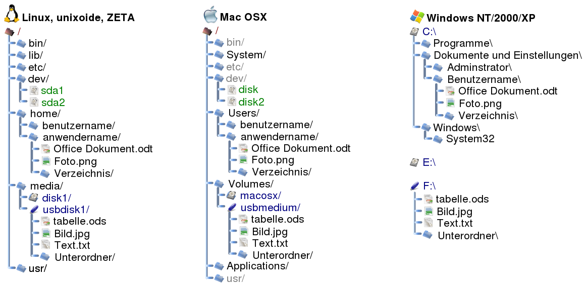

# Файлы и утилиты для работы с ними

Центральная абстракция Unix-подобных систем звучит так: всё есть файл. Т.е. всё с чем работает операционная система имеет представление в виде файла определённого типа. Файлом может быть: обычный текстовый файл на диске, папка, устройство подключённое к компьютеру, область оперативной памяти и т.д.

Чтобы выполнить любое действие с файлом нужно указать путь к нему. В Unix системах, в отличие от Windows структура каталогов начинается с одного, корневого каталога (root - корень). Путь к этому каталогу - `/`. В Windows каждый диск создаёт свою, отдельную структуру каталогов со своим корнем, который обозначается символом `С:\`, `D:\` и т.д.



Путь к файлу можно задать как:
- абсолютный (полный) путь;
- относительный путь.

Полный путь всегда **начинается с корня**, а затем перечисляются все каталоги на пути к целевому файлу: `/etc/ssh/sshd_config`, `/bin/bash`. Путь к каталогу можно указывать с слешем в конце или без него: `/home`, `/home/`, для большинства утилит разницы нет, но для некоторых, завершающий слеш определяет, нужно ли выполнить действие с самим каталогом или с его содержимым.

Относительный путь к файлу строится **начиная с текущего** (рабочего) каталога и включает в себя все каталоги на пути к целевому файлу. При построении относительного пути применяются следующие обозначения:

- текущий каталог обозначается символом `.`:

  ```bash
  .                   # Текущий каталог
  ./filename          # filename лежит в текущем каталоге
  ./dirname/filename  # filename лежит в каталоге dirname, который лежит в текущем
  ```

- родительский каталог (текущий лежит в неё) обозначается `..`:

  ```bash
  ..                   # Родительский каталог текущего
  ../..                # Родительский каталог родительского каталога
  ../dirname/filename  # Выходим из текущего в родительский кaталог, заходим в dirname и работаем с filename
  ```

- Часто в относительных путях к файлам/папкам, которые лежит в текущем каталоге не указывают начальный `./`, а просто пишут: 

  ```bash
  filename          # вместо ./filename
  dirname/filename  # вместо ./dirname/filename
  ```

  В большинстве случаев, если путь указан как аргумент команды, то оба варианта работают одинаково, но если файл - это исполняемая программа или путь прописан в конфиге, возможны неожиданные трактовки такой записи.

**Примечание:** если путь содержит хотя бы один файла или каталог с пробелом в имени, то вест путь нужно взять в кавычки (в одинарные или двойные) иначе он будет трактован неправильно, т.к. пробел в командах используется для разделения ключей:

```bash
ls path to file    # Не правильно. Три разных пути
ls "path to file"  # Один путь
```

**Примечание:** в Windows имена файлов и каталогов - регистроНЕзависимы, а в Linux - регистрозависимы, т.е:

``` bash
filename
fileName
FILENAME
```

три разных имени с точки зрения Linux и одно и тоже имя, с точки зрения Windows. Поэтому в Linux нужно следить за тем какие буквы в имени прописные, а какие строчные.

<br>

## Утилита pwd

Чтобы узнать полный путь к текущему каталогу можно воспользоваться утилитой [`pwd`](https://manpages.ubuntu.com/manpages/jammy/en/man1/pwd.1.html). Она так же применяется в командах, которые не принимают относительные пути и хотят полный:

```bash
`pwd`/filename # Командная оболочка превратит это в полный путь
```

### Задание

1. Определите путь к вашему текущему каталогу при помощи команды `pwd`;

<br>

## Утилита ls

Теперь, когда мы знаем в какой директории находимся, нужно "осмотреться", т.е. узнать какие в ней есть файлы . Утилита [`ls`](https://manpages.ubuntu.com/manpages/jammy/en/man1/ls.1.html) позволяет сделать это, а также получить информацию о правах доступа, размере, дате создания, владельце и т.д.:

```bash
ls     # Содержимое текущего каталога
ls ..  # Содержимое родительского каталога (текущий лежит в нём)
ls path/to/file  # Содержимое каталога path/to/file или информация о файле
ls -a  # Показать всё, в том числе и скрытые файлы
ls -l  # Длинный формат. Дополнительно показывает информацию о файлах
ls -h  # С ключом -l размеры печатаются, как 1K 234M 2G и т.д.
```

Это самые часто используемые ключи, но `ls` умеет ещё многое, например сортировать по имени/дате/размеру, показывать больше информации о файлах и т.д.

### Задание

2. Посмотрите, какие файлы есть в этом каталоге. Сначала просто командой `ls`, затем с ключами `-a` и `-l`;
3. Выведете содержимое каталога, отсортированное по размеру файлов при помощи `ls`. Порядок сортировки: по возрастанию размера.

<br>

## Утилита tree

Вторая команда которая позволяет посмотреть содержимое каталога, но не виде плоского списка, а в формате дерева - [`tree`](https://manpages.ubuntu.com/manpages/jammy/en/man1/tree.1.html). Она обладает такими же возможностями что и `ls`, но иногда древовидная структура вывода удобнее.

Эта команда не входит в состав дистрибутива Unubtu, но её легко можно установить:

```bash
sudo apt install tree
```

По умолчанию `tree` строит дерево начиная от текущего каталога и рекурсивно для всех подкаталогов, что, в случае большого количества файлов, может быть не желательно. Чтобы ограничить глубину просмотра можно воспользоваться ключом `-L`:

```bash
tree -L 1     # Файлы и папки текущего каталога
tree -L 2     # Файлы и папки текущего каталога и подкаталогов
tree -L 3 ..  # Файлы и папки родительского, текущего и подкаталогов текущего 
```

Некоторые полезные ключи:

```bash
tree -a /path/to/dir  # Показать скрытые файлы и каталоги в /path/to/dir
tree -p       # Показать типы файлов и права доступа
tree -sh      # Ключ -s - показать размер и -h в удобном для просмотра виде
```

Остальные настройки можно посмотреть в man-е.

### Задание

4. Посмотрите содержимое текущего каталога утилитой `tree`;
5. Посмотрите содержимое родительского каталога и добавьте ключи для просмотра всех файлов, их прав и размеров. 

<br>

## Команда cd

Теперь, когда мы знаем, какие каталоги существуют в системе помимо нашего, нужно определиться с тем, как перемещаться по ним. Для этих целей существует команда  [`cd`](https://manpages.ubuntu.com/manpages/jammy/en/man1/cd.1posix.html). Она принимает как абсолютные, так и относительные пути:

```bash
cd       # Перейти в домашний каталог пользователя
cd ~     # Перейти в домашний каталог пользователя
cd /etc  # Переходим в /etc
cd ssh   # Далее в /etc/ssh
cd /     # Перейти в корневой каталог
cd -     # Возвращаемся в предыдущий каталог (/etc/ssh)
```

### Задание

6. Перейдите в корневой каталог;
7. Перейдите по пути `/home/<имя вашего пользователя>`;
8. Вернитесь в предыдущий каталог при помощи `-`, а затем, таким же образом, обратно в домашний каталог пользователя.

<br>

##  Утилита mkdir

По существующим каталогам мы перемещаться можем. Настало время создать что-то своё. Чтобы создать один каталог или целое дерево можно воспользоваться утилитой [`mkdir`](https://manpages.ubuntu.com/manpages/jammy/en/man1/mkdir.1.html):

```bash
mkdir one two            # В текущем каталоге создаст ещё 2: one и two
mkdir -p tree/four/five  # Создаст вложенные каталоги
```

### Задание

9. В домашнем каталоге создайте каталог `project`. Не заходите в него;
7. Создайте иерархию каталогов `project/app/items` и `project/app/site` за один вызов `mkdir`;  
   Если всё правильно, у вас должно получится так:
   
   ```bash
   project/
   └── app
       ├── items
       └── site
   ```

<br>

## Команды touch и echo

Теперь добавим несколько файлов. Вообще говоря команды [`touch`](https://manpages.ubuntu.com/manpages/jammy/en/man1/touch.1.html) и [`echo`](https://manpages.ubuntu.com/manpages/jammy/en/man1/echo.1.html) на предназначены для создания файлов, у них другая задача. Но, традиционно, в обучающих материалах, их используют именно для этого. Не будем отступать от традиций:

```bash
touch 1.txt 2.txt      # Создаст файлы 1.txt 2.txt
echo "Hello" > 3.txt   # Создаст файл 3.txt содержащий текст "Hello" и перевод строки
echo "world" >> 3.txt  # Допишет в конец файла 3.txt текст "world"
echo "" > 3.txt        # Теперь в файле 3.txt только перевод строки
```

### Задание

11. Используете команду `touch`, чтобы создать в каталоге `~/project/app/site` файл `empty.html` прямо из домашнего каталога;

12. Теперь перейдите в `~/project/app/site`;

13. Находясь в `~/project/app/site` используйте команду `echo` (4 раза) чтобы в каталоге `~/project/app` создать файл `app.py` содержащий:

    ```python
    import socketserver
    from http.server import SimpleHTTPRequestHandler
    with socketserver.TCPServer(('', 8000), SimpleHTTPRequestHandler) as httpd:
        httpd.serve_forever()
    ```

<br>

## Утилиты cat и tac

Во время работы в терминале чаще всего приходится иметь дело с текстовыми файлами, а значит нужно иметь возможность быстро смотреть их содержимое.

[`cat`](https://manpages.ubuntu.com/manpages/jammy/en/man1/cat.1.html) - пример ещё одной утилиты, которая чаще всего используется не по своему прямому назначению. Чтобы посмотреть содержимое текстового файла достаточно написать:

```bash
cat /path/to/file  # Покажет, что в файле /path/to/file
```

Если перечислить несколько файлов, то `cat` склеит их и покажет как один текст.

Второй типичный сценарий применения этой утилиты - создание многострочных файлов с заданным текстом (часто применяется в скриптах). Например:

```bash
cat << EOF >> one.txt
1
2
EOF
```

приведёт к созданию в текущем каталоге файла `one.txt` с текстом:

```
1
2
```

Слово `EOF` - это просто стоп-слово и вместо него может быть любое другое:

```bash
cat << DOG >> two.txt
3
4
DOG
```

Ещё с помощью `cat` можно дописать файл(ы) в конец другого:

```bash
cat one.txt two.txt >> tree.txt  # > вместо >> чтобы перезаписать tree.txt
```

получим:

```bash
1
2
3
4
```

Утилита [`tac`](https://manpages.ubuntu.com/manpages/jammy/en/man1/tac.1.html) работает также как и `cat`, но строки выводятся в обратном порядке. Т.е. последняя строка в файле будет показана первой:

```bash
tac tree.txt
```

покажет:

```bash
4
3
2
1
```

### Задание

14. Используйте команду `cat`, чтобы посмотреть содержимое только что созданного файла `~/project/app/app.py`;

15. Используйте команду `cat`, чтобы создать файл `index.html` в каталоге `~/project/app/site` с текстом:

    ```html
    <!DOCTYPE html>
    <html lang="en">
    <head>
        <meta charset="UTF-8">
        <title>Animals</title>
    </head>
    <body>
        <a href="./all.html">All</a><br>
        <a href="./cats.html">Cats</a><br>
        <a href="./dogs.html">Dogs</a>
    </body>
    </html>
    ```
15. Проверьте, что `index.html` содержит нужный текст при помощи команды `cat`;

16. Проверьте структуру каталога `project` командой `tree`. Если всё правильно, структура должна быть такой:
    
    ```bash
    project/
    └── app
        ├── app.py
        ├── items
        └── site
            ├── empty.html
            └── index.html
    ```

<br>

## Утилиты head и tail

Иногда нет необходимости выводить весь файл целиком и достаточно показать несколько начальных или конечных строк (например, если мы смотрим файл с логами). Для этих целей подойдут утилиты [`head`](https://manpages.ubuntu.com/manpages/jammy/en/man1/head.1.html) и [`tail`](https://manpages.ubuntu.com/manpages/jammy/en/man1/tail.1.html) соответственно.

По умолчанию обе утилиты показывают по 10 строк из файла, но это поведение можно изменить при помощи ключа `-n`:

```bash
head -n 2 two.txt
```

```bash
1
2
```

```bash
tail -n 2 two.txt
```

```bash
3
4
```

### Задание

18. Используя `head` посмотрите первые 6 строк файла `index.html`;
19. Используя `tail` посмотрите последние 6 строк файла `index.html`;

<br>

## Утилита find

Чем дальше, тем больше у нас будет файлов и ориентироваться в них становится сложнее. Утилита [`find`](https://manpages.ubuntu.com/manpages/jammy/en/man1/find.1.html) позволяет выполнять поиск файлов и каталогов на основе специальных условий. Её можно использовать в различных обстоятельствах, например, для поиска файлов по правам доступа, владельцам, группам, типу, размеру и другим подобным критериям.

```bash
find /    # Найдёт все файлы существующие на компьютере
find /etc # Найдёт все файлы в каталоге /etc
find .    # Найдёт все файлы в текущем каталоге
```

Чтобы определить шаблон имени файла нужно использовать ключ `-name`:

```bash
find / -name "*.log"    # Найдёт на компьютере все файлы с именами заканчивающимися на .log
find /etc -iname "ssh*" # Найдёт все файлы в каталоге /etc с именами начинающимися с ssh (без учёта регистра)
```

Нужно помнить, что с точки зрения Linux файлом является всё, в том числе и каталоги, поэтому, чтобы ограничить поиск только именами каталогов или обычных файлов нужно добавить ключ `-type`:

```bash
find /         # Найдёт все файлы существующие на компьютере
find / -type d # Найдёт все каталоги существующие на компьютере
find / -type f # Найдёт все файлы, но не каталоги
```

Чтобы искать файлы только среди тех, которые принадлежат определённому пользователю или определённой группе помогут ключи `-user` и `-group` соответственно:

```bash
find / -user john   # Найдёт все файлы на компьютере принадлежащие пользователю john
find / -group share # Найдёт все файлы на компьютере принадлежащие группе share
```

Также можно искать файлы с критерием по дате создания/открытия/редактирования, размеру, правам доступа и т.д.

Кроме того, при помощи ключа `-exec` можно выполнить команду (или несколько) для каждого из найденных файлов. Например удалить или перенести в указанную директорию:

```bash
 find . -type d -exec ls -al '{}' \;
```

Здесь `{}` - плейсхолдер вместо которого будет подставлено имя найденного файла. Он взято в кавычки, чтобы избежать проблем с оболочкой (она может заменить скобочки, т.к. не поймёт, что это часть команды `find`). Символ `;` определяет, что ключ `exec` закончился. Он экранирован при помощи слэша, по той же причине, что и фигурные скобки. Вместо слэша можно было бы использовать кавычки.

В результате будут найдены все каталоги расположенные в текущем и для каждого будет выполнена команда `ls -al`. 

Больше примеров можно посмотреть здесь: https://losst.pro/komanda-find-v-linux

### Задание

20. В каталоге `~/project` создайте каталог `templates`;

21. В нём создайте файл `header` cодержащий:

    ```html
    <!DOCTYPE html>
    <html lang="en">
    <head>
        <meta charset="UTF-8">
        <title>Animals</title>
    </head>
    <body>
        <ul>
    ```

22. Там же создайте файл `footer` cодержащий:

    ```html
        </ul>
    </body>
    </html>
    ```

23. В каталоге `~/project/app/items` создайте два новых каталога, с именами: `cats` и `dogs`;

24. В каталоге `cats` создайте 5 файлов с названием `cat{Номер}` содержащих текст соответствующий шаблону:

    ```html
    <li class="cat">{Кличка}</li>
    ```

    Вместо `{Номер}` укажите номер файла; вместо `{Кличка}` придумайте любую кличку для кота;

25. В каталоге `dogs` создайте 5 файлов с названием `dog{Номер}` содержащих текст соответствующий шаблону:

    ```html
    <li class="dog">{Кличка}</li>
    ```

    Вместо `{Номер}` укажите номер файла; вместо `{Кличка}` придумайте любую кличку для собаки;

26. Перейдите в каталог `~/project/app/site` и напишите команду `find` таким образом, чтобы она:

    - в каталоге `items` нашла все файлы (но не папки) с именами начинающимися на cat;
    - для каждого найденного файла выполнила команду `cat имя_файла >> cats`;

27. Затем напишите команду `find` таким образом, чтобы она:

    - в каталоге `items` нашла все файлы (но не папки) с именами начинающимися на dog;
    - для каждого найденного файла выполнила команду `cat имя_файла >> dogs`;

28. Затем напишите команду `find` таким образом, чтобы она:

    - в каталоге `items` нашла все файлы (но не папки);
    - для каждого найденного файла выполнила команду `cat имя_файла >> all`.

29. Используйте команду `cat`, чтобы склеить файлы `header`, `cats` и `footer` в указанном порядке и сохранить результат в `cats.html`;

30. Повторите предыдущий пункт для файлов `dogs` и `all`.

Если всё правильно, структура должна быть такой:

```bash
project/
├── app
│   ├── app.py
│   ├── items
│   │   ├── cats
│   │   │   ├── cat0
│   │   │   ├── cat1
│   │   │   ├── cat2
│   │   │   ├── cat3
│   │   │   └── cat4
│   │   └── dogs
│   │       ├── dog0
│   │       ├── dog1
│   │       ├── dog2
│   │       ├── dog3
│   │       └── dog4
│   └── site
│       ├── all
│       ├── all.html
│       ├── cats
│       ├── cats.html
│       ├── dogs
│       ├── dogs.html
│       ├── empty.html
│       └── index.html
└── templates
    ├── footer
    └── header
```

<br>

## Команды cp и mv

Часто файлы нужно копировать/перемещать/переименовывать для этих целей подходят утилиты [`cp`](https://manpages.ubuntu.com/manpages/jammy/en/man1/cp.1.html) и [`mv`](https://manpages.ubuntu.com/manpages/jammy/en/man1/mv.1.html):

```bash 
cp /etc/ssh/sshd_config /etc/ssh/sshd_config_backup # Копируем файл sshd_config в sshd_config_backup
mv /etc/ssh/sshd_config /etc/ssh/sshd_config_backup # Переименовываем файл sshd_config в sshd_config_backup
cp /etc/ssh/ssh* ~/data # Копируем из /etc/ssh/ файлы, которые начинаются с ssh
mv /etc/ssh/sshd_config ~/config # Перемещаем файл sshd_config в домашний каталог и с новым именем config
```

При копировании или перемещении может случиться так, что в точке назначений уже существует файл с таким же именем как и целевой. В этом случае удобно попросить `cp` или `mv` автоматически создать бэкап файла который присутствует в папке:

```bash
cp --backup=numbered src_file dest_dir/  # Для mv аналогично
```

В данном случае, если в `dest_dir` присутствует `src_file`, он будет переименован в `src_file.~1~`.

При копировании папки с файлами, нужно добавить ключ `-r` (recursive).

### Задание

31. Перейдите в каталог `~/project/app/items` и создайте в нем каталог с именем `tigers`;
32. Скопируете все файлы из каталога `cats` в `tigers`;
33. Переименуйте файлы в каталоге `tigers`, таким образом, чтобы они начинались не на cat, а на tiger.
34. Скопируйте каталог `dogs` вместе с файлами таким образом, чтобы копия называлась `lupus`.
35. Переименуйте файлы в каталоге `lupus`, таким образом, чтобы они начинались не на dog, а на lupus.

<br>

## Утилита grep

Одной из самых полезных утилит при работе с текстовыми файлами является [`grep`](https://manpages.ubuntu.com/manpages/jammy/en/man1/grep.1plan9.html). Она позволяет искать текст по заданному шаблону в файле(-ax) или в тексте полученном на стандартный ввод. В результате, на экран выведутся все **строки** в которых было найдено совпадение с шаблоном:

```bash
grep -i Port /etc/ssh/sshd_config  # Передаём файл
```

```bash
cat /etc/ssh/sshd_config | grep -i Port  # Перенаправляем вывод cat
```

Здесь ключ `-i` добавлен, чтобы `grep` не учитывал регистр в процессе поиска.

С помощью `grep` можно искать совпадение с шаблоном во всех файлах заданной директории:

```bash
grep -i port -r -n /etc/ssh
```

```bash
/etc/ssh/ssh_config:40:#   Port 22
/etc/ssh/sshd_config:17:#Port 22
/etc/ssh/sshd_config:92:#GatewayPorts no
...
```

Здесь ключ `-r` (recursive) указан, чтобы просмотреть все файлы во всех вложенных каталога, а ключ `-n` дополняет вывод номером строки, в которой обнаружено совпадение.

Кроме самой строки с совпадением бывает нужно посмотреть текст, который расположен выше или ниже её. Для этого можно воспользоваться ключами:

- `-A`, `--after-content` - показать вхождение и n строк после него;
- `-B`, `--before-content` - показать вхождение и n строк перед ним;
- `-C` - показать n строк до и после вхождения;

 ```bash
cat /etc/ssh/sshd_config | grep -i -A 5 Port
 ```

Кроме перечисленного, `grep` умеет фильтровать имена файлов по заданному шаблону, считать количество совпадений и многое другое. Больше примеров можно посмотреть здесь: https://losst.pro/gerp-poisk-vnutri-fajlov-v-linux.

### Задание

36. Перейдите в каталог  `~/project`;
37. Используйте `grep`, чтобы найти все файлы, в тексте которых присутствует слово `class`. Добавьте ключ `-l`, чтоб в вывод покали только имена файлов. Вывод направьте в файл `animals`;
38. Используйте файл `animals` и связку `cat` с `grep`, чтобы вывести имена всех файлов, которые не заканчиваются на `.html`. Вывод направьте в файл `trash`;

<br>

## Команда rm и rmdir

За время работы накопилось много мусора. Лишние файлы и папки можно удалить при помощи команды [`rm`](https://manpages.ubuntu.com/manpages/jammy/en/man1/rm.1.html). Кроме `rm` можно воспользоваться командой [`rmdir`](https://manpages.ubuntu.com/manpages/jammy/en/man1/rmdir.1.html), но только для удаления пустых каталогов. В целом `rm` полностью покрывает функционал `rmdir`, поэтому последняя как правило не используется:

```bash
rm 1.txt 2.txt  # Удалит 1.txt 2.txt
rm *.txt        # Удалит все файлы в текущей папке с расширением .txt
rm *            # Удалит в текущей папке все файлы, но не папки
rm -r *         # Удалит в текущей папке все файлы и папки.
rm -rf *        # Удалит в текущей папке всё игнорируя возможные ошибки
rm -rf /        # Попытка удалить вообще всё
rm -rf /*       # Всё не удалит, но систему попортит
```

Здесь ключ `-r` указан для рекурсивного удаления каталогов и их содержимого. Ключ `-f` -  не останавливать удаление после первой ошибки.

### Задание

39. Добавьте в файл `trash` каталоги `app/items` и `templates`, а также файлы `animals` и `trash`;
40. Перед выполнением следующего пункта рекомендуется сделать копию каталога `project`, чтобы восстановить его, в случае ошибки;
41. Воспользуйтесь командой `rm`, чтобы удалить все файлы и папки из списка. Для этого добавьте ключ `-r` (чтобы удалять папки) и в качестве аргумента команды напишите `cat trash` окружив его апострофами (это приведёт к тому, что вывод команды `cat` будет подставлен в команду `rm` как список аргументов). 

Если вы все сделали правильно, то структура каталога `project` будет такая:

```bash
project/
└── app
    ├── app.py
    └── site
        ├── all.html
        ├── cats.html
        ├── dogs.html
        ├── empty.html
        └── index.html
```

42. Находясь в каталоге `project/app/site` запустите скрипт `app.py` командой:

   ```bash
   python3 ../app.py
   ```

43. Перейдите в браузер на хостовой машине и введите в строку адреса IP виртуальной машины и, через двоеточие, порт 8000. В результате должна открыться страница с тремя ссылками: All, Cats, Dogs, переходя по которым должны отображаться списки кличек животных, которые вы добавляли ранее;
43. Остановите приложение <kbd>Ctrl</kbd> + <kbd>C</kbd>.

<br>

## Утилита file

Иногда файл трудно идентифицировать по имени или по специфическому слову в его тексте. В этом случае чтобы определить тип файла (и возможно получить некоторую дополнительную информацию о его содержимом) можно воспользоваться утилитой [`file`](https://manpages.ubuntu.com/manpages/jammy/en/man1/file.1.html). Например:

```bash
file /etc/ssh /etc/ssh/sshd_config
```

покажет:

```bash
/etc/ssh:             directory
/etc/ssh/sshd_config: ASCII text
```

Команда `file` пытается определить **содержимое** файла по набору встроенных шаблонов (magic) и если у неё это получается, выводится более конкретная информация:

```bash
file /etc/ssh/ssh_host_rsa_key.pub
```

```bash
/etc/ssh/ssh_host_rsa_key.pub: OpenSSH RSA public key
```

Для утилиты ssh получим ещё более подробную информацию:

```bash
file /bin/ssh
```

```bash
/bin/ssh: ELF 64-bit LSB pie executable, x86-64, version 1 (SYSV), dynamically linked, interpreter /lib64/ld-linux-x86-64.so.2, BuildID[sha1]=6678a9af4c26cb447ab29e5d5ce1bfbddd3cd5cc, for GNU/Linux 3.2.0, stripped
```

В случае, если файл - это ссылка на другой файл:

```bash
file /bin/pager
```

```bash
/bin/pager: symbolic link to /etc/alternatives/pager
```

А тот - на следующий:

```bash
file /etc/alternatives/pager
```

```bash
/etc/alternatives/pager: symbolic link to /usr/bin/less
```

можно добавить ключ `-L` чтобы `file` автоматически переходил по всем ссылкам и показал информацию разу о конечном файле.

### Задание

45. Используя `find` найдите все файлы в директории `/usr/share/doc` и к каждому найденному файлу примените утилиту `file`.
46. Результат передайте утилите `grep` которая должна найти в выводе текст `HTML document`. То что получится сохраните в файл `docs`;
47. Используйте утилиту `nl` (number lines), чтобы определить сколько строк в файле.

<br>

## Утилиты less и more

Одно из основных неудобств при работе в терминале - отсутствие возможности скролить вывод команд. Если вывод программы занимает больше одного экрана, то верхняя часть просто обрезается. Чтобы решить эту проблему существуют утилиты-пейджеры (page - страница) [`less`](https://manpages.ubuntu.com/manpages/jammy/en/man1/less.1.html) и [`more`](https://manpages.ubuntu.com/manpages/mantic/en/man1/more.1.html).

Эти утилиты дублируют функционал друг друга, но `less` более удобна и функциональна, поэтому рассмотрим только её.

Воспользоваться `less` можно двумя способами. Передать ей текстовый файл как аргумент:

```bash
less /etc/ssh/sshd_config
```

или перенаправить в `less` вывод другой утилиты:

```bash
cat /etc/ssh/sshd_config | less
```

В обоих случаях мы получим текст, который можно прокручивать вверх/вниз/влево/вправо при помощи стрелок. Чтобы закончить просмотр нужно нажать <kbd>q</kbd>.

Помимо прокрутки `less` обладает другими полезными возможностями, например интерактивным поиском по отображаемому тексту. Если во время её работы нажать <kbd>/</kbd>, написать интересующий текст и нажать <kbd>Enter</kbd>, то все совпадения с шаблоном будут подсвечены и по ним можно будет перемещаться при помощи клавиш <kbd>n</kbd> (вперёд) и <kbd>Shift</kbd> + <kbd>n</kbd> (назад).

Остальные возможности `less` можно посмотреть в интерактивной справке. Справка вызывается во время работы утилиты по нажатию клавиши <kbd>h</kbd>

> Кстати говоря, man-страницы отображаются при помощи `less`, а значит во время просмотра справки тоже можно пользоваться поиском.

### Задание

48. Используйте связку `cat` и `less` чтобы посмотреть содержимое файла `docs`;
49. Используйте функцию поиска в `less` чтобы найти в файле слово `examples`.

<br>

## Текстовые редакторы

Для редактирования текстовых файлов удобно использовать текстовые редакторы. Редакторов работающих в терминал, на данный момент довольно много, но как правило, их нужно дополнительно устанавливать, что не очень удобно, особенно, если требуется внести небольшое изменение в каком-то одном файле.

**nano**

Прострой текстовый редактор, присутствует во множестве дистрибутивов. Если открыть редактор, то в нём встроена справочная систем, которая обычно открывается по нажатию <kbd>F1</kbd> или <kbd>Ctrl</kbd> + <kbd>G</kbd>. В справочной системе перечислены сочетания клавиш, которых нет на основном экране.

Сочетания клавиш обычно начинаются с символа `^` или `M-`. Первый из них (`^`) означает клавишу <kbd>Ctrl</kbd>, либо двойное нажатие клавиши <kbd>Esc</kbd>. Второй (`M-`)  может быть введён с помощью клавиш <kbd>Alt</kbd>, <kbd>Cmd</kbd> или <kbd>Esc</kbd>, в зависимости от настроек вашей клавиатуры.

**vi vim**

Редакторы `vi` и его обновлённая версия `vim` - самый часто встречающийся текстовый редактор, он есть практически во всех дистрибутивах Linux, не только на серверных или настольных, но и на специализированных (например, для роутеров и т.п.).

В Ubuntu кроме редакторов `vi` и `vim` ещё можно найти довольно хороший туториал `vimtutor`. Просто запускаете его, читаете описание урока и выполняете прямо там же.

**Внимание:** чтобы выйти из `vi`, `vim` и `vimtutor` нужно набрать `:` (шифт + сама клавиша) и затем написать `q!` и нажать <kbd>Enter</kbd>. Если в процессе случайного тыкания по клавиатуре вы переключились в режим редактирования и символы просто печатаются на экране, то чтобы вернуться в командный режим нажмите `Esc` и уже после этого выходите. Так же убедитесь, что вы на английской раскладке.

### Задание

50. Изучите справочную систему `nano` и `vimtutor`.

<br>

## Источники

- Основы Linux от основателя Gentoo. Часть 2 (4/5): Обработка текста и перенаправления: https://habr.com/ru/articles/105926/
