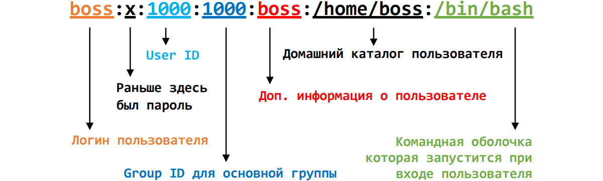
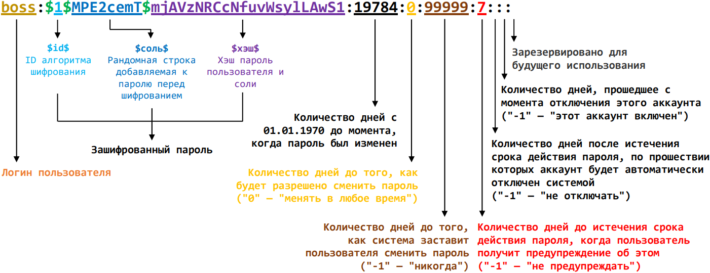
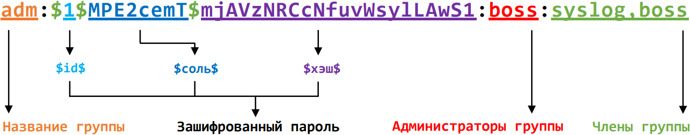

# Пользователи и группы

Как известно Linux является многопользовательской операционной системой, т.е. в ней могут быть зарегистрированы и одновременно работать сразу несколько пользователей.

Пользователь (user) — это сущность, которая может запускать **процессы** и владеть **файлами**. 

У пользователей есть имена (логины) однако ядро не работает с логинами, оно идентифицирует пользователей с помощью простых числовых идентификаторов (User ID, UID).

Существует 3 типа пользователей:

- **Суперпользователь** (пользователь с UID 0). Традиционно имя суперпользователя *root*, хотя его и можно изменить и даже удалить, но делать этого не стоит, т.к. некоторые утилиты могут перестать работать правильно.  
  Пользователи с другими UID не обладают правами суперпользователя, но можно создать любое количество пользователей с одинаковым UID (в том числе и равным 0). Т.е. логин, пароль, домашний каталог и т.д. будут другие, а UID тот же;
- **Системные пользователи** (пользователь с UID больше 1 и до 1000). Они нужны НЕ для входа в систему, а для ограничения доступа к системным ресурсам и для запуска программ, которым нужно дать доступ к этим ресурсам. С точки зрения ядра существует только 2 типа пользователей (суперпользователь и остальные), но добавление категории системных пользователей <u>удобно</u> с организационной точки зрения, например:
  - в графическом интерфейсе, в списке пользователей, нет необходимости показывать системных;
  - во время создания нового пользователя, для системного нет необходимости создавать домашний каталог, устанавливать пароль и т.д.
  - обычно, для безопасности, под такими пользователями нельзя залогиниться, т.к. вместо командной оболочки у них установлены специальные заглушки (`/usr/sbin/nologin` или `/bin/false`) и вас тут же выкинет из системы после входа.
- **Обычный пользователь** (пользователь с UID от 1000). Они нужны для работы людей.

На самом деле диапазоны UID для системных и обычных пользователей жёстко НЕ зафиксированы в системе и определяются значениями указанными в файле [*/etc/login.defs*](https://manpages.ubuntu.com/manpages/focal/ru/man5/login.defs.5.html). Выше были показаны значения по умолчанию для Ununtu.

Кроме того, пользователи могут состоять в группах. Каждый пользователь должен состоять минимум в одной группе, такая группа для пользователя называется **основной** (primary). Кроме основной группы, пользователя можно добавить в другие, **дополнительные** (supplementary) группы. То, что для одного пользователя называется основной группой, для другого может быть дополнительной. По умолчанию, для каждого нового пользователя создаётся основная группа название которой совпадает с логином пользователя, но это совсем не обязательно и можно, например, поменять настройки таким образом, чтобы у всех новых пользователей была одна и та же основная группа.

Максимальное количество групп в которых может состоять пользователь в Ubuntu - 65536 ([`getconf`](https://manpages.ubuntu.com/manpages/jammy/en/man1/getconf.1.html) `NGROUPS_MAX`). Среди групп тоже есть деление на системные и обычные. Группы служат для тех же целей, что и пользователи, т.е. чтобы управлять доступом к запуску процессов и файлам.

<br>
> [!note] 
> Далее у большинства команд будут указаны ключи в длинном формате (`--all` и т.п.), т.к. они позволяют лучше понять, что означает ключ. Но, как правило, ключи так же имеют и короткую форму (`-a` и т.п.), которой удобнее пользоваться на практике. Подробнее смотрите в справочной системе.

<br>

## Утилиты whoami, id, groups

В процессе работы вы можете переключаться между пользователями или запускать команды от имени другого пользователя. Чтобы узнать кем именно вас сейчас считает система воспользуйтесь командой [`whoami`](https://manpages.ubuntu.com/manpages/jammy/en/man1/whoami.1.html), а если нужна информация о группах в которых состоит пользователь поможет утилита [`groups`](https://manpages.ubuntu.com/manpages/jammy/en/man1/groups.1.html).

Альтернативным способом, которым можно узнать информацию о пользователе, является утилита [`id`](https://manpages.ubuntu.com/manpages/jammy/en/man1/id.1.html). Кроме логина, она дополнительно может показать список групп пользователя, его UID, GID и т.д.

```bash
id                 # UID, GID и группы текущего пользователя
id user_name       # UID, GID и группы пользователя user_name
id --user --name   # только имя пользователя
id --group --name  # только основная группа
id --groups --name # все группы
```

### Задание

1. Выполните команду `whoami`, а затем `sudo whoami`;
2. Выполните команду `groups`, затем `sudo groups` и `groups daemon`;
3. Выполните команду `id`, затем `sudo id` и `id daemon`.

<br>

## Как получить список пользователей

Информация о всех пользователях существующих в системе хранится в файле [`/etc/passwd`](https://manpages.ubuntu.com/manpages/jammy/en/man5/passwd.5.html), поэтому можно просто распечатать его содержимое: 

```bash
cat /etc/passwd
```

Информация о каждом пользователе записывается в отдельной строке с параметрами,  разделёнными двоеточием:

```bash
root:x:0:0:root:/root:/bin/bash
daemon:x:1:1:daemon:/usr/sbin:/usr/sbin/nologin
bin:x:2:2:bin:/bin:/usr/sbin/nologin
...
boss:x:1000:1000:boss:/home/boss:/bin/bash
```



Доп. информация о пользователе ([GECOS](https://ru.wikipedia.org/wiki/Поле_Gecos)) указывается через запятую и может включать реальное имя пользователя, телефон, адрес и т.д. Эту информацию можно менять при помощи утилиты [chfn](https://manpages.ubuntu.com/manpages/jammy/en/man1/chfn.1.html);

Как видно, кроме суперпользователя - *root* и пользователя, созданного в процессе установки системы - *boss*, присутствует ещё много других. Как несложно догадаться по их UID и логинам - это системные пользователи.

Изменение данных в этом файле или добавление/удаление записей сразу же отразится на работе системы.

### Задание

4. Используя связку `cat` и `nl` определите количество пользователей в файле `/etc/passwd`;
5. Посмотрите содержимое файла `/etc/shells`. Это список всех командных оболочек присутствующих в системе, которые могут быть установлены как оболочки по умолчанию для пользователей. Запомните путь к оболочке `screen`;
6. Откройте файл `/etc/passwd` в текстовом редакторе (через `sudo`) и замените у своего пользователя оболочку на `screen`;
7. Переподключитесь к серверу. При входе у вас должна изменится строка приглашения (prompt);
8. Выполните последовательность действий:
   - Нажмите сочетание клавиш <kbd>Ctrl</kbd> + <kbd>a</kbd> и затем <kbd>|</kbd> (экран должен разделиться пополам);
   - Нажмите сочетание клавиш <kbd>Ctrl</kbd> + <kbd>a</kbd> и затем <kbd>Tab</kbd> (курсор перейдёт на второй экран);
   - Нажмите сочетание клавиш <kbd>Ctrl</kbd> + <kbd>a</kbd> и затем <kbd>с</kbd> (на втором экране будет начата сессия);
   - Выполните команду `/bin/bash` (на втором экране запустится оболочка bash);
9. Введите команду [`chsh`](https://manpages.ubuntu.com/manpages/jammy/en/man1/chsh.1.html) и укажите старую оболочку (обычно это bash). Команда `chsh` сама внесёт изменение в `/etc/passwd`, но при этом гарантированно его не повредит и проконтролирует, что введённая вами оболочка действительно доступна в система;
10. Переподключитесь к серверу.

<br>

## А где пароль?

С целью безопасности пароль убрали из файла `/etc/passwd` и теперь он хранится в [`/etc/shadow`](https://manpages.ubuntu.com/manpages/jammy/en/man5/shadow.5.html). Доступ к этому файлу ограничен и чтобы посмотреть его содержимое нужно воспользоваться `sudo`:

```bash
sudo cat /etc/shadow
```

```bash
root:*:19641:0:99999:7:::
daemon:*:19641:0:99999:7:::
bin:*:19641:0:99999:7:::
...
boss:$1$MPE2cemT$mjAVzNRCcNfuvWsylLAwS1:19784:0:99999:7:::
```



Сейчас в Ubuntu, по умолчанию, пароль шифруется при помощи `yescrypt` (id `$y$`), но здесь, для примера, пароль 123 был зашифрован при помощью хэш функции md5 (id `$1$`).

Как видно, для некоторых пользователей вместо пароля указан символ `*` или `!`. Символ `*`, как правило используется для системных пользователей и означает, что для этого пользователя вход по паролю вообще не предусмотрен. Символ `!` или `!!`, обычно используется чтобы заблокировать вход по паролю или, в том случае, когда пользователя создали без указания пароля. В любом случае, присутствие в строке пароля этих символов, приведёт к тому, что войти под таким пользователем, **при помощи пароля**, не получится, т.к. система ответит отказом на любой введённый пароль. 

Важно понимать, что с точки зрения системы у пользователя установлен совершенно обычный пароль, просто не существует такого пароля, хэш от которого содержал бы `!`, `*` и некоторые другие символы и именно поэтому система отвергнет любой пароль. Поэтому блокировка пароля НЕ означает, что другими способами тоже войти нельзя. Например, залогиниться по ssh при помощи **ключа** все ещё возможно (именно поэтому мы запрещали в конфиге ssh-сервера вход под *root* полностью, а не только по паролю).

Если пароль убрать совсем (т.е. между двоеточиями ничего не будет) , то пользователь сможет зайти в систему не вводя пароль вовсе.

Изменение данных в `/etc/shadow` сразу же отразится на работе системы.

### Задание

11. Подключитесь к серверу вторым окном и перейдите в нём под *root* (`sudo su`);
12. Поменяйте конфиг ssh-сервера таким образом, чтобы разрешить вход пользователям с пустыми паролями (`PermitEmptyPasswords yes`) и перезапустите службу;
13. Сделайте резервную копию файла `/etc/shadow`;
14. Откройте файл `/etc/shadow` в текстовом редакторе и удалите у своего пользователя пароль;
15. В первом окне разлогиньтесь и снова подключитесь. Как видите, пароль больше вводить не нужно;
16. В первом окне удалите файл `/etc/shadow`. Как видите `sudo` не попросил пароль;
17. В первом окне попробуйте восстановить файл `/etc/shadow` из резервной копии. Теперь `sudo` ругается на отсутствие пароля;
18.  Восстановите исходный `/etc/shadow` через второе окно.

<br>

## Как получить список групп

Информация о всех группах существующих в системе хранится в файле [`/etc/group`](https://manpages.ubuntu.com/manpages/jammy/en/man5/group.5.html), поэтому можно просто распечатать его содержимое: 

```bash
cat /etc/group
```

Информация о каждой группе записывается в отдельной строке с параметрами, разделёнными двоеточием:

```bash
root:x:0:
daemon:x:1:
bin:x:2:
sys:x:3:
adm:x:4:syslog,boss
...
boss:x:1000:
```


Изменение данных в этом файле или добавление/удаление записей сразу же отразится на работе системы.

### Задание

19. Откройте файл `/etc/group` в текстовом редакторе и добавьте себя в группу `games`;
20. Проверьте список групп своего пользователя. На данный момент новой группы там быть не должно;
21. Перелогиньтесь и проверьте список своих групп снова.

<br>

## Пароль группы

Так же как и у пользователя у группы может быть пароль. Пароль у группы позволит стать её участником только на время (до выхода из сессии) при помощи утилиты [`newgrp`](https://manpages.ubuntu.com/manpages/jammy/en/man1/newgrp.1.html), но НЕ позволит добавится в группу на постоянной основе.

Утилита `newgrp` создаёт новую сессию и пока сессия действует заменяет основную группу пользователя на ту, которая указана как её аргумент. Никаких изменений в файлах `newgrp` не делает.

У группы может быть:

- пустой пароль. Только членам группы будет разрешено использовать утилиту `newgrp`;
- заблокированный пароль (содержащий `!` и/или `*`). Только члены группы, <u>у которых есть пароль</u>, смогут использовать утилиту `newgrp`. Пользователи у которых пустой или заблокированный пароль использовать `newgrp` не смогут; Каждая новая группа создаётся с заблокированным паролем - это так называемый ограниченный (restrict) режим доступа;
- нормальный пароль. Для использования `newgrp` нужно будет ввести пароль. Это может сделать любой пользователь.

Пароль группы, так же как и пароль пользователя убрали из файла `/etc/group` и теперь он хранится в [`/etc/gshadow`](https://manpages.ubuntu.com/manpages/jammy/en/man5/gshadow.5.html). Доступ к этому файлу ограничен и чтобы посмотреть его содержимое нужно воспользоваться `sudo`:

```bash
sudo cat /etc/gshadow
```

```bash
root:*::
daemon:*::
bin:*::
sys:*::
adm:$1$MPE2cemT$mjAVzNRCcNfuvWsylLAwS1:boss:syslog,boss
...
boss:!::
```



Кроме пароля в файле `/etc/gshadow` перечислены пользователи-администраторы группы и обычные члены группы.

Администраторы группы не обязательно должны быть членами группы. Они могут добавлять/удалять в группу обычных пользователей (не администраторов) и менять пароль.

Список администраторов может устанавливать только администратор системы.

### Задание

22. Откройте файл `/etc/gshadow` в текстовом редакторе и у группы `mail` заменить пароль на `$1$MPE2cemT$mjAVzNRCcNfuvWsylLAwS1`;
23. Введите команду `newgrp mail` и на запрос пароля введите: 123;
24. Проверьте список групп своего пользователя. Обратите внимание на основную группу.
25. Введите команду `exit` и снова проверьте список своих групп.

<br>

## Утилиты для управления пользователями и группами

Несмотря на то, что при помощи ручного редактирования файлов описанных выше, возможно добавлять, удалять и редактировать информацию о пользователях и группах, в большинстве случаев, для этих целей рекомендуется использовать специализированные утилиты.

### Утилита passwd

Утилита [`passwd`](https://manpages.ubuntu.com/manpages/jammy/en/man1/passwd.1.html) позволяет выполнять различные манипуляции с паролем пользователя. Некоторые команды можно запускать без указания логина пользователя, тогда изменения будут произведены с паролем текущего пользователя.

```bash
passwd               # Изменить пароль текущего пользователя
passwd ures_name     # Изменить пароль пользователю ures_name
passwd --status      # Информация о пароле (дата изменения, время до смены и т.д.)
passwd --delete ures_name # Удалить (сделать пустым) пароль пользователю ures_name
passwd --lock ures_name   # Заблокировать вход ures_name по паролю (но не по ключу)
passwd --expire ures_name # При следующем входе потребовать изменить пароль
```

Остальные ключи можно посмотреть в man;

Утилита `passwd` использует [PAM](https://manpages.ubuntu.com/manpages/jammy/en/man7/PAM.7.html) для аутентификации пользователей и изменения их паролей. Конфиг РАМ для утилиты `passwd` расположен по пути `/etc/pam.d/passwd`. Если его открыть, то, по умолчанию он не содержит своих настроек, а только подключает другой файл из этого же каталога: `@include common-password`.  Т.е. действующие настройки находятся в `/etc/pam.d/common-password`. Там прописан способ шифрования новых паролей, ограничения на сложность, можно задать длину и т.д.

Пользователь `root` может устанавливать какие угодно пароли не зависимо от всех этих настроек и без необходимости вводить старый;

#### Задание

26. Обеспечите себе второе окно с рутовыми правами и бэкап файла `/etc/shadow`, на случай, если что-то пойдёт не по плану;
27. В первом окне, для своего пользователя выполните команду:  `sudo passwd --lock`;
28. Во втором окне посмотрите как изменился пароль у вашего пользователя;
29. В первом окне, попробуйте перелогиниться. Теперь вы НЕ сможете войти какой бы пароль ни вводили;
30. Во втором окне снимите блокировку со своего пользователя;
31. В первом окне, попробуйте залогиниться;
32. В первом окне, для своего пользователя выполните команду:  `sudo passwd --expire`;
33. В первом окне, попробуйте перелогиниться. Теперь ваш пароль установлен как требующий смены при входе;
34. Попробуйте ввести тот же пароль, что и был, а затем какой-нибудь простой пароль вроде 123. В обоих случаях вы получите отказ. Это происходит из за настроек PAM;
35. Во втором окне откройте файл `/etc/pam.d/common-password`. В нём нас интересует строка с `pam_unix.so`.
36. Изучите man по [`pam_unix`](https://manpages.ubuntu.com/manpages/jammy/en/man8/pam_unix.8.html) . Как видно это модуль принимающий на вход набор параметров. Сейчас установлены `obscure` и `yescrypt`. Найдите эти параметры в man-e;
37. Измените параметры `pam_unix.so` таким образом, чтобы убрать проверки сложности, установить тип хеширования `md5` и минимальную длину пароля равную 1 символ. Перезапускать ничего не нужно, изменения вступят в силу сразу;
38. В первом окне, попробуйте перелогиниться и в качестве нового пароля установите любой 1 символ;
39. Используйте утилиту `passwd`, чтобы установить тот пароль, который хотите. 

<br>

### Утилита chage

Утилита [chage](https://manpages.ubuntu.com/manpages/jammy/en/man1/chage.1.html) позволяет изменить всю информацию о сроках истечении действия пароля пользователя, например:

```bash
chage --list <имя пользователя> # показать информацию о сроках действия пароля
chage --inactive <дней> <имя пользователя> # если пароль истечёт, аккаунт заблокируется через указанное количество дней
chage --maxdays <дней> <имя пользователя> # период устаревания пароля (в днях)
chage --lastday <дней> <имя пользователя> # когда последний раз менялся пароль (в днях с 01.01.1970). 0 - принудительная смена при следующем входе
```

#### Задание

40. Посмотрите информацию о сроках действия пароля для своего пользователя;
41. Установите период устаревания пароля 30 дней и снова посмотрите информацию о сроках;

<br>

### Восстановление пароля

Бывают случаи, когда нужно получить доступ к машине, но пароль от пользователя с правами администратора не известен. Если к этой машине есть физический доступ, то это не проблема.

Если для пользователя root пароль не установлен (т.е. вместо пароля `*` или `!`), то достаточно загрузиться в recovery mode и вы сразу получите доступ к машине от имени root. Дальше можете поменять пароль целевому пользователю и вообще делать что угодно.

Если для пользователя root пароль установлен, то при входе в recovery mode система потребует его ввести. Несмотря на это изменение пароля всё равно возможно, хотя и потребует дополнительных действий. Подробнее можно посмотреть в этом видео: https://youtu.be/dSsEC7LL4Mk?si=jQ2DyOJW8SQLY_kG.

#### Задание

42. В файле `/etc/shadow` замените пароль своего пользователя на этот:

    ```
    $1$V/N2w9n3$0LQa/OywnCLPSlEcd5.w8.
    ```

    теперь, вы не можете выполнять команды с `sudo` или повторно залогиниться, если выйдите из системы, т.к. не знаете какие символы вводить в ответ на запрос пароля;

43. Перезагрузите виртуальную машину, и в самом начале загрузки зажмите клавишу <kbd>Shift</kbd>. В результате вы попадёте в меню загрузчика;

44. Выберите пункт "Advanced options for Ubuntu" и затем пункт "Ubuntu, with Linux <версия ядра> (recovery mode)";

45. После загрузки вы сразу же будете залогинены под root. Установите старый пароль для своего пользователя (не для root) при помощи `passwd`;

46. Введите `exit` и система продолжит загружаться дальше. Теперь вы снова можете войти под своим паролем;

47. Теперь, снова отредактируйте файл `/etc/shadow`, но в этот раз установите указанный выше пароль для `root`, а у своего пользователя добавите восклицательный знак перед паролем (чтобы заблокировать его);

48. Перезагрузите виртуальную машину, и в самом начале загрузки зажмите клавишу <kbd>Shift</kbd>, а затем, в меню загрузчика, клавишу <kbd>e</kbd>, чтобы отредактировать загрузочный скрипт;

49. Промотайте скрипт до строки, которая должна выглядеть примерно так:

    ```
    linux /vmlinuz-6.5.0-21-generic root=/dev/mapper/ubuntu--\vg-ubuntu--lv ro
    ```

    и допишите в конец `init=/bin/sh`. Это приведёт к тому, что вместо процесса инициализации (первый процесс в системе) будет запущена командная оболочка.

50. Нажмите <kbd>Ctrl</kbd> + <kbd>x</kbd> или <kbd>F10</kbd>, чтобы продолжить загрузку. Изменение которое мы внесли отработает только в этот раз, в дальнейшем, скрипт загрузки останется прежним;

51. Изменить пароль сейчас не получится, т.к. файловая система смонтирована в режиме только для чтения. Чтобы перемонтировать её в режиме для записи введите:

    ```
    mount -o remount,rw /
    ```

52. Чтобы вернуть root пароль в виде `!`, а свой пароль разблокировать ведите:

    ```
    passwd --delete root
    passwd --lock root
    passwd --unlock <ваш логин>
    ```

53. Далее можно выключить машину и заново запустить или можно продолжить загрузку запустив процесс инициализации, который мы ранее заменили своим:

    ```
    exec /sbin/init
    ```

<br>

### Утилиты adduser и useradd

Утилиты [`adduser`](https://manpages.ubuntu.com/manpages/jammy/en/man8/adduser.8.html) и [`useradd`](https://manpages.ubuntu.com/manpages/jammy/en/man8/useradd.8.html) позволяющие добавлять новых пользователей в систему. Первая из них просит задать пароль и ответить на ряд вопросов о пользователе, а вторая просто создаёт пользователя с дефолтными настройками, заблокированным паролем и даже без домашнего каталога.

Обе утилиты, в дополнение к логину, принимают набор ключей позволяющих полностью указать информацию о создаваемом пользователе, включая UID, первичную и вторичные группы, наличие и путь к домашнему каталогу и т.д. Если ключи не заданы, то утилиты используют настройки по умолчанию, которые можно найти в файлах [`/etc/adduser.conf`](https://manpages.ubuntu.com/manpages/jammy/en/man5/adduser.conf.5.html) и ` /etc/default/useradd` соответственно.

#### Задание

54. Используйте утилиту `adduser`, чтобы создать пользователя с логином `first` и любым паролем. Остальную информацию можно не задавать;
55. Используйте утилиту `useradd`, чтобы создать пользователя с логином `second`;
56. Откройте файлы `/etc/passwd`, `/etc/shadow` и каталог `/home/` и сравните результат создания пользователей;
57. Используйте утилиту `useradd` и создайте псевдоним для пользователя `first` с логином `alf`:
    - укажите ключи `--non-unique`, чтобы разрешить создавать не уникальных пользователей и `--uid` (после этого ключа нужно указать UID пользователя `first`);
    - укажите ключ `--create-home`, чтобы создать отдельный домашний каталог для нового пользователя;
    - укажите ключ `--shell /usr/bin/tmux`, чтобы указать командную оболочку, которую нужно запустить при входе пользователя;
    - после создания пользователя установите для него пароль при помощи команды `passwd`;
58. Откройте новое окно и залогиньтесь под пользователем `first`:
    - посмотрите вывод утилиты `id`;
    - посмотрите полный путь к вашей домашней директории;
    - разлогиньтесь;
59. Теперь залогиньтесь под пользователем `alf`:
    - обратите внимание на логин в строке приглашения, а также, что оболочка по прежнему `bash`, а не `tmux`;
    - посмотрите вывод утилиты `id`;
    - посмотрите полный путь к вашей домашней директории;
    - посмотрите, кто владеет текущей директорией;
    - попробуйте перейти в `/home/first`;
    - разлогиньтесь.
60. Используйте утилиту `useradd` и создайте псевдоним для пользователя `root` с логином `alro`.
61. Залогиньтесь под `alro` (напрямую, а не через ssh. Через ssh не пустит, т.к. в конфиге установлен запрет для подключения под `root`). Как видно, несмотря на то, что для `root` пароль заблокирован, можно войти с его правами через `alro`.
62. Разлогиньтесь.

<br>

### Утилиты deluser и userdel

Утилиты `deluser` ([22.04](https://manpages.ubuntu.com/manpages/jammy/en/man8/deluser.8.html), [23.10](https://manpages.ubuntu.com/manpages/mantic/en/man8/deluser.8.html)) и [`userdel`](https://manpages.ubuntu.com/manpages/jammy/en/man8/userdel.8.html) позволяют удалять пользователей из системы. Утилита `deluser` - более дружественный фронт-энд для `userdel`, она опционально позволяет удалять домашнюю директорию пользователя или даже все файлы в системе, принадлежащие удаляемому пользователю, запускать пользовательские скрипты, делать бэкап и др.

При желании можно удалить даже пользователя `root`.

#### Задание

63. Используя утилиту `userdel` (без дополнительных флагов) удалите пользователей `second`, `alf` и `alro`;
64. Используя утилиту `deluser` удалите пользователя `first` вместе с его домашней директорией и всеми файлами которые ему принадлежат (домашний каталог удалённого пользователя `alf` тоже принадлежит пользователю `first`). Дополнительно укажите опцию для создания бэкапа.

<br>

### Утилиты addgroup и groupadd

Для создания групп, так же как и для создания пользователей существуют две утилиты: высокоуровневая [`addgroup`](https://manpages.ubuntu.com/manpages/jammy/en/man8/addgroup.8.html)  и низкоуровневая [`groupadd`](https://manpages.ubuntu.com/manpages/jammy/en/man8/groupadd.8.html). Всё что работает при создании пользователей, будет работать и для групп.

<br>

### Утилиты delgroup и groupdel

Для удаления групп, так же как и для удаления пользователей существуют две утилиты: высокоуровневая [`delgroup`](https://manpages.ubuntu.com/manpages/jammy/en/man8/delgroup.8.html)  и низкоуровневая [`groupdel`](https://manpages.ubuntu.com/manpages/jammy/en/man8/groupdel.8.html). Обе утилиты просто удаляют указанную группу.

<br>


### Утилита usermod

Утилита [`usermod`](https://manpages.ubuntu.com/manpages/jammy/en/man8/usermod.8.html) позволяет модифицировать любую информацию о существующем пользователе, включая его логин, UID, основную и список дополнительных групп и т.д:

```bash
usermod --login Новый_логин Старый_логин      # изменить логин
usermod --move-home --home Путь_к_home Логин  # изменить расположение домашнего каталога
usermod --non-unique --uid Новый_UID Логин    # изменить User ID, даже если он существует
usermod --groups Группа1,Группа2 Логин        # Заменить вторичные группы на указанне
usermod --append --groups Группа1,Группа2 Логин  # Добавить вторичные группы
```

<br>

### Утилита groupmod

Утилита [`groupmod`](https://manpages.ubuntu.com/manpages/xenial/ru/man8/groupmod.8.html) позволяет модифицировать любую информацию о существующей группе, включая её название, GID и пароль.

#### Задание

65. Создайте пользователя с логином *laurence* при помощи утилиты `adduser`;
66. Создайте группу *matrix*;
67. При помощи `usermod` добавьте к вторичным группам пользователя *laurence* группу *matrix*;
68. Затем установите для пользователя *laurence* значение 1999 в качестве *UID*;
69. Поменяйте логин пользователя *laurence* на *lana*. Проверьте владельца домашнего каталога и файлов в нём;
70. К группам пользователя *lana* добавьте группу *cloud_atlas*;
71. Измените GID группы *cloud_atlas* на 2012;
72. Удалите пользователя *lana*;
73. Удалите группы matrix и *cloud_atlas*.

<br>


### Утилита su

Утилита [`su`](https://manpages.ubuntu.com/manpages/jammy/en/man1/su.1.html) позволяет выполнить команду от имени другого пользователя. Часто используется, чтобы перейти под другой аккаунт (т.е. выполнить команду login от имени указанного пользователя). При вызове без указания пользователя `su` по умолчанию запускает интерактивную оболочку от имени *root*.

```bash
sudo su     # Перейти под пользователя root со своим окружением
sudo su -   # Перейти под пользователя root с его окружением
sudo su логин          # Перейти под пользователя <логин> со своим окружением
sudo su - логин        # Перейти под пользователя <логин> с его окружением
sudo su --login логин  # То же, что и предыдущая, просто полная форма
su --shell=/bin/bash логин    # Перейти под пользователя <логин> в оболочке bash
su --command='ls /home' логин # Выполнить команду ls /home от имени пользователя <логин>
```

#### Задание

74. Создайте нового пользователя *scrooge_mcduck*;
75. Выполните команду `mkdir money` от имени пользователя *scrooge_mcduck*;
76. Посмотрите кому принадлежит папка *money*;
77. Перейдите под пользователя *scrooge_mcduck* с командной оболочкой `/usr/bin/tmux`;
78. Удалите папку *money*;
79. Завершите сеанс пользователя *scrooge_mcduck*;
80. Удалите пользователя *scrooge_mcduck*.

## Источники

- Основы Linux от основателя Gentoo. Часть 3 (3/4): Управление аккаунтами в Linux: https://habr.com/ru/articles/110012/;
- Users and groups (Русский): https://wiki.archlinux.org/title/Users_and_groups_(Русский);
- Как восстановить забытый пароль в Linux — Виктор Ашик: https://youtu.be/dSsEC7LL4Mk?si=jQ2DyOJW8SQLY_kG

