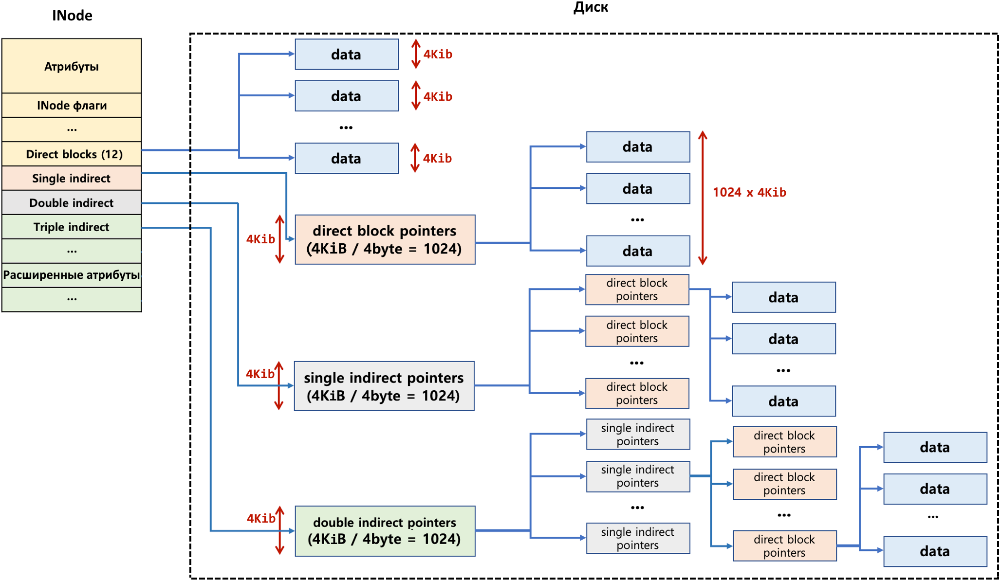
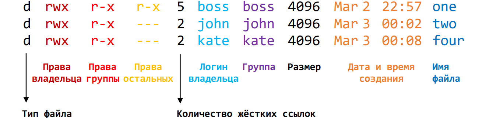
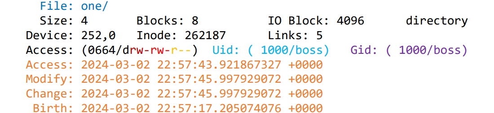
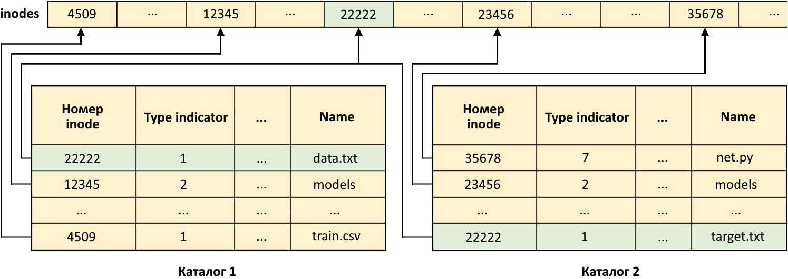
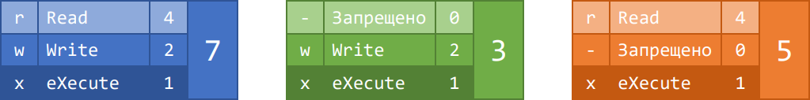
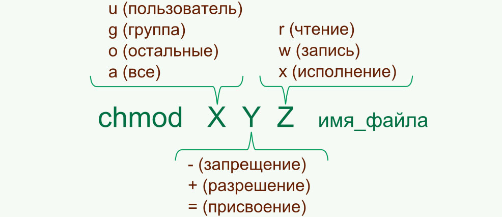
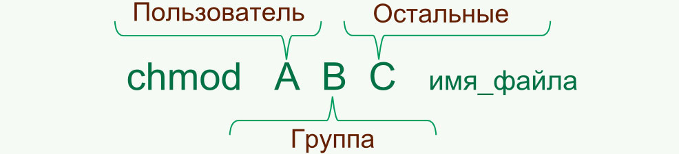
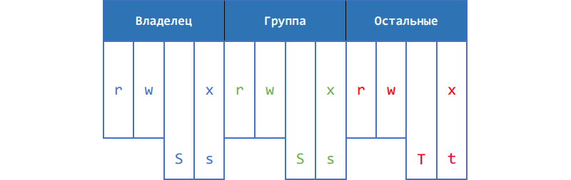

# Файлы и управление правами доступа

Файл можно представить как совокупность данных и метаданных. Для каждого файла, в файловой системе создаётся свой индексный дескриптор. Индексный дескриптор - это структура [`INode`](https://ru.wikipedia.org/wiki/Inode)(Index Node) содержащая всю информацию о файле (кроме имени и пути к файлу). Все индексные дескриптор идентифицируются по их уникальному номеру.



`INode` создаётся в **файловой системе** и хранят только **метаданные** файла, но не хранит сами данные. Вместо данных в `inode` присутствую ссылки на блоки расположенные **на диске** (НЕ в файловой системе), а уже в этих блоках записаны **данные**. 

Данные хранятся на диске в виде набора блоков фиксированного размера (обычно по 4 КиБ, но может быть как больше, так и меньше). В `inode` хранится 12 прямых ссылок на блоки и 3 косвенных: одинарной, двойной и тройной косвенности (ссылки на ссылки). Каждая из этих ссылок позволяет указывать на определённое количество блоков. При условии, 4 байтного (32 бита) адреса, получим:
- 12 прямых ссылок позволяют указывать на 12 блоков общим размером 12 \* 4 = 48 КиБ;
- ссылка одинарной косвенности позволяет указывать на 1024 блока общим размером 1024 \* 4 = 4 МиБ;
- ссылка двойной косвенности позволяет указывать на 1024 \*1024 = 1048576 блока общим размером 1024 \* 1024 \* 4 = 4 ГиБ;
- ссылка тройной косвенности позволяет указывать на 1024 \*1024 \* 1024 = 1073741824 блока общим размером 1024 \* 1024 \* 1024 \* 4 = 4 ТиБ;

Метаданные хранятся непосредственно в `inode`. Они описывают такую информацию как: права доступа, UID/логин пользователя-владельца, GID/название группы-владельца, дату создания, редактирования и т.д.  

Набор метаданных зависит от возможностей файловой системы и настроек ядра Linux, но большинство современных файловых систем поддерживают 3 типа метаданных:

- стандартные атрибуты;
- `inode` флаги;
- расширенные атрибуты. 

Расширенные атрибуты и `inode` флаги были добавлены, чтобы сделать процесс управления доступом более удобным и гибким, чем он был изначально, поэтому, чтобы получить полное представление об управлении правами в Linux нужно рассмотреть их все. Но, чтобы не переусложнять задние мы сосредоточимся только на стандартных атрибутах.

<br>

## Стандартные атрибуты

Стандартные атрибуты описывают следующие характеристики файла:

- типа файла;
- права доступа к файлу;
- UID пользователя-владельца;
- размер в байтах;
- набор временных меток;
- GID группы-владельца;
- количество жёстких ссылок, связанных с файлом;

<br>

### Как посмотреть стандартные атрибуты (утилиты ls и stat)

Чтобы посмотреть стандартные атрибуты файла можно воспользоваться утилитами [`ls`](https://manpages.ubuntu.com/manpages/mantic/en/man1/ls.1.html) и [`stat`](https://manpages.ubuntu.com/manpages/jammy/en/man1/stat.1.html).

```bash
ls -l file_name
```



```bash
stat file_name
```



Обе утилиты можно дополнительно настроить при помощи ключей.
#### Задание

1. Используйте утилиту `stat` и посмотрите информацию о каталоге `/`. Какой номер `inode` у корневого каталога?
2. Используйте утилиту `stat` с параметром `--print`, чтобы отобразить информацию о содержимом каталога `/`. Составьте такую форматную строку, чтобы данные выводились в соответствии с примером:
   ```bash
   Name: /boot;	Type: directory;	Access: drwxr-xr-x
   Name: /cdrom;	Type: directory;	Access: dr-xr-xr-x
   ...
   ```
3. Используйте утилиту `ls` и посмотрите информацию о каталоге `/`. Содержимое каталога при этом выводиться не должно;
4. Используйте утилиту `ls`, чтобы отобразить информацию о содержимом каталога `/`. Укажите соответствующие ключи, чтобы НЕ отображались `.` и `..`, логины владельца и название группы.

<br>

### Типы файлов

Как уже упоминалось ранее в Linux придерживаются идеологии - "всё есть файл", поэтому файлы бывают разных типов. Ранее мы смотрели информацию о типе файла при помощи утилиты `file`, которая пытается определить дополнительную информацию о типе файла по его содержимому. Когда подробности не нужны, посмотреть тип можно при помощи утилит `ls` и `stat`. Первый символ в строке прав доступа показывает тип:

```bash
lrwxrwxrwx  1        4 Mar 11 20:41 rtc -> rtc0
crw-------  1 248,   0 Mar 11 20:41 rtc0
brw-rw----  1   8,   0 Mar 11 20:41 sda
```

Всего существуют 7 типов файлов:

| Символ | Тип файла                 |
| :----: | :------------------------ |
|   -    | Обычный файл              |
|   d    | Каталог                   |
|   l    | Символическая ссылка      |
|   b    | Блочное устройство        |
|   c    | Символьное устройство     |
|   p    | Именованный канал (pipe)  |
|   s    | Сокет                     |

- Обычный файл (`-`). Сюда относятся все файлы с текстовыми или бинарными данными. Конфиги, исходный код, музыка, картинки, исполняемый файл, в любом случае это всё обычный (regular) файл. Остальные типы файлов считаются специальными (special);

- Каталог (`d`). В Linux каталог является особым типом файла, данные которого представляют собой **список** имен других файлов и каталогов, вложенных в данный каталог. В каталоге осуществляется связь между именами файлов и их индексными дескрипторами (`inode`). Когда мы говорим, что файл находится в каталоге, это означает, что в таблице данных этого каталога есть запись, которая связывает имя файла с его индексным дескриптором.
  Если в этот или другой каталог добавить еще одну запись, которая связывает тот же индексный дескриптор с другим именем, то с точки зрения пользователя, один и тот же файл будет находиться сразу в нескольких каталогах или несколько раз в одном и том же каталоге, но под разными именами.

  

  На рисунке выше, файл, индексный дескриптор которого имеет номер 22222, будет виден сразу в двух каталогах под именами *data.txt* и *target.txt*. Это так называемый **механизм жестких ссылок**. Удаление всех жестких ссылок на файл приведет к тому, что он станет недоступным и будет считаться удаленным из системы;

- Символьная ссылка (`l`). Символьная ссылка – это файл, в данных которого содержится адрес другого файла **по его имени** (а не индексному дескриптору). Выполнение символьной ссылки приводит к открытию файла, на который она указывает. Это аналог ярлыков в операционной системе Windows. Если удалить исходный файл, то символьная ссылка продолжит существовать. Она по-прежнему будет указывать на файл, которого уже нет. Символьные ссылки не содержат метаданных файлов, на которые они указывают. У них есть собственные метаданные (свое время создания, размер, права доступа);

- Символьное (`c`) и блочное устройство (`b`). Файлы устройств предназначены для обращения к аппаратному обеспечению компьютера (дискам, принтерам, терминалам и др.). Когда происходит обращение к файлу устройства, то ядро операционной системы передает запрос драйверу этого устройства. К символьным устройствам обращение происходит последовательно (символ за символом). Примером символьного устройства может служить терминал. Считывать и записывать информацию на блочные устройства можно в произвольном порядке, причем блоками определенного размера. Пример: жесткий диск.

- Сокет (`s`) и канал (`p`). Чтобы понять, что такое канал и сокет, необходимо понимание процессов в операционной системе. И каналы и сокеты организуют их взаимодействие. Пользователь с данными типами файлов почти не сталкивается. Ключевым отличием канала от сокета является то, что канал передает данные только в одном направлении. Через канал один процесс всегда передает данные второму, но не наоборот. Сокеты позволяют передавать данные в разных направлениях, т. е. осуществляют связь. Также следует отметить, что канал представлен в структуре каталогов файлом, только если он именован. Безымянный канал создаётся всякий раз когда вы использует символ вертикальной черты в команде, например: `ls -a | grep *.txt`.

#### Задание

5. Воспользуйтесь утилитой `find`, чтобы найти файлы каждого типа описанного выше;
6. В домашнем каталоге создайте файл `dolly` с тексом "original";
7. При помощи команды `ls -l` посмотрите количество жёстких ссылок на `dolly`;
8. Используйте команду [`ln`](https://manpages.ubuntu.com/manpages/jammy/en/man1/ln.1.html) чтобы создать жёсткую ссылку на `dolly` под названием `clone`;
9. Посмотрите количество жёстких ссылок на `dolly` и на `clone`;
10. При помощи команды `stat` посмотрите время последней модификации (modify) и номер inode файлов `dolly` и `clone`;
11. Добавьте в файл `clone` любую строку;
12. Посмотрите время последней модификации файла `dolly` и файла `clone`. Как видно, оно совпадает, хотя вы работали только с файлом `clone`;
13. Используйте команду `ln` чтобы создать символьную ссылку на `dolly` под названием `leash`;
14. При помощи команды `ls -l` посмотрите количество жёстких ссылок на `dolly` и на типа файла `leash`;
15. При помощи команды `stat` посмотрите время последней модификации (modify) и номер inode файлов `dolly` и `leash`;
16. Добавьте в файл `leash` любую строку;
17. Посмотрите время последней модификации файла `dolly` и файла `leash`. Как видно, время модификации `leash` не изменилось вообще, а у `dolly` изменилось;
18. Удалите файл `dolly`;
19. Попробуйте вывести содержимое файлов `clone` и `leash`. Как видно, теперь `leash` указывает "в никуда";
20. Создайте файл `dolly` с текстом "fake" и снова выведите содержимое файла `leash`;
21. Удалите файлы `dolly`, `clone`, `leash`.

<br>

### Временные метки

У файла могут быть следующие временные метки:

- Время создания (birth) - время, когда был создан новый индексный дескриптор файла. Не изменяется ни при каких манипуляциях с файлом. Эта временная метка доступна не во всех дистрибутивах и файловых системах [[подробнее](https://blog.marbu.eu/posts/2019-02-17-btime/)];
- Время последнего доступ (access) - время, когда последний раз было обращение к **данным** для **чтения**. Обращение к метаданным или изменение данных не изменяют эту метку. Например, для текстового файла - это просмотр его содержимого, для исполняемого файла - время последнего запуска, для каталога - время просмотра списка вложенных файлов;
- Время последней модификации (modify) - время, когда последний раз было обращения к **данным** для **записи**. Обращение к метаданным или чтение данных не изменяют эту метку;
- Время последнего изменения (change) - время, последнего изменения состояния файла, т.е. как данных, так и метаданных. Таким образом при изменении данных меняется и modify и change, но при изменении метаданных только change.
#### Задание

22. Создайте каталог `data` и в нём три файла с интервалом в 1 минуту или больше: `one`, `two`, `three`;
23. Воспользуйтесь утилитой `find` и ключом фильтрующим по времени последней модификации (modify), чтобы найти в каталоге `data` сначала только файл `three`, затем `two`, `three` и затем `one`, `two`, `three`;
24. Воспользуйтесь утилитой `touch`, чтобы установить для файлов `one`, `two`, `three` дату последнего доступа для чтения (access) в значения: 8 декабря 2228 года, 6 января 2230 года, 22 марта 2233 года соответственно (в качестве часов и минут укажите нули);
25. Создайте файл `four`;
26. Воспользуйтесь утилитой `find`, чтобы найти и удалить все файлы в каталоге `data` к которым был получен доступ на чтение (access) менее 0 минут назад (т.е. `one`, `two`, `three`).

<br>

### Размер файла

Как было сказано выше, данные файла хранятся на диске в блоках фиксированной длинны, поэтому файл содержащий 1 байт информации будет занимать на диске не менее 1 блока. Для определённости путь будет 1 блок = 4 КиБ.

Стоит отметить, что существуют блоки которыми оперирует файловая система и блоки, которыми оперирует диск. Таким образом 1 блок с точки зрения файловой системы может потребовать выделить несколько блоков на диске.

#### Задание

27. Создайте файл `text` содержащий текст: "Hello";
28. Изучите 2-ю строку в выводе утилиты `stat` для этого файла. Как видно размер файла в байтах (`Size`) равен - 6, a в блоках (`Blocks`) - 8:  
    - Размер в блоках объясняется тем, что тут указаны блоки выделенные на диске, а не в файловой системе. Если принять, что 1 блок в файловой системе равен 4096 байт, а размер блока на диске 512 байт, тогда получаем, 8 блоков на диске - это 1 блок в файловой системе;
    - Почему же размер в байтах равен 6, хотя символов в файле всего 5?
29. Посмотрите содержимое файла `text` побайтово при помощи команды:
    ```bash
    cat text | hexdump -c
    ```

<br>

### Права доступа

Система прав доступа (permissions) в Linux основана на 3х операциях: чтение (Read), изменение (Write), исполнение (eXecute). Каждая из перечисленных операций может быть разрешена или запрещена по отдельности.

Каждая из операций имеет символьное и цифровое представление и поэтому, права доступа тоже могут быть записаны в двух формах. В символьном представлении, права задаются в виде 3х символов каждый на своей позиции, при этом, если операция запрещена, то вместо неё указывается прочерк:

```palin
rwx
-wx
r-x
```

В цифровом представлении все три операции задаются в виде **одного** числа, как сумма числовых представлений всех разращённых операций: `r` = 4, `w` = 2, а `х` = 1.



Права доступа можно назначить 3-м категориям пользователей по-отдельности. Выделяют такие категории: пользователь-владелец файла (owner), пользователи входящие в группу владеющую файлом (group) и все остальные пользователи (other). Полные права доступа к файлу записываются в порядке: владелец группа остальные:

```bash
rwxrwxrwx  # в числовой форме 777
rwxr-xr--  # в числовой форме 754
r-x------  # в числовой форме 500
```

Иногда пользователь может принадлежать сразу к двум категориям с разными правами, и чтобы понять какие итоговые права он получит нужно разобраться в порядке их применения:

- Если пользователь является владельцем файла, то он получает права владельца;
- Если пользователь НЕ владелец и входит в группу владеющую файлом, то он получает права установленные для группы;
- Если пользователь НЕ владелец и НЕ входит в группу, то он получает права, указанные для остальных.

Таким образом, если пользователь является владельцем файла с полным доступом и в тоже время принадлежит к группе, которой разрешено только чтение, то он получит полный доступ:

```bash
rwxr-----  # владелец rwx, члены группы r--, остальные ---
```

> [!important] 
> Все права доступа распространяются только на данные файла. Метаданные может редактировать только `root` и владелец, не зависимо от выставленных разрешений.

##### Задание

30. Воспользуйтесь утилитой `find`, чтобы найти во всей системе файлы принадлежащие вашему пользователю и имеющие разрешение для владельца, как минимум на чтение. Результат сохраните в файл `readable` и воспользуйтесь утилитой [`wc`](https://manpages.ubuntu.com/manpages/jammy/en/man1/wc.1.html), чтобы определить сколько в нём получилось строк;
31. Воспользуйтесь утилитой `find`, чтобы найти во всей системе файлы принадлежащие основной группе вашего пользователя и имеющие разрешение на исполнение для любой категории пользователей. Результат сохраните в файл `executable` и воспользуйтесь утилитой `wc`, чтобы определить сколько в нём получилось строк;
32. Воспользуйтесь утилитой `find`, чтобы найти во всей системе файлы НЕ принадлежащие вашему пользователю и имеющие разрешения в точности равные 755. Результат сохраните в файл `755` и воспользуйтесь утилитой `wc`, чтобы определить сколько в нём получилось строк.

> [!tip] 
> Условия поиска в `find` можно инвертировать с помощью `-not`, объединять с помощью `-and` и `-or` и группировать с помощью круглых скобок (скобки нужно экранировать слешем).
> 
> ```bash
> find / -user boss -and -not -type d
> find / \(-type f -or -type d\) -and -mmin +10
> ```

> [!tip] 
> Права доступа `find` может сопоставлять в трёх режимах: 
>
> ```bash
> # 644 -> rw-r--r-- # Здесь разрешено 4 действия;
> find / -perm 644   # точное соответствие указанным;
> find / -perm -644  # как минимум указанные, но если прав больше, тоже ОК;
> find / -perm /644  # достаточно наличие хотя бы одного из 4 разрешённых действий;
> ```

<br>

#### Изменение прав доступа

Изменить права доступа к файлу может только владелец и `root`. При этом, владелец может лишить себя всех прав на файл и затем (уже будучи лишённым всех прав) так же легко их себе вернуть. Для изменения прав используется утилита [`chmod`](https://manpages.ubuntu.com/manpages/jammy/en/man1/chmod.1.html).

В символьном представлении:



Например:

```bash
chmod g+w file_name     # Добавить группе право изменять файл
chmod a-wx file_name    # Забрать право изменять и исполнять файл у всех
chmod go=wx file_name   # Группе и остальным установить право изменять и исполнять файл
chmod g+w,u-w file_name # Группе добавить право менять файл, а у владельца забрать
```

Кроме стандартных прав `r`, `w` и `x` команда ещё принимает `X`, `s`, `t`. Последние будут описаны далее.

В числовом представлении:



Например:

```bash
chmod 777 file_name  # Всем разрешено всё
chmod 000 file_name  # Всем запрещено всё
chmod 444 file_name  # Все могут только читать
chmod 760 file_name  # Владелец может всё, группа - читать и менять, остальные ничего
```

##### Задание

33. В домашнем каталоге создайте файл с именем `my_precious` и установите для него следующие права доступа: владелец может всё, группа и остальные - ничего.

<br>

#### Смена группы-владельца 

Смена группы-владельца при помощи утилиты [`chgrp`](https://manpages.ubuntu.com/manpages/jammy/en/man1/chgrp.1.html) разрешено `root` и владельцу файла, но при условии, что владелец является членом новой группы.

Например:

```bash
chgrp new_group_name file_name
chgrp -R new_group_name file_name  # Рекурсивно применить к файлами и каталогам
```

<br>

#### Смена пользователя-владельца 

Смена владельца файла и/или каталога при помощи команды [`chown`](https://manpages.ubuntu.com/manpages/jammy/en/man1/chown.1.html) разрешено только `root`.

Например:

```bash
chown new_owner_name file_name     # Смена владельца
chown new_owner_name:new_group_name file_name  # Смена владельца и группы
chown :new_group_name file_name    # Смена только группы
chown -R new_owner_name file_name  # Рекурсивно применить к файлами и каталогам
```

##### Задание

34. Создайте группу `fellowship_of_the_ring`;
35. При помощи команды `chgrp` попробуйте сменить группу владеющую файлом `my_precious` на `fellowship_of_the_ring`. Т.к. вы не состоите в этой группе, вам должны отказать в доступе;
36. Добавьте себя в групп `fellowship_of_the_ring` и повторно попробуйте сменить группу владеющую файлом `my_precious`;
37. При помощи команды `chown` измените владельца файла `my_precious` на `root` и группу-владельца на `root`;
38. Удалите файл `my_precious`.

<br>

#### Действие прав доступа на файлы и каталоги

В предыдущем задании вам удалось удалить файл `my_precious` несмотря на то, что ваш пользователь не `root`, вы не состоите в группе `root` и пользователям категории "other" были запрещены любые действия. Т.е. у вашего пользователя не было никаких прав на файл `my_precious` и тем не менее система удалила его не задавая лишних вопросов. Почему станет понятно дальше.

Если у файла отсутствует:

-  `-r`. Запрещено смотреть содержимое файла, перемещать и копировать. Удаление, переименование, дописывание в конец, перезаписывание и т.д. не запрещено;
- `-w`. Запрещено менять содержимое файла. Удаление, переименование, просмотр, перемещение, копирование и т.д. не запрещено;
- `-x`. Запрещено исполнять файл как программу. Скомпилированную программу без этого разрешения не запустить, но вот скрипты, с точки зрения системы - это простой текст, поэтому проверка этого разрешения остаётся "на совести" интерпретатора. Python не проверяет наличие этого разрешения у скрипта, а bash - проверяет и т.д.

Если у каталога отсутствует:

-  `-r`. Запрещено смотреть список файлов в каталоге и автодополнение имён тоже перестаёт работать. Если вы знаете имя файла, то можете делать с ним, что хотите;
-  `-w`. Запрещено менять список файлов, т.е. удалять, создавать, перемещать, переименовывать. Копировать в другую папку, изменять содержимое, просматривать и т.д. не запрещено;
-  `-x`. Нельзя заходить в папку и подпапки. Если мы не можем зайти, то мы не можем почти ничего, кроме просмотра списка **имён**. Права и вся остальная информация будет не доступна для просмотра. Т.е. для любых манипуляций с содержимым это право должно быть.

Итоговый набор действий, которые можно выполнять с файлом определяется разрешениями самого файла и каталога, в котором он лежит.

<br>

#### Действие прав доступа на жёсткие ссылки

У жёстких ссылок нет отдельных прав, т.к. они не существуют как отдельный объект в системе. Как уже говорилось ранее, жёсткая ссылка - это просто запись в таблице файлов каталога. Все жёсткие ссылки связаны с одним и тем же индексным дескриптором, и поэтому изменение прав доступа через любую жёсткую ссылку изменит их и у всех остальных. 

<br>

#### Действие прав доступа на символьные ссылки

Символьная ссылка - это отдельный объект в системе, поэтому у неё могут быть свои собственные права доступа, владелец и т.д.

В Linux (в отличие от macOS), хоть символьные ссылки и имеют свои права доступа они всегда равны 777 и изменить их не получится. Попытка применить `chmod` к ссылке приведёт к изменению прав доступа целевого объекта, а ссылка так и останется с 777. Изменить владельца и группу у символьной ссылки можно для этого в командах `chown` и `chgrp` нужно добавить ключ `-h`. Без него, владелец и группа будут изменены у целевого объекта, а не у самой ссылки.

Если ссылка лежит в каталоге с установленными StikyBit, в её работе возможны [нюансы](https://utcc.utoronto.ca/~cks/space/blog/linux/Ubuntu1204Symlinks). 

<br>

#### Спец биты

Нетрудно понять, что такой набор прав доступа сильно ограничен и нуждается в расширении. Для этих целей существуют 3 дополнительных специальных разрешения.



##### SetUID

SetUID или SUID бит устанавливается на место `x` в правах владельца и обозначается символом `s` или `S`. Размер символа определяется тем, было ли установлено право `x`.

```bash
rwx rwx rwx  + SUID бит -> rws rwx rwx
rwx --- ---  + SUID бит -> rws --- ---
rw- rwx rwx  + SUID бит -> rwS rwx rwx
```

Установка этого бита приведёт к тому, что запуск исполняемого файла будет выполнен от имени и с правами пользователя, владеющего этим файлом, а не от имени запустившего пользователя. На каталог этот бит не влияет никак.

Как и стандартные права SUID бит имеет символьное и цифровое обозначение: `s` и 4 соответственно. Добавить SUID бит можно стандартными способами:

```bash
chmod u+s file_name   # добавит SUID бит к тем правам, которые были
chmod 4755 file_name  # Установит права rwsr-xr-x. Первая 4 - это SUID бит
```

> [!warning] 
> SUID бит не применяется к скриптам, по соображениям безопасности, он действует только на исполняемые файлы. В задании мы сделаем один "финт ушами", чтобы всё разработало, но это исключительно в демонстрационных целях. Никогда так не делайте.

###### Задание

39. Используйте утилиту `find`, чтобы найти во всей системе файлы, для которых установлен SUID бит. Результат выведите в файл и посчитайте сколько таких файлов;
40. Перейдите в каталог `/tmp` и скопируйте `/bin/bash` в `/tmp/bash`. Для копии владельца и группу на свои;
41. В каталоге `/tmp` создайте файл `wakeup.sh` содержащий:
    ```bash
    #!/tmp/bash -p
    echo "Wake up, $(whoami)..."
    echo "The Matrix has you..."
    ```
    Первая строка в скрипте - это [шебанг](https://ru.wikipedia.org/wiki/Шебанг_(Unix)). Он показывает какой программе следует передать этот скрипт для интерпретации;
42. Установите права владения файлом `wakeup.sh` `rwx---r-x`;
43. Создайте пользователей: `neo` и `morpheus`;
44. Перейдите под пользователя `neo` и запустите скрипт командой `./wakeup.sh`. Вы должны увидеть, что `whoami`, в скрипте, показало имя запускающего пользователя, т.е. `neo`;
45. Вернитесь под своего пользователя и добавьте SUID бит к правам `/tmp/bash`;
46. Перейдите под пользователя `morpheus` и запустите скрипт командой `./wakeup.sh`. Теперь вместо запускающего пользователя `morpheus` вы получили свой логин, т.к. программа была запущена от имени вашего пользователя;


##### SetGID

SetGID или SGID бит устанавливается на место `x` в правах группы и обозначается символом `s` или `S`. Размер символа определяется тем, было ли установлено право `x`.

```bash
rwx rwx rwx  + SGID бит -> rwx rws rwx
--- rwx ---  + SGID бит -> --- rws ---
rwx rw- rwx  + SGID бит -> rwx rwS rwx
```

Установка этого бита для каталога приводит к тому, что файлы, создаваемые в этом каталоге, в качестве группы-владельца получат группу каталога, а не основную группу пользователя создающего файл, т.е. файлы как бы наследуют группу от каталога с установленным SGID битом. Этот бит влияет на работу только каталогов, поэтому применять его к файлам бессмысленно.

Такое поведение позволяет организовать совместную работу пользователей над общими файлами в каталоге, при условии, что все эти пользователи - члены группы владеющей каталогом. Тогда все созданные в каталоге файлы доступны всем членам группы.

Как и стандартные права SGID бит имеет символьное и цифровое обозначение: `s` и 2 соответственно. Добавить SGID бит можно стандартными способами:

```bash
chmod g+s file_name   # добавит SGID бит к тем правам, которые были
chmod 2774 file_name  # Установит права rwxrwsr--. Первая 2 - это SGID бит
```

###### Задание

47. Находясь в `/tmp` создайте каталог `matrix` и установите ему права доступа 770 и перейдите в него;
48. Создайте группу `share`;
49. **Добавьте** пользователей `neo` и `morpheus` в группу `share` (как их дополнительную группу);
50. Измените группу для каталога `/tmp/matrix` на `share`;
51. Из под пользователя `neo` создайте в каталоге `matrix` файл "message" с любым текстом.
52. Под пользователем `morpheus` попробуйте дописать в "message" ещё строку текста;
53. Проверьте права доступа к файлу. Несмотря на то, что каталог и оба пользователя состоят в группе `share` файлы по прежнему создаются с основной группой пользователя (в данном случае `neo`);
54. Вернитесь под своего обычного пользователя и добавьте каталогу `matrix` SGID бит;
55. Из под пользователя `neo` удалите старый файл "message" и создайте его заново с любым текстом. Поверьте, что теперь группа-владелец файла - это `share`.
56. Под пользователем `morpheus` попробуйте дописать в "message" ещё строку текста. Теперь у вас должно получиться.

##### StikyBit

StikyBit устанавливается на место `x` в правах остальных пользователей и обозначается символом `t` или `T`. Размер символа определяется тем, было ли установлено право `x`.

```bash
rwx rwx rwx  + SUID бит -> rwx rwx rwt
--- --- rwx  + SUID бит -> --- --- rwt
rwx rwx rw-  + SUID бит -> rwx rwx rwT
```

Как рассказывает [Википедия](https://en.wikipedia.org/wiki/Sticky_bit), когда-то в ОС семейства Unix "липкий бит" использовался для удержания кода исполняемых файлов в свопе - для их быстрого повторного запуска. Но эта практика осталась в прошлом, и в Linux данный атрибут используется **только с каталогами**.

В Linux установленный для каталога StikyBit запрещает удаление и переименование файлов в этом каталоге всем, кроме `root`, владельца каталога и владельцев соответствующих файлов. Этот запрет работает независимо от разрешений каталога и имеет приоритет над ними.

Как и стандартные права StikyBit имеет символьное и цифровое обозначение: `t` и 1 соответственно. Добавить StikyBit можно стандартными способами:

```bash
chmod o+t file_name   # добавит StikyBit к тем правам, которые были
chmod 1727 file_name  # Установит права rwx-w-rwt. Первая 1 - это StikyBit
```

###### Задание

57. Установите на каталог `matrix` права 777. Теперь никаких спец битов не установлено;
58. Из под пользователя `morpheus` создайте в каталоге `matrix` файл "morpheus_file";
59. Зайдите под пользователя `neo` и попробуйте удалить "morpheus_file". Разумеется, файл будет удалён, т.к. права каталога `matrix` это разрешают, хотя файл и не принадлежит `neo`;
60. Добавьте к правам каталога `matrix` StikyBit;
61. Из под пользователя `morpheus` создайте в каталоге `matrix` файл "morpheus_file";
62. Зайдите под пользователя `neo` и снова попробуйте удалить "morpheus_file". На этот раз система откажется это делать;
63. Пока вы зaлогинены как `neo`, создайте 2 файла: "spoon" и "neo_file";
64. Удалите "spoon". Как видно, сам владелец может удалить файл;
65. Вернитесь под своего обычного пользователя (он должен владеть каталогом `matrix`) и удалите файлы "morpheus_file" и "neo_file". Вы можете это сделать как владелец каталога.

<br>

#### Права доступа нового объекта (утилита umask)

Если создать файл и каталог, то мы увидим, что для них уже установлены права доступа:

```bash
rwxrwxr-x # 775 - для каталога
rw-rw-r-- # 664 - для файла
```

Чтобы изменить эти значения утилите [`umask`](https://manpages.ubuntu.com/manpages/jammy/en/man1/umask.1posix.html) нужно передать новое значение маски. Во время расчёта прав доступа, маска выступает как набор запрещённых прав. Она применяется к стандартным права для файла (`666`) и каталога (`777`) и в результате получается итоговые права.

Например:

```
Стандартные права файла  666 = 110 110 110 
Значение маски           002 = 000 000 010
Итоговые права файла     664 = 110 110 100
```

```
Стандартные права каталога  777 = 111 111 111 
Значение маски              002 = 000 000 010
Итоговые права файла        775 = 111 111 101
```

Изменить значение маски можно следующим образом:

```bash
umask         # покажет текущее значение маски
umask 000     # установит новое значение маски
umask u-w,g-w # модифицирует текущее значение маски (синтаксис как и у chmod)
```

Такое изменение сохраняется пока вы не разлогинетесь, потом всё вернётся к стандартному значению. Чтобы установить вашу маску на постоянной основе, добавьте в файл `./profile` расположенный в вашем домашнем каталоге строку:

```bash
umask 222 # новое значение маски 222
```

##### Задание

66. Установите значение маски таким образом, чтобы все новые каталоги создавались с правами `404`.

<br>

## INode флаги

Посмотреть список `inode` флагов можно командой [`lsattr`](https://manpages.ubuntu.com/manpages/jammy/en/man1/lsattr.1.html). Несмотря на название команды, на сегодняшний день, флаги не относятся к числу стандартных или расширенных атрибутов, флаги идут в дополнение к ним.

```bash
lsattr file_name     # Список всех флагов. Один символ на один флаг;
lsattr -l file_name  # Показать длинные названия вместо односимвольных сокращений;
```

Флаги обозначаются одним из перечисленных символов «**aAcCdDeFijmPsStTux**» + незаменяемые «**EINV**». Ниже представлен список флагов, для ознакомления с их возможностями. Полное описание можно найти в man по команде `chattr`. Некоторые флаги могут не работать из-за отсутствия поддержки в файловой системе:

| Флаг | Значение                                                                                    | Флаг | Значение                                                                                  |
| :--: | ------------------------------------------------------------------------------------------- | :--: | ----------------------------------------------------------------------------------------- |
|  a   | разрешено только добавление данных                                                          |  A   | не обновлять времени последнего доступа                                                   |
|  c   | сжатие                                                                                      |  C   | без копирования при записи                                                                |
|  d   | команда `dump` пропустит этот файл                                                          |  D   | синхронизация c диском обновлений в каталогах                                             |
|  e   | файл использует экстенты (нельзя удалить командой `chattr`)                                 |  E   | зашифрованный (нельзя удалить или установить командой `chattr`)                           |
|  F   | поиск путей в каталогах без учёта регистра                                                  |  j   | ведение журнала данных                                                                    |
|  i   | не может быть удален, переименован и нельзя создать ссылку                                  |  I   | индексированный каталог (нельзя удалить или установить командой `chattr`)                 |
|  m   | не применять сжатие                                                                         |  N   | встроенные данные (нельзя удалить или установить командой `chattr`)                       |
|  s   | при удалении заполнить нулями блоки занимаемые файлом                                       |  S   | синхронизация обновлений c диском                                                         |
|  t   | без слияния хвостов                                                                         |  T   | вершина иерархии каталогов                                                                |
|  P   | иерархия проекта                                                                            |  u   | обеспечить возможность восстановления после удаления                                      |
|  x   | прямой доступ к файлам ([DAX](https://www.kernel.org/doc/html/latest/filesystems/dax.html)) |  V   | выполнять проверку достоверности данных (нельзя удалить или установить командой `chattr`) |

Изменить состояние флагов можно командой [`chattr`](https://manpages.ubuntu.com/manpages/jammy/en/man1/chattr.1.html).

```bash
chattr +i file_name  # Добавить флаг i;
chattr =i file_name  # Установить флаг i;
chattr -i file_name  # Удалить флаг i;
```

### Задание

67. Создайте каталог `immortals` и в нём файл `deadpool`. Обоим назначьте права 777;
68. Установите для файла `deadpool` флаг `i`;
69. Попробуйте выполнить команду удаления файла `deadpool` от имени своего пользователя, а затем от `root`;
70. Установите флаг `i`;
71. Удалите файл.

<br>

## Расширенные атрибуты

Расширенные атрибуты - это пары **ключ: значение**, которые можно привязать к файлам и каталогам. Существует четыре класса расширенных атрибутов: `security`, `system`, `trusted` и `user`, эти классы обычно называют пространства имён. Класс `user` может быть использован обычным пользователем для хранения произвольной информации о файле, доступ к нему не требует прав суперпользователя.

Чтобы работать с расширенными атрибутами нужно установить пакет `attr`:

```bash
sudo apt install attr
```

Посмотреть список расширенных атрибутов можно командой [`getfattr`](https://manpages.ubuntu.com/manpages/jammy/en/man1/getfattr.1.html):

```bash
getfattr -d file_name                # -d значит все
getfattr --name attr_name file_name  # показать атрибут attr_name
```

Установить значение расширенному атрибуту можно командой [`setfattr`](https://manpages.ubuntu.com/manpages/jammy/en/man1/setfattr.1.html):

```bash
setfattr --name user.attr_name -v attr_val file_name # Установить attr_name = attr_val
getfattr --remove user.attr_name file_name
```

Кроме перечисленных команд работать с расширенными атрибутами может утилита [`xattr`](https://manpages.ubuntu.com/manpages/jammy/en/man1/xattr.1.html) (портирована из macOS). Нужно отдельно устанавливать пакет `xattr`.

> [!warning] 
>  По умолчанию `cp`, `rsync` и другие подобные утилиты не сохраняют расширенные атрибуты, т.е. они будут потеряны. Смотрите раздел: [сохранение расширенных атрибутов](https://wiki.archlinux.org/title/Extended_attributes_(%D0%A0%D1%83%D1%81%D1%81%D0%BA%D0%B8%D0%B9)#%D0%A1%D0%BE%D1%85%D1%80%D0%B0%D0%BD%D0%B5%D0%BD%D0%B8%D0%B5_%D1%80%D0%B0%D1%81%D1%88%D0%B8%D1%80%D0%B5%D0%BD%D0%BD%D1%8B%D1%85_%D0%B0%D1%82%D1%80%D0%B8%D0%B1%D1%83%D1%82%D0%BE%D0%B2).

<br>

### Access Control Lists (ACLs)

ACL использует для совей работы расширенные атрибуты.

[Списки управления доступом](https://en.wikipedia.org/wiki/ru:ACL "wikipedia:ru:ACL") (Access Control Lists, ACL) — расширенный, более гибкий механизм прав доступа для файловых систем, разработанный как дополнение к стандартным правам доступа UNIX. В системе с моделью безопасности, основанной на ACL, когда субъект запрашивает выполнение операции над объектом, система сначала проверяет список разрешённых для этого субъекта операций, и только после этого даёт (или не даёт) доступ к запрошенному действию.

Если в системе используется ACL, то при выводе прав доступа вы увидите дополнительный `+` в конце:

```bash
rwxrw-r-x+
```

<br>

### Привилегии (Capabilities)

Для реализации привилегий в Linux используются расширенные атрибуты в пространстве имён _security_.

В Linux традиционно процесс может запускаться либо от имени пользователя `root` и получать все его безграничные возможности, либо от имени обычного пользователя. Таким образом, для выполнения простой (но привилегированной) операции вроде перевода часов, мы разрешаем утилите [`date`](https://manpages.ubuntu.com/manpages/jammy/en/man1/date.1.html) творить любые безобразия в системе, т.к. вынуждены запускать её от имени `root`.

Если кратко, то привилегии позволяют разрешить процессу выполнять только указанную  привилегированную операцию, без передачи ему полных прав на систему. Список привилегий доступных в Ubunu можно посмотреть [тут](https://manpages.ubuntu.com/manpages/noble/en/man7/capabilities.7.html).

### Задание

72. Создайте файл `trophy` с содержимым: "After completing the laboratory work you will get a cake";
73. Добавьте к этому файлу расширенный атрибут `user.top_secret` со значением "The сake is a lie";
74. Проверьте, что атрибут установлен;
75. Скопируйте файл `trophy` в эту же папку под именем `trophy2` и проверьте список его атрибутов.

<br>

## Источники

- Основы Linux от основателя Gentoo. Часть 3 (2/4): Модель прав доступа: https://habr.com/ru/articles/109392/;
- FilePermissions: https://help.ubuntu.com/community/FilePermissions;
- Ext2 - Inode Data Structure: https://wiki.osdev.org/Ext2#Inode_Data_Structure;
- Понимая, как используется дисковое пространство в Linux / Хабр: https://habr.com/ru/companies/flant/articles/354802/;
- Тебибайт — Википедия: [https://ru.wikipedia.org/wiki/Тебибайт](https://ru.wikipedia.org/wiki/Тебибайт);
- Настройка Umask в Linux: https://hmarketing.ru/blog/server/nastroyka-umask-v-linux/;
- Linux. Упражнения с set(u|g)id и sticky bit: http://torofimofu.blogspot.com/2014/09/linux-setugid-sticky-bit.html;
- How Do Permissions Apply to Symbolic Links?: https://www.baeldung.com/linux/symlinks-permissions;
- Ubuntu 12.04 and symbolic links in world-writeable sticky-bitted directories: https://utcc.utoronto.ca/~cks/space/blog/linux/Ubuntu1204Symlinks;
- Extended attributes (Русский) - ArchWiki: [https://wiki.archlinux.org/title/Extended_attributes_(Русский)](https://wiki.archlinux.org/title/Extended_attributes_(Русский));
- Разрешения процессов в Linux: http://rflinux.blogspot.com/2014/06/linux-caps.html.