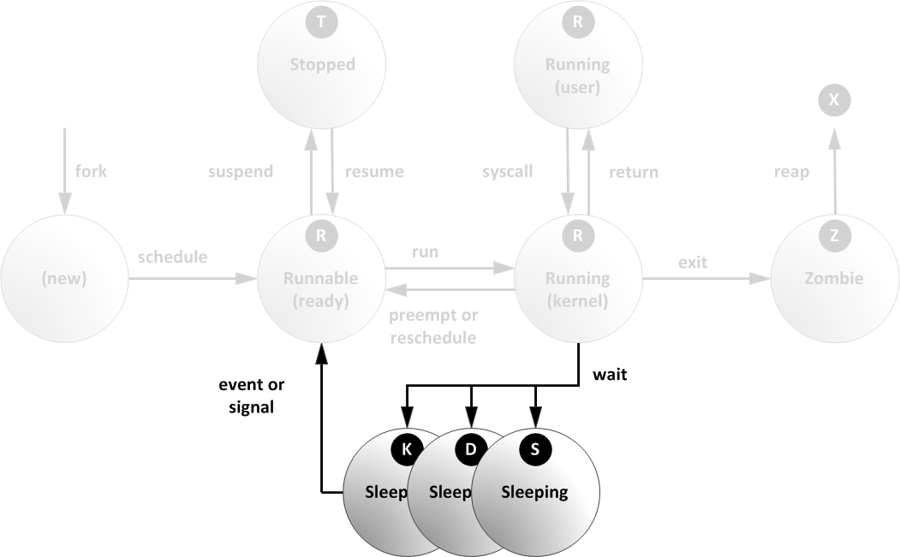

# Процессы

В первом приближении, процесс - это экземпляр программы загруженный в оперативную память с целью исполнения.


Ядро хранит информацию о всех процессах в двухсвязном списке, который называется список задач (task list). Каждый элемент этого списка является _дескриптором процесса_. Дескриптор процесса содержит всю информацию об определенном процессе и описывается структурой [`task_struct`](https://github.com/torvalds/linux/blob/master/include/linux/sched.h#L748). 


Каждый дескриптор процесса идентифицируется уникальным числом PID (Process ID). Информацию о процессе можно найти в псевдо-файловой системе [`/proc`](https://manpages.ubuntu.com/manpages/jammy/en/man5/proc.5.html) по его PID, но существуют утилиты, которые позволяют посмотреть информацию о процессах в более удобной форме. 

<br>

## Список процессов в системе (утилиты `ps`, `top`, `htop`)

Посмотреть список процессов можно утилитой [`ps`](https://manpages.ubuntu.com/manpages/jammy/en/man1/ps.1.html):

```bash
ps  # Процессы пользователя, но только связанные с текущим терминалом
ps --user user_name  # Все процессы пользователя user_name
ps -e                # Показать все процессы в системе
ps -o user,pid,%cpu,%mem,command  # определить список столбцов
```

Утилита `ps` выводит снимок списка процессов в момент своего запуска и не позволяет наблюдать за ними в реальном времени. Частично эту проблему позволяет решить утилита [watch](https://manpages.ubuntu.com/manpages/jammy/en/man1/watch.1.html), т.к. она автоматически, с заданным интервалом, перезапускает переданную ей команду:

```bash
watch -n 1 "date"      # Часы обновляющиеся раз в секунду
watch -n 0.5 "ls -al"  # Раз в 0.5 сек смотрим содержимое текущего каталога
watch -n 0.2 "ps -e"   # Раз в 0.2 сек смотрим списко процессов
```

Чтобы не городить костыли с `ps` и `watch` можно воспользоваться утилитой [top](https://manpages.ubuntu.com/manpages/jammy/en/man1/top.1.html), которая из коробки умеет обновлять информацию о системе в реальном времени и кроме того обладает интерактивным пользовательским интерфейсом:

```bash
top
```

Программу можно настроить через аргументы команды, но большая часть настроек доступна в интерактивном режиме. Например:
- клавиша <kbd>h</kbd> позволяет получить сбавочную информацию;
- клавиша <kbd>f</kbd> позволяет выбрать список и порядок отображаемые столбцов и столбцов и порядок сортировки;
- комбинация <kbd>Shift</kbd> + <kbd>w</kbd> позволяет сохранить ваши настройки в файл и впоследствии `top` будет загружать их автоматически.

В качестве альтернативы `top` можно рассмотреть утилиту [`htop`](https://manpages.ubuntu.com/manpages/jammy/en/man1/htop.1.html). В отличие от первой, она может быть не предустановлена в некоторых дистрибутивах.

```bash
htop
```

Так же как и `top`, `htop` можно настроить через аргументы команды, но большая часть настроек доступна в интерактивном режиме. В целом утилиты очень похожи, но `htop` сделан больший упор на графическую составляющую. Через меню Setup (<kbd>F2</kbd>) можно изменить набор выводимой информации, создать дополнительную вкладку, изменить цветовую тему и т.д.

### Задание 

1. Запустите команду `sleep 10m`. Это запустит процесс, который захватит терминал и уснёт на 10 минут. Его в любой момент можно завершить комбинацией клавиш <kbd>Сtrl</kbd> + <kbd>c</kbd>, но пока этого не делайте.
2. Откройте новый терминал и воспользуйтесь утилитой `ps`, чтобы определите PID процесса созданного командой `sleep`. Т.к. вы подключились с другого терминала, просто `ps` будет на достаточно, т.к. процесс `sleep` остался связан с прошлым терминалом. Нужно посмотреть все процессы вашего пользователя;
3. Теперь используйте утилиту `top`, чтобы найти тот же самый процесс и его PID;
4. Для тех же целей воспользуйтесь утилитой `htop`.

<br>

## Откуда берутся процессы

В Linux процессы могут быть созданы двумя способами:

- запуск отдельного процесса с нуля;
- запуск процесса как fork (ответвление) от уже существующего.

Можно предположить, что процессы, в основном, запускаются как отдельные. Hо это не так. Практически все процессы в Linux создаются путём ответвления от существующего процесса. Процесс от которого происходит ответвление будем называть - родительский (parent), а новый процесс - дочерний (child). Каждый процесс, кроме своего идентификатора PID получает идентификатор родительского процесса Parent PID (PPID).


Кроме создания, родительский процесс отвечает за корректное завершение работы дочернего процесса.

### Задание

5. Настройте утилиту `ps` таким образом, чтобы она дополнительно выводила PPID. Затем запустите её без параметров и найдите в списке процессов тот процесс, который является родительским для `ps`. Запомните его PID;
6. Запустите утилиту `top` и найдите предка процесса PID которого вы определили на прошлом шаге. Запомните его PID;
7. Запустите утилиту `htop` и найдите предка процесса PID которого вы определили на прошлом шаге.

<br>

## Первые процессы в системе

Из вышесказанного может последовать логичный вопрос: если новые процессы – создаются, путём ответвления от существующих, то, есть ли в системе корневой родительский процесс, от которого произошли все остальные? Да, на самом деле таких процесса даже 2, хотя в более старых версиях был один.

Рассмотрим в общих чертах процесс загрузки системы ([тут подробно](https://proninyaroslav.gitbooks.io/linux-insides-ru/content/)).


Собственно, из всего перечисленного нас интересует функция [`rest_init`](https://github.com/torvalds/linux/blob/22b8cc3e78f5448b4c5df00303817a9137cd663f/init/main.c#L689), которая вызывается почти в самом конце функции [`start_kernel`](https://github.com/torvalds/linux/blob/22b8cc3e78f5448b4c5df00303817a9137cd663f/init/main.c#L880). Если посмотреть её исходный код, то там можно найти строки в которых создаются два потока, каждый из которых запускает свою функцию:

```c
pid = user_mode_thread(kernel_init, NULL, CLONE_FS);  # Получит PID 1
...
pid = kernel_thread(kthreadd, NULL, NULL, CLONE_FS | CLONE_FILES);  # Получит PID 2
```

Поток, в котором работает функция [`kthreadd`](https://github.com/torvalds/linux/blob/master/kernel/kthread.c#L736), после некоторой подготовки попадает в бесконечный цикл. У этого процесса только одна задача - создавать новые потоки ядра по необходимости. Т.е. именно он является **предком** всех процессов, работающих в **пространстве ядра** (kernel spaces).

> В ранних версиях ядра, процесса `kthread` не было, а для создания потоков ядра были предусмотрены интерфейсы `kernel_create` и `daemonize`, но этот механизм сложен в эксплуатации, поэтому в новых версиях ядра предоставляются более удобные интерфейсы `kthead_create` и `kthread_run` обращающиеся для создания потоков ядра к процессу `kthreaad`.

Поток, в котором работает функция [`kernel_init`](https://github.com/torvalds/linux/blob/22b8cc3e78f5448b4c5df00303817a9137cd663f/init/main.c#L1453), после некоторой подготовки выполняет поиск init-процесса, который подготовит систему непосредственно к работе пользователя. Сначала функция посмотрит установлен ли путь к init-процессу в конфиге или возможно передан через параметры (мы использовали эту возможность в задании по смене "забытого" пароля, явно прописывая `init=/bin/sh` в параметрах загрузки ядра). Затем функция проверит стандартные пути и если init-процесс не будет найден, то загрузится командная оболочка `/bin/sh` для возможности восстановления системы.

```C
    # Поиск пути к init в конфиге и параметрах запуска
    
    if (!try_to_run_init_process("/sbin/init") ||
        !try_to_run_init_process("/etc/init") ||
        !try_to_run_init_process("/bin/init") ||
        !try_to_run_init_process("/bin/sh"))
        return 0;

    panic("No working init found. Try passing init= option to kernel. "
          "See Linux Documentation/admin-guide/init.rst for guidance.");
```

> [!NOTE]
> К моменту запуска init-процесса ядро уже загружено и готово к работе, а задача init-процесса загрузить программы относящиеся к текущему дистрибутиву. Т.е. ядро можно сравнить с основой для пиццы, а всё, что загружает init-процесс - это наполнитель.  
> Таким образом нам ничего не мешает указать в качестве init например своё приложение, да хоть просто утилиту `/bin/ls`.

Init-процесс (в нашем случае - это `systemd`) запустит все необходимые службы и затем запустит утилиту `getty`, которая будет ожидать ввода вашего логина (именно её вы видите на экране после загрузки системы). После того, как вы введёте логин, [`getty`](https://manpages.ubuntu.com/manpages/jammy/en/man8/getty.8.html) передаст его утилите [`login`](https://manpages.ubuntu.com/manpages/jammy/en/man1/login.1.html), которая (в случае успешного ввода пароля) запустит вашу командную оболочку.

Init-процесс работает в пространстве пользователя (user spaces) и именно он служит общим **предком** для всех процессов работающих в **пространстве пользователя**.

Так как оба процесса созданы непосредственно ядром и не имеют предка, то для них PPID равен нулю.

<br>

## Просмотр иерархии процессов (`pstree`)

Все 3 перечисленные выше утилиты умеют выводить процессы выстраивать их в виде древовидной структуры, но более удобный способ просмотра иерархии процессов - утилита [`pstree`](https://manpages.ubuntu.com/manpages/jammy/en/man1/pstree.1.html).

```bash
pstree           # построить дерево процессов. По умолчанию корень дерев в PID = 1
pstree proc_pid  # построить дерево начиная от процесса с PID = proc_pid
pstree -p        # показывать PID процессов
```

### Задание

8. Посмотрите информацию о файле `/sbin/init`. Как видно это всего лишь символьная ссылка на настоящий init-процесс;
9. Используйте связку `ps` и `grep`, чтобы найти среди всех процессов PID `systemd`;
10. Используйте связку `ps` и `grep`, чтобы найти среди всех процессов PID `kthreadd`;
11. Воспользуйтесь утилитой `pstree` и постройте дерево всех процессов начиная от PID = 0;
12. В окне с ssh подключением запустите команду `watch -n 0.5 "pstree -p"`, затем перейдите в окно виртуальной машины и нажмите сочетание клавиш <kbd>Alt</kbd>+ <kbd>2</kbd>, затем  <kbd>Alt</kbd>+ <kbd>3</kbd> и <kbd>Alt</kbd>+ <kbd>4</kbd>  таким образом вы откроете второй, третий и четвёртый терминалы. В дереве процессов у вас должны появиться 3 дополнительных процесса `agetty`;
13. Введите логин и пароль во втором терминале. Теперь процесс `agetty` должен превратиться в `login` с присоединёнными к нему `bash` (если вы не меняли командную оболочку);
14. Теперь запустите процесс `top`. Как видно `bash` теперь стал родителем для `top`;
15. Разлогиньтесь из второго терминала и остановите `watch`;
16. Определите PID корневого sshd процесса, т.е. непосредственного потомка `systemd`;
17. Перезапустите `watch` следующим образом `watch -n 0.5 pstree -p PID_вашего_sshd`, а затем подключитесь по ssh к серверу вторым окном. Как видно, теперь `bash` является потомком `sshd`.

<br>

## Пространство ядра vs пространство пользователя

Выше было сказано, что `kthreadd` работает в пространстве ядра и создаёт процессы ядра, а init-процесс (`systemd`) работает в пространстве пользователя и является предком всех процессов работающих в пространстве пользователя. Что это за пространства и зачем они нужны?

Если коротко, то для того, чтобы программы не смогли "поломать" систему и друг друга. Для этих целей используется 3 техники:

- отделение кода и данных ядра от кода и данных прикладных программ;
- виртуализация памяти;
- переключение режимов работы процессора.

### Отделение кода и данных ядра от кода и данных прикладных программ

Ядро ОС - это тоже программа, а значит её данные и код, во время работы, хранятся в оперативной памяти и потенциально это даёт возможность другой программе, изменив определённые ячейки памяти, повлиять на работу ядра.

Чтобы предотвратить возможность вмешиваться в работу ядра вся оперативная память доступная системе делится на две секции: **пространство** в котором располагается код и данные **ядра** и **пространство** в котором располагается код и данные **пользовательских** программ (на картинке представлен пример для архитектуры x32). 


Если программа, расположенная в "нижней" секции попробует залезть в секцию оперативной памяти занятую ядром, она будет немедленно уничтожена. Вместо прямого доступа к данным ядра, пользовательским программам предоставляется набор функций (API) вызвав которые программа сможет попросить ядро выполнить желаемые действия. Всё, что касается выделения/освобождения системных ресурсов не доступно пользовательской программе напрямую, только через обращение к ядру.

Всё бы хорошо, но если на компьютере работает ядро и одна пользовательская программа. Что помещает одной пользовательской программа вмешаться в работу другой, ведь они обе находятся в пространстве пользователя.

### Виртуализация памяти

На самом деле картинка расположенная выше - врёт. То, что изображено на картинке показывает как оперативную память "видит" любой запущенный в системе процесс и как её воспринимает разработчик.

Как уже было сказано выше, все операции с системными ресурсами (в том числе и с выделением и освобождением участков оперативной памяти) происходят через вызов функций ядра. Таким образом ядро может "обманывать" программу подменяя адрес по которому обращается программа на другой ([mapping memory addresses](https://www.geeksforgeeks.org/memory-allocation-techniques-mapping-virtual-addresses-to-physical-addresses/)). Даже если две программы обратятся по одному и тому же адресу в оперативной памяти, ядро обеспечит, чтобы они работали с разными ячейками физической памяти. За счёт этого программы **изолированы** каждая в свой отдельной виртуальной песочнице. Процесс видит всю память в системе, как совою собственную и не подозревает о существовании других. 

<details>
	<summary>Программа узнает, что не единственная работает на компьютере</summary>
	<video src="./task_02.5_img/mib_2.mp4"/>
</details>


Чтобы обеспечить эффективный механизм виртуализации памяти, она поделена на блоки (страницы) и каждому процессу, при необходимости выделяется некоторое их количество (когда вы создаёте переменные, массивы, объекты и т.д). Каждая страница содержит данные о режиме доступа, смешении, состоянии, принадлежности процессу и т.д., поэтому попытка вылезти за пределы выделенной страницы в чужую, закончится уничтожением процесса нарушителя.


В ряде случаев в виртуальную память процесса отображается другой процесс. Таким образом оба процесса могут изменять данные друг друга. Это происходит при подключении к программе динамической библиотеки (dll - windows, so - Linux) или при создании потока (нити). Например все потоки ядра работают в одном виртуальном пространстве.

Звучит как идеальное решение всех проблем, но что помешает пользовательской программе работать с памятью (и др.) напрямую, не обращаясь к функциям ядра?

### Переключение режимов работы процессора

Процессор (ЦП) делит все инструкции, которые он может выполнить на привилегированные и непривилегированные ([кольца защиты](https://ru.wikipedia.org/wiki/Кольца_защиты)). Если программа просит ЦП выполнить инструкцию не переключив его на нужный уровень привилегий, то инструкция исполнена не будет. Например, процессор Intel делит степень привилегий на 4 уровня: Ring0 ~ Ring3 (чем меньше номер уровня, тем более "опасные" инструкции).


Фактически, система Linux использует только два уровня выполнения, Ring0 и Ring3 (то же самое верно и для систем Windows). Если процессор работает на уровне Ring0, то говорят, что он находится в режиме ядра (kernel mode), а если на уровне Ring3, то в пользовательском режиме (user mode). Не путайте с kernel space и user space, то было про оперативную память, а mode - про режим работы процессора.

Т.к. ядро стартует раньше пользовательских программ, оно обеспечивает себе возможность переключаться на уровень Ring0 (например, при помощи специально настроенных прерываний), но когда запускает процесс с функцией `kernel_init` переводит ЦП на уровень Ring3, тем самым понижая уровень привилегий для пользовательских программ. Именно поэтому пользовательские программы вынуждены обращаться к ядру и не могут творить всё, что им угодно, т.к. процессор просто откажется исполнять требуемые инструкции.

### Системные вызовы

Обращение пользовательской программы к ядру называется [системным вызовом](https://acm.bsu.by/wiki/Unix2019b/Системные_вызовы). Т.к. пользовательский код не способен напрямую вызвать функцию ядра (т.к. его код расположен в kernel space), для каждой функции ядра существует функция-обёртка (часто они даже называются одинаково). Как правило библиотеки таких функций присутствуют в операционной системе и подключаются к программе во время компиляции. Например GNU C Library (часто используется название glibc).


Пользовательское приложение во время работы вызывает библиотечную функцию, которая загружает идентификатор системного вызова и аргументы в регистры процессора, а затем заставит процессор переключиться на уровень ядра. С этого момента процессор работает на уровне Ring 0 и исполняет указанную функцию ядра с заданными аргументами. После завершения работы функция ядра переключает процессор обратно на Ring 3 и возвращает управление пользовательской программе.

Переключение в режим ядра и обратно - длительная операция и поэтому их стараются делать как можно меньше. Например, выделять сразу большой кусок памяти, а не много раз по кусочку.

### Задание

18. Введите команду `strace -c ls -al`. Утилита [`starce`](https://manpages.ubuntu.com/manpages/jammy/en/man1/strace.1.html) позволяет отслеживать системные вызовы которые совершает команда. Ключ `-c` позволяет вывести статистику по каждому системному вызову для указанной команды. Найдите системный вызов, который выполнялся дольше остальных;
19. Посмотрите конкретный системны вызова `execve` при помощи команды ` strace -e trace=execve ls -ls;
20. Установите утилиту `ltrace` командой `sudo apt install ltrace`;
21. Введите команду `ltrace -c ls -al`. Утилита [`ltarce`](https://manpages.ubuntu.com/manpages/jammy/en/man1/ltrace.1.html) позволяет отслеживать вызовы библиотечных функций которые совершает команда (не только системные). Ключ `-c` работает так же как и для `strace`. Найдите библиотечный вызов, который выполнялся дольше остальных;
22. Отфильтруйте только вызов функции `strlen` командой `ltrace -e strlen ls -ls`;

<br>

## Жизненный цикл процесса

Рассмотрим полный жизненный цикл пользовательского процесса.


0. Процесса не существует. Существует только предок;
1. Предок пополняет вызов библиотечной функции [`fork`](https://manpages.ubuntu.com/manpages/jammy/en/man2/fork.2freebsd.html) (есть несколько различных вариантов этой функции). Функция `fork` выполняет системный вызов [`clone`](https://manpages.ubuntu.com/manpages/jammy/en/man2/clone.2.html) и в результате появляется новый процесс - копия родительского;

### Задание

23. Установите компилятор языка C: `sudo apt install gcc`;

24. В домашней директории создайте файл `proc.c` содержащий:

    ```C
    #include <stdio.h>
    #include <unistd.h>  /* для fork */
     
    int main() {
        fork(); // Здесь будет создан потомок
                // <-- Начиная с этой строки, код будет исполняться в двух процессах
        printf("Hello, World\n");
    }
    ```

25. Скомпилируйте исполняемый файл командой: `gcc -o proc proc.c`. В результате будет создан файл `proc`;

26. Запустите программу командой `./proc`. В результате вы увидите вывод "Hello, World" дважды, один от родителя, второй от потомка;

Как правило, наличие двух одинаковых процессов не особенно полезно, поэтому далее предок и потомок начинают работать каждый по своему сценарию. Чтобы это было возможно, нужен способ, в коде, отличить предка от потомка. Это можно сделать на основании значения которое возвращает функция `fork`. Предок получит от `fork` PID дочернего процесса, а дочерний процесс получит 0. Если произошла, критическая ошибка и дочерни процесс создать не удалось, то `fork` вернёт -1.

27. Измените код в файле `proc.c` на следующий:

    ```C
    #include <stdio.h>
    #include <unistd.h>    /* для fork  */
    #include <sys/types.h> /* для pid_t */
     
    int main() {
        pid_t pid = fork();
              // <-- Начиная с этой строки, код будет исполняться в двух процессах
        if (pid < 0) {           
            printf("Bad fork\n");   // Ошибка создания потомка
        } else if (pid == 0) {   
            printf("I am child\n"); // Осознаём себя как дочерний процесс
        } else {                 
            printf("I am parent of: %d\n", pid); // Осознаём себя как родительский процесс
        }
    }
    ```

28. Скомпилируйте и запустите программу. В результате вы увидите разный вывод от каждого из процессов;

Часто, дочерний процесс исполняет НЕ свой код, а запускает уже существующую программу. Точнее не запускает, а буквально превращается в другую программу заменяя свой код на чужой. Эта операция выполняется при помощи функции семейства [`exec`](https://manpages.ubuntu.com/manpages/jammy/en/man3/exec.3.html) (функции отличаются способом передачи аргументов).

<details>
  <summary>Как-то так ...</summary>
  <video src="./task_02.5_img/exec.mp4"/>
</details>


29. Измените код в файле `proc.c` на следующий:

    ```C
    #include <stdio.h>
    #include <unistd.h>
    #include <sys/types.h>
    
    int main() {
        pid_t pid = fork();
 
        if (pid == 0) {
            // Осознаём себя как дочерний процесс
            execl("/bin/ls", "", "-al", (char *) 0); // Превращаемся в ls -al
            printf("exec is fail");      // В норме сюда мы попасть не должны
        } else {
            printf("I am parent of: %d\n", pid);
        }
    }
    ```

30. Скомпилируйте и запустите программу. В результате дочерний процесс превратится в команду `ls -al`. Строка "exec is fail" не будет выведена, т.к. она относится к собственному коду дочернего процесс, а он был заменён на код из файла "/bin/ls" в результате вызова `execl` ;

Временно пропустим часть в которой процесс выполняет полезную работу и перейдём к части, в которой он завершается. Как уже говорилось, родительский процесс отвечает за завершение работы дочернего, но пока-что мы не заботились об этом. После того, как код дочернего процесса подойдёт к концу он автоматически уведомит ядро об окончании работы через системный вызов [`exit`](https://manpages.ubuntu.com/manpages/jammy/en/man2/exit.2.html) (или это можно сделать вручную вызвав одноимённую функцию). В результате ядро освободит все занятые процессом ресурсы и, с этого момента, процесс переходит в состояние - "зомби" (т.е. он уже не живой, но всё ещё существует как процесс, с точки зрения системы). Состояние зомби - это естественное состояние процесса перед окончательным уничтожением. Зомби НЕ потребляют памяти или процессорного времени, они просто висят в списке процессов и ждут, пока родительский процесс прочитает их код завершения и позаботится об их окончательном уничтожении.

31. Измените код в файле `proc.c` на следующий:

    ```C
    #include <stdio.h>
    #include <unistd.h>
    #include <sys/types.h>
    
    int main() {
        pid_t pid=fork();
     
        if (pid == 0) {
            printf("I am child\n");
        } else {
            printf("I am parent of: %d\n", pid);
            sleep(600); // Засыпаем на 10 минут
        }
    }
    ```

32. Скомпилируйте и запустите программу. В результате, дочерний процесс завершится раньше родительского и повиснет в состоянии зомби;

33. Пока родительски процесс всё ещё спит откройте новый терминал и запустите программу `top`. Как видно, вверху количество зомби процессов теперь равно 1. Используя PID, который родительский процесс вывел на экран, найдите его и посмотрите в столбец `S` (state). Там должен быть символ `Z`;

Что будет, если родительский процесс завершится раньше дочернего? Дочерний процесс продолжит работать, но теперь у него не будет родительского процесса, то есть он станет "сиротой" (официальный термин). Но он пробудет в таком состоянии не долго, т.к. его сразу же удочерит процесс с PID 1 и позаботится о его корректном завершении, дождавшись когда процесс закончит свои дела и перейдёт в состояние зомби.

Во всех программах, которые мы запускали до этого момента мы никак не заботились о завершении дочернего процесса, поэтому с ним происходил сценарий описанный выше. Но что происходит с родительским процессом после его завершения? А всё тоже самое, т.к. он сам был создан как дочерний от другого процесса. Наши программы запускаются через `exec` в дочерних процессах, которые запускает командная оболочка `bash`.

34. Измените код в файле `proc.c` на следующий:

    ```C
    #include <stdio.h>
    #include <unistd.h>
    #include <sys/types.h>
    
    int main() {
        pid_t pid=fork();
     
        if (pid == 0) {
            printf("I am child\n");
            sleep(600); // Засыпаем на 10 минут
        } else {
            printf("I am parent of: %d\n", pid);
        }
    }
    ```

35. Скомпилируйте и запустите программу. В результате, родительский процесс завершится раньше дочернего и будет удочерён init-процеессом;

36. Запустите утилиту `ps` и настройте её на вывод PPID, PID и команды. Убедитесь, что дочерний процесс `./proc` теперь потомок процесса с PID 1.

Чтобы позаботится о завершении своего дочернего процесса, родительский процесс должен вызвать функцию семейства [`wait`](https://manpages.ubuntu.com/manpages/jammy/en/man2/wait.2freebsd.html). В результате родительский процесс получит статус код завершения дочернего и переведёт его из состояние зомби в полностью уничтоженное удалив его дескриптор из таск листа. Доступ к статус коду дочернего процесса имеет только родительский;  

37. Измените код в файле `proc.c` на следующий:

    ```C
    #include <stdio.h>
    #include <unistd.h>
    #include <sys/types.h>
    #include <sys/wait.h> /* для wait */
      
    int main() {
        pid_t pid=fork();
      
        if (pid == 0) {
            sleep(5);
            printf("I am child\n");
        } else {
            printf("I am parent of: %d\n", pid);
            
            printf("Waiting for child\n");
            int status;
            wait(&status); /* Засыпаем, пока дочерний процесс не закончит работу */
            printf("Child exit with code %d\n", status);
        }
    }
    ```

38. Скомпилируйте и запустите программу. В результате, родительский процесс будет "висеть" пока дочерний не завершится.

Команда `wait` ожидает завершения любого дочернего процесса, но если их много, то можно воспользоваться `waitpid`, которая будет ждать завершения дочернего процесса с указанным PID. Если ваш процесс порождает много других и вы не хотите тормозить его функцией `wait`, то можно зарегистрировать обработчик сигнала [`SIGCHLD`](https://ru.wikipedia.org/wiki/SIGCHLD) и вызывать `wait` как реакцию на него. Сигнал `SIGCHLD` автоматически отправляется дочерним процессом родительскому в момент вызова `exit`.

### Процесс во время работы

В период между созданием и уничтожением процесс переключается между некоторым набором состояний.

#### Состояние `TASK_RUNNING`

Если процесс находится в состоянии `TASK_RUNNING` (утилиты отображают как `R`) это означает одно из:

- процесс готов к исполнению, но пока ожидает, когда планировщик выделит ему процессорное время;
- процесс занимает процессор и исполняет свой код;
- процесс занимает процессор и исполняет код ядра (системный вызов);

В системе одновременно работает множество процессов, но количество процессоров (ядер) ограниченно, поэтому планировщик выделяет каждому процессу определённое количество квантов процессорного времени, а затем отдаёт процессор следующему в очереди. Иногда исполняющийся процесс может быть прерван (вытеснен (preempt)) и переведён в состояние ожидания не потратив все выделенные кванты времени (например, в случае аппаратного прерывания).


Количество процессорного времени которое будет выделено процессу определяется его приоритетом и политикой планирования (подробнее [тут](https://dzen.ru/a/YxnZnu2ZfhT13ahq)). Мы ограничимся только политикой `SCHED_OTHER`, которая применяется к большинству пользовательских процессов по умолчанию.

**В этом случае** приоритет процесса определяется значением `NICE`, которое можно указать при помощи утилиты [`nice`](https://manpages.ubuntu.com/manpages/jammy/en/man1/nice.1.html) (для нового процесса) или изменить утилитой [`renice`](https://manpages.ubuntu.com/manpages/jammy/en/man1/renice.1.html) (для запущенного) процесса. Обе утилиты позволяют устанавливать `NICE` в диапазоне от -20 до 19. Значение `NICE` по умолчанию равно 0.  

```bash
nice -n -10 ls  # запустить ls с NICE -10
nice -n 15 ls   # запустить ls с NICE 15
renice -n -20 -p PID       # Изменить для просесса PID NICE на -20
renice -n -20 -u user_name # Изменить для всех процессов user_name NICE на -20
```

Само значение `NICE` показывает НЕ приоритет, а готовность процесса **уступить** свою очередь другим. Чем выше это число, тем более уступчивый процесс и от того более "приятный" (nice) для других. Чем число меньше, тем процесс менее "приятный" и вместо того, чтобы уступить, сам готов расталкивая всех пробраться в начало очереди. Т.е. чем выше значение `NICE`, тем чаще процесс будет уступать свой процессорное время другим. Пользователь без прав суперпользователя может сделать процесс более уступчивым, но не наоборот.

Некоторые утилиты, кроме `NICE` выводят значение приоритета (`PRI`, `PR`), пока не обращайте на него внимания, т.к. оно может сбить с толку, потому что в разных местах отображается по разному и сильно зависит от политики планирования.

##### Задание

39. Запустите утилиту `htop` и посмотрите на её состояние в столбце `S`. Т.к. утилита сейчас активно мониторит ресурсы и обновляет экран, ей требуется процессор и поэтому она находится в состоянии `R`. Большая часть остальных процессов находится в спящем состоянии;
40. Найдите столбец `NI` (`NICE`), для утилиты `htop` сейчас там должно быть выставлено стандартное значение 0. Попробуйте изменить его клавишами <kbd>F8</kbd> и <kbd>F7</kbd>. Как видно, значение увеличивается, но не уменьшается (для этого нужны права `root`);
41. Не закрывая `htop` перейдите в новое окно и установите для неё значение `NICE` равное -20 при помощи утилиты `renice`;
42. Теперь запустите команду `sleep 10m` установив `NICE` в -10;
43. Отсортируйте вывод утилиты `htop` по значению `NICE` от меньшего к большему и убедитесь, что значения установленные вам ранее применились.


#### Состояния `TASK_INTERRUPTIBLE`, `TASK_UNINTERRUPTIBLE`, `TASK_KILLABLE`

Эти три состояния говорят о том, что процесс не может продолжать работу и ожидает когда произойдёт нужное событие. Пока процесс ждёт, он переходит в состояние сна и находится в нём, пока не получит уведомление от системы. Проснувшись процесс переходит в состояние готовности (`TASK_RUNNING`).

Различают следующие виды спящих "процессов":

- `TASK_INTERRUPTIBLE` (утилиты отображают как `S`) . Процесс ждет некоторого условия: аппаратного запроса, доступа к ресурсам системы или сигнала. Когда произойдёт событие или сигнал удовлетворяющий условию, процесс вернётся в состояние _Запущен_;
- `TASK_UNINTERRUPTIBLE` (утилиты отображают как `D`). Этот процесс также находится в спящем режиме, но, в отличие от состояния `S`, не реагирует на поступающие сигналы. Это состояние используется, только если прерывание процесса может привести к непредсказуемому состоянию устройства;
- `TASK_KILLABLE`. Это состояние аналогично непрерываемому состоянию `D`, но позволяет ожидающему заданию реагировать на сигнал завершения (полное прерывание процесса). Служебные программы часто отображают _завершаемые_ процессы как состояние `D`.



#### Состояния `TASK_STOPPED`, `TASK_TRACED`

Процесс не может продолжать работу, потому что был остановлен по одной из причин:

- `TASK_STOPPED` (утилиты отображают как `T`). Процесс был остановлен (приостановлен), обычно по сигналу от пользователя или другого процесса. Этот процесс может быть продолжен (возобновлен) еще одним сигналом, возвращающим в состояние _Запущен_.
- `TASK_TRACED`. Отлаживаемый процесс, который также временно остановлен и использует тот же бит состояния `T`.


##### Задание

44. Запустите команду `sleep 10m` затем нажмите <kbd>Ctrl</kbd> + <kbd>Z</kbd>. Это приведёт к остановке (НЕ к завершению) процесса;
45. Запустите утилиту `top` и тоже остановите её;
46. Запустите утилиту `htop` и отсортируйте процессы по столбцу `S`. Убедитесь, что обе утилиты находятся в состоянии сна и затем остановите `htop`;
47. Запустите команду `sleep 10m` остановите её тоже;
48. Наберите команду `jobs -l`. Вы должны получить список процессов находящихся в фоне с пометками, какие из них остановлены, а какие запущены. В нашем случае должно быть 4 остановленных процесса;
49. Определите номер (первый столбец) процесса `top` в списке и переведите его из фона на **передний план** командой `fg <номер>` (он при этом проснётся и продолжит работать). Завершите `top`;
50. Определите номер первого процесса `sleep` и выполните команду `bg <номер>`. Это приведёт к тому, что процесс **останется в фоне**, но проснётся и продолжит работать.
51. Посмотрите список фоновых процессов командой `jobs -l`;
52. Завершите все фоновые процессы.

#### Состояния `EXIT_ZOMBIE`, `EXIT_DEAD`

Эти состояние были рассмотрены ранее:

- `EXIT_ZOMBIE` (утилиты отображают как `Z`). Дочерний процесс отправляет сигнал родительскому процессу при завершении работы. Освобождаются все ресурсы, за исключением дескриптора процесса (с идентификатором PID).
- `EXIT_DEAD` (`X`). Когда родительский процесс очищает (_убирает_) оставшийся дескриптор дочернего процесса, такой процесс считается полностью высвободившим ресурсы. Это состояние никогда не наблюдается в программах вывода списков процессов.

<br>

## Процессы и права доступа

Может возникнуть логичный вопрос, почему Linux создаёт новые процессы именно через клонирование существующих, ведь создавать копию процесса и его данных, для того, чтобы он потом превратился в другой - это пустая трата системных ресурсов и времени.

На самом деле реального копирования данных не происходит. Linux отмечает страницы памяти принадлежите родительскому процессу как доступны только для чтения и когда дочерний процесс захочет **изменить** переменную, унаследованную от родителя, система уже реально скопирует переменную в другое место оперативной памяти и изменение будет происходить уже там ([Copy-on-write](https://ru.wikipedia.org/wiki/Копирование_при_записи)).

Основная причина создавать процессы через `fork` заключается в том, что дочерний процесс получает от родителя набор его метаданных и как следствие все системные ограничения и разрешения. Т.е. бесправный процесс создаёт такого же бесправного потомка. Сейчас нас будут интересовать: RUID, RGID, EUID, EGID:

   - EUID (effective user identifier) и EGID (effective group identifier) ука­зыва­ют "эффектив­ных" (действующий) ID поль­зовате­ля и основной груп­пы. Именно этот идентификатор исполь­зуется системой для опре­деле­ния прав дос­тупа про­цес­са к фай­лам и дру­гим объ­ектам;
   - RUID (real user identifier) и RGID (real group identifier) ука­зыва­ют "нас­тоящих" ID поль­зовате­ля и груп­пы. Это идентификаторы показывают кто на самом деле запустил процесс. Никак не влияет на определение прав доступа **ядром**, но может использоваться **утилитами**, чтобы запрещать не желательные действия;
   - SUID (saved user identifier) и SGID (saved group identifier) при запуске устанавливаются равным эффективным идентификаторам и нужны для того, чтобы процесс мог менять "эффектив­ных" идентификатор на реальный и обратно. 

### Задание

53. Запустите команду:

    ```bash
    watch -n 0.5 ps -o euser,ruser,suser,egroup,rgroup,sgroup,command -U ваш_логин
    ```

54. В другом терминале залогиньтесь под своим основным пользователем и запустите утилиту `passwd` от имени своего пользователя.

55. Пока `passwd` ждёт ввода посмотрите вывод `ps`. Обратите внимание на её эффективного и реального пользователей. Как видно, реальный (запустивший команду) пользователь - это вы, а эффективный - `root`. Так получилось, потому что у `passwd` установлен SUID бит в правах; 

56. Измените код в файле `proc.c` на следующий:

    ```C
    #include <stdio.h>
      
    #define __USE_GNU   // Чтобы не ругался на getresuid и getresgid
    #include <unistd.h> // Для getresuid и getresgid
      
    int main() {
        uid_t ruid, euid, suid;
        gid_t rgid, egid, sgid;
      
        getresuid(&ruid, &euid, &suid);
        getresgid(&rgid, &egid, &sgid);
      
        printf("EUID - %d\n", euid);
        printf("RUID - %d\n", ruid);
        printf("SUID - %d\n", suid);    
        printf("EGID - %d\n", egid);
        printf("RGID - %d\n", rgid);
        printf("SGID - %d\n", sgid);
    }
    ```

57. Скомпилируйте и запустите программу:

    - Cначала как обычно, от имени своего пользователя;
    - Затем через `sudo`;
    - Затем, установите владельцем `root`, добавьте к правам Set UID бит и запустите как обычно.

58. Измените код в файле `proc.c` на следующий:

    ```C
    #include <stdio.h>
    
    #define __USE_GNU
    #include <unistd.h>
    
    int main() {
        uid_t ruid, euid, suid;
        getresuid(&ruid, &euid, &suid);
    
        if (euid == 0)
            if (ruid == 0) execl("/usr/bin/cat", "", "/etc/shadow", (char *) 0);
            else printf("Fake root!\n");
        printf("Not root!\n");
    }
    ```
59. Скомпилируйте и запустите программу:

    - Cначала как обычно, от имени своего пользователя;
    - Затем через `sudo`;
    - Затем, установите владельцем `root`, добавьте к правам Set UID бит и запустите как обычно.

Идентификаторы RUID, RGID, EUID, EGID,  SUID, SGID можно изменить в программе, но:

   - Если эффективный UID равен 0 (`root`), то можно менять любой ID на любой (на этой возможности основана утилита `sudo`);
   - Если эффективный UID НЕ равен 0, то ядро проверит остальные два и если целевого значения среди них нет, то поменять ID не получится. Поэтому SUID и SGID нужны.

### Утилита sudo

Ранее была рассмотрена утилита - `su`, которая позволяет запускать процессы от имени другого пользователя, вводя его пароль. Утилита [`sudo`](https://manpages.ubuntu.com/manpages/jammy/en/man8/sudo.8.html) позволяет запустить процесс от имени **другого** пользователя (по умолчанию от `root`) вводя пароль **своего**. Как побочный эффект (или как основная фича) это позволяет запускать процессы от имени пользователей с заблокированным паролем (помним, что в Ubuntu у `root` пароль заблокирован по умолчанию):

```bash
sudo <ключи sudo> <команда> <ключи команды>
sudo ls -al         # Запуск ls -al от имени root
sudo -u nobody top  # Запуск top от имени nobody
sudo -u nobody -g daemon ls / # Запуск ls / от имени nobody с группой daemon
```

При помощи `sudo` можно указать:

- реальный и эффективный идентификатор пользователя;
- реальный и эффективный идентификатор основной группы;
- дополнительные идентификаторы групп;
- переменные окружения;
- текущий рабочий каталог;
- маску режима создания файла (umask);
- роль и тип SELinux;
- приоритет планирования (он же nice значение);
- ограничение ресурсов системы (по памяти, по проц. времени и т.д.).

Принцип работы `sudo` простой. Сама утилита принадлежит `root` и для неё установлен Set UID бит, следовательно запущенный процесс будет иметь эффективный идентификатор пользователя `root`. Далее `sudo` делает `fork` себя (в некоторых случаях несколько раз) и дочерний процесс так же получает эффективный ID `root`. Затем дочерний процесс меняет идентификаторы на указанные пользователем и превращается в команду указанную пользователем.

#### Конфигурирование sudo

Все настройки `sudo` находятся в файле `/etc/sudoers`. Менять этот файл не рекомендуется, вместо этого лучше добавлять дополнительные конфиги в каталог `/etc/sudoers.d` (файл может называться как угодно но точки в начале и тильды (`~`) в конце быть не должно). Эта возможность особенно удобна, когда вы настраиваете сервер не руками, а скриптом. Все файлы из `/etc/sudoers.d` будут добавлены к конец `/etc/sudoers`.  Если для пользователя присутствуют несколько записей, то они применяются по порядку.

По умолчанию, пользователю запрещено всё. Добавляя новые записи можно разрешить или запретить выполнять команду (имеется в виду с `sudo`). О том какие настройки поддерживает `sudo` можно ознакомится в [man](https://manpages.ubuntu.com/manpages/jammy/en/man5/sudoers.5.html) или например [тут](https://losst.pro/nastrojka-sudo-v-linux).

##### Задание

60. Добавьте нового пользователя `khonsu`;

61. Откройте второе окно и залогиньтесь под ним, а в первом окне перейдите под `root` (для удобства). Все дальнейшие действия по изменению файлов выполняйте в первом окне, а проверочные во втором;

62. В каталог `/etc/sudoers.d` добавьте файл `01_khonsu` содержащий:

    ```plain
    khonsu <ip вашего сервера> = /usr/bin/ls
    ```

    Этой строкой мы разрешаем пользователю `khonsu` на указанном хосте выполнять команду `ls` с `sudo`. Другие команды `sudo` откажется запускать.

63. Проверьте, что `khonsu` может выполнять команду `sudo ls` и `sudo ls -al`;

64. Измените файл `01_khonsu` на:

    ```plain
    khonsu <ip вашего сервера> = /usr/bin/ls -al
    ```

    Теперь пользователь `khonsu` может выполнять команду `ls` только с указанным **аргументом**. Проверьте;

65. Измените файл `01_khonsu` на:

    ```plain
    khonsu <ip вашего сервера> = EXEC: NOPASSWD: /usr/bin/ls -al
    ```

    К каждой команде можно добавить 0 или больше **тегов**. Здесь мы добавили 2 тега: `EXEC:` - можно запускать, `NOPASSWD:` - можно не вводить пароль. Проверьте, что теперь `sudo` не просит пароль;

66. Введите команду:

    ```plain
    khonsu <ip вашего сервера> = CWD=/home/khonsu NOPASSWD: /usr/bin/ls -al
    ```

    Дополнительно, к каждой команде можно добавить 0 или больше **опций**. Здесь мы добавили 1 опцию `CWD`, которая установит текущий каталог в `/home/khonsu` перед тем, как будет запущена команда. Проверьте, что из любого каталога `sudo ls -al` показывает содержимое домашнего каталога;

Во всех перечисленных случаях команда запускалась от имени `root` и с группой `root`. Это поведение по умолчанию можно изменить. Для этого перед командой (0 или 1 раз), нужно указать пользователя и(или) группу от имени которого можно запускать эту команду:

- `(user)` - если указано имя пользователя `user`, то команду можно запустить только от имени этого пользователи и любой из его групп (по умолчанию берётся основная): `sudo -u user ...`, `sudo -u user -g user_grp ...`;
- `(user:group)`- если указано имя пользователя `user` и группа `group`, то всё тоже, что и выше, но дополнительно можно указывать группу `group`:  `sudo -u user -g group ...`;
- Если перед командой не указано вообще ничего, то это аналогично: `(root)`;
- `()` или `(:)` - если перед командой указаны пустые скобки или с двоеточием, и правило назначается пользователю `khonsu`, то это аналогично `(khonsu)`;
- `(:group)` - если указана только группа `group`, и правило назначается пользователю `khonsu`, то это аналогично `(khonsu:group)`;

67. Создайте пользователя `marc_spector`;

68. Добавьте в файл `01_khonsu` ещё одну запись:

    ```plain
    khonsu <ip вашего сервера> = (marc_spector:root) NOPASSWD: /usr/bin/touch
    ```

    Этой строкой мы разрешаем пользователю `khonsu` без пароля запускать команду `touch` от имени пользователя `marc_spector` и при желании с группой `root` (но не обязательно).

69. Под пользователем `khonsu` перейдите в каталог `/tmp` и введите команду: `sudo -u marc_spector touch moon`. Проверьте владельца файла.

Одно правило может содержать несколько команд указанных через запятую. Для каждой команды теги, опции и пользователи от имени которых разрешено запускать указываются отдельно.

70. Допишите в конец последнего правила разрешение выполнять команду `/usr/bin/rm` от имени пользователя `marc_spector`, но обязательно с паролем.

Всё, что мы только что писали выше в единственном экземпляре может быть записано во множественном при помощи псевдонимов (аlias). Всего существует 4 типа псевдонимов:

- User Aliases - один или несколько пользователей (или групп) через запятую. Это пользователи для которых назначается правило:

  ```plain
  User_Alias ADMINS = %admin
  User_Alias USERS = tom, dick, harry
  ```

- Host Aliases - это список имен хостов, ip-адресов, сетей и сетевых групп через запятую:

  ```plain
  Host_Alias SERVERS = 192.168.0.1, 192.168.0.2, server1
  Host_Alias NETWORK = 192.168.0.0/255.255.255.0
  ```

- Runas Aliases - аналогично псевдонимам пользователей, но дополнительно разрешено указывать пользователей по UID (#0, #1000). Эти псевдонимы можно указывать в круглых скобках перед командой как вместо пользователей, так и вместо групп:

  ```plain
  Runas_Alias ROOT = #0
  Runas_Alias ADMINS = %admin, root
  ```

- Command Aliases - это список команд и каталогов через запятую. Если вы укажете каталог, он будет включать любой файл в этом каталоге, но не в подкаталогах:

  ```plain
  Cmnd_Alias SHUTDOWN_CMDS = /sbin/poweroff, /sbin/reboot, /sbin/halt
  Cmnd_Alias ADMIN_CMDS = /usr/sbin/passwd, /usr/sbin/useradd
  ```

Дополнительно существует с встроенный псевдоним `ALL` который можно писать где угодно

71. Создайте пользователей `bastet` и `selina_kyle`;

72. Замените содержимое файла `01_khonsu` на:

    ```plain
    User_Alias GODS = khonsu, bastet
    Runas_Alias HUMANS = marc_spector, selina_kyle
    GODS ALL = (HUMANS) NOPASSWD: ALL
    ```

    Здесь мы создаём два псевдонима и одно правило. Каждому пользователю из `GODS` на любых хостах разрешено выполнять любые команды без ввода пароля от имени любого из пользователей `HUMANS`.

Для проверки наличия ошибок в файле рекомендуется выполнить команду `visudo -c <имя_файла>`.

<br>

## Процессы и командная оболочка

Для организации диалоговой работы пользователей в Linux вводится понятие терминальной сессии. Сессия "живёт" с момента ввода пользователем имени и пароля и до выхода из системы. Во время терминальной сессии может быть запущено несколько программ, которые будут параллельно выполнятся в фоновом режиме и между которыми можно переключаться в диалоговом режиме. После завершения терминальной сессии обычно происходит завершение всех запущенных в ней фоновых процессов.

С точки зрения ядра - терминальная сессия - это группа процессов, имеющих один идентификатор сеанса **SID**. Этот идентификатор совпадает с PID процесса запустившего сессию (как правило это командная оболочка). Процесс запустивший сессию называется - лидером сессии. С идентификатором SID связан драйвер управляющего терминала, доступный всем членам сеанса как файл символьного устройства **/dev/tty**. Для каждого сеанса существует свой **/dev/tty**. Управляющий терминал взаимодействует с процессами сеанса с помощью отправки сигналов.

Процесс не связанный с каким-либо терминалом и обычно являющийся потомком init-процесса называют демоном.

В рамках одного **сеанса** могут существовать несколько **групп** процессов. С каждым процессом связан идентификатор группы **PGID**. Этот идентификатор совпадает с PID первого процесса в группе. Этот процесс называется - лидером группы. Одна из групп в сеансе может быть зарегистрирована в драйвере управляющего терминала как группа фоновых процессов. Процессы могут (все кроме лидеров) переходить из группы в группу самостоятельно или переводить из группы в группу другие процессы в пределах сеанса. Перейти в группу другого сеанса нельзя, но можно создать свой собственный сеанс из одного процесса со своей группой в этом сеансе. Вернуться в предыдущий сеанс уже не получится.

### Задание

73. Выполните команду: `sleep 10m &` три раза;
74. Затем команду: ` ps -o pid,sid,pgid,comm -u ваш_логин`. Обратите внимание, что все три `sleep` имеют один и тот же SID, равный PID текущей командной оболочки. Это говорит о том, что они все относятся к текущему сеансу. При этом у каждого из них разный PGID, т.к. они все являются лидерами своих групп;
75. Выполните команду: ` ps -o pid,sid,pgid,comm -u ваш_логин | less`. Обратите внимание, что у `ps` и `less` одинаковый PGID совпадающий с PID процесса `ps`. Это означает, что эти 2 процесса находятся в одной группе лидер которой `ps`.

<br>

## Межпроцессное взаимодействие

Как было сказано выше, процессы изолированы друг от дуга, но периодически возникает необходимость обмена информацией между ними. Для этого в Linux доступны следующие варианты:

- каналы (именованные и не именованные);
- сигналы;
- сокеты (именованные и не именованные);
- очереди сообщений;
- разделяемая память;
- примитивы синхронизации потоков.

Из всего перечисленного рассмотрим только механизм сигналов. Механизм сигналов является простейшей формой межпроцессного взаимо­действия и предназначен для внешнего управления процессами. У каждого сигнала есть свой **обработчик**, определяющий поведение процесса при отсылке ему этого сигнала. Каж­дому процессу назначаются обработчики «по умолчанию», в большинстве случаев приводящие к завершению процесса. Программист может определить свой обработчик сигнала, как функцию, которой будет передано управление при доставке сигнала процессу. 

У каждого сигнала есть название и номер. Номера могут отличатся в разных системах, а названия стандартизированы, поэтому лучше использовать их. Сигналы поддерживаемые Ubuntu и их номер можно найти в [man](https://manpages.ubuntu.com/manpages/lunar/ru/man7/signal.7.html). Вот небольшая таблица часто используемых сигналов:

| **Название** | **Номер** | **Описание**                                                 |
| ------------ | --------- | ------------------------------------------------------------ |
| SIGHUP       | 1         | Закрытие терминала. Если командная оболочка получает сигнал `SIGHUP` когда вы закрываете терминал, она завершает работу. Перед выходом она отправляет сигнал `SIGHUP` всем запущенным в ней процессам |
| SIGINT       | 2         | Сигнал остановки процесса пользователем с терминала (CTRL + C) |
| SIGQUIT      | 3         | Сигнал остановки процесса пользователем с терминала (CTRL + \\) с дампом памяти |
| SIGKILL      | 9         | Безусловное завершение процесса                              |
| SIGTERM      | 15        | Сигнал запроса завершения процесса                           |
| SIGSTOP      | 17        | Принудительная приостановка выполнения процесса, но не завершение его работы |
| SIGTSTP      | 18        | Приостановка процесса с терминала (CTRL + Z), но не завершение работы |
| SIGCONT      | 19        | Продолжение выполнения ранее остановленного процесса         |

Кроме комбинаций клавиш для отправки процессам сигналов служит утилита [`kill`](https://manpages.ubuntu.com/manpages/jammy/en/man1/kill.1.html):

```bash
kill -L     # список сигналов
kill -l 9   # название сигнала по номеру (наоборот тоже работает)
kill -9 PID # отправить сигнал с номером 9 процессу PID
kill -SIGKILL PID # отправить сигнал SIGKILL процессу PID
```

### Задание

76. Выполните команду: `sleep 20m &` три раза. На экране должны отобразится PID-ы процессов;
77. Отправьте всем трём сигнал `SIGSTOP`. Проверьте список фоновых процессов командой `jobs`;
78. Отправьте последнему запушённому сигнал `SIGKILL`, а первому `SIGCONT` и снова проверьте их состояние;
79. Определите PID своей командной оболочки (`echo $$`) и пошлите ей сигнал `SIGHUP`;
80. Зайдите обратно на сервер и проверьте список фоновых процессов. Как видно, таймеры отсутствую, т.к. им был послан такой же сигнал (потеря связи с командной оболочкой);
81. Запустите команду `python3 -m http.server 8000 &` и проверьте в браузере, что сервер работает;
82. Разлогиньтесь и снова проверьте вывод браузера. Теперь сервер перестал работать;
83. Зайдите на сервер и проверьте все процессы своего пользователя. Как видно сервер до сих пор присутствует в списке, но теперь он не отвечает. Проблема в том, что его вводи и вывод был связан с нашим терминалом и он получил ошибку, когда мы вышли из сессии. Чтобы такого не происходило нужно либо перенаправить ввод/вывод в другие файлы либо использовать команду `nohup`. Она отвязывает процесс от текущего терминала и перенаправляет вывод в файл "nohup.out";
84. Отправьте зависшему процессу сигнал `SIGKILL` и перезапустите сервер командой `nohup python3 -m http.server 8000 &`;
85. Разлогиньтесь и проверьте, что сервер по прежнему работает.

<br>

## Источники

- [Процессы и память в Linux. Отрывок из книги «Внутреннее устройство Linux»](https://xakep.ru/2021/03/05/linux-processes-and-memory/);
- [Linux Inside на русском](https://proninyaroslav.gitbooks.io/linux-insides-ru/content/);
- [Различия между PID, TID и PPID в Linux](https://www.baeldung.com/linux/pid-tid-ppid);
- [Алгоритм загрузки linux (BIOS/UEFI)](https://sysadminium.ru/adm_serv_linux-boot_algorithm/);
- [Процесс загрузки ОС Linux схематично и понятно](https://study-linux.livejournal.com/8018.html);
- [Системы инициализации Linux](https://losst.pro/sistemy-initsializatsii-linux);
- [Система инициализации systemd](https://sysadminium.ru/adm-serv-linux-systemd-init-system/);
- [Linux - Потоки ядра](https://rflinux.blogspot.com/2010/04/linux.html);
- [Ещё немного о потоках ядра: kthreadd](https://rflinux.blogspot.com/2010/04/kthreadd.html);
- [Пространство ядра и пространство пользователя](https://russianblogs.com/article/52641591816/);
- [Unix2019b/Системные вызовы](https://acm.bsu.by/wiki/Unix2019b/Системные_вызовы);
- [Кольца, уровни привилегий и защита в x86](https://habr.com/ru/companies/smart_soft/articles/184174/);
- [Как работает компьютер: глубокое погружение (на примере Linux)](https://habr.com/ru/articles/755638/);
- [Изучаем процессы в Linux](https://habr.com/ru/articles/423049/);
- [Приоритеты процессов в ОС Linux](https://dzen.ru/a/YxnZnu2ZfhT13ahq1);
- [Реальный, эффективный и сохраненный идентификатор пользователя в Linux](https://www.geeksforgeeks.org/real-effective-and-saved-userid-in-linux/);
- [Разрешения процессов в Linux](http://rflinux.blogspot.com/2014/06/linux-caps.html);
- [Как запустить процесс с определенной группой](https://www.baeldung.com/linux/run-process-with-group);
- [sudo](https://losst.pro/komanda-sudo-v-linux);
- [Настройка sudo](https://losst.pro/nastrojka-sudo-v-linux);
- [Как читать и определять переменные окружения и оболочки на Linux](https://ru.hexlet.io/blog/posts/kak-chitat-i-opredelyat-peremennye-okruzheniya-i-obolochki-na-linux);
- [Процессы в Linux, взаимодействие процессов](https://www.k-max.name/linux/processy-v-linux/).
