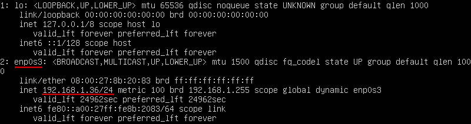
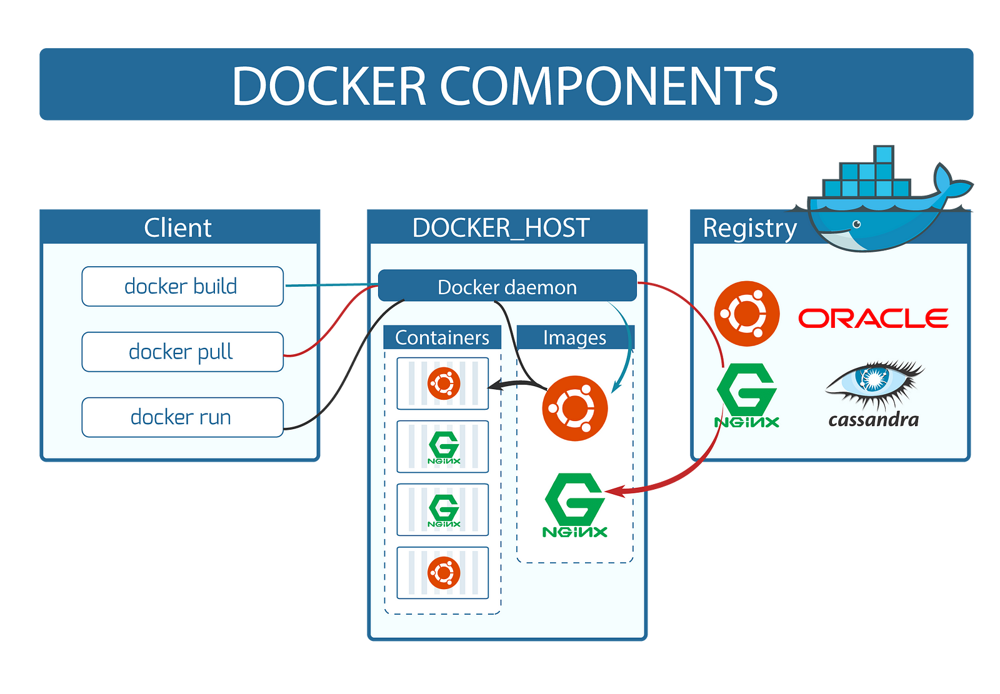
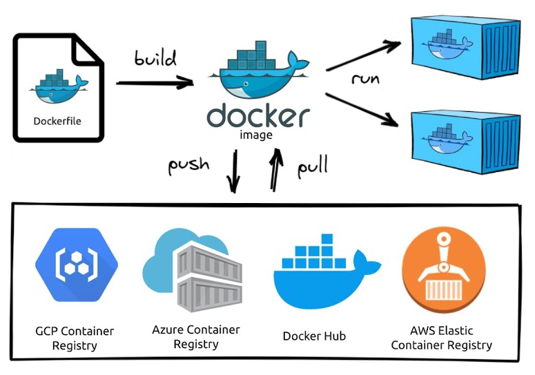
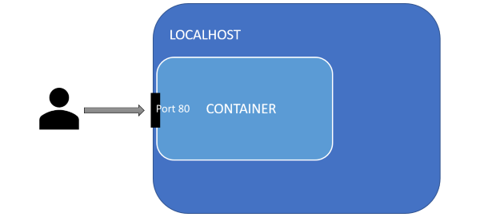
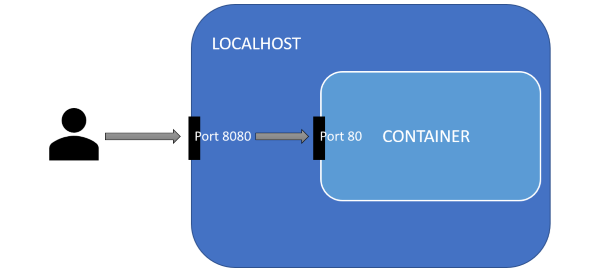
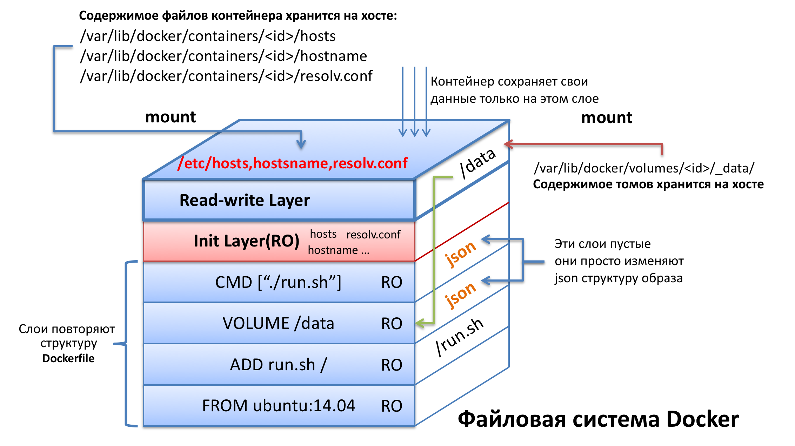

# Основы Docker

Для этой работы зарезервируйте для диска виртуальной машины побольше места 50+ GiB.

## Настройка DNS

В некоторых случаях при попытке обновить индексы пакетов или установить пакет вы можете получить ошибку связанную с тем, что не удалось определить (resolve) ip-адрес сервера по доменному имени. Как правило эта ошибка связана с неправильной настройкой dns. Если вы получаете такую ошибку, то выполните следующие пункты, если нет, то их можно пропустить.

1. Для начала нужно определить название сетевого интерфейса через который машина выходит в интернет. В нашем случае этому интерфейсу выдаётся ip-адрес роутером (т.к. сеть VirtualBox в режиме сетевого моста). Введите команду `ip a` и найдите название интерфейса:

   

   В моём случае сетевой интерфейс называется "enp0s3".

2. Чтобы установить для данного интерфейса dns можно воспользоваться 2-мя вариантами (выберите любой):

   - Временный вариант, он будет отменятся после перезагрузки сервера. Нужно ввести команду:

     ```bash
     sudo resolvectl dns enp0s3 8.8.8.8
     ```

     Здесь мы добавляем в список dns-серверов dns-сервер google. Чтобы проверить, что команда выполнилась успешно введите:

     ```bash
     sudo resolvectl dns enp0s3
     ```

     В результате вы должны увидеть список dns-серверов для интерфейса "enp0s3".

   - Постоянный вариант. Для этого нужно воспользоваться утилитой `netplan` - это основной способ настройки сети в современных дистрибутивах Ubuntu. Все конфигурационные файлы `netplan` хранят в директории "/etc/netplan".

     - Посмотрите содержимое каталога "/etc/netplan". В моём случае там только один файл "00-installer-config.yaml" в котором указаны такие настройки:

       ```yaml
       network:
         ethernets:
           enp0s3:
             dhcp4: true
         version: 2
       ```

     - Посмотрите актуальные настройки при помощи команды: `sudo netplan get`. Вывод должен быть такой же.

     - создайте в каталоге "/etc/netplan" файл с названием "01-dns.yaml", имя конфиг-файла может быть любым, но обязательно с расширением ".yaml". Номер в начале определяет порядок применения конфиг-файлов.

     - В этом файле пропишите:

       ```yaml
       network:
         ethernets:
           enp0s3:
             nameservers:
               addresses: [8.8.8.8]
       ```

       В этом файле мы указываем только те настройки которые хотим *добавить*. В данном случае я хочу для интерфейса `enp0s3` добавить сервера разрешения имён (т.е. dns) "nameservers" и адреса этих серверов "addresses" указываю в виде списка через запятую (в моём случае 8.8.8.8 достаточно).

     - Запустите команды:

       ```bash
       sudo netplan generate
       sudo netplan applay
       sudo netplan get
       ```

       Первая команда пройдётся по всем yaml файлам в "/etc/netplan" и склеит их в порядке номеров файлов. Вторая команде применит новые настройки к сети. Третья команда покажет текущий *полный* конфиг.  
       Таким же образом можно настроить и всё остальное для каждого сетевого интерфейса, например: статический ip, шлюз по умолчанию, маршруты, подключение к wi-fi сети и т.д.

<br>

## Установка компонентов Docker Engine

Docker Engine - это технология предназначенная для создания и контейнеризации ваших приложений. Docker Engine действует как клиент-серверное приложение и состоит из:

- Серверная часть представленная в виде демона `dockerd`. Этот процесс непосредственно занимается работой с образами, контейнерами, томами и т.д. Управляет их созданием, следит за работой, собирает информацию, а также предоставляет пользовательский интерфейс для всего этого (центральный прямоугольник на изображении);
- Интерфейса командной строки (CLI) который позволяет взаимодействия с демоном Docker при помощи команд из терминала (левый прямоугольник на изображении);
- API который можно использовать для взаимодействия с демоном Docker в своих программах (на изображении нет, т.к. api это не отдельная программа а набор http запросов на которые реагирует docker демон).



Установим docker и docker compose согласно инструкции с [оф сайта](https://docs.docker.com/engine/install/ubuntu/).

3. Для удобства дальнейшей работы, подключитесь к машине по ssh;

4. Обновите индексы пакетов: `sudo apt-get update`.

5. Устанавливать docker и docker compose будем из официальных репозиториев Docker.  
   **Примечание 1:** далее в тексте команд, в конце строки может встречаться символ `\`. Этот символ - не часть команды, а спец. способ, который служит для переноса части команды на новую строку (для красоты и удобства чтения). После этого символа должен быть нажат Enter и далее продолжение команды.  
   **Примечание 2:** если вы скопируете и вставите команду в которой (в середине) присутствует `\`, то в некоторых терминалах (например KiTTY) можно получить некорректное выполнение команды. Если у вас такой случай, то копируйте команды построчно до символа `\` (и его тоже), после него нажимаете Enter и копируете дальше.

   - Установим некоторые нужные пакеты:

     ```bash
     sudo apt-get install ca-certificates curl
     ```
     
   - Добавим официальный GPG-ключ для доступа к репозиторию Docker:

     ```bash
     sudo install -m 0755 -d /etc/apt/keyrings
     sudo curl -fsSL https://download.docker.com/linux/ubuntu/gpg -o /etc/apt/keyrings/docker.asc
     sudo chmod a+r /etc/apt/keyrings/docker.asc
     ```
     
   - Следующая команда настроит репозиторий:

     ```bash
     echo \
       "deb [arch=$(dpkg --print-architecture) signed-by=/etc/apt/keyrings/docker.asc] https://download.docker.com/linux/ubuntu \
       $(. /etc/os-release && echo "$VERSION_CODENAME") stable" | \
       sudo tee /etc/apt/sources.list.d/docker.list > /dev/null
     ```
     
   - После добавления нового репозитория обновим индексы пакетов:

     ```bash
     sudo apt-get update
     ```

   - Теперь установим docker и docker compose:

     ```bash
     sudo apt-get install docker-ce docker-ce-cli containerd.io docker-buildx-plugin docker-compose-plugin
     ```

   - Добавьте текущего пользователя в группу docker:
     
     ```bash
     sudo usermod -aG docker $USER
     ```
     
     Здесь `USER` это переменная среды в которой хранится логин текущего пользователя, а значок `$` перед именем переменной среды приводит к тому, что её значение подставляется в команду в виде текста. Например `echo $USER` напечатает имя текущего пользователя.  
     Добавление пользователя в группу "docker" позволит ему запускать команды docker без необходимости вводить `sudo` иначе придётся это делать постоянно, т.к. для работа с docker требуются права суперпользователя;
     
     > [!IMPORTANT]
     > Требования root прав - это один из существенных недостатков Docker. Неумелое обращение с ним может привести к серьёзным дырам в безопасности.
     
   - Перелогиньтесь или перезагрузите сервер чтобы система обновила информацию о ваших группах;
     
   - Проверьте, что установка прошла успешно:  
     
     ```bash
     docker version
     docker compose version
     ```
     
     В данном случае мы установили плагин "compose" для docker, но есть и отдельный пакет "docker-compose" (как видно разница в наличии `-`). На данный момент он считается устаревшим.

## Начинаем работать с Docker

Для того, чтобы начать работать с docker нам нужен хотя бы один образ (image). Образ можно получить двумя способами: собрать вручную из Dockerfile или скачать (pull) готовый из репозитория образов (самый популярный [DockerHub](https://hub.docker.com/)).  
Имея образ мы можем запускать виртуальные машины (container) при помощи команды `run`.



6. Выполните команду:

   ```bash
   docker --help
   ```

   Изучите список команд и опций доступных для управления docker. Для каждой команды из списка тоже можно вызвать справку, чтобы уточнить уже её список подкоманд и опций и т.д.  
   Большинство команд docker имеют альтернативный вариант написания (alias) который можно найти в справке, например `docker images ls --help` покажет, что у этой команды есть ещё 2 псевдонима `docker image list` и `docker images`. Используйте тот вариант который вам больше нравится. 

7. Выполните команду:

   ```bash
   docker image ls
   ```

   Данная команда позволяет посмотреть список образовав которые есть у вас на локальной машине. Сейчас список должен быть пустой.

8. Выполните команду:

   ```bash
   docker run hello-world
   ```

   Данная команда позволяет создать новый контейнер (виртуальную машину) из образа с именем "hello-world".  Чтобы это сделать образ должен быть у вас на локальной машине.  
   Т.к. у нас сейчас нет этого образа, то docker отправится искать его в репозиторий образов, т.е. на DockerHub, затем скачает его оттуда и после этого вернётся к выполнению команды `run`.

9. Ещё раз проверьте список локальных образов. Теперь там должен быть один образ - тот самый "hello-world".

10. Команда `run` запустила контейнер, который отработал, вывел на экран приветственное сообщение и тут же завершит свою работу (т.е. виртуальная машина выключилась). Чтобы проверить список контейнеров, которые когда либо были запущены воспользуйтесь командой:

    ```bash
    docker container ls -a
    ```

    Изучите  информацию о контейнерах. Сейчас у вас в списке должен быть только один контейнер и в столбце `STATUS` должно значится `Exited (0)`, т.е. контейнер остановился и его главный процесс вернул код ошибки 0.  
    Более короткий вариант команды: `docker ps -a`.

11. Запустите ещё несколько контейнеров из образа "hello-world" и изучите как изменился список контейнеров.  
    Теперь docker больше не будет скачивать образ, т.к. он уже есть на машине.  

12. Посмотрите список контейнеров, но в этот раз добавьте к команде опцию `-s`. В результате у вас появится дополнительный столбец `SIZE` показывающий размер занимаемый контейнером на диске.  
    Как видно, собственный размер контейнеров 0 Байт, а значение указанное в скобочках - это размер образа на котором основаны контейнеры (образ один для всех наших контейнеров). Реально контейнер хранит только ту информацию, которая отличается в нём от базового образа.

13. В результате работы у вас может накопится довольно большое количество контейнеров. И хотя каждый из них занимает мало места на диске полезно уметь их удалять.  

    Введите команду и удалите один контейнер:
    ```bash
    docker rm {CONTAINER ID | CONTAINER NAME}
    ```

    Здесь вместо `{CONTAINER ID | CONTAINER NAME}` нужно указать либо идентификатор контейнера, либо его имя. Эта информация у вас на экране. В случае, если вы решите воспользоваться `CONTAINER ID`, то достаточно ввести первые несколько символов (ровно столько, чтобы докер мог отличить нужный id от других, иногда достаточно одного символа); в случае с `CONTAINER NAME` имя нужно вводить полностью, но здесь вам поможет <kbd>Tab</kbd>.

14. Когда образов накапливается очень много, то перечислять все их имена или id в команде `rm` не очень удобно, поэтому, все *остановленные* контейнеры можно удалить командой:

    ```bash
    docker container prune
    ```

    Удалите все оставшиеся контейнеры.

15. Образ "hello-world" нам больше не понадобится, поэтому удалите его командой:

    ```bash
    docker rmi hello-world
    ```

    Команда удаления образа не сработает, если существуют контейнеры, которые созданы на его основе. В этом случае нужно сначала удалить их или воспользоваться опцией `-f` для принудительного удаления образа.

### Способы запуска контейнера

16. Выполните команду:

    ```bash
    docker pull nginx
    ```

    Эта команда скачает образ [nginx](https://hub.docker.com/_/nginx) с DockerHub без запуска контейнера.

17. Запустите новый контейнер из образа "nginx" при помощи команды `run` без параметров.  
    Эта команда запустит контейнер в режиме по умолчанию, который называется attached mode. Это означает, что стандартный ввод (stdin), стандартный вывод (stdout) и стандартный вывод ошибок (stderr) контейнера подключены к сеансу текущей оболочки. Т.е. любой вывод из контейнера немедленно выводится на наш терминал, а любой ввод с терминала отправляется в контейнер. Однако мы не можем полноценно взаимодействовать с контейнером, потому что внутри контейнера не запущена командная оболочка.

18. Т.к. весь наш ввод отправляется к контейнер, то мы не можем работать с хостовой системой. Остановите контейнер при помощи комбинации клавиш  <kbd>Ctrl</kbd> +  <kbd>C</kbd>. Эта комбинация завершит основной процесс контейнера и он автоматически остановится.

19. Выполните у себя в терминале команду `tty`.  
    В результате вы должны увидеть, путь к виртуальному устройству с которым ассоциирован терминал.

20. Контейнер можно попросить запустить внутри себя команду указав саму команду и её аргументы после имени образа. Попросим его выполнить команду `tty`:

    ```bash
    docker run nginx tty
    ```

    Как следует из сообщения, внутри контейнера нет запущенного терминала.  
    Попросив контейнер выполнить команду мы заменили его *основную команду* своей, поэтому контейнер сразу завершит работу после её выполнения. Т.е. в данном случае сервер внутри контейнера запущен не будет. 

21. Чтобы решить проблему захвата ввода-вывода нашего терминала контейнером запустите новый контейнер из образа "nginx" при помощи команды:

    ```bash
    docker run -d nginx
    ```

    Опция `-d` запустит контейнер в detach mode, т.е. контейнер будет отсоединён от нашего терминала и будет работать в фоне (background), кроме того на экран будет выведен id контейнера. Это позволит вам взаимодействовать с системой и дальше, и кроме того когда вы отключитесь от сервера контейнер продолжит работать.

22. Выполните команду:

    ```bash
    docker ps
    ```

    Без опции `-a` эта команда показывает только работающие в данный момент контейнеры. Сейчас у вас должен быть только один такой контейнер.

23. Работающий контейнер можно остановить командой `docker stop` и заново запустить командой `docker start`. Так же как и при удалении нужно указать `CONTAINER ID` или `CONTAINER NAME` целевого контейнера.  
    Остановите контейнер используя его id.  
    Обратите внимание, команда `run` не используется для запуска остановленных контейнеров, она создаёт новый.

24. Последний, используемый на практике, способ запуска контейнера - интерактивный режим. В этом режиме внутри контейнера создаётся сеанс оболочки (shell session), который позволяет взаимодействовать с ним напрямую через терминал. Т.е. мы как-бы попадаем внутрь контейнера и работаем там.   
    Выполните команду:

    ```bash
    docker run -it nginx
    ```

    Здесь используются две опции `-t` - создает псевдо-терминал (pseudo TTY) внутри контейнера; `-i` - перенаправляет наш ввод на стандартный ввод псевдо-терминала контейнера.

25. Для данного контейнера вы получите такую же самую "картину" как и для запуска без параметров, но для других контейнеров отличия будут (увидим далее).  Остановите контейнер.

26. Убедимся, что при запуске контейнера в интерактивном режиме в нём есть терминал.  
    Выполните команду:

    ```bash
    docker run -it nginx tty
    ```

27. Удалите все созданные контейнеры.

28. В процессе работы у нас постоянно накапливаются ненужные контейнеры и их приходится постоянно удалять. Чтобы попросить контейнер автоматически удалиться после остановки, можно добавить к команде запуска опцию `--rm`.  
    Запустите контейнер:

    ```bash
    docker run --rm -d nginx
    ```

29. Теперь остановите его при помощи команды `docker stop` и id контейнера, а затем проверьте список всех контейнеров. Он должен быть пуст.

По умолчанию контейнер не имеет ограничений по ресурсам и может использовать столько ресурсов, сколько позволяет планировщик ядра хоста. Docker предоставляет способы управления объемом выделенной для контейнера памяти или ресурсов процессора, устанавливая флаги команды `docker run` (подробнее в [документации](https://docs.docker.com/config/containers/resource_constraints/)).

<br>

## Взаимодействие с контейнером

По умолчанию все docker контейнеры запускаются изолированными друг от друга и от хостовой системы. Поэтому далее рассмотрим как получить возможность "общаться" с контейнером.

### Выполнение команд внутри запущенного контейнера

Одним из востребованных способов взаимодействия с контейнером - это прямое выполнение команд.

30. Запустите новый контейнер nginx:

    ```bash
    docker run --rm -d nginx
    ```

31. Выполните команду:

    ```bash
    docker exec -it {CONTAINER ID | CONTAINER NAME} bash
    ```

    Здесь ключи `-it` используются в том же значении, что и ранее (интерактивный режим). В конце указывается команда которую нужно запустить в контейнере вместе с параметрами. В данном случае мы хотим запустить сеанс командной оболочки bash, т.е. своего рода терминал.  
    В результат у вас должно измениться приглашение к вводу и все ваши последующие команды будут выполнятся внутри контейнера.

32. Перейдите в каталог "/usr/share/nginx/html" и посмотрите его содержимое.  
    Там должно быть 2 файла, среди которых "index.html".

33. Попробуйте открыть его при помощи текстового редактора `nano`.  
    Вы обнаружите, что этот редактор не установлен в контейнере.

34. Обновите индексы пакетов `apt` и установите `nano` (название пакета такое же).

35. Проверьте, что теперь файл успешно открывается.

36. Отключитесь от контейнера при помощи `exit`.  
    Контейнер продолжит работать дальше и при необходимости мы в любое время снова сможем к нему подключиться.  
    Команда `exec` не требует обязательного входа в контейнер для запуска команд, например:

    ```bash
    docker exec {CONTAINER ID | CONTAINER NAME} ls -al
    ```

    выполнит команду `ls -al` в контейнере и сразу отобразит её результат на экран.

### Сетевое взаимодействие

Перед выполнением рекомендуется ознакомится с [этим](https://itisgood.ru/2019/10/29/objasnenie-koncepcii-setej-v-docker/) постом.

#### Как общаться с одним контейнером

37. Ранее мы запускали контейнер с nginx, который, кроме прочего, используется и как web-сервер для простых сайтов. Запустите новый контейнер в detach mode и попробуйте получить от него ответ на GET-запрос (nginx прослушивает 80 порт):

    ```
    curl 127.0.0.1:80
    ```

    В результате вы должны получить ошибку, т.к. nginx хоть и слушает 80 порт но внутри своей изолированной от хоста сети.

38. Чтобы решить эту проблему есть два варианта:  

    - подключить контейнер как приложение к хостовой сети;  
      
    - пробросить порты из хостовой сети в сеть контейнера.  
      

39. Остановите контейнер и запустите новый, командой:

    ```
    docker run -d --network=host nginx
    ```

    Проверьте ответ при помощи `curl`.  
    Теперь вы должны получить в ответ код html страницы с приветствием от nginx.

40. Попробуйте запустить ещё один контейнер той же командой что и выше (останавливать первый не нужно!), а затем проверьте список *запущенных* контейнеров.  
    Вы должны обнаружить, что запущен по прежнему только первый.  

41. Т.к. мы запустили второй контейнер в фоновом режиме, то никаких сообщений кроме его id на экране не появилось. Чтобы понять в чём проблема воспользуемся командой:  
    ```bash
    docker logs {CONTAINER ID | CONTAINER NAME}
    ```

    Вы должны увидеть, что nginx несколько раз пытался занять 80 порт, но тот был уже занят (нашим первым контейнером), поэтому в итоге nginx-у это надоело и он завершился, а вместе с ним и контейнер.

42. Остановите первый контейнер.

43. Более безопасным способом попасть внутрь сети контейнера является проброс портов. Введите команду:

    ```bash
    docker run -d -p 8080:80 nginx
    ```

    Здесь используется опция `-p`, после которой указано, что порт 8080 хостовой сети пробрасывается на 80 порт в сети контейнера. Опция `-p` может быть использована несколько раз, если нужно пробросить больше одного порта, кроме того, можно отправить tcp и udp трафик на разные порты внутри контейнера, пробросить сразу диапазон портов или пробросить случайный порт.  
    Чтобы посмотреть что и куда проброшено есть команда: `docker port {CONTAINER ID | CONTAINER NAME}`.

44. Запустите ещё один контейнер nginx, но в качестве порта на хосте укажите 80. Проверьте при помощи `curl`, что оба контейнера отвечают на запросы (ip остается 127.0.0.1).

45. Откройте браузер в основной ОС (не на виртуальной машине). Введите в строке адреса ip виртуальной машины (тот который вы использовали для ssh-подключения).  
    В результате вы должны увидеть приветственную страницу "Welcome to nginx!", что свидетельствует о том, что трафик по 80-му порту попадает через виртуальную машину в docker-контейнер и обратно.

46. Остановите все запущенные контейнеры.

#### Смотрим на сети

В целом работа с сетями в docker не ограничивается пробросом портов.

47. Для того, чтобы проверьте какие сети уже созданы docker-ом введите команду:

    ```bash
    docker network ls
    ```

    Вы должны получить что-то вроде этого:  
    ```bash
    NETWORK ID     NAME               DRIVER    SCOPE
    b4dad78c9e66   bridge             bridge    local
    8c8110ea3bd3   host               host      local
    936056c7c16b   none               null      local
    ```

    Сеть `host` мы уже использовали ранее для подключения контейнера к сети хостовой машины; сеть `none` служит для изоляции контейнера от любых сетей вообще; а сеть `bridge` - это сеть к которой подключаются все контейнеры по умолчанию.  
    Кроме существующих сетей можно создавать свои собственные, но только не с драйвером `host` или `null`. Подробнее о существующих сетевых драйверах можно узнать в [документации](https://docs.docker.com/network/).

48. Запустите ещё одно окно с ssh-подключением к серверу (в kitty можно щёлкнуть правой кнопкой мыши по окну и выбрать "Duplicate Session") и в каждом окне запустите по одному контейнеру "avenga/net-tools":  

    ```bash
    docker run -it --name=one avenga/net-tools
    docker run -it --name=two avenga/net-tools
    ```

    Здесь используется опция `--name` которая позволяет присвоить контейнеру указанное имя (это то самое `CONTAINER NAME` которое раньше генерировалось рандомно).  
    В образе "nginx" для уменьшения размера удалили большинство не нужных для работы nginx утилит, поэтому воспользуемся образом "avenga/net-tools" в котором установлены утилиты для анализа сети которые нам сейчас понадобятся.

49. Выполните внутри контейнера `one` команду `ip a`.  
    В моём случае вывод такой:

    ```
    1: lo: <LOOPBACK,UP,LOWER_UP> mtu 65536 qdisc noqueue state UNKNOWN qlen 1000
        link/loopback 00:00:00:00:00:00 brd 00:00:00:00:00:00
        inet 127.0.0.1/8 scope host lo
           valid_lft forever preferred_lft forever
    122: eth0@if123: <BROADCAST,MULTICAST,UP,LOWER_UP,M-DOWN> mtu 1500 qdisc noqueue state UP
        link/ether 02:42:ac:11:00:03 brd ff:ff:ff:ff:ff:ff
        inet 172.17.0.2/16 brd 172.17.255.255 scope global eth0
           valid_lft forever preferred_lft forever
    ```

50. Повторите команду в контейнере `two`.  
    Как видно вывод отличается только ip-адресом (у меня он 172.17.0.3).

51. Как говорилось ранее эти контейнеры подключены к сети по умолчанию (bridge), а значит они должны "видеть" друг друга. Пропингуйте второй контейнер из первого:

    ```bash
    ping 172.17.0.3
    ```

    Если пинги идут, значит всё хорошо.

52. При подключении к сети, контейнеры получают IP адрес динамически, что затрудняет настройку их взаимодействия. Хотя и можно задать фиксированный IP (или свободный из диапазона) при помощи опции `--ip` есть способы и получше:  

    - Использовать опцию `--link`;
    - Использовать встроенный dns docker-a.

53. Для начала рассмотрим использование опции `--link`.  

54. Ключ `--link` на данный момент считается устаревшим, поэтому не будем посвящать ему много времени.  Данный ключ позволяет во время запуска контейнера подключить его к другим. Подключение состоит в том, что в запускаемый контейнер будет добавлен ряд переменных окружения и в его файл `/etc/hosts` будет добавлена новая запись (для каждого из подключаемых контейнеров). При этом, в тех контейнерах, к которым мы подключаемся никаких изменений не будет.

55. Запустите новый контейнер в отдельной ssh-сессии:

    ```bash
    docker run -it --name=three --link=one --link=two:alias_for_two avenga/net-tools
    ```

    Здесь мы подключаем контейнер `three` к контейнерам `one` и `two`. При этом контейнер `one`, внутри контейнера `three`, будет виден под именем `one`, а контейнер `two` ещё и под именем `alias_for_two`.

56. Получите список переменных окружения контейнера `three`:

    ```bash
    env
    ```

    Вы увидите множество переменных среди которых будут `ONE_NAME` и `ALIAS_FOR_TWO_NAME`.

57. Посмотрите содержимое файла `/etc/hosts`.  
    Вывод должен быть похож на этот:

    ```
    127.0.0.1       localhost
    ::1     localhost ip6-localhost ip6-loopback
    fe00::0 ip6-localnet
    ff00::0 ip6-mcastprefix
    ff02::1 ip6-allnodes
    ff02::2 ip6-allrouters
    172.17.0.2      one 019fcf7a081a
    172.17.0.3      alias_for_two 3b24775e813e two
    172.17.0.4      462b039d2e9a
    ```

    Как видно в последних строках к IP адресам привязаны доменные имена соответствующие именам контейнеров, их id (12 символов), а также для контейнера `two`, ещё и псевдониму который был указан ранее.  
    Это значит, что вместо ip-адресов, можно использовать имена контейнеров, например в конфигах.

58. Проверьте, что в контейнере `three` работает `ping` по имени контейнера `one`:

    ```bash
    ping one
    ```

59. Перейдите в окно подключённое к контейнеру `one` и попробуйте пропинговать контейнер `three` в обратном направлении, сначала по ip, а затем по имени.  
    Пинг по имени сработать не должен, т.к. опция `--link` подействовала только на контейнер `three`.

60. Остановите и удалите все три контейнера. Для удаления используйте их имена.  
    Удалять контейнеры - обязательно, т.к. далее мы будем использовать имена `one`, `two`, `three` для новых контейнеров. Если будут существовать контейнеры с этими именами (даже не работающие) docker не позволит это сделать.

61. Более продвинутый вариант позволяющий использовать имена контейнеров как их доменные имена в сети заключается в работе через встроенный dns docker-a. Но он не работает в сети по умолчанию, поэтому нужно будет создать свою.

62. Введите команду:

    ```bash
    docker network create sky_net
    ```

    Здесь будет создана сеть "sky_net" с настройками по умолчанию.

63. Проверьте, что сеть была успешно создана и присутствует в общем списке сетей.  
    Как видно, в качестве драйвера был выбран драйвер `bridge`.

64. Запустите контейнер командой:

    ```bash
    docker run -it --name=one --network=sky_net avenga/net-tools
    ```

    Здесь мы используем опцию `--network` которая позволяет подключить контейнер к указанной сети.  Данную опцию можно использовать несколько раз, если нужно подключиться к нескольким сетям.

65. В другом окне запустите контейнер `two` такой же командой.

66. В третьем окне запустите контейнер `three`, но *без подключения* к сети "sky_net":  
    ```bash
    docker run -it --name=three avenga/net-tools
    ```

67. Проверьте, что контейнер `one` пингует контейнер `two` по имени, а контейнер `three` нет.

68. Откройте четвёртое окно с ssh-подключением к серверу и введите команду:

    ```bash
    docker network inspect sky_net
    ```

    Данная команда отобразит информацию о сети "sky_net" в формате [json](https://youtu.be/Wqmcj1IhDFM).  

69. Найдите раздел "Containers" и убедитесь, что там присутствует информация только о двух подключённых контейнерах с именами `one` и `two`.

70. В этом же окне введите команду:

    ```bash
    docker network connect sky_net three
    ```

    Здесь мы подключаем уже запущенный контейнер `three` к сети "sky_net".

71. Посмотрите как изменился раздел "Containers" у сети "sky_net".

72. Перейдите в окно подключённое к контейнеру `one` и пропингуйте контейнер `three`.  В этот раз пинг должен работать.

73. Вернитесь в 4-е окно и введите команду:

    ```bash
    docker network disconnect sky_net one
    ```

    Здесь мы отключаем контейнер `one` от сети "sky_net".  

74. Проверьте, что контейнер `one` больше не пингует контейнеры `two` и `three`.  

75. Вернитесь в 4-е окно и введите команду:

    ```bash
    docker network connect --alias=zero sky_net one
    ```

    Здесь мы подключаем контейнер `one` к сети "sky_net" и назначаем ему дополнительное доменное имя "zero".  Чтобы сделать то же самое но во время запуска контейнера служит опция `--network-alias=zero`.

76. Перейдите во 2-е окно и проверьте, что контейнер `one` пингуется по именам "one" и "zero".  

77. Остановите и удалите все контейнеры. Закройте все окна кроме одного.

78. Введите команду:

    ```bash
    docker network rm sky_net
    ```

    Здесь мы удаляем сеть "sky_net".

### Работа с данными

Перед выполнением рекомендуется ознакомиться с [этим](https://habr.com/ru/company/ruvds/blog/441574/) постом.

По умолчанию файлы, создаваемые приложением, работающим в контейнере, сохраняются в слое контейнера, поддерживающем запись. Для того чтобы этот механизм работал, ничего специально настраивать не нужно. Приложению достаточно просто сохранить данные и продолжить заниматься своими делами. Однако после того как контейнер перестанет существовать, исчезнут и данные, сохранённые таким вот нехитрым способом.

Но не волнуйтесь, Docker позволяет работать с данными и другим образом. При помощи томов (volume) и монтирования каталогов внутрь контейнера ([bind mount](https://docs.docker.com/storage/bind-mounts/)).


79. Для начала рассмотрим монтирование каталога внутрь контейнера.

80. Создайте в домашнем каталоге пользователя папку "content" и внутри неё файл "index.html" с текстом:

    ```html
    <h1>Hello from the local directory</h1>
    ```

81. Введите команду:

    ```bash
    docker run --rm --name=web -d -p 80:80 -v ~/content:/usr/share/nginx/html nginx
    ```

    Здесь мы запускаем контейнер "nginx" с именем "web" и монтируем *локальный* каталог "content" расположенный в домашнем каталоге пользователя в каталог `/usr/share/nginx/html` расположенный в контейнере. nginx ищет в каталоге `/usr/share/nginx/html` файл "index.html" и отдаёт его по запросу на корень сайта.   
    При монтировании локального каталога в контейнер возможно несколько ситуаций:

    - Локальный каталог существует (`/dir/on/local/machine`), каталог в контейнере существует (`/dir/in/container`). Каталог "container" будет с теми же правами и с тем же содержимым, что и каталог "machine". Всё что ранее было в каталоге "container" исчезнет. Этот вариант совпадает с нашим;
    - Локальный каталог существует (`/dir/on/local/machine`), каталог в контейнере и часть указанного пути НЕ существует (`/dir/in/container`). Предположим, что в контейнере существует только каталог "/dir", тогда каталоги "in" и "container" будут созданы автоматически. При этом каталог "in" будет создан от имени и в группе "root", а конечный каталог в пути, т.е "container", как и в предыдущем случае будет с теми же правами и с тем же содержимым, что и каталог локальный каталог "machine" и наполнится его содержимым;
    - Локальный каталог и часть пути НЕ существует (`/dir/on/local/machine`), каталог в контейнере существует (`/dir/in/container`). Предположим, что на локальной машине существует только каталог "/dir", тогда каталоги "on", "local" и "machine" будут созданы автоматически. При этом каталог все они будут созданы от имени и в группе "root". Т.к. локальный каталог пустой и принадлежит "root", то и каталог "container" тоже будет пуст (даже если в нём что-то было) и будет принадлежать "root";
    - Локальный каталог и часть пути НЕ существует (`/dir/on/local/machine`), каталог в контейнере и часть пути НЕ существует (`/dir/in/container`). На обеих машинах будут созданы все недостающие каталоги от имени и в группе "root". Каталог "container" будет пуст и принадлежать естественно "root". 

    Во всех перечисленных случаях изменения внутри контейнера будут видны снаружи и наоборот. Чтобы запретить контейнеру менять файлы в каталоге в конце команды монтирования нужно указать "ro": `-v /dir/on/local/machine:/dir/in/container:ro`.

82. Откройте браузер в основной ОС и введите ip-виртуальной машины в строку адреса.  
    На экране должно появиться сообщение "Hello from the local directory".

83. Измените содержимое файла "index.html" в локальной папке "content" на следующее:

    ```html
    <h1 style="color: red">Hello from the local directory</h1>
    ```

    и обновите страницу в браузере. Текст должен поменять цвет. 

84. Монтирование томов [(volumes)](https://docs.docker.com/storage/volumes/).  
    Хотя монтирование каталога выглядит вполне достаточным, чтобы решить описанную ранее проблему, у него есть ряд недостатков:

    - Нужно где-то создать каталог, который будет монтироваться. Нужно самому думать где это лучше сделать.
    - Если образ содержал какие-то файлы, то при монтировании каталога они исчезнут.
    - Внутри контейнера, вы часто работаете под пользователем root и способны получить доступ к любой подмонтированной директории не обращая внимание на права доступа. Например, если случайно подмонтировать в контейнер локальную папку "/etc" то через контейнер можно будет назначить своему пользователю любые права на хостовой системе.

85. Для начала посмотрите список созданных томов:

    ```bash
    docker volume ls
    ```

    Сейчас список должен быть пуст.

86. Создайте новый том командой:

    ```bash
    docker volume create data
    ```

    Здесь имя тома - "data". Если не указать имя самому, то будет создан том со случайным именем.

87. Выполните команду: 

    ```bash
    docker volume inspect data
    ```

    Вы должны увидеть информацию о томе в формате json. Как видно из раздела "Mountpoint" том физически хранится у вас на диске, но о том, чтобы всё правильно монтировалось заботится уже сам docker.

88. Остановите предыдущий контейнер "web" и запустите новый, командой:

    ```bash
    docker run --rm --name=web -d -p 80:80 -v data:/usr/share/nginx/html:ro nginx
    ```

    Здесь мы создаём контейнер таким же образом как и ранее, но монтируем вместо локального каталога том "data".   
    При монтировании тома возможно несколько ситуаций:

    - Пустой том монтируется в НЕ пустой каталог (`/dir/in/container`). Том получит все файлы находящиеся в "container", а также сам том получит права доступа как у каталога.  
      В этом отношении монтирование тома отличается от монтирования локального каталога.
    - НE пустой том монтируется в НЕ пустой каталог (`/dir/in/container`). Содержимое каталога "container" заменится на содержимое тома, при этом права доступа к каталогу "container" изменятся на права доступа указанные в томе.
    - Пустой том монтируется в пустой каталог (`/dir/in/container`). Так же как и в случае с локальной папкой все не существующие каталоги будут созданы от имени и в группе "root". При этом том никак не изменится.
    - НE пустой том монтируется в пустой каталог (`/dir/in/container`). Так же как и ранее все не существующие каталоги будут созданы от имени и в группе "root", а содержимое каталога "container" заменится на содержимое тома, при этом права доступа к каталогу "container" изменятся на права доступа указанные в томе.
    - Если том с указанным именем не существовал, то он будет создан автоматически.
    - Если не указать имя тома вообще, т.е `-v /dir/in/container`, то будет создан анонимный том. Во первых его имя будет сгенерировано случайным образом, а во вторых, такой том автоматически удалится, если контейнер был запущен с опцией `--rm` (обычные тома удаляются только пользователем). 

    **Примечание:** есть одно существенное отличие тома от каталога. Если удалить из каталога все файлы, то каталог по прежнему будет помнить информацию о владельце, группе и правах доступа. Если в томе по любой причине нет файлом (даже если они были, но потом их удалили), то том не помнит никакие права доступа, а при последующем монтировании ведёт себя как абсолютно пустой том.

    Том так же как и локальный каталог можно подмонтировать в режиме только для чтения, дописав "ro" в конце, но если монтируемый том был пуст, то сначала он получит все файлы из контейнера.

89. Введите команду:

    ```bash
    docker run -d -v data:/root/site -p 6080:6080 -p 5901:5901 -e PASSWORD=123456 beneventsur/xubuntu:vscode-1.44.2
    ```

    Здесь мы запускаем контейнер из [образа](https://hub.docker.com/r/beneventsur/xubuntu) в котором установлена среда разработки Visual Studio Code и монтируем к нему тот же том, что и к предыдущему. В контейнере содержимое тома будет доступно по пути "/root/site".  
    Здесь же устанавливается переменная среды `PASSWORD` и ей присваивается значение 123456. 

90. Перейдите в браузер на основной ОС и введите в адресную строку:

    ```bash
    http://{ip виртуальной машины}:6080/vnc.html
    ```

    Нажмите кнопку подключение и введите пароль: 123456.  
    Перед вами должен открыть рабочий стол.

91. Откройте в браузере ещё одну страницу и введите в адресную строку ip виртуальной машины. В результате вы подключитесь к контейнеру с сервером nginx и получите от него приветственную страницу.

92. Выполните последовательность действий:

    - На первой вкладке браузера на рабочем столе найдите иконку Visual Studio Code и запустите. В ответ на ругательство о недоверии к загрузчику нажмите кнопку "Launch Anyway";
    - В открывшемся окне нажмите "File" -> "Open File...", а затем кнопку "Home" и в папке "site" выберите файл "index.html".  
      Этот файл появился в результате того, что сначала мы подключили том "data" к контейнеру с nginx и всё, что было у него в "/usr/share/nginx/html" попало в том;
    - Внесите изменения в "index.html" и сохраните его;
    - Переключитесь в браузере на вторую вкладку и обновите её.  
      Вы должны увидеть, что страница изменилась, т.е. два контейнера получают доступ к одним и тем же файлам через том "data".

93. Закройте вкладки, остановите и удалите контейнеры.  
    Несмотря, на то, что контейнеры больше не существуют, файл "index.html" сохранён в томе "data".

94. Выполните команду:

    ```
    docker volume rm data
    ```

    Эта команда удалит указанный том. Когда нужно удалить все не использующиеся тома, можно воспользоваться командой: `docker volume rm prune`.

95. Кроме опции `-v` можно, для монтирования, можно воспользоваться опцией `--mount`. В этом случае нужно заменить:

    ```bash
    -v {локальный каталог или том}:{каталог в контейнере}
    --mount type={bind-для каталогов или volume-для томов},source={локальный каталог или том},target={каталог в контейнере}
    ```

96. Монтирование [`tmpfs`](https://docs.docker.com/storage/tmpfs/) (похоже на том, только в оперативной памяти, а не на диске) в данной работе рассмотрено не будет, в виду её специфичности и чтобы не усложнять работу.

#### Прямое копирование файлов

При помощи тома забрать данные из работающего контейнера не получится, т.к. тома монтируются только при создании контейнера. В этом случае забрать или отправить файлы можно при помощи команды `docker cp`.

97. Запустите новый nginx контейнер с именем "web", в фоновом режиме, без монтирования томов и пробросив наружу 80-й порт.

98. Введите команду:

    ```bash
    docker cp web:/usr/share/nginx/html/. ~/new_site
    ```

    Здесь мы копируем из контейнера "web" из каталога "/usr/share/nginx/html" все файлы в локальный каталог "\~/new_site".  
    Обратите внимание, что в конце источника файлов стоит `/.` это показывает, что нужно копировать содержимое каталога, а если эти символы убрать, то в "\~/new_site" появится сам каталог "html" с файлами.

99. Проверьте, что в "\~/new_site" появились 2 файла, затем внесите изменения в файл "index.html".

100. Введите команду:

     ```bash
     docker cp ~/new_site/. web:/usr/share/nginx/html
     ```

     Здесь всё ровно наоборот локальные файлы попадут в контейнер.

101. Проверьте, что в браузере отображается изменённая страница, а затем остановите и удалите контейнер "web".

<br>

## Сборка своего образа

До этого момента мы использовали готовые образы из репозитория DockerHub. Существует множество случаев, когда готовых образов не достаточно:

- Вас чем-то не устаревает существующий образ и вы хотите настроить его под свои потребности;
- Нужного вам инструмента нет в виде docker-образа;
- Вы хотите упаковать в контейнер своё приложение.

Рассмотрим последний вариант на примере простого Flask приложения.

### Настройка базового Flask приложения

Сначала мы создадим простое [Flask](https://flask-docs.readthedocs.io/en/latest/quickstart/) приложение, просто для того, чтобы было что положить в Docker контейнер. Если каких-то пакетов у вас в системе не будет, просто установите их.

102. В домашнем каталоге создайте каталог `tutorial` и зайдите в него;

103. Теперь создайте каталог `flask` и зайдите в него.  Тут будет flask-приложение;

104. Проверьте, что в системе установлен интерпретатор python3 и его версию:

     ```bash
     python3 --version
     ```

    В моём случае версия python 3.10.6. Эта информация нам понадобится далее.

105. Создайте виртуальное окружение с именем "ven":

     ```bash
     python3 -m venv venv
     ```

     Виртуальное окружение позволит изолировать разные проекты друг от друга и содержать в "чистоте" глобальное окружение.

106. Активируйте  виртуальное окружение:

     ```bash
     source venv/bin/activate
     ```

     Если всё правильно, то в начале строки появится название виртуального окружения. Например такое: `(venv) user@user-pc:~/tutorial/flask$`;

107. Установите пакет Flask с помощью pip:

     ```bash
     pip install Flask
     ```

     `pip` - это менеджер python-пакетов, что-то вроде `apt` для ubuntu.

108. Создайте файл с именем `app.py` содержащий код из документации Flask для создания базового приложения:

     ```python
     from flask import Flask
       
     app = Flask(__name__)
       
     @app.route('/')
     def hello_world():
         return 'Hello, World!'
       
     if __name__ == "__main__":
         app.run(debug=True, host='0.0.0.0')
     ```

109. Запустите `python app.py` и вы должны увидеть запуск сервера.  
     Перейдите в основную ОС и в браузере укажите ip-адрес виртуальной машины и порт 5000. Вы должны увидеть "Hello, World!");

110. Остановите приложение комбинацией клавиш: <kbd>Ctrl</kbd>+<kbd>C</kbd>;

111. Сохраните установленные пакеты (зависимости) в файл `requirements.txt`:

       ```bash
       pip freeze > requirements.txt
       ```

     Команда `freeze` выводит на экран все установленные в текущем окружении python-пакеты вместе с их версиями.  
     Если в созданном файле появится строка `pkg-resources==0.0.0` удалите её, это своего рода баг, который, в дальнейшем, не даст `pip`-у нормально устанавливать пакеты.

112. Далее можно деактивировать виртуальное окружение командой: `deactivate`.  В принципе можно и не деактивировать, разницы нет. Мы будем работать с docker, а он ничего не знает о виртуальных окружениях, созданных командой `venv`.

### Упаковка приложения в docker-контейнер

На предыдущем этапе мы написали приложение и убедились, что оно работает на хостовой системе. Теперь настало время поместить приложение в docker-контейнер.

#### Создаём Dockerfile

С базовым набором команд Dockerfile можно ознакомится в [посте на хабре](https://habr.com/ru/company/ruvds/blog/439980/), с более полной версией в [документации](https://docs.docker.com/engine/reference/builder/).

Теперь, когда у нас есть приложение, упакуем его. Как основу для нашего будущего Docker-образа будем использовать образ, с установленным интерпретатором [Python](https://hub.docker.com/_/python) (в моём случае версии 3.10.6). Версия интерпретатора важна, т.к. в файле "requirements.txt" указаны пакеты с учётом этой версии интерпретатора. 

Сначала мы напишем инструкцию (`Dockerfile`), следуя которой Docker будет собирать новый образ.

В данный момент мы всё ещё находимся в директории `flask`. Можете проверить это при помощи команды `pwd` (вы должны увидеть что-то вроде этого: `/home/user/tutorial/flask`).

113. Создайте файл с именем `Dockerfile` (`nano Dockerfile`) и скопируйте в него приведенный ниже код:

     ```dockerfile
     FROM python:3.10.6
     WORKDIR /app
     COPY / /app
     RUN pip install -r requirements.txt
     ENTRYPOINT [ "python" ]
     CMD [ "app.py" ]
     ```

     - В строке `FROM python:3.10.6` мы указываем какой базовый образ будем использовать для своего. В данном случае, в качестве базового мы использовали уже кем-то созданный [образ](https://hub.docker.com/layers/library/python/3.10.6/images/sha256-8d1f943ceaaf3b3ce05df5c0926e7958836b048b700176bf9c56d8f37ac13fca), но если же вы хотите создать свой базовый образ, то нужно начинать со специально подготовленного пустого образ [scratch](https://hub.docker.com/_/scratch) (подробнее в [документации](https://docs.docker.com/build/building/base-images/));
     - Командой `WORKDIR /app` мы создаем каталог с именем `app` в корне файловой системы образа и назначаем его рабочей директорией. Это как текущая папке в терминале, т.е. все команды будут выполнятся относительно неё;
     - Затем командой `COPY / /app` копируем все файлы из каталога сборки на хостовой системе (первый аргумент `/`) в каталог `/app` внутри контейнера;  
       Обратите внимание, что каталог сборки считается корнем файловой системы на хосте, т.е. где бы не находился каталог сборки такой путь:  `..` в Dockerfile-e прописать нельзя.
     - Далее мы используем команду `RUN` для запуска команды внутри контейнера. В данном случае,  для установки зависимостей, перечисленных в `requirements.txt` при помощи `pip`. Помним про `WORKDIR`;
     - Команда `ENTRYPOINT [ "python" ]` устанавливает, что при запуске контейнера (`run` или `start`) должен быть запущен исполняемый файл с аргументами в формате json-массива. В данном случае мы запускаем интерпретатор python без параметров, но могли бы например написать так: ["ls", "l", "a"];  
       Аргументы указанные при запуске контейнера после имени образа будут *добавлены* в список указанных здесь.
     - Команда `CMD [ "app.py" ]`, в данном случае, используется для того, чтобы предоставить список аргументов команде `ENTRYPOINT`. Т.е. при старте контейнера будет выполнена команда: `python app.py`.  
       Аргументы указанные при запуске контейнера после имени образа *заменят* аргументы указанные здесь.
     
     Все команды будут выполнены один раз, в процесс сборки образа, при этом каждая образует свой отдельный слой, в итоге docker-образ будет иметь структуру подобную такой:



#### Создаём образ

Когда Dockerfile готов приступаем к созданию образа. В упрощённом смысле происходит скачивание образа виртуальной машины (c DockerHub), в которой установлена операционная система на базе Linux (может быть и Windows), а также некоторые дополнительные программы (в нашем случае Python). Затем происходит копирование на диск виртуальной машины (в каталог `/app`) содержимого текущего каталога ( в нашем случае мы находимся в `flask`) и установка зависимостей из `requirements.txt`. Получившийся образ сохраняется на локальный диск.

114. Запустим сборку образа:

     ```bash
     docker build -t flask .
     ```

     При выполнении приведенной выше команды убедитесь, что вы находитесь в каталоге `flask`, т.к. символ `.` означает, что *каталог сборки* находится в текущем каталоге. По умолчанию docker ищет файл с именем "Dockerfile" в каталоге сборки, но можно указать и другой путь (опция `--file`), при этом сама сборка будет происходить относительно каталога сборки. Т.е. где бы не находился "Dockerfile", все пути прописанные в нём будут рассчитываться исходя из расположения каталога сборки.

     Флаг `-t` с параметром `flask` означает, что у созданного образа будет имя `flask` (при желании можно добавить тег, например для указания версии образа: `flask:1.0`. Тег по умолчанию `latest`).   

115. После того, как сборка завершилась введите проверьте список образов. В нём должен появится наш образ `flask:latest`.  
     Может быть, что процесс сборки будет прерван из-за ошибки, и в списке появятся ещё несколько "не доделанных" образов с именем "<none\>". В этом случае их следует удалить используя команду: `docker rmi` с указанием `IMAGE ID` удаляемого образа (возможно потребуется добавить ключ `-f`).

116. Проверьте, что приложение работает корректно (через браузер или `curl`), затем остановите его:

     ```bash
     docker run --rm -p 80:5000 flask
     ```

####  Уменьшаем размер образа

117. Определите размер образа `flask` используя `docker image ls`.  
     Святая корова, он тяжелый! Что-то около 900 МБ для python, работающего с приложением Flask? Давайте изменим это.

118. У нас есть 2 основных способа уменьшения веса образа:

     - Не копировать в образ лишних файлов;
     - Использовать более легковесный базовый образ.

119. Для начала избавимся о лишних файлов.

120. Запустите новый контейнер, а затем посмотрите что у него внутри:

     ```bash
     docker run -d --rm --name=subject flask
     docker exec subject ls
     ```

     Как видно, кроме интересующих нас файлов в контейнер попал сам Dockerfile и каталог с виртуальным окружением (он нам тоже не нужен, т.к. контейнер сам по себе виртуальное окружение). Это произошло, потому-что в мы сказали команде `COPY` копировать всё содержимое каталога сборки.  
     Обратите внимание, что команда `ls` вывела содержимое каталога "/app", а не домашнего каталога пользователя root (как происходит при обычном входе). Это произошло по тому, что в Dockerfile мы назначили этот каталог рабочим (`WORKDIR /app`), т.е. при входе в контейнер мы вначале попадаем в рабочий каталог.

121. Оценим сколько места занимают эти:

     ```bash
     docker exec subject du -ha --max-depth=1
     ```

     Здесь мы просим контейнер запустить команду `du` (disk usage) с параметром `-a` чтобы показать информацию и для файлов тоже; `-h` чтобы показать размер в читабельном виде, а не в виде байт и параметре `--max-depth=1` чтобы ограничить вывод только первым уровнем вложенности.  
     Как видно из вывода лишние файлы занимают почти 25 МБ.

122. Чтобы эти мусорные файлы не попали к образ при сборке можно поступить двумя способами:

- Во-первых, мы можем изменить `Dockerfile` и скопировать не все файлы из директории flask, а только те, которые нужны, т.е:

  ```dockerfile
  COPY requirements.txt /app
  COPY app.py /app
  ```

  У нас очень маленькое приложение, и оно простое, но для больших проектов это может занять довольно много строк.

- 2-й вариант: Docker предоставляет нам возможность добавить файл ".dockerignore", который работает как файл ".gitignore" для git. Когда Docker запустит `COPY / /app` при создании образа он проигнорирует файлы и каталоги перечисленные в ".dockerignore" и сам ".dockerignore" тоже.

123. Создайте в каталоге `flask` файл ".dockerignore" содержащий:

     ```bash
     venv/
     Dockerfile
     ```

124. Пересоберите образ командой `docker build`, но назовите его `flask:clean`.  
     Здесь clean - это тег. Просто, чтобы иметь возможность отличить новый образ от старого. Если тег не указать, то будет установлено значение по умолчанию latest и новый образ затрёт старый.

125. Проверьте список образов и сравните размеры `clean` и `latest`.

126. Теперь когда "мусора" в образе нет подумаем о замене базового образа для контейнера.  
     В качестве базового образа мы использовали образ "python:3.10.6" построенный на ubuntu. То есть полновесная ubuntu! Чтобы просто запустить Flask-приложение!! Есть много функций ubuntu, которые нам не нужны. Возможно, нам удастся найти более легкий дистрибутив Linux для запуска нашего приложения. Один из самых популярных - `alpine`. При этом, нам даже не придётся выполнять установку интерпретатора самостоятельно, реестре python на DockerHub есть [python:3.10.6-alpine](https://hub.docker.com/layers/library/python/3.10.6-alpine/images/sha256-5b4e425e03038da758a35dc6f4473b4cf9bbadb9a7cdc2766d5d1d10ef1c9ca9?context=explore)!

127. Откройте `Dockerfile` и замените первую строку на:

     ```dockerfile
     FROM python:3.10.6-alpine
     ```

     Пересоберите образ командой `docker build` и назовите его `flask:alpine`.

128. Посмотрите список образов.  
     Новый образ должен весить что-то около 60 МБ. Всё еще немного великовато, но пока на этом остановимся.

129. Удалите образы `flask` c тегами `latest`, `clean`.

130. Как упоминалось выше, если мы сейчас попробуем выполнить `docker run flask`, то получим ошибку, т.к. у нас нет образа `flask:latest` и с dockerhub его тоже скачать не получается. Следовательно, во всех командах придётся писать `flask:alpine`, что не всегда удобно. Исправим это.

131. Выполните команды:

     ```bash
     docker image tag flask:alpine flask:latest
     docker image tag flask:alpine my_app:latest
     docker image ls
     ```

     и обратите внимание на `IMAGE ID`

     ```bash
     REPOSITORY   TAG       IMAGE ID       CREATED         SIZE
     flask        alpine    d3b120370c04   4 minutes ago   60.5MB
     flask        latest    d3b120370c04   4 minutes ago   60.5MB
     my_app       latest    d3b120370c04   4 minutes ago   60.5MB
     ```

     Предыдущей командой мы добавили 2 других имени для образа с нашим приложением.

132. Удалите `my_app:latest` и `flask:alpine` командой `docker rmi`. При этом удалятся только имена, а сам образ останется под именем `flask:latest`.

#### Создание образа из контейнера

Обычно мы действуем по обратному сценарию, т.е. из образа создаём контейнеры, но иногда проще внести изменения в готовый контейнер и сделать из него образ, чем писать с нуля Dockerfile.

Мы будем вносить изменения в контейнер `flask`.

133. Запустите новый контейнер в фоновом режиме:

     ```bash
     docker run -d --name=flask_base flask
     ```

134. Установим в этом контейнере модуль для работы с mysql - "mysql-connector-python":

     ```bash
     docker exec flask_base pip install mysql-connector-python
     ```

135. Откройте локальный файл "app.py" и замените его содержимое на:

     ```python
     from flask import Flask, request
     from getpass import getpass
     from mysql.connector import connect, Error
     
     connection = None
     
     def init_db():
         global connection
         try:
             print('Connection to db:', end='')
             connection = connect(host='db', user='root', password='123')
             print('ОК')
     
             print('Create db:', end='')
             create_db_query = "CREATE DATABASE IF NOT EXISTS vars"
             with connection.cursor() as cursor:
                 cursor.execute(create_db_query)
             print('ОК')
                 
             print('Change db:', end='')                        
             use_db_query = "USE vars"
             with connection.cursor() as cursor:
                 cursor.execute(use_db_query)
             print('ОК')
                                
             print('Create table:', end='')
             create_table_query = """
             CREATE TABLE IF NOT EXISTS vars(
                 id INT AUTO_INCREMENT PRIMARY KEY,
                 name VARCHAR(100),
                 value VARCHAR(100),
                 UNIQUE (name)
                 )
                 """
             with connection.cursor() as cursor:
                 cursor.execute(create_table_query)
                 connection.commit()  
             print('ОК')     
         except Error as e:
             print('Failure', e)
     
     
     app = Flask(__name__)
     
     @app.route('/var/<var_name>', methods=['GET'])
     def get(var_name):
         select_query = f"""
         SELECT value FROM vars
         WHERE name = '{var_name}'
         """
         
         print("Select query:", select_query)
         with connection.cursor() as cursor:
             cursor.execute(select_query)
             return cursor.fetchall()[0][0]
         
         
     @app.route('/var/<var_name>', methods=['POST'])
     def set(var_name):
         value = request.form.get("value")
         insert_query = f"""
         INSERT INTO vars (name, value)
         VALUES ('{var_name}', '{value}')
         ON DUPLICATE KEY UPDATE value='{value}'
         """
         
         print("Insert query:", insert_query)
         with connection.cursor() as cursor:
             cursor.execute(insert_query)
             connection.commit()
             
         return 'OK'
     
     
     if __name__ == "__main__":
         init_db()
         app.run(debug=True, host='0.0.0.0')
     ```

136. Остановите контейнер, а затем скопируйте локальный файл `app.py` в контейнер при помощи команды:

     ```bash
     docker cp app.py flask_base:/app/app.py
     ```

137. Мы изменили в контейнере всё, что хотели, теперь из него можно сделать образ (ну или просто запустить (`docker start`))

     ```bash
     docker commit flask_base var_keeper:latest
     ```

     Первый аргумент имя или id контейнера, второй аргумент имя и тег итогового образа.

138. Убедитесь, что новый образ появился в списке.

139. Теперь проверим работоспособность получившегося образа, но для этого нам понадобиться контейнер с базой данный mysql. Разумеется на DockerHub такой [есть](https://hub.docker.com/_/mysql).

140. Создайте сеть под названием "net", а затем запустите контейнер с mysql как указано на странице образа:

     ```bash
     docker run -d --name=db --network=net -v vars:/var/lib/mysql -e MYSQL_ROOT_PASSWORD=123 mysql
     ```

     Здесь мы создаём новый `mysql` контейнер с сервером БД и запускаем его в фоновом режиме; имя контейнера `db`; контейнер подключён к сети `net` (и доступен там по доменному имени `db`); кроме того, мы создаём и монтируем новый том `vars` к каталогу `/var/lib/mysql` в контейнере (чтобы хранить базу на хост машине); пароль пользователя `root` установлен в `123` через переменную среды `MYSQL_ROOT_PASSWORD`.

141. Теперь запустите контейнер из образа `var_keeper:latest`

     ```bash
     docker run -d --name=keeper --network=net -p 80:5000 var_keeper
     ```

     В коде есть отладочные принты, но контейнер в фоновом режиме не выводит информацию на экран. Чтобы её посмотреть выполните команду `docker logs keeper`.

     Если всё работает правильно, то в начале (перед выводом flask) должно быть напечатано:

     ```plain
     Connection to db:ОК
     Create db:ОК
     Change db:ОК
     Create table:ОК
     ```

142. Проверьте работоспособность контейнера при помощи браузера. При отправке приложению POST запроса на роут `/var/<имя переменной>` значение должно добавляться в базу данных, а при отправке GET запроса - извлекаться из базы и выводится на экран.  
     Для отправки POST запроса можно ввести в строку адреса:

     ```html
     data:text/html,<form action=http://{ip_виртуальной_машины}:80/var/a method=post><input name=value></form>
     ```

     и нажать Enter. На экране появится поле ввода. Введённое значение будет отправлено на `/var/a` и сервер запомнит новую переменную `a`.

143. Затем отправьте GET запрос (просто перейдите по `http://{ip_виртуальной_машины}/var/a`) в браузере должно появиться то значение, которое вы вводили ранее.

##### Отправляем образ на DockerHub

Перед выполнением рекомендуется посмотреть [обзорное видео по DockerHub](https://youtu.be/ERvC8RAr4YQ). Придётся проскипать рекламу, но тут наиболее полный обзор из тех, что нашёл на Youtube.

144. Зарегистрируетесь на https://hub.docker.com и зайдите под своей учёткой (возможно понадобится VPN);

145. Нажмите кнопку "Create repository" и в качестве имени укажите "var_keeper".

146. Перейдите в терминал и введите команду:

     ```bash
     docker login
     ```

     Введите имя пользователя и пароль, от DockerHub. Для того VPN пока не требуют.

147. Добавьте образу `var_keeper` ещё одно имя `<имя пользователя DockerHub>/var_keeper`. В моём случае так:

     ```bash
     docker tag var_keeper:latest vladimirchabanov/var_keeper:latest
     ```

     Как обычно `latest` можно не указывать. Новое имя и тег могут быть любыми.

148. Отправьте образ на DockerHub командой `docker push`. В моём случае так:

     ```bash
     docker push vladimirchabanov/var_keeper
     ```

     Теперь ваш образ доступен где угодно по имени репозитория. Т.е. его можно указывать в `Dockerfile`, `docker run`, `docker push` и т.д.  
     Например в моём случае: `docker run vladimirchabanov/var_keeper`

Полное название загруженного на DockerHub образа приведите в отчёте.

<br>

## Источники

1. docker-ci-cd-tutorial: https://github.com/Clemsazert/docker-ci-cd-tutorial
2. Изучаем Docker основы [все части]: https://habr.com/ru/company/ruvds/blog/438796/
3. Объяснение концепции сетей в Docker: https://itisgood.ru/2019/10/29/objasnenie-koncepcii-setej-v-docker/
4. Взаимодействие Docker контейнеров: https://dotsandbrackets.com/communication-between-docker-containers-ru/
5. Python и MySQL: практическое введение: https://proglib.io/p/python-i-mysql-prakticheskoe-vvedenie-2021-01-06
6. Docker compose - группы контейнеров: https://youtu.be/4KbL5lbjK-M
7. Обзорное видео по DockerHub: https://youtu.be/ERvC8RAr4YQ
8. Как успешно реализовать проверку состояния контейнера в Docker Compose: [длинная ссылка](https://medium.com/nuances-of-programming/как-успешно-реализовать-проверку-состояния-контейнера-в-docker-compose-6e3b449018b7)

