# Основы Git. GitHub Actions

1. Если у вас ещё не установлена утилита git, то установите её.

2. Если вы никогда ранее не использовали git, для начала вам необходимо выполните следующие команды, чтобы git узнал ваше имя и электронную почту:

   ```bash
   git config --global user.name "Your Name"
   git config --global user.email "your_email@whatever.com"
   ```

   Имя пользователя и почта могут быть любыми, они нужны только для того, чтобы подписывать ими коммиты которые вы будете создавать.

3. В git используется три уровня конфигов:

   - Системный `--system` - содержит значения, общие для всех пользователей системы и для всех их репозиториев;
   - Глобальный `--global` - хранит настройки для всех репозиториев текущего пользователя;
   - Локальный `--local` - хранит настройки для конкретного репозитория.

   При совпадении настроек применяются более локальные.

4. Введите команду:

   ```bash
   git config --global --list
   ```

   Вы должны увидеть своё имя пользователя и почту которую указывали ранее.  
   Ключ `--list` (`-l`) отображает список настроек указанного уровня или общие настройки, если уровень не выбран.

5. В домашнем каталоге создайте папку "var_keeper".

6. Перейдите в "var_keeper" и создайте в нём новый репозиторий командой: `git init`

7. Убедитесь, что в каталоге "var_keeper" появился каталог ".git" при помощи команды: `ls -al`. Этот каталог и есть репозиторий. В большинстве случаев вам не придётся работать с ним на прямую, вся работа с репозиторием происходит через утилиту git.

8. Введите команду:

   ```bash
   git config --list --show-origin
   ```

   В данном случае мы используем ключ `--list` чтобы посмотреть все настройки и ключ `--show-origin` чтобы посмотреть в каком конфиг-файле эта настройка указана.

9. Введите команду:

   ```bash
   git status
   ```

   Гит должен сообщить, что вы находитесь в ветке "master" и ещё нет ни одного коммита и коммитить нечего.  
   Само слово *коммит* - переводят на русский как *фиксация*. По сути коммит является своего рода точкой сохранения. Если в какой-то момент вы создали коммит, то в любое время сможете вернуть все файлы в каталоге к их состоянию на момент создания коммита. 

10. Создайте файл "ReadMe.md". В этом файле будет описание проекта и другая полезная для пользователей информация. Пока-что в файле должно быть:

    ```markdown
    # Var_keeper
    
    Приложение позволяет сохранить переменную и затем прочитать её значение при помощи http запроса.
    ```

    **Примечание:** в unix системах регистр символов в именах файлов и каталогов имеет значение.

11. Снова введите команду:

    ```bash
    git status
    ```

    Гит должен сообщить, что вы по прежнему находитесь в ветке "master", коммитов нет, но есть неотслеживаемый файл "ReadMe.md".  
    Неотслеживаемые файлы находятся только в рабочем каталоге и после их удаления, средствами git их не восстановить.

12. Введите команды:

    ```bash
    git add ReadMe.md
    git status
    ```

    Теперь неотслевываемых файлов больше нет, а файл "ReadMe.md" *скопирован* в специальную зону внутри каталога ".git" которая называется "stage" (это своего рода кэш).  
    Т.к. файл именно скопирован, то при изменении "ReadMe.md", в рабочем каталоге, у вас будет две версии - одна в кэше, вторая в рабочем каталоге.

13. Измените "ReadMe.md" на:

    ```markdown
    # Var_keeper
    ```

    и снова введите `git status`.  
    Гит сообщит, что файл "ReadMe.md" был изменен и он отличается от того, что находится в кэше.

14. Если мы хотим обновить файл в кэше, то нужно повторно выполнить `git add ReadMe.md`, но мы поступим наоборот, заменим файл в рабочем каталоге на тот, который был закэширован.  
    Введите команду:

    ```bash
    git restore ReadMe.md
    ```

    и проверьте, что "ReadMe.md" вернулся в прежнее состояние.

15. Stage зона это ещё не окончательный коммит, а как бы его заготовка. Всё что там находится, при следующей команде `commit` будет добавлено в дерево коммитов.

16. Введите команду:

    ```bash
    git commit -m "Добавлен ReadMe.md"
    ```

    Ключ `-m` позволяет указать комментарий к коммиту прямо в командной строке.  
    **Примечание:** если не указать ключ `-m`, то будет открыт текстовый редактор, в котором нужно будет написать комментарий. После сохранения файла и выхода из редактора будет выполнен коммит. Обычно такой способ применяется, если нужно написать большое пояснение к коммиту.

17. Введите команду:

    ```bash
    git status
    ```

    Гит должен сообщить, что коммитить нечего и содержимое рабочего каталога соответствует последнему коммиту.

18. Прежде, чем перейти непосредственно к разработке создадим специальный файл предназначенный, для того, чтобы автоматически отфильтровывать "мусор" который не должен попадать в репозиторий (например временный файлы и т.п.). Гит просто не будет обращать внимание на файлы и каталоги перечисленные в этом файле.

19. Создайте файл ".gitignore" в корне репозитория. Если вы работаете в Windows, то можете получить сообщение об ошибке, т.к. имя файла начинается с точки. При создании файла через терминал проблем не будет.  
    **Внимание!** У файла нет расширения, он начинается с точки и все символы маленькие.

20. Чтобы не придумывать содержимое файла самому, перейдите на [сайт](https://www.toptal.com/developers/gitignore/) (на GitHub тоже можно найти репозитории с готовыми .gitignore). В поле ввода напишите "python" и "flask", а затем нажмите "Сгенерировать". Содержимое страницы скопируйте в ".gitignore".

21. Выполните:

    ```bash
    git add .gitignore 
    git commit -m "Добавлен .gitignore"
    ```

22. Проверьте содержимое рабочего каталога (`ls -al`). По умолчанию, файлы и каталоги начинающиеся с точки не отображаются, поэтому без ключа `-a` в списке файлов вы их не увидите.

23. Введите команду:

    ```bash
    git log
    ```

    Вы должны увидеть информацию о всех коммитах, которые есть в репозитории с указанием хеша коммита, автора, даты создания и комментария к коммиту. Когда коммитов становится много, их удобнее смотреть в более компактном виде. Один из преднастроенных вариантов: `git log --oneline`

24. Для следующего шага вам понадобится учётная запись на [github.com](https://github.com/). Если ещё не зарегистрировались, то сделайте это.

25. На GitHub создайте новый публичный репозиторий с именем `var_keeper`. Дополнительных галочек выставлять не нужно, он должен быть пустой.  
    Вообще говоря, имя может не совпадать с именем локального репоизтория.

26. После того, как репозиторий будет создан, GitHub покажет шпаргалку, по тому, как можно подружить ваш локальный репозиторий и удалённый. Доступ к репозиторию на GitHub можно настроить по SSH и по HTTPS. Можете выбрать удобный для вас способ. Далее описывается настройка доступа по HTTPS, т.к. он требует меньше дополнительных действий.

27. В нашем случае, локальный репозиторий уже существует, поэтому нужно выполнить всего 4 шага:

    - В терминале ввести команду: `git remote add origin <ссылка на репозиторий>`. После этой команды гит запомнит ссылку на удалённый репозиторий под именем "origin".  
      Этот шаг нас ни к чему не обязывает, таких ссылок можно запомнить любое количество и куда угодно (хоть на google).
    - Затем, GitHub рекомендует переименовать нашу ветку "master" (в которой мы находимся) в "main". Сделаем это: `git branch -M main`.  
      На самом деле это действие не обязательное, GitHub-у всё равно как называются ваши ветки. 
    - После чего нужно синхронизировать наш локальный репозиторий и удалённый. Для этого нужно отправить всё коммиты, которые есть у нас на GitHub: `git push -u origin main`. Ключ `-u` назначит удалённый репозиторий "origin", как репозиторий по умолчанию для ветки "main". Т.е. в будущем достаточно просто вводить `git push` без указания куда нужно отправлять коммиты.  
      Перед отправкой гит запросит учётные данных от удалённого репозитория. Раньше это были логин и пароль от GitHub, но с недавних пор вместо пароля нужно вводить токен (как получить: [[видео]](https://youtu.be/n9JLuvpycJM) [[текст]](https://docs.github.com/ru/authentication/keeping-your-account-and-data-secure/creating-a-personal-access-token)). Во время создания токена выбирайте вариант (classic) и поставьте галочки в разделах `repo` и `workflow`. Токен нам ещё понадобится, поэтому сохраните его где-нибудь, т.к. GitHub вам его больше не покажет.
    - В Windows, гит запоминает логин и токен во время первой отправки и больше не спрашивает. Но как правило логин и токен нужно вводить каждый раз. Чтобы упростить себе выполнение работы воспользуйтесь [хранилищем учётных данных](https://git-scm.com/book/ru/v2/Инструменты-Git-Хранилище-учётных-данных). Для этого введите команду: `git config --global credential.helper store`. После этого гит запомнит учётные данные, после первого их введения. Проблем здесь заключается в том, что учётные данных хранятся в файле (по умолчанию "~/.git-credentials") в открытом виде. В принципе можно удалять файл после работы или хранить его на внешнем носителе.

28. Откройте репозиторий на GitHub. Вы должны увидеть, что "ReadMe.md" и ".gitignore" уже загружены.

29. В целом движение файлов в процессе работы с git можно представить таким образом: 

    

30. Введите команду:

    ```bash
    git branch
    ```

    Гит покажет список веток, которые есть в репозитории. На текущий момент, должна быть только одна ветка - "main".

31. Введите команду:

    ```bash
    git branch dev
    ```

    В результате будет создана новая ветка с именем "dev", но при этом вы останетесь в "main".  
    **Внимание:** далее по тексту в начале некоторых пунктов будет указано название ветки в которой вы должны находиться ***на начало*** этого пункта. Это сделано, чтобы можно было проверить, в той ли ветке вы находитесь.

32. [main] Проверьте, что ветка создана при помощи команды:

    ```bash
    git branch
    ```

    Вы должны увидеть две ветки: "main" и "dev", при этом символом `*` показана активная ветка.

33. [main] Перейдите в ветку "dev" командой:

    ```bash
    git checkout dev
    ```

    Убедитесь, что вы действительно в ней.  
    Команда `git checkout` позволяет переходить не только с ветки на ветку, но и на любой коммит. В этом случае нужно указать его хэш (можно частично), тег или другую метку указывающую на нужный коммит.

34. На данный момент файлы во всех ветках у нас одинаковые. Дальнейшую разработку мы будем вести в ветке "dev", а в ветку "main" будем переносить только полностью готовые и протестированные версии приложения.

35. Обычно, параллельно с разработкой разворачивают инфраструктуру (ПО и сервера) выполняющую специализированные задачи, например: тестирование, предрелизную проверку, демонстрацию работы приложения заказчику и т.д. В нашем случае все эти задачи будут решаться посредством GitHub Actions.  
    GitHub Actions работает по принципу: событие -> реакция. Полный список событий можно найти в документации. В качестве реакции на событие запускается рабочий процесс (workflow) выполняющий заданную пользователем последовательность действий на виртуальных машинах.

36. Чтобы познакомиться с основными принципами работы GitHub Actions создадим дополнительную временную ветку в которой опишем несколько простых рабочих процесов (workflow).

37. [dev] Создайте ветку "test" и перейдите в неё. Теперь у нас 3 ветки, и в каждой из них все файлы одинаковые.

38. [test] В корне репозитория создайте каталог ".github". В нём создайте каталог "workflows". В нём будут располагаться файлы с рабочими процессами.

39. [test] В каталоге "workflows" создайте файл "welcome.yml" с содержимым:

    ```yaml
    on: push
    jobs:
      welcome:
        runs-on: ubuntu-latest
        steps:
          - run: echo "Hello new commits"
    ```

    Название файла может быть любым. В данном файле в разделе `on` описываются все события для которых нужно выполнить этот рабочий процесс. В разделе `jobs` описывается одно или несколько заданий (здесь одно). `welcome` - это произвольное имя задания. `runs-on` - список машин на которых нужно выполнить этот job (в нашем случае только ubuntu-latest). Раздел `steps` - это список действий, которые нужно выполнить в пределах текущего job-a. Здесь мы просим выполнить консольную команду `echo`, но с тем же успехом можно использовать и любые другие консольные команды.  
    Данный рабочий процесс будет выполнятся всегда после того, как будет выполнен `push` в репозиторий на github.

40. [test] Перейдите в корень репозитория, затем выполните команду: `ls -al` и убедитесь, что каталог ".github" присутствует в репозитории.

41. [test]  Выполните:

    ```bash
    git add . 
    git commit -m "Добавлен workflow welcome"
    ```

    Команда `git add` с точкой в конце добавила в stage зону все файлы и папки, которые находились в *текущем* каталоге и как следствие они попали в наш последний коммит.

42. [test -> dev] Перейдите в ветку "dev" и снова проверьте содержимое репозитория. Каталога ".github" быть не должно.

43. [dev -> test] Вернитесь обратно в "test" и убедитесь, что ".github" на месте.

44. [test] Чтобы созданный нами рабочий процесс выполнился его нужно отправить на GitHub. Но, на данный момент, удалённый репозиторий связан только с веткой "main", и гит не знает куда ему нужно отправить ветку "test". Снова воспользуемся ключом `-u` и укажем `origin` как место назначения:

    ```bash
    git push -u origin test
    ```

45. Перейдите на GitHub в репозиторий "var_keeper" и откройте раздел "Actions". Слева вы увидите список существующих в репозитории рабочих процессов (в нашем случае только `.github/workflows/welcome.yml`). Основную часть экрана занимает список запущенных/выполненных процессов.

    

46. К этому моменту наш процесс должен был уже завершится и рядом с ним должна быть зелёная галочка. Щёлкните по нему и откроется окно визуализирующее взаимосвязи job-ов в процессе. У нас он только один. 

    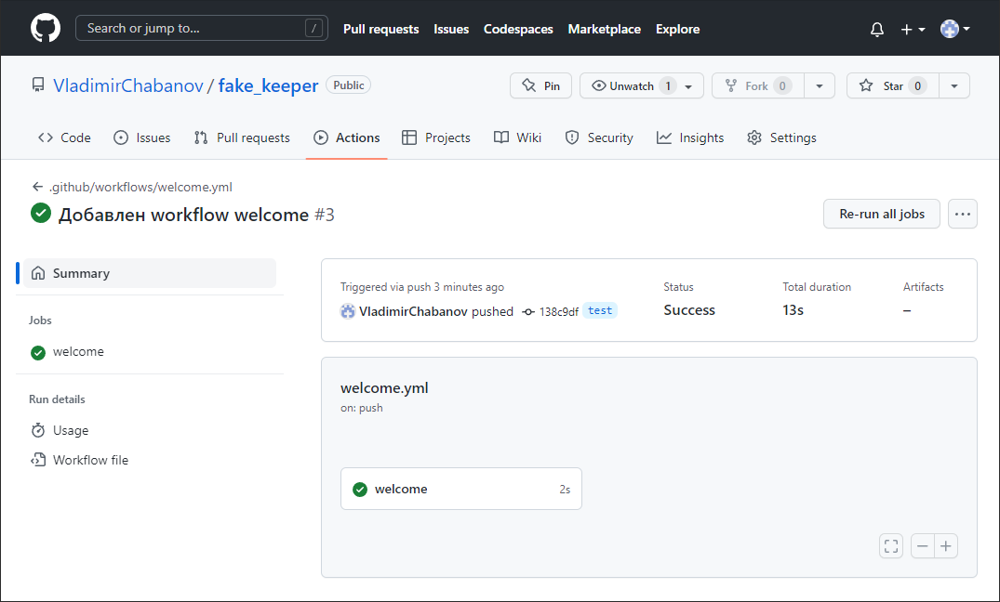

47. Щёлкните по нему и откроется более подробная информация о выполнении процесса. Развернув раздел под названием Run echo "Hello new commits" вы увидите результат работы команды, т.е. само сообщение "Hello new commits".

    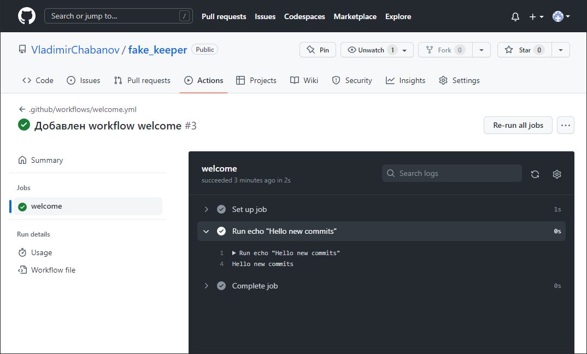

48. [test] Обратите внимание, что рабочий процесс в списке назван по полному имени файла, а в списке запущенных процессов он значится под именем коммита в котором был добавлен. Исправим это.  
    Откройте, в локальном репозитории, файл "welcome.yml" и добавьте в начало:

    ```yaml
    name: Welcome workflow
    run-name: Welcome new commits
    ```

    Параметр `name` определяет имя в списке рабочих процессов, а `run-name` в списке запущенных.

49. [test] Закоммитьте и отправьте изменения на GitHub:

    ```bash
    git add .
    git commit -m "Обновлён workflow welcome"
    git push
    ```

    Посмотрите, что изменилось в разделе "Actions".

50. В каждый workflow GitHub передаёт дополнительную информацию в виде переменных окружения виртуальной машины и в виде [контекстов](https://docs.github.com/en/actions/learn-github-actions/contexts).  
    Список переменных окружения можно посмотреть обычным образом (консольная команда `env`). Для просмотра содержимого контекстов можно попросить одно конкретное значение или воспользоваться функцией `toJSON`.

51. [test] В каталоге ".github/workflows/" создайте файл "dump_contexts.yml" со следующим содержимым:

    ```yaml
    name: Context testing
    on: push
    jobs:
      dump_contexts:
        runs-on: ubuntu-latest
        steps:
          - name: Dump GitHub context
            id: github_context_step
            run: echo '${{ toJSON(github) }}'
          - name: Dump job context
            run: echo '${{ toJSON(job) }}'
          - name: Dump steps context
            run: echo '${{ toJSON(steps) }}'
          - name: Dump runner context
            run: echo '${{ toJSON(runner) }}'
          - name: Dump Secrets context
            run: echo '${{ toJSON(secrets) }}'
          - name: Dump strategy context
            run: echo '${{ toJSON(strategy) }}'
          - name: Dump matrix context
            run: echo '${{ toJSON(matrix) }}'
          - name: Dump environments variable
            run: env
    ```

    Этот workflow, тоже будет выполнен по событию `push`, но теперь у нас job состоит из 8-ми шагов. Каждый из них выведет информацию о своём контексте на экран, а последний покажет переменные среды.  
    Чтобы получить конкретное значение из контекста оно должно быть указано в специальном виде: `${{ runner.os }}`. Например эта запись будет заменена на значение ключа "os" контекста "runner".

52. [test] Закоммитьте и отправьте изменения на GitHub. Затем откройте раздел "Actions" и изучите вывод последнего wirkflow. Обратите внимание, что "Welcome workflow" тоже был запущен.

53. На данный момент у нас такое дерево коммитов:

    

54. [test] Ветка "test" нам больше не нужна, поэтому можем её удалить.  
    Здесь может показаться, что удаление ветки приведёт к удалению коммитов созданных в ней. На самом деле это не так. Понятие *ветка* в git это просто *ссылка* на последний коммит созданный в ней и как только вы создаёте новый коммит в ветке, эта ссылка автоматически перепрыгивает на него. Удаление ветки сводится к удалению этой самой ссылки и не затрагивает коммиты. 

55. [test -> dev] Удаление веток в локальном и удалённом репозитории не связано, поэтому их придётся удалять отдельно. Удалить активную ветку нельзя, поэтому сначала перейдите в ветку "dev", а затем выполните команды:

    ```bash
    git branch -D test
    git push origin -d test
    ```

    Обычно для удаления локальной ветки используется `-d`, но нам пришлось использовать усиленную версию `-D` по следующей причине: те три коммита, которые мы делали в ветке "test" всё ещё существуют, но теперь они не доступны и вскоре будут окончательно удалены гитом. Обычно перед удалением ветки её вливают в другую, в этом случае, даже после удаления ветки, коммиты остаются доступны через коммит слияния.

56. Почему три коммита из удалённой ветки "test" вдруг стали недоступны?  
    Дело в том, что каждый коммит помнит только своих предков, но не потомков, поэтому находясь на каком-нибудь коммите, можно пройти назад, по всем предыдущим, до самого начала, но не вперёд. После удаления ветки "test", у пользователя больше нет возможности перейти на коммиты созданные в ней, через другую ветку или как-нибудь ещё и поэтому гит считает их мусорными.

    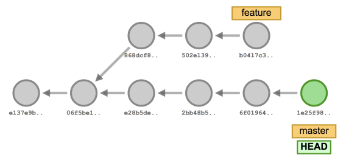

    На самом деле есть способ попасть на коммиты из удалённой ветки если вы знаете их хэши. Именно поэтому git, при удалении ветки, печтатет хэш её последнего коммита и не уничтожает недоступные коммиты сразу же. Зная хэш коммита вы можете перейти на него и восстановить ветку, если удалили её не намеренно.

57. [dev] Создайте новую ветку с названием "template" и перейдите в неё. В этой ветке мы создадим нулевую версию нашего приложения.

58. [template] Настроим локальное окружение, чтобы иметь возможность запускать код у себя на машине. Для этого введите команду: `python3 -m venv venv`. В итоге в корне репозиторий будет создан каталог "venv" с виртуальным окружением. Т.к. это наши рабочие файлы, то они не должны попадать в общий репозиторий. Если вы откроете файл  ".gitignore", то в разделе "# Environments" нейдёте несколько разных имён, в том числе и `venv/`. Это означает, что дополнительных изменений нам вносить не нужно, т.к. гит уже знает, что эту папку нужно игнорировать.

59. [template] Активируйте виртуальное окружение, т.к. же как вы это делали ранее: `source venv/bin/activate`.

60. [template] Установите необходимые для работы пакеты: `pip install flask`

61. [template] Создайте в корне репозитория каталог "src", внутри которого создайте каталог "app". В каталоге "app" создайте файл "app.py" с содержимым:

    ```python
    from flask import Flask
    
    app = Flask(__name__)
    
    @app.route('/')
    def hello_world():
         return 'Hello, World!'
    
    if __name__ == "__main__":
         app.run(debug=True, host='0.0.0.0')
    ```

    Это шаблон будущего проекта (нулевая версия).

62. [template] Запустите приложение и, в новом терминале, проверьте его работоспособность, при помощи команды: `curl http://127.0.0.1:5000/`. `curl` отправит GET-запрос на `http://127.0.0.1:5000`. В результате вы должны увидеть сообщение `Hello, World!`.  
    Если всё хорошо, то остановите приложение и закройте новый терминал.

63. [template] Сохраните зависимости приложения в файл в **корень** репозитория:

    ```bash
    pip freeze > requirements.txt
    ```

64. [template] Находясь в корне репозитория наберите команду: `git status`. Гит должен показать, что присутствуют неотслеживаемые файлы. Среди этих файлов должен быть только каталог "src" и "requirements.txt". Каталога "venv" в списке быть не должно, т.к. он игнорируется гитом.

65. [template] Выполните:

    ```bash
    git add .
    git commit -m "Добавлен шаблон приложения"
    ```

66. Обычно, параллельно с разработкой приложения разрабатываются и тесты, которые проверяют, что при добавлении нового функционала ничего не сломалось (регрессионное тестирование). Т.к. разработчик постоянно меняет код, то и тесты тоже должны запускаться постоянно. Следовательно они должны выполнятся максимально быстро, чтобы не тормозить процесс.  
    Быстро проверить всё приложение не получится, поэтому ограничиваются проверкой отдельных модулей (юнит тесты). В этой работе не будет модульных тестов, но мы будем делать вид, что они есть.

67. [template] В корне репозитория создайте папку "test" и в нём создайте файл "unit-tests.sh" со следующим содержимым:

    ```bash
    echo "Unit Tests PASS"
    ```

    Это обычный shell скрипт.

68. [template] Выполните:

    ```bash
    git add .
    git commit -m "Добавлены unit тесты"
    ```

69. Добавим workflow, который будет запускать эти тесты при каждом `push`. Если в качестве триггера указать просто `push`, то тесты будут запускаться при `push` в любую ветку в которую мы вольём нашу текущую, т.к. workflow попадёт и туда тоже. По итогу работы мы должны будем влить эту ветку в "dev", а "dev" рано или поздно вольётся в "main".  
    По причинам, которые будут понятны далее мы не хотим запускать тесты при `push` в "dev" и "main". Они должны запускаться только при `push` в ветки, в которых разрабатываются отдельные фичи (как наша). Поэтому в workflow исключим "dev" и "main".

70. [template] Т.к. каталог ".github/workflows/" мы создавали только в ветке "test", а затем её удалили, то на данный момент этих каталогов у нас нет. Создайте их.

71. [template] В ".github/workflows/" создайте файл: "unit_tests.yml" содержащий:

    ```yaml
    name: Unit Tests
    run-name: Run Unit Tests
    on:
      push:
        branches-ignore:
          - 'main'
          - 'dev'
    jobs:
      unit_testing:
        runs-on: ubuntu-latest
        steps:
          - name: Run Unit Tests
            run: |
              chmod +x ./test/unit-tests.sh
              ./test/unit-tests.sh
            shell: bash
    ```

    Вертикальная черта после `run` указывает, что далее будет многострочный текстовый литерал, без неё, перевод строки был бы воспринят как конец значения и начало нового ключа. Параметр `shell` указывает какой программе следует отдать текст из раздела `run`. В данном случае это терминал bash, но в принципе можно указать например интерпретатор python, в этом случае `run` должен содержать python скрипт.  
    Здесь `chmod +x ./test/unit-tests.sh` добавляет права на исполнение файлу `./test/unit-tests.sh` (путь от корня репозитория). Следующая строка запускает файл как программу.

72. [template] Закоммитьте изменения и отправьте на GitHub. Ветка "template" новая, поэтому гиту нужно будет указать куда её отправлять.

73. Перейдите на GitHub в раздел "Actions". Вы должны увидеть, что процесс завершился с ошибкой. Если вы посмотрите более подробную информацию по процессу, то вы поймёте, что проблема появились на этапе "Run Unit Tests" и в тексте ошибки сказано: "No such file or directory". Дело в том, что по умолчанию в рабочем каталоге виртуальной машины запущенной для выполнения workflow, ничего нет, в том числе и наших файлов из репозитория.

74. Чтобы скопировать файлы из репозитория в рабочий каталог виртуальной машины можно воспользоваться обычным способом (клонировать репозиторий командой `git clone`). Но GitHub предоставляет более удобный способ (заранее подготовленные действия Actions). В нашем случае перед шагом "Run Unit Tests" нужно добавить дополнительный шаг (не забывайте про отступы):

    ```yaml
    - name: Checkout
      uses: actions/checkout@v3
    ```

    Здесь `uses` говорит, что этот шаг должен выполнить Action расположенный в репозитории `actions/checkout` (https://github.com/actions/checkout) и при этом использовать версию с тегом `v3`.  Это действие без параметров, как раз и скопирует файлы из репозитория в рабочий каталог виртуальной машины. При желании можно указать какой коммит или ветку требуется копировать.

75. [template] Добавьте указанный выше шаг в "unit_tests.yml", сделайте новый коммит и `push`. Теперь если вы перейдёте в раздел "Actions", то обнаружите, что процесс завершился успешно и на шаге "Run Unit Tests" было выведено сообщение: "Unit Tests PASS".

76. Теперь в процессе разработки по `push` в любую ветку кроме "dev" и "main" будут запускаться наши воображаемые unit тесты.

77. На данный момент у нас такое дерево коммитов. Ветка "test" была удалена, но здесь она оставлена в виде `x` для наглядности:

    

78. Будем считать, что мы закончили добавление новой фичи в проект и привели его в рабочее состояние. Следующим шагом должно быть отправка нашего кода в ветку "dev" (слияние веток). Но, как правило, только unit тестов не достаточно чтобы убедиться в полной работоспособности проекта, т.к. по отдельности модули могут работать, а в готовом приложении нет. Добавим интеграционный тест, который будет проверять работоспособность приложения в целом.  
    На каком же этапе нужно выполнить этот тест? Очевидно, что после добавления кода из "template" в "dev" это делать уже поздно, т.к. сломанный код уже попал в ветку, следовательно нужно это сделать раньше. С другой стороны разворачивать окружение для интеграционного тестирования локально может быть очень сложно и не удобно, поэтому хотелось бы это сделать удалённо.

79. На GitHub (не в git) есть механизм который называется pull request. Если по простому, то он состоит из 2х шагов:

    - `pull` из ветки в которую хотим влиться в ветку которую хотим влить. То есть как бы обратный шаг. Мы берём все изменения из "dev" и вливаем их в "template".
    - `push` того, что получилось после слияния в "dev". Этот шаг не выполнится, пока пользователь не разрешит. 

    Результат будет именно тот, что мы хотели изначально, т.е. наш кода из "template" попадёт в "dev", но благодаря первому шагу мы ***заранее*** получим слитое состояние веток "template" и "dev", которое и сможем протестировать перед тем как разрешить второй шаг.

80. [template] В каталоге ".github/workflows/" создайте файл "pull-request-to-dev.yml" содержащий:

    ```yaml
    name: Pull Request To Dev
    run-name: Run Integration Tests
    on:
      pull_request:
        branches:
          - 'dev'
    jobs:
      integration_testing:
        runs-on: ubuntu-latest
        steps:
          - name: Checkout
            uses: actions/checkout@v3
          - name: Install requirements
            run: pip install -r requirements.txt
          - name: Run app
            run: python3 ./src/app/app.py &
          - name: Test GET-request
            run: |
              ANSW=$(curl http://127.0.0.1:5000/)
              if [ "$ANSW" != "Hello, World!" ]; then
              exit 1
              else
              echo "Integration Test PASS"
              fi
    ```

    В этом рабочем процессе мы устанавливаем все необходимые для работы приложения "app.py" зависимости из файла "requirements.txt". На шаге "Run app" запускаем приложение и на шаге "Test GET-request" выполняем shell скрипт, который обращается к нашему приложению `curl http://127.0.0.1:5000/` и сохраняет результат работы в переменную `ANSW`, затем значение `ANSW` сравнивается с текстом "Hello, World!" и в случае неравенства скрипт завершается с ненулевым кодом (т.е. ошибка). Если значения совпадают, пишем "Integration Test PASS".  
    В качестве триггера для процесса выбираем `pull_request`. Здесь ограничим только `pull_request` в "dev", т.к. для ветки `main` будут свой workflow.

81. [template] Закоммитьте и отправьте на GitHub изменения.

82. [template] Прежде, чем создать pull request мы должны отправить ветку "dev" на GitHub, т.к. она пока существует только в локальном репозитории. Как обычно выполните команду `git push -u origin dev` чтобы гит отправил и запомнил куда отправлять коммиты в будущем. Переходить в ветку "dev" не обязательно.

83. Откройте репозиторий на GitHub и в разделе "Pull requests" нажмите кнопку "New pull request":

    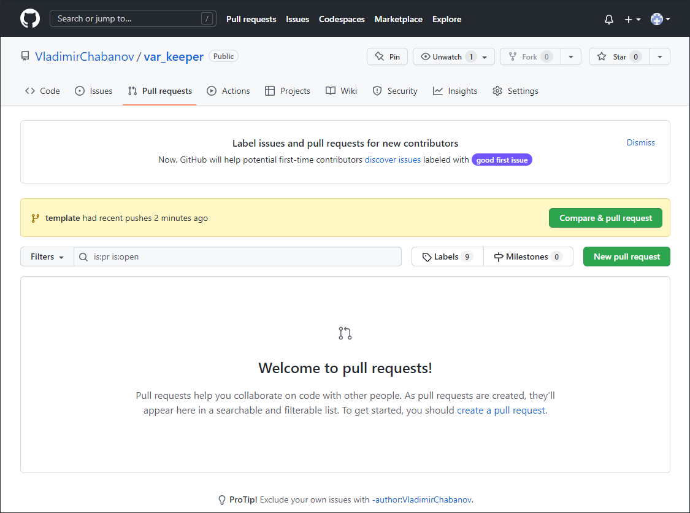

84. Выберите для слияния ветки "dev" и "template" и нажмите "Create pull request":

    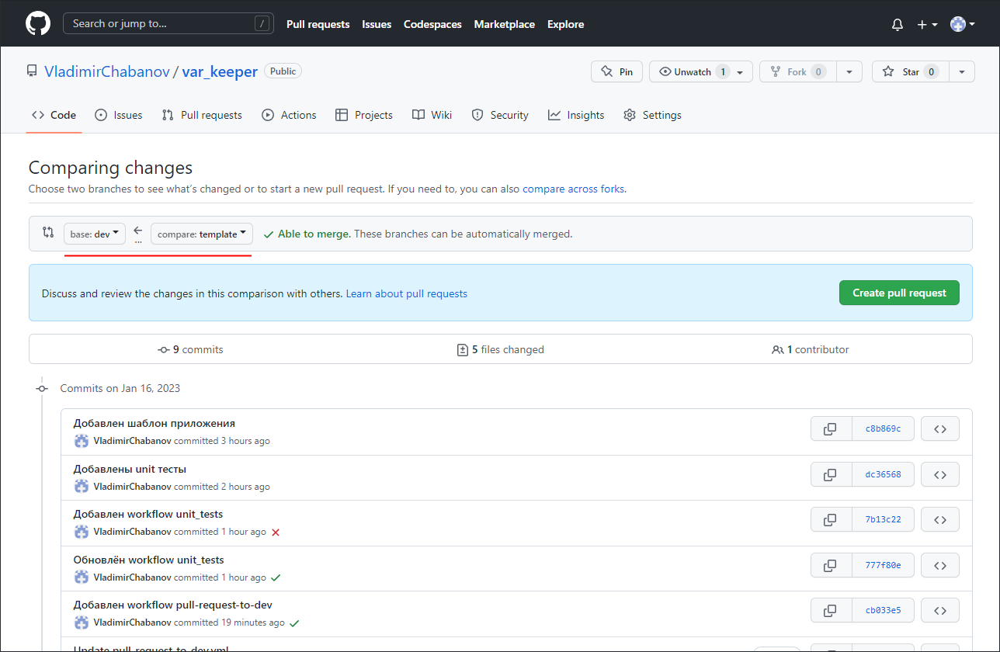

85. Укажите название pull request-a и нажмите "Create pull request":

    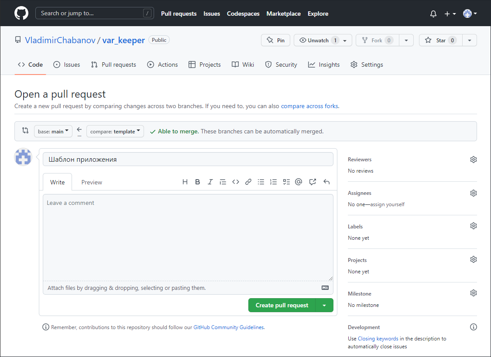

86. Теперь pull request создан и под списком коммитов можно увидеть выполненные workflow. Если хоть один из них не закончится успешно pull request нельзя будет завершить. Нажмите на Details возле workflow "Pull Request To Dev" и проверьте, что на шаге "Test GET-request" было выведено сообщение "Integration Test PASS":

    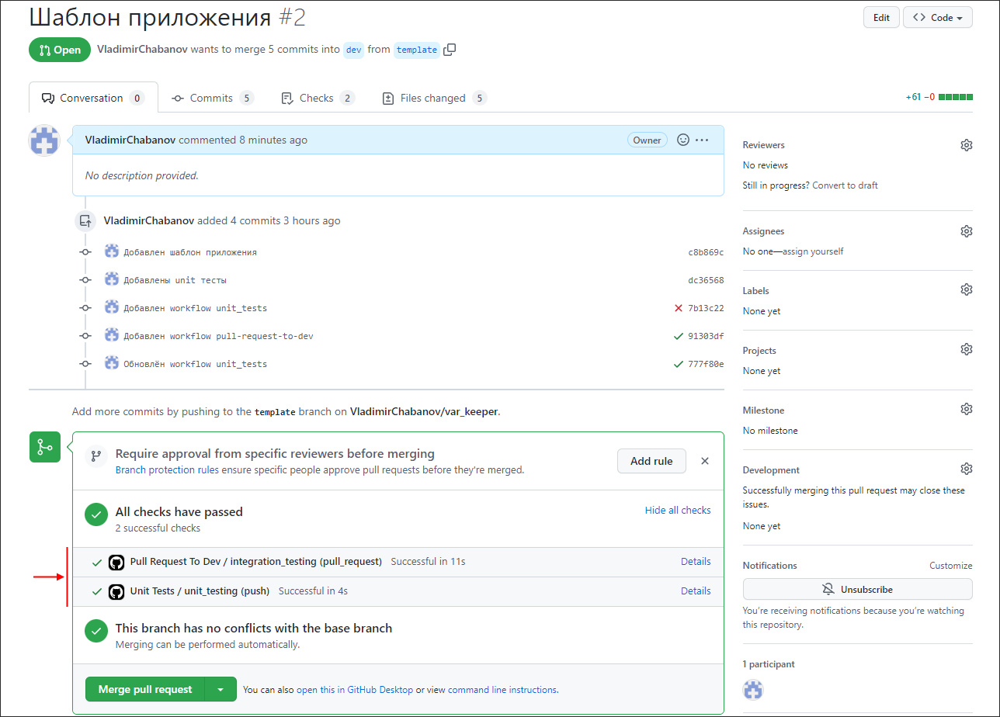

87. Чтобы завершить pull request нужно выбрать один из вариантов слияния веток. Обычно стараются выбирать Rebase, чтобы история разработки была линейная. Но мы выберем первый вариант, чтобы посмотреть что получится. Нажмите "Merge pull request", а затем подтвердите действие:

    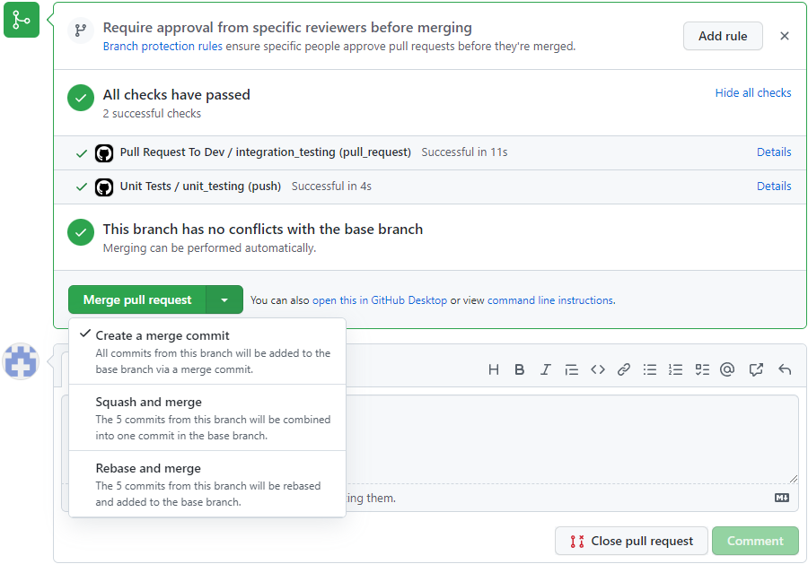

88. Ветка "template" выполнила свою роль и больше не нужна. Удалите её. При этом коммиты, которые были в этой ветке не удалятся сборщиком мусора git, т.к. перед удалением ветки мы слили её с другой:

    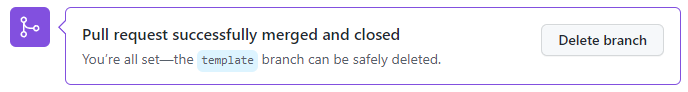

89. [template -> dev] Теперь на GitHub присутствуют коммиты, которых нет у нас в локальном репозитории (коммит слияния). Если мы сейчас продолжим разработку, то в дальнейшем возникнут проблемы при отправке коммитов на GitHub. Чтобы этого избежать, в терминале, перейдите на ветку "dev" и скачайте изменения в локальный репозиторий: `git pull`.

90. [dev] Удалите локальную ветку "template" и с GitHub тоже:

    ```bash
    git branch -d template
    git push origin -d template
    ```

    Обратите внимание, что теперь мы используем не усиленную `-d`.

91. [dev] Посмотрите историю репозитория при помощи команды: `git log --oneline --graph`. Как видно, в истории  присутствует "петля", которая появилась в результате добавления merge-коммита. Чтобы предотвратить появление таких петель и используется стратегия "Rebase and merge":

    

92. Т.к. в ветку "dev" попадает только полностью рабочая версия приложения, почти готовая к релизу, хотелось бы иметь возможность "пощупать" его в виде собранного приложения (stage версия). Для этого запакуем его в docker контейнер и отправим в специальный репозиторий, из которого, можно будет получить контейнер с приложением обычным образом.

93. [dev -> docker] Новый функционал будем добавлять в отдельной ветке. Для этого создайте и прейдите в ветку "docker".

94. [docker] Обновление stage версии будем выполнять автоматически, каждый раз, когда будет обновятся ветка "dev" (т.е. по `push` в неё). Для этого в каталоге ".github/workflows/" создайте файл "staging.yml" содержащий:

    ```yaml
    name: Push Stage version to DockerHub
    on:
      push:
        branches:
          - 'dev'
    jobs:
      build:
        runs-on: ubuntu-latest
        steps:
          - name: Checkout repository
            uses: actions/checkout@v3
            
          - name: Cut commit sha
            id: cut
            run: echo "sha_short=${GITHUB_SHA::7}" >> $GITHUB_OUTPUT
            
          # Login against a Docker registry
          # https://github.com/docker/login-action
          - name: Log into DockerHUB
            uses: docker/login-action@28218f9b04b4f3f62068d7b6ce6ca5b26e35336c
            with:
              username: ${{ secrets.DOCHUB_USERNAME }}
              password: ${{ secrets.DOCHUB_TOKEN }}
              
          - name: Setup Docker buildx
            uses: docker/setup-buildx-action@79abd3f86f79a9d68a23c75a09a9a85889262adf
    
          # Build and push Docker image with Buildx
          # https://github.com/docker/build-push-action
          - name: Build and push Docker image
            id: build-and-push
            uses: docker/build-push-action@ac9327eae2b366085ac7f6a2d02df8aa8ead720a
            with:
              context: .
              file: ./docker/Dockerfile
              push: true
              tags: ${{ vars.DOCHUB_USERNAME }}/var_keeper:${{ steps.cut.outputs.sha_short }}
    ```

    Здесь используется 4 действия `actions/checkout` - чтобы получить содержимое репозитория в рабочий каталог виртуальной машины; `docker/login-action` - чтобы залогиниться на DockerHUB; `docker/setup-buildx-action` - настройка "buildx" - плагина Docker CLI для расширенных возможностей сборки с помощью BuildKit; `docker/build-push-action` - сборка и отправка образа в репозиторий DockerHUB. После символа `@` указаны sha коммитов или тег коммита.  
    Для того, чтобы этот workflow отработал корректно нужно:

    - Создать Dockerfile, на основании которого будет собираться образ. В нашем workflow указано, что Dockerfile лежит в каталоге "docker", который расположен в корне репозитория.
    - Добавить логин и пароль от аккаунта DockerHub в раздел [секретов GitHub репозитория](https://docs.github.com/ru/actions/security-guides/encrypted-secrets). Имя пользователя должно быть сохранено под именем `DOCHUB_USERNAME`, пароль под именем `DOCHUB_TOKEN`.
    - Добавить в раздел [переменных GitHub репозитория](https://docs.github.com/en/actions/learn-github-actions/variables#creating-configuration-variables-for-a-repository) переменную `DOCHUB_USERNAME` с именем пользователя DockerHub. Эта переменная должна совпадать с одноимённым секретом. Такое дублирование нужно, т.к. GitHub заменяет значения секретов на звёздочки, при попытке преобразовать их в текст, а для указания полного имени Docker образа нам нужно имя пользователя. В принципе для имени пользователя можно ограничится только переменной и не создавать для него секрет.

95. [docker] Закоммитьте созданный workflow, но пока не отправляйте на GitHub.

96. [docker] Добавим Dockerfile. Для этого в корне репозитория создайте каталог "docker" и в нём создайте файл с именем "Dockerfile" содержащий (версию python укажите свою):

    ```dockerfile
    FROM python:3.10.6-alpine
    WORKDIR /app
    COPY requirements.txt /app
    COPY /src/app /app
    RUN pip install -r requirements.txt
    ENTRYPOINT [ "python" ]
    CMD [ "app.py" ]
    ```

    Это почти тот же Dockerfile, который мы использовали ранее. Отличия только в команде `COPY`. Здесь, мы копируем "requirement.txt" из корня репозитория в каталог "/app" в контейнере, а затем копируем содержимое каталога "/src/app" из репозитория тоже в "/app" в контейнере.

97. [docker] Закоммитьте Dockerfile. На GitHub пока не отправляем.

98. Откройте репозиторий на GitHub и в его настройках добавьте в раздел [секретов](https://docs.github.com/ru/actions/security-guides/encrypted-secrets) (secrets) переменную  `DOCHUB_USERNAME` - имя пользователя от аккаунта DockerHub и `DOCHUB_TOKEN` - пароль от его. Там же, но на соседней вкладке (variables) добавьте переменную `DOCHUB_USERNAME` с именем пользователя DockerHub.

    > [!NOTE]
    > Здесь мы используем в качестве репозитория для контейнера - DockerHub, но GitHub так же позволяет хранить Docker образы в своём реестре пакетов на [ghcr.io](https://ghcr.io) (подробнее в [документации](https://docs.github.com/ru/packages/working-with-a-github-packages-registry/working-with-the-container-registry)).

99. [docker] Теперь можно отправить все созданные коммиты на GitHub.

100. Создайте pull request и для слияния выберете ветки "dev" и "docker". Убедитесь, что тесты проходят успешно и завершите слияние. Удалите ветку "docker" из репозитория на GitHub.

101. Перейдите в раздел "Actions" и убедитесь, что последний workflow выполнился успешно (это тот который собирает и отправляет контейнер на DokcerHub). Затем перейдите в свой репозиторий на DockerHub и убедитесь, что в списке тегов появился новый образ.

102. Проверьте работоспособность образа запустив его при помощи docker (не забудьте пробросить порт).

103. [docker -> dev] В терминале перейдите в ветку "dev" и заберите изменения с GitHub в локальный репозиторий: `git pull`, затем удалите локальную ветку "docker".

104. Для того, чтобы быстро получать информацию о состоянии последней stage версии и о коммите для которого построена эта версия добавим в "ReadMe.md" бейдж. По сути бейдж - это просто изображение, которое отображает некоторую информацию и автоматически изменяется, при изменении этой информации.   
     Бедж можно добавить 3 способами:

     - Используя встроенные средства GitHub. Довольно ограниченный метод, позволяет создавать [бейджи статуса](https://docs.github.com/en/actions/monitoring-and-troubleshooting-workflows/adding-a-workflow-status-badge) показывающие успешность его выполнения указанного workflow.
     - Используя внешние сервисы генерирующие изображения. Очень хороший вариант [shields.io](https://shields.io/). Данный сервис содержит кучу заготовок, которые можно настраивать по своему желанию.
     - Использовать просто статическую картинку.

105. Для начала добавим бейдж отображающий статус процесса сборки и отправки образа на DockerHub. Файл описывающий соответствующий workflow называется у нас "staging.yml". Бейдж можно получить по ссылке в формате:

     ```plain
https://github.com/<OWNER>/<REPOSITORY>/actions/workflows/<WORKFLOW_FILE>/badge.svg
     ```

     `<OWNER>` - это имя владельца репозитория; `<REPOSITORY>` - это название репозитория; `<WORKFLOW_FILE>` - это название файла рабочего процесса (с расширением!). В нашем случае `staging.yml`. Регистр букв - важен!

     Второй вариант получения этого бейджа - через веб-интерфейс GitHub. Для этого в разделе Actions выберите интересующий workflow и затем в выпадающем меню "Create status badge":

     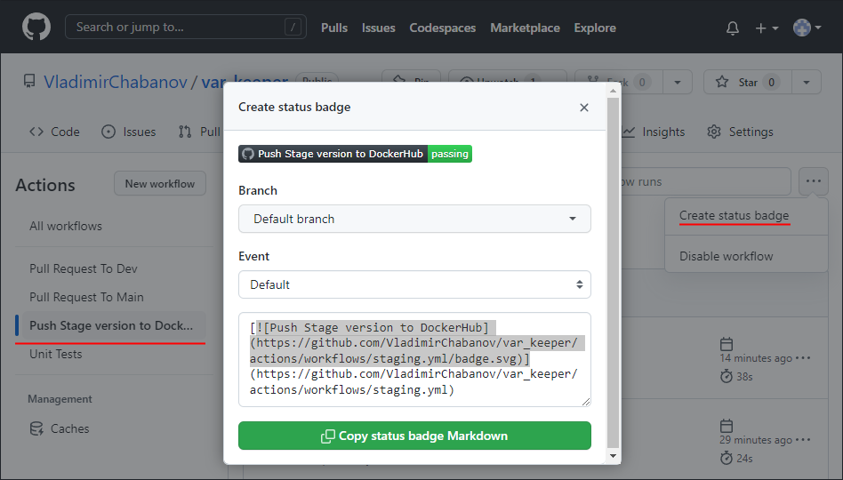

     В этом примере бейдж дополнительно завёрнут в ссылку на файл workflow.

106. [dev] По правилам, для добавления каждого **нового функционала** мы должны создать **новую ветку**, но для уменьшения размера работы выполним следующие несколько шагов сразу в ветке "dev".  
     Разместим бейдж на главной странице нашего репозитория. Для этого откройте "ReadMe.md" и добавьте после заготовка ссылку на бейдж. Чтобы бейдж отображался как картинка можно воспользоваться как синтаксисом [html](http://htmlbook.ru/html/img/), так и [Markdown](https://docs.github.com/en/get-started/writing-on-github/getting-started-with-writing-and-formatting-on-github/basic-writing-and-formatting-syntax#images) В моём случае файл будет выглядеть так:

     ```markdown
     # Var_keeper
     
     
     
     Приложение позволяет сохранить переменную и затем прочитать её значение при помощи http запроса.
     ```

107. Второй бейдж добавим при помощи сервиса [shields.io](https://shields.io/). Перейдите по ссылке и введите в строке поиска: "docker". В списке выберите пункт "Docker Image Version". В форме справой стороны щёлкните по пункту "Show optional parameters" и заполните поля: `user` `repo` `sort` и `label`. `user` - логин на DockerHub; `repo` = `var_keeper`; `sort` = `date`; `label` = `build for commit`. Остальное можете заполнить по желанию. Внизу страницы щелкните по кнопке "Copy", чтобы получить просто ссылку на изображение или стразу выберите в каком виде хотите её получить (HTML, markdown).

108. [dev] Добавьте бейдж в ReadMe.md через пробел после первого. В моём случае файл будет выглядеть так:

     ```markdown
     # Var_keeper
     
      
     
     Приложение позволяет сохранить переменную и затем прочитать её значение при помощи http запроса.
     ```

109. [dev] Закоммитьте изменения, отправьте на GitHub и убедитесь, что бейджи отображаются нормально. Не забудьте выбрать ветку "dev" в интерфейсе GitHub, т.к. пока что "ReadMe.md" изменён только в ней.

110. Осталось настроить последний шаг, слияние "dev" и "main", но перед этим добавим ещё одну имитацию наличия тестов. Будем считать, что перед вливанием в ветку "main" мы хотим протестировать код максимально полно, пусть это и займёт много времени. Для этого, помимо обычных тестов, мы хотим запустим все остальные.

111. [dev] В каталоге "test" создайте файл "all-mega-hard-tests.sh" со следующим содержимым:

     ```bash
     echo "All Mega Hard Tests PASS"
     ```

112. [dev] Коммит.

113. [dev] Слияние "dev" и "main" тоже будем выполнять через pull request, в процессе которого будем запускать все тесты, которые у нас есть. Для этого в каталоге ".github/workflows/" создайте файл "pull-request-to-main.yml" содержащий:

     ```yaml
     name: Pull Request To Main
     run-name: Run All Tests
     on:
       pull_request:
         branches:
           - 'main'
     jobs:
       unit_testing:
         runs-on: ubuntu-latest
         steps:
           - name: Checkout
             uses: actions/checkout@v3
           - name: Run Unit Tests
             run: |
               chmod +x ./test/unit-tests.sh
               ./test/unit-tests.sh
             
       integration_testing:
         needs: unit_testing
         runs-on: ubuntu-latest
         steps:
           - name: Checkout
             uses: actions/checkout@v3
           - name: Install requirements
             run: pip install -r requirements.txt
           - name: Run app
             run: python3 ./src/app/app.py &
           - name: Test GET-request
             run: |
               ANSW=$(curl http://127.0.0.1:5000/)
               if [ "$ANSW" != "Hello, World!" ]; then
               exit 1
               else
               echo "Integration Test PASS"
               fi
               
       mega_hard_testing:
         needs: [unit_testing, integration_testing]
         runs-on: ubuntu-latest
         steps:
           - name: Checkout
             uses: actions/checkout@v3
           - name: Run Mega Hard Tests
             run: |
               chmod +x ./test/all-mega-hard-tests.sh
               ./test/all-mega-hard-tests.sh
     ```

     В данном workflow у нас есть 3 job-а, при этом второй ждёт завершения первого, а третий, первого и второго. Это достигается за счёт параметра `needs`, без которого все job-ы выполняются независимо и, по возможности, параллельно. По умолчанию, если в результате предшествующего job-а возникает ошибка, то зависимые не запускаются.

114. [dev] Коммит и пуш на GitHub.

115. Перейдите на GitHub и выполните pull request. В настройках выберите для слияния ветки "main" и "dev".  
     Под списком коммитов вы должны увидеть, что были запущены unit, intergation и mega hard тесты (возможно придётся подождать несколько секунд пока они запустятся). Завершите слияние.

116. Перейдите в раздел "Actions" и в запущенных workflows выберите последний (Run All Tests). Вы увидите, что job "unit_testing", "integration_testing" и "mega_hard_testing" объединены в цепочку.

117. Откройте репозиторий GitHub, выберите ветку "main" и убедитесь, что "ReadMe.md" соответствует тому, что было в ветке "dev" до слияния.

118. [dev -> main] Перед тем, как продолжить не забудьте забрать все изменения с GitHub в локальный репозиторий (`git pull` в ветке "main").

119. Чтобы проверить, что всё работает правильно, модифицируем проект.

120. [main -> dev] Для начала перейдите в "dev" и создайте новую ветку с именем "add_data_base". Все новые ветки должны создаваться от "dev"!

121. [dev -> add_data_base] Перейдите в ветку "add_data_base". Тут будем вести разработку.

122. Модифицируйте код приложения "app.py" (src/app/) следующим образом:

     ```python
     from flask import Flask, request
     from getpass import getpass
     from mysql.connector import connect, Error
      
     connection = None
      
     def init_db():
         global connection
         try:
             print('Connection to db:', end='')
             connection = connect(host='db', user='root', password='123')
             print('ОК')
      
             print('Create db:', end='')
             create_db_query = "CREATE DATABASE IF NOT EXISTS vars"
             with connection.cursor() as cursor:
                 cursor.execute(create_db_query)
             print('ОК')
      
             print('Change db:', end='')
             use_db_query = "USE vars"
             with connection.cursor() as cursor:
                 cursor.execute(use_db_query)
             print('ОК')
      
             print('Create table:', end='')
             create_table_query = """
             CREATE TABLE IF NOT EXISTS vars(
                 id INT AUTO_INCREMENT PRIMARY KEY,
                 name VARCHAR(100),
                 value VARCHAR(100),
                 UNIQUE (name)
                 )
                 """
             with connection.cursor() as cursor:
                 cursor.execute(create_table_query)
                 connection.commit()  
             print('ОК')     
         except Error as e:
             print('Failure', e)
      
      
     app = Flask(__name__)
      
     @app.route('/var/<var_name>', methods=['GET'])
     def get(var_name):
         select_query = f"""
         SELECT value FROM vars
         WHERE name = '{var_name}'
         """
      
         print("Select query:", select_query)
         with connection.cursor() as cursor:
             cursor.execute(select_query)
             return cursor.fetchall()[0][0]
      
      
     @app.route('/var/<var_name>', methods=['POST'])
     def set(var_name):
         value = request.form.get("value")
         insert_query = f"""
         INSERT INTO vars (name, value)
         VALUES ('{var_name}', '{value}')
         ON DUPLICATE KEY UPDATE value='{value}'
         """
      
         print("Insert query:", insert_query)
         with connection.cursor() as cursor:
             cursor.execute(insert_query)
             connection.commit()
      
         return 'OK'
      
      
     if __name__ == "__main__":
         init_db()
         app.run(debug=True, host='0.0.0.0')
     ```

123. [add_data_base] Коммит.

124. [add_data_base] Приложение теперь взаимодействует с базой данных mysql и для его работы нужно установить дополнительный пакет: `mysql-connector-python`.  
     Если вы уже деактивировали виртуальное окружение "venv", активируйте его снова, затем установите требуемый пакет: `pip install mysql-connector-python` и обновите "requirements.txt": `pip freeze > requirements.txt`

125. [add_data_base] Коммит.

126. [add_data_base] Т.к. приложение изменилось и следовательно оно уже не будет проходить intergation тест. Поправим и его. Модифицируйте "pull-request-to-dev.yml" (.github/workflows/) следующим образом:

     ```yaml
     name: Pull Request To Dev
     run-name: Run Integration Tests
     on:
       pull_request:
         branches:
           - 'dev'
     jobs:
       integration_testing:
         runs-on: ubuntu-latest
         container: python:3.10.9-slim
         services:
           db:
             image: mysql
             env:
               MYSQL_ROOT_PASSWORD: 123
             options: >-
               --health-cmd "mysqladmin ping"
               --health-interval 10s
               --health-timeout 5s
               --health-retries 5
         steps:
           - name: Checkout
             uses: actions/checkout@v3
           - name: Install requirements
             run: pip install -r requirements.txt
           - name: Run app
             run: python3 ./src/app/app.py &
           - name: Install curl
             run: apt-get -y update; apt-get -y install curl
           - name: Set variable a in 123
             run: curl -X POST -F 'value=123' http://localhost:5000/var/a
           - name: Test getting the value of a variable
             run: |
               VALUE=$(curl http://localhost:5000/var/a)
               if [ "$VALUE" != "123" ]; then
               exit 1
               else
               echo "Integration Test PASS"
               fi
     ```

     Здесь весь `job` "integration_testing" запускается в docker контейнере "python:3.10.9-slim" (раздел `container`). До этого момента все workflow выполнялись на самой виртуальной машине, без контейнеризации.  Кроме того, перед тем, как начнут выполнятся действия указанные в разделе `steps` будет запущен docker контейнер с базой данных "mysql" (раздел `services`). Гарантируется, что все сервисы будут запущены до того, как начнётся исполнения job-а. Но запуск сервиса - это просто факт старта его docker контейнера, поэтому в разделе `options` сервиса `db` указан набор дополнительных команд (health check), которые пингуют готовность базы данных с заданным интервалом. Без этих команд исполнение `steps` может начаться раньше, чем база данных будет готова принять подключение.  

     По умолчанию все контейнеры запущенные в `job` подключены к одной сети, поэтому нет необходимости пробрасывать порты. Если бы мы не поместили весь `job` в docker контейнер, пришлось бы пробросить порт базы данных и менять в скрипте "app.py" `connect(host='db', user='root', password='123')` на `connect(host='localhost', user='root', password='123')`.

127. [add_data_base] Коммит.

128. [add_data_base] Данный тест у нас присутствует и в файле "pull-request-to-main.yml". Замените в нём содержимое job-a "integration_testing" на новое (из файла выше).

129. [add_data_base] Коммит и пуш на GitHub.

130. Перейдите на GitHub и выполните pull request. В настройках выберите для слияния ветки "dev" и "add_data_base". Дождитесь, пока все тесты выполнятся (успешно!) и подтвердите слияние. После слияния удалите ветку `add_data_base`.

131. Выполните pull request. В настройках выберите для слияния ветки "main" и "dev". Дождитесь, пока все тесты выполнятся (успешно!) и подтвердите слияние.

132. [add_data_base -> main] Перейдите в ветку "main" и заберите с GitHub изменения в локальный репозиторий.

133. [main -> dev] Перейдите в ветку "dev" и заберите с GitHub изменения в локальный репозиторий.

134. [dev] Удалите ветку "add_data_base", а затем посмотрите историю репозитория: `git log --oneline --graph`.

     

## Источники

1. [Настройка имени пользователя и почты в git](https://githowto.com/ru/setup);
2. [Как генерировать осмысленные коммиты. Применяем стандарт Conventional Commits](https://habr.com/ru/companies/yandex/articles/431432/);
3. [Скринкаст по Git – Конфигурация – Игнорирование: .gitignore](https://youtu.be/hjxFQNjpEU4);
4. [Интерактивный тура (пошаговое руководство) по git](https://githowto.com/ru);
5. [Официальная электронная книга по git](https://git-scm.com/book/ru/v2) - книга на русском;
6. [The Git Community Book](https://uleming.github.io/gitbook/index.html) - книга тоже на русском;
7. [Git: курс](https://www.youtube.com/playlist?list=PLDyvV36pndZFHXjXuwA_NywNrVQO0aQqb) - неплохой плейлист по git. Возможно будет слишком много подробностей для новичков;
8. [GitHub Actions (документация)](https://docs.github.com/ru/actions);
9. [Кратко о YAML](https://learnxinyminutes.com/docs/ru-ru/yaml-ru/);
10. [JSON ⇆ YAML](https://www.json2yaml.com/).
