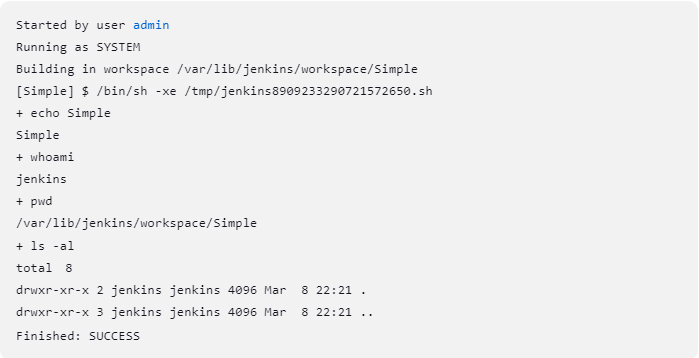
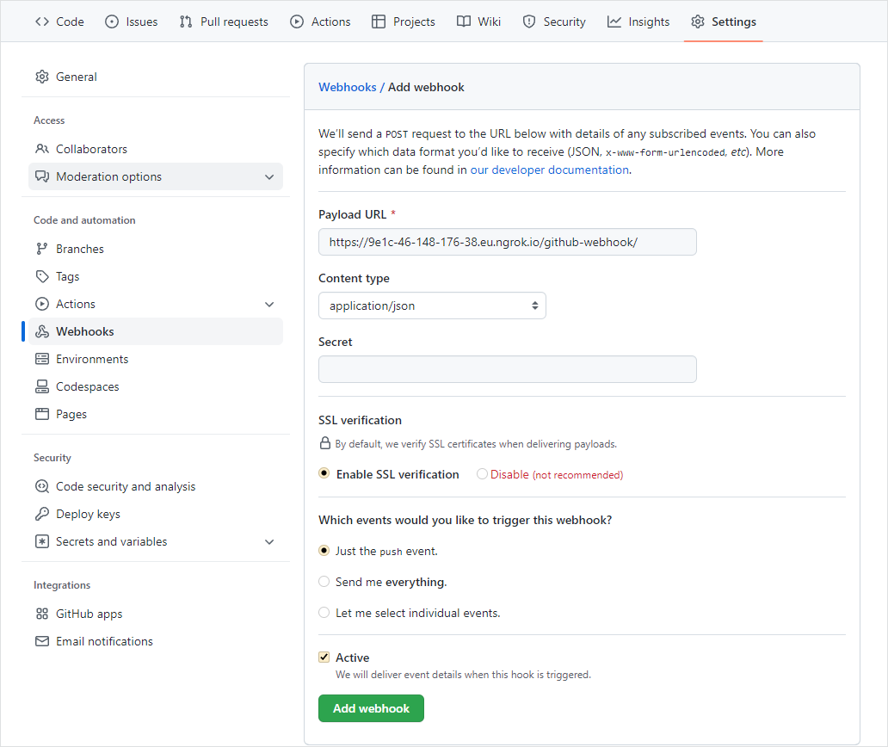
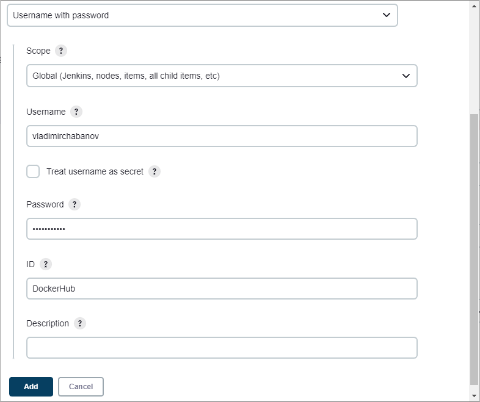
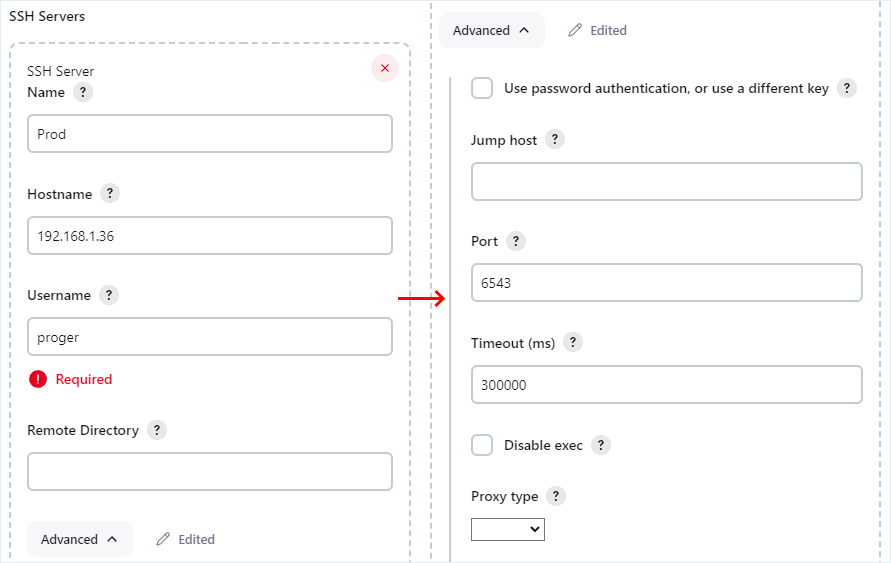
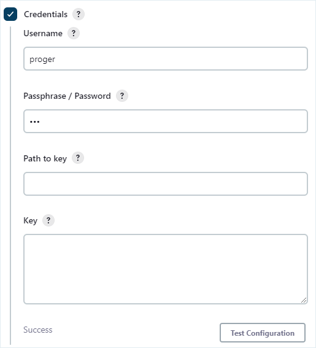
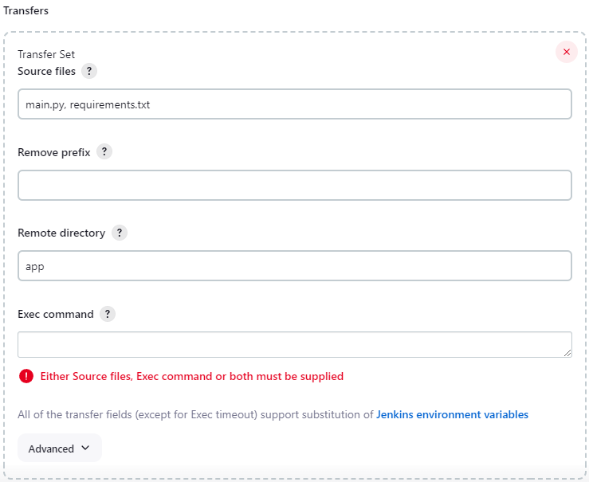
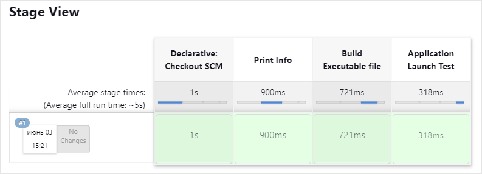

# Практическое задание 5. Знакомство с Jenkins

**Цель:** Ознакомиться на практике со средствами CI/CD доступными в Jenkins.

## Установка

1. Скачать Jenkins можно с [официального сайта](https://www.jenkins.io/download/). Здесь доступно множество вариантов, под разные ОС, в том числе и Jenkins запакованный в Docker-контейнер. В этой работе мы будем устанавливать Jenkins с нуля на Ubuntu.
2. Создайте **новую** виртуальную машину с Ubuntu Server-ом в качестве имени пользователя выберите любое кроме `jenkins`. На этом сервере будет выполняться сборка и тестирование приложения.  
   Если у вас остался сервер с предыдущих работ, то не удаляйте его, т.к. он понадобится далее.
3. В настройках VirutalBox переключите Сеть виртуальной машины в режим "Сетевой мост", затем залогиньтесь и определите ip-адрес машины (в моем случае это: 192.168.1.40). С хостовой машины установите соединение с сервером по ssh с помощью любого, удобного для вас, ssh-клиента.  
   Таким образом будет удобнее выполнять последующие шаги, т.к. можно будет просто копипастить команды.
4. Перейдите на оф. сайт Jenkins в [раздел установки](https://www.jenkins.io/doc/book/installing/linux/#debianubuntu) и установите на сервер сначала Java.  
   Инструкция по установке Java расположена под инструкцией по установке Jenkins.
5. Теперь установите Jenkins. Просто последовательно копируйте и запускайте команды указанные в инструкции. Если строка заканчивается на символ `\`, то такие строки нужно копировать по одной, т.к. после `\` ожидается нажатие Enter.  
   Для Jenkins можно выбрать один из вариантов: "Long Term Support release" или "Weekly release". Для этой работы разницы нет, но в "Long Term Support release" обычно меньше багов, т.к. релиз не самый последний и баги уже могли успеть исправить;
6. Теперь нужно выполнить начальную конфигурацию Jenkins через web-интерфейс.  
   Т.к. машина с сервером на котором установлен Jenkins находится в одной сети с нашей хвостовой машиной, мы можем получить доступ к Jenkins через браузер на хвостовой машине, просто указав в адресной строке браузера ip-адрес сервера и порт 8080 (стандартный порт для Jenkins). В моем случае это: 192.168.1.40:8080.
7. Сначала Jenkins попросит доказать, что вы действительно владелец сервера, для этого нужно скопировать в поле ввода в браузере содержимое файла `/var/lib/jenkins/secrets/initialAdminPassword` расположенного на сервере. Его можно открыть любым текстовым редактором (через `sudo`).
8. Теперь Jebkins предложит 2 варианта установки плагинов:

   - Install suggested plugins - автоматически установит набор популярных плагинов;
   - Select plugins to install - перед установкой позволит выбрать что устанавливать.
   
   Выберите второй вариант и откажитесь от всех плагинов. Плагины можно будет легко установить/удалить в любое время, поэтому мы не будем устанавливать их сейчас, чтобы не тратить время.
9. Создайте пользователя-администратора Jenkins. Логин и пароль нужно будет вводить при входе в web-интерфейс Jenkins, поэтому установите что-то простое.
10. По умолчанию Jankins определяет язык интерфейса по настройкам браузера, поэтому вместо английского вы можете увидеть русский текст. Иногда удобнее использовать английский интерфейс (проще гуглить). Если хотите можете оставить русский, но чтобы получить возможность переключить интерфейс на английский язык нужно установить плагин:

    - Выберите в меню слева пункт "Настроить Jenkins" ("Manage Jenkins"), а затем "Плагины" ("Plugins");
    - После этого меню слева переключится в режим управления плагинами. Выберите пункт "Доступные плагины" ("Available plugins") и в строку поиска вбейте "Locale";
    - Поставьте галочку рядом с "Locale" и нажмите кнопку "Install". Система проверит и установит необходимые зависимости, а затем начнёт установку плагина;
    - В самом низу поставьте галочку "Перезапустить Jenkins по окончанию установки и отсутствии активных задач". Вкладка может не обновится автоматически, поэтому обновите её вручную через некоторое время;
    - Вернитесь обратно в раздел "Настроить Jenkins" ("Manage Jenkins"), а затем перейдите в раздел "Система" ("System");
    - Пролистайте вниз до раздела "Locale". В нем будет поле под названием "Язык по умолчанию" ("Default Language"). Введите "en" или "ENGLISH";
    - В этом же разделе поставьте галочку "Игнорировать настройки браузера и принудительно использовать этот язык для всех пользователей" ("Ignore browser preference and force this language to all users");
    - После того, как вы нажмёте кнопку "Применить" настройки вступят в силу.

## Простой job

Сейчас мы создадим самый просто job с настройками по умолчанию. Job будет состоять только из одного шага в результате которого на сервере будут запущены несколько обычных shell-команд.

1. Чтобы создать новое задание (job) для Jenkins:

   - на главной странице (Dashboard), в меню слева нажмите кнопку "New Item";
   - введите имя job-a;
   - из списка возможных вариантов выберите первый "Freestyle project" и нажмите кнопку OK.

2. Пролистайте страницу до раздела "Build Steps" и нажмите кнопку "Add build step" в выпадающем списке выберите "Execute shell". В зависимости от установленных плагинов в этом списке могут быть доступны дополнительные варианты позволяющие выполнять некоторые шаги проще.

3. В появившемся поле наберите:

   ```bash
   echo $JOB_NAME
   whoami
   pwd
   ls -al
   ```

   В первой строке, мы используем переменную окружения, которую устанавливает Jenkins. В данном случае в переменной `JOB_NAME` хранится имя которое мы дали job-у при создании. В таких переменных хранится много полезной информации, поэтому изучите их (ссылка на список доступна в этом же разделе).  
   Остальные три строки, это обычные shell-команды, которые покажут пользователя от чьего имени выполняется данный скрипт, текущий каталог и его содержимое.

4. После того, как вы нажмёте кнопку "Save" job будет сохранён и вас перекинет в меню управления текущим job-ом.

   

5. Запустите job при помощи кнопки "Build Now".  
   Через несколько секунд вы увидите, что в разделе "Build History" появится первый/новый пункт.

6. Щёлкнув по этому пункту вы попадёте раздел управления результатами сборки. Здесь нас интересует пункт меню "Console Output". Изучите свой вывод.

   

   Как видно, название job-a у меня "Simple"; скрипт выполнялся от имени пользователя "jenkins"; текущим каталогом был "/var/lib/jenkins/workspace/Simple" и в данный момент он пустой и принадлежит пользователю "jenkins".

7. Если вы перейдёте в раздел "Dashboard" (корень сайта), то обнаружите свой job и здесь.

## Сборка проекта с GitHub

Здесь мы создадим job который получит файлы проекта с GitHub, установит зависимости и запустит проект.

### Подготовка репозитория

1. Создайте новый каталог **на любой** машине, на которой у вас есть утилита git;

2. Создайте три файла со следующим содержимым:

   - ReadMe.md

     ```markdown
     # Pure python QR Code generator
     ```

   - main.py

     ```python
     import qrcode
     img = qrcode.make('Some data here')
     img.save("some_file.png")
     ```

   - requirements.txt

     ```
     qrcode[pil]
     ```

3. Инициируйте в этой папке локальный репозиторий и закоммитьте содержимое;

4. Создайте на github.com репозиторий и синхронизируйте его с локальным. В моём случае это [qr_code_generator](https://github.com/VladimirChabanov/qr_code_generator/tree/efd97701189b9db6eb0a1c601119129058a5c567).

### Создаём и настраиваем job

1. Перейдите в раздел управления плагинами и установите плагин [Git](https://plugins.jenkins.io/git), также как вы установили плагин "Locale";

2. Создайте новый job типа "Freestyle project";

3. Т.к. у нас установлен плагин "Git", поэтому в настройках job-a появится пункт "Git" в разделе "Source Code Management". В этом разделе установите переключатель на Git (по умолчанию None);

4. В развернувшемся подразделе найдите поле "Repository URL" и вставьте ссылку на созданный ранее GitHub-репозиторий. Ссылку можно получить щёлкнув по зелёной кнопке "Code" на странице репозитория. Пока нам достаточно https ссылки (чтобы не тратить время на настройку ssh);

5. Чуть ниже, в поле "Branch Specifier", замените `*/master` на `*/main`.  
   Эту ветку Jenkins попробует скачать из репозитория. Но в нашем репо нет ветки `master`, т.к на стадии синхронизации с GitHub мы переименовали её в "main" (командой `git branch -M main`). Здесь же, вместо ветки можно указать название тега или хэш коммита;

6. Перейдите в раздел "Build Steps" и создайте step типа "Execute shell" содержащий команду: `ls -al`;

7. Сохраните и запустите job;

8. После выполнения job-а, посмотрите консольный вывод. Вы должны увидеть, что в текущем рабочем каталоге присутствуют все файлы из репозитория;

9. Вернитесь на страницу управления job-ом и нажмите кнопку "Configure", чтобы изменить job;

10. В разделе "Build Steps" замените `ls -al` на:

    ```bash
    #!/bin/bash
    python3 -m venv venv
    source venv/bin/activate
    pip install -r requirements.txt
    python main.py
    ```

11. Сохраните и запустите job;

12. Этот запуск должен завершится неудачно. Если вы изучите консольный вывод, то обнаружите, что причина в отсутствии `venv`.  
    Все команды, которые выполняет Jenkins запускаются на той машине, на которой он установлен, т.е. на нашем Ubuntu Server. Следовательно, прежде, чем что-то запускать, нужно позаботиться, чтобы необходимый софт был установлен;

13. Перейдите на сервер и установите `venv` и `pip`;

14. Вернитесь обратно в Jenkins и запустите job повторно.  
    Теперь всё должно выполнится успешно, а в рабочем каталоге должен появится файл "some_file.png". Убедитесь в этом при помощи пункта "Workspace" со страницы управления job-ом.

## Автоматизация сборки проекта с GitHub

Здесь мы настроим процесс автоматического запуска job-а при обнаружении изменений в GitHub-репозитории.

### Запуск по таймеру

1. Создайте новый job типа "Freestyle project";

2. В разделе "Source Code Management" укажите те же настройки, что и ранее;

3. В разделе "Build Triggers" перечислены источники событий, которые могут инициировать запуск job-a. Поставьте галочку напротив триггера "Poll SCM". Этот триггер будет опрашивать GitHub в соответствии с заданной периодичностью и в случае обнаружения изменений будет запускаться job;

4. В развернувшемся подразделе "Schedule" нужно указать периодичность опроса репозитория в формате cron. Для этого можно воспользоваться подсказкой или [онлайн генераторами](https://www.atatus.com/tools/cron). Введите в это поле строку: `H/2 * * * *`.  
   Здесь мы просим автоматически проверять репозиторий каждую чётную минуту;

5. Перейдите в раздел "Build Steps" и создайте step типа "Execute shell" содержащий:

   ```bash
   #!/bin/bash
   python3 -m venv venv
   source venv/bin/activate
   pip install -r requirements.txt
   python main.py
   ```

6. Сохраните job, но НЕ запускайте его вручную. Подождите до ближайшей чётной минуты и job должен будет запуститься автоматически. Затем подождите ещё 3-5 минут. Т.к. репозиторий не изменялся, то и новых запусков в истории появляться не должно;

7. Теперь, в локальном репозитории, QR код генератора измените содержимое файла "main.py" на следующее:

   ```python
   import qrcode
   img = qrcode.make('Other data here')
   img.save("other_file.png")
   ```

8. Закоммитьте и отправьте изменения на GitHub;

9. Подождите ближайшей чётной минуты и вы должны увидеть, что запустился новый процесс сборки, а в рабочем каталоге появился файл "other_file.png";

10. Минус данного метода в том, что мы вынуждены постоянно выполнять проверку репозитория, при этом нагружая свой сервер и сервера GitHub. Поэтому, чтобы не напрягать GitHub своими запросами зайдите в "Configure" и выключите job. Переключатель вверху страницы переведите из положения "Enabled" в "Disabled".

### Запуск по событию

1. Перейдите в раздел управления плагинами и установите плагин [GitHub](https://plugins.jenkins.io/github);

2. Создайте новый job типа "Freestyle project";

3. В самом верху можно поставить галочку "GitHub project" и указать URL GitHub репозитория (тоже, что и ранее, но без .git в конце). Этот пункт не обязательный, он приведёт к тому, что в некоторых местах появится ссылка позволяющая перейти на GitHub и больше ничего;

4. В разделе "Source Code Management" укажите те же настройки, что и ранее;

5. После установки плагина "GitHub", в разделе "Build Triggers" появится новый триггер - "GitHub hook trigger for GITScm polling". Выберите его.  
   Этот триггер будет запускать job, только в том случае, если GitHub сообщит Jenkins-у о наступлении интересующего нас события (нас будет интересовать `push`). Т.е. не мы дёргаем GitHub, а GitHub уведомляет нас;

6. Перейдите в раздел "Build Steps" и создайте step типа "Execute shell" содержащий:

   ```bash
   #!/bin/bash
   python3 -m venv venv
   source venv/bin/activate
   pip install -r requirements.txt
   python main.py
   ```

7. Сохраните job, но НЕ запускайте его вручную;

8. На данном этапе Jenkins ждёт уведомлений от GitHub, но GitHub об этом не подозревает. Т.е. теперь мы должны настроить GitHub таким образом, чтобы он отправлял сообщения нашему Jenkins-у;

9. Чтобы GitHub знал кого ему нужно уведомить о событиях, ему нужно предоставить Webhook (т.е. ссылку), но с этим есть определённая проблема (если у вас не белый IP). Виртуальная машина находится за NAT (ваш роутер и маршрутизаторы провайдер выполняют трансляцию адресов и портов), и следовательно, снаружи (из интернета) к ней доступа нет.  
   Чтобы решить эту проблему воспользуемся тоннелем `ngrok`:

   - Откройте раздел Download на [оф. сайте](https://ngrok.com/download);

   - Скопируйте команду из "Install ngrok via Apt", чтобы установить ngrok через `apt`;

   - Вставьте и выполните её в терминале (через ssh или напрямую);

   - Чтобы ngrok работал понадобится токен, который можно получить в [личном кабинете](https://dashboard.ngrok.com/get-started/your-authtoken) после регистрации. Там же будет команда которую нужно выполнить, чтобы привязать ngrok к аккаунту. Что-то вроде: `ngrok config add-authtoken ваш_токен`.  
     Копируйте её и запускайте в терминале.
     
   - Запустите ngrok командой: `nohup ngrok http 8080 &`.  
     Здесь мы просим ngrok, чтобы он пробрасывал http запросы на порт 8080 (это порт Jenkins-а), при этом мы отсоединяем ngrok от терминала (`nohup`) и запускаем его в фоне (`&`), чтобы он не блокировал терминал;
     
   - В результате ngrok сгенерирует ссылку которая будет выполнять роль web-хука для GitHub. Т.е. все HTTP запросы отпрядённые этот URL попадут на наш сервер на порт 8080.  
     Узнать URL можно в личном [кабинете](https://dashboard.ngrok.com/cloud-edge/endpoints) или выполнив команду:
     
     ```bash
     curl http://localhost:4040/api/tunnels
     ```
     
     В полученном JSON найдите ключ "public_url";
     
   - Скопируйте ссылку и вставите в адресную строку браузера. Если в результате откроется Jenkins значит ссылка работает.

10. Перейдите на GitHub в репозиторий с проектом QR код генератора. Перейдите в раздел "Settings" и в левом меню выберите пункт "Webhooks", а затем нажмите кнопку "Add webhook".

11. В поле "Payload URL" вставьте ссылку полученную от ngrok к которой добавьте `/github-webhook/`. В списке "Content type" выберите "application/json". В разделе "Which events would you like to trigger this webhook?" можно выбрать разные события, которые будут приводить к отправке сообщения по webhook-у, но нас интересует только `push`, поэтому оставляем дефолтное значение "Just the push event".

    

12. Теперь, в локальном репозитории, QR код генератора измените содержимое файла "main.py" на следующее:

    ```python
    import qrcode
    img = qrcode.make('GitHub Webhook')
    img.save("gitHub_webhook.png")
    ```

13. Закоммитьте и отправьте изменения на GitHub;

14. Откройте Jenkins и теперь вы должны увидеть, что сборка была выполнена;

15. Минус данного метода в том, что мы зависим от ngrok и в случае перезапуска сервера или самого ngrok-a, будет сгенерирована новая ссылка, а значит придётся вносить изменения и на GitHub. Но если у вашего сервера есть белый IP или вы настроили туннелирование через VPS, то данный метод очень хороший.

**Внимание:** выключите этот job и убедитесь, что job по таймеру тоже отключён иначе могут быть ошибки во время выполнения следующих заданий.

## Автоматизация отправки на DockerHub

Здесь мы настроим процесс автоматического запуска job-а при обнаружении изменений в GitHub-репозитории, упаковки приложения в Docker-контейнер и отправки его на DockerHub.

На данном этапе нам понадобится Docker. Если у вас он ещё не установлен, установите.

После установки добавьте пользователя jenkins (можно и основного тоже) в группу docker, чтобы он мог запускать команды без sudo:

```
sudo usermod -aG docker jenkins
sudo usermod -aG docker $USER
```

Перезагрузите сервер.

1. Прежде, чем перейдём к созданию job-a изменим исходный код нашего проекта. Для этого замените содержимое файла "main.py" в локальном репозитории на:

   ```python
   import qrcode
   import base64
   from flask import Flask
   from flask import request
   from io import BytesIO
   
   app = Flask(__name__)
   
   @app.route("/qr")
   def qr():
      msg = request.args.get('msg')
      img = qrcode.make(msg)
      
      buffer = BytesIO()
      img.save(buffer, format="png")
    
      img64 = base64.b64encode(buffer.getvalue())
      return f''
   
   
   if __name__ == "__main__":
      app.run(host='0.0.0.0')
   ```

   А содержимое файла "requirements.txt" на:

   ```
   qrcode[pil]
   flask
   ```

2. Закомитьтте изменения;

3. Далее добавим в репозиторий QR код генератора Dockerfile;

4. В корне локального репозитория создайте каталог "docker" и в этом каталоге создайте Dockerfile со следующим содержимым:

   ```dockerfile
   FROM python:3.8-alpine3.17
   WORKDIR /app
   COPY requirements.txt /app
   COPY main.py /app
   RUN pip install -r requirements.txt
   ENTRYPOINT [ "python" ]
   CMD [ "main.py" ]
   ```

5. Закомитьте изменения и отправьте их на GitHub;

6. Перейдите в Jenkins и создайте новый job типа "Freestyle project";

7. В разделе "Source Code Management" укажите те же настройки, что и ранее;

8. Перейдите в раздел "Build Steps" и создайте step типа "Execute shell" содержащий:

   ```bash
   docker build --file=docker/Dockerfile -t qrcode .
   ```

   Ключ `--file` позволяет определять произвольный путь к Dockerfile-у (по умолчанию он ищется в текущей папке); `-t` позволяет определить имя нового образа и тег (по умолчанию latest); точка в конце - это "контекст", относительно "контекста" вычисляются все пути прописанные в Dockerfile (у нас это текущая папка).

9. Добавьте ещё один шаг типа "Execute shell" содержащий:

   ```bash
   docker run --rm --name=qrcodegen -d -p 5000:5000 qrcode
   sleep 5
   ```

   Запускаем контейнер из образа "qrcode" в фоновом режиме (`-d`). Имя контейнеру назначаем "qrcodegen" и просим удалять его автоматически после остановки (`--rm`). Для доступа внутрь контейнера пробрасываем внешний порт 5000 на внутренний порт 5000 (его, по умолчанию, слушает flask).  
   Команды `sleep 5` - это "костыль", который служит для того, чтобы дать docker-у время полноценно запустить контейнер. Без этого костыля следующий шаг начнёт выполняться до того, как приложение в контейнере будет готово к работе.

10. Добавьте ещё один шаг типа "Execute shell" содержащий:

    ```bash
    curl localhost:5000/qr?msg=hello
    ```

    Используем утилиту "curl" чтобы послать запрос нашему приложению. В ответ, приложение сгенерирует qr код с текстом "hello", затем преобразует изображение в строку в формате base64  и пришлёт его завернув в тег `img`   
    Вывод этой команды должен содержать текст:

    ```
    
    ```

11. Добавьте ещё один шаг типа "Execute shell" содержащий:

    ```bash
    docker stop qrcodegen
    ```

    Останавливаем контейнер по имени. После остановки он сразу будет удалён;

12. Сохраните и запустите job вручную. Оцените консольный вывод и если ошибок нет, то переходите к следующему шагу.  
    **Внимание:** если в процессе работы job-а возникнут ошибки, то шаг выполняющий остановку и удаление контейнера может не выполниться. В результате, при следующем запуске job-а Docker будет ругаться, что имя и(или) порт уже используются. Поэтому если job завершился неудачно, то остановите контейнер вручную (например выполнив команду через ssh терминал);

13. Теперь нужно настроить отправку контейнера на DockerHub. Но для этого придётся войти в свою учётную запись.  
    Чтобы не прописывать логин и пароль в открытом виде добавим их в специальное хранилище учётных данных (Credentials).

    - В разделе "Build Environment" (выше "Build Steps") поставьте галочку напротив пункта "Use secret text(s) or file(s)".
    - В развернувшемся подразделе нажмите на кнопку "Add" и выберите "Username and password (separated)".  А затем заполните поля "Username Variable" и "Password Variable" значениями "DOCHUB_USERNAME" и "DOCHUB_TOKEN" соответственно.  Под этими именами будут доступны наши учётные данные от DockerHub на каждом step-е job-a.

      

    - Нажмите кнопку "+ Add" и в развернувшемся списке выберите единственный доступный вариант: "Jenkins";
    - В открывшемся окне введите логин и пароли от DockerHub, а также поле ID.

      

    - После того, как вы нажмёте "Add" окно закроется, а в поле "Credentials" будут выбраны только что введённые значения. В дальнейшем (в других job-ax) повторный ввод логина и пароля не потребуется, они сразу же будет доступны в списке.

14. Перейдите в раздел "Build Steps" и создайте step типа "Execute shell" содержащий:

    ```bash
    docker login -u $DOCHUB_USERNAME -p $DOCHUB_TOKEN
    ```

15. Добавьте ещё один шаг типа "Execute shell" содержащий:

    ```bash
    #!/bin/bash
    docker tag qrcode:latest $DOCHUB_USERNAME/qrcode:${GIT_COMMIT::7}
    ```

    Здесь мы добавляем нашему образу "qrcode:latest" новое имя состоящее из логина на DockerHub имени образа и обрезанного до 7 символов хэша коммита. (`GIT_COMMIT` - это переменная окружения, которую предоставляет Jenkins).

16. Следующим шагом выполняем push на DockerHub:

    ```bash
    #!/bin/bash
    docker push $DOCHUB_USERNAME/qrcode:${GIT_COMMIT::7}
    ```

17. Сохраните job;

18. Откройте [DockerHub](https://hub.docker.com/) залогиньтесь под своим аккаунтом (может понадобиться VPN) и создайте репозиторий "qrcode".

19. Запустите job в ручном режиме.  
    В результате его выполнения на сайте [DockerHub](https://hub.docker.com/) вы должны увидеть новый образ в репозитории "qrcode";

20. Выполним окончательную настройку данного job-a, а именно настроим триггер, который будет следить за изменениями в репозитории на GitHub;

21. В разделе "Build Triggers"  выберите и настройте "Poll SCM" или "GitHub hook trigger for GITScm polling" по своему усмотрению;

22. Для проверки работоспособности job-a. Замените содержимое файл "main.py" в локальном репозитории на следующее:

    ```python
    import qrcode
    import base64
    from flask import Flask
    from flask import request
    from io import BytesIO
    
    app = Flask(__name__)
    
    @app.route("/")
    def root():
       return '''<form action="/qr" method="GET">
          <input type="text" name="msg" placeholder="Enter text"/>
          <input type="submit" value="QR-code"/>
       </form>'''
    
    
    @app.route("/qr")
    def qr():
       msg = request.args.get('msg')
       img = qrcode.make(msg)
       
       buffer = BytesIO()
       img.save(buffer, format="png")
     
       img64 = base64.b64encode(buffer.getvalue())
       return f''
    
    
    if __name__ == "__main__":
       app.run(host='0.0.0.0')
    ```

23. Выполните коммит, пуш на GitHub и убедитесь, что через некоторое время на [DockerHub](https://hub.docker.com/) появилась свежая версия приложения.

## Автоматизация деплоя

Здесь мы настроим процесс автоматического запуска job-а при обнаружении изменений в GitHub-репозитории, и передачи содержимого репозитория на другой сервер по ssh. Для простоты пропустим этапы сборки тестирования и т.д.

1. Для начала установите плагин [Publish Over SSH](https://plugins.jenkins.io/publish-over-ssh/), который позволит передавать файлы с сервера Jenkins на другие сервера;

2. Теперь нужно добавить машины на которые мы собираемся выполнять "деплой" (в нашем случае будет только одна):

   - Запустите второй сервер. Если его нет, то создайте;

   - Создайте пользователя "proger", поменяйте порт ssh-сервера на "6543" и переключите сеть виртуальной машины в режим Сетевого моста;

   - Перейдите в web-интерфейс Jenkins и выберите в меню слева пункт "Настроить Jenkins" ("Manage Jenkins"), а затем "Система" ("System");

   - Промотайте страницу почти до самого конца до радела "Publish over SSH" и здесь найдите подраздел "SSH Servers";

   - В поле "Name" напишите любое имя, оно будет отображаться в списках выбора серверов;

   - В поле "Hostname" укажите ip-адрес второго сервера;

   - В поле "Username" укажите "proger";

   - В этом же блоке, чуть ниже разверните подраздел "Advanced" и в поле "Port" введите тот порт 6543;

     

   - Нажмите кнопку "Save" и перейдите обратно на главную страницу.

3. Создайте новый job типа "Freestyle project";

4. В разделе "Source Code Management" укажите те же настройки, что и ранее;

5. В разделе "Build Triggers"  выберите и настройте "Poll SCM" или "GitHub hook trigger for GITScm polling" по своему усмотрению;

6. В разделе "Build Steps" на этот раз ничего добавлять не будем. Обычно здесь выполняется сборка, тестирование и т.д.

7. В разделе "Post-build Actions" щёлкните по кнопке "Add post-build action" и в раскрывшемся списке выберете "Send build artifacts over SSH";

8. Теперь нужно настроить процесс пересылки файлов на целевую машину:

   - В разделе "SSH Server" в поле "Name" у вас будет автоматически выбран тот сервер который мы только что добавили, т.к. он единственный;
   - Нажмите по кнопке "Advanced" и поставьте галочку на против "Credentials". Как результат развернётся подраздел настройки доступа к серверу. Здесь доступны настройки как по ключу, так и по паролю. В этой работе, для простоты, воспользуемся вариантом доступа по паролю;
   - Введите в поле "Username" имя пользователя "proger", а в поле "Passphrase / Password" введите пароль. Убедитесь, что всё правильно, при помощи кнопки "Test Configuration".

     

   - Ниже в разделе "Transfers" указывается что и куда будет пересылаться. Мы будем пересылать только файлы "main.py" и "requirements.txt", которые попадут в рабочую директорию Jenkins из репозитория в папку "app" расположенную в домашней директорию пользователя proger.  
     Для этого введите в "Source files" список файлов через запятую: main.py, requirements.txt. В поле "Remote directory" введите: app. Остальные поля можно не заполнять.

     

9. Сохраните настройки job-а;

10. Внесите любые изменения в удалённый репозиторий, чтобы активировать триггер;

11. Проверьте, что job отработал и файлы с GitHub действительно скопированы в каталог app расположенный в домашней директории пользователя proger.

## Jenkins Pipelines

Настройка Jenkins через графический интерфейс выполняется довольно просто и интуитивно понятно. Несмотря на это, рабочие процессы настроенные таким образом обладают рядом существенных недостатков:

- Задания Jenkins не версионируются. Т.е. в случае отката к предыдущей версии проекта придётся вручную перенастраивать задания в Jenkins. Если бы задания хранились в виде файлов в одном репозитори с проектом, то они бы откатились автоматически;
- Задания Jenkins и код с которым выполняется работа разделены. Кроме бэкапа проекта требуется дополнительно выполнять бэкап Jenkins и если сервер с Jenkins будет потерян, то всё придётся настраивать с нуля (если нет бэкапа).

Подход называемый *Инфраструктура как код* (IaC) помогает решить подобного рода проблемы. В частности в Jenkins есть возможность описывать задания в виде файла-скрипта, который называется - Pipeline.

### Простой Pipeline

1. Установите плагины [Pipeline](https://plugins.jenkins.io/workflow-aggregator/) (это набор плагинов) и [Pipeline: Stage View](https://plugins.jenkins.io/pipeline-stage-view/). После этого, в меню создания новых job-ов, будут добавлены новые пункты связанные с Pipeline;
   
2. Создайте новый job типа "Pipeline".  
   Здесь как и ранее вы увидите блок настроек, в том числе триггеры запуска job-а, а в самом низу страницы, в блоке "Pipeline" будет поле для ввода кода;

3. Для начала создадим простой pipeline отображающий на экране текстовое сообщение:

   ```groovy
   pipeline{
       agent any
       stages{
           stage('Print Hello'){
               steps{
                   echo 'Hello World!'
               }
           }
       }
   }
   ```

   Каждый pipeline содержит *обязательный* корневой элемент `pipeline`. В фигурных скобках должны присутствовать два *обязательных* элемента: `agent` и `stages`:

   - Элемент `agent` указывает на каком Jenkins-агенте будет выполнен pipeline. В этой работе мы настраивали только один агент, но часто их бывает несколько, например по одному для каждой ОС и разрядности системы.  
     Данный элемент может быть указан как для всего pipeline, так и для каждой стадии (`stage`) отдельно. В данном случае мы указываем один на весь pipeline и разрешаем его выполнение на любом доступном агенте.  
     Вместо Jenkins-агента можно указать docker-контейнер;
   - Элемент `stages` содержит список всех этапов пайплайна. Обязательно должен присутствовать хотя бы один этап с одним шагом (`steps`);
   - Элемент `stage('stage_name')` описывает один конкретный этап pipeline с названием "stage_name". Этапов может быть любое количество и, по умолчанию, они выполняются друг за другом в порядке указанном в скрипте. Этап должен содержать хотя бы один шаг;
   - Элемент `steps` описывает шаги которые нужно выполнить в пределах текущего этапа. В нашем случае, в терминале будет напечатано сообщение "Hello World!".

4. Нажмите кнопку "Save", а затем "Build Now".  
   Через некоторое время вы увидите "Stage View" отображающий информацию о каждом этапе выполнения pipeline.

   

5. Наведите мышку на зелёный прямоугольник и нажмите на всплывающий элемент с кнопкой "Logs".  
   В результате должно открыться окно с сообщением "Hello World!" которое мы выводили в процессе выполнения этапа. Кроме того, полные логи pipeline можно посмотреть так же как и ранее;

6. Модифицируйте pipeline следующим образом:

   ```groovy
   pipeline{
       agent any
       stages{
           stage('Print Info'){
               steps{
                   sh 'echo $JOB_NAME'
                   sh 'whoami'
                   sh 'pwd'
                   sh 'ls -al'
               }
           }
       }
   }
   ```

   Здесь мы используем команду `sh`, чтобы выполнить shell-команды так, как будто их ввели в терминал руками.  В данном случае у нас 4 отдельных шага в пределах этапа "Print Info";

7. Запустите pipeline и изучите логи.

### Простой Pipeline c GitHub

Обычно файл с pipeline-ом размешают в корне репозитория с проектом для удобства запуска и версионирования.

1. Перейдите на сервер c Jenkins и установите компилятор g++:

   ```bash
   sudo apt-get install g++
   ```

   Это один из популярных компиляторов языка С++ который понадобится нам для сборки проекта;

2. Создайте новую папку "cpp_hello_world" и в ней инициализируйте git-репозиторий (этот и последующие шаги можно выполнять на хостовой системе);

3. В корне репозитория создайте файл "main.cpp" содержащий:

   ```cpp
   #include <iostream>
    
   int main(){
       std::cout << "Hello World" << std::endl;
   }
   ```

4. Создайте коммит;

5. Теперь создайте файл с именем "Jenkinsfile" содержащий:

   ``` groovy
   pipeline{
       agent any
       stages{
           stage('Print Info'){
               steps{
                   sh 'echo "Branch: $(git rev-parse --abbrev-ref HEAD)"'
                   sh 'echo "Hash: $(git rev-parse HEAD)"'
                   sh 'echo "g++ version: $(g++ --version)"'
               }
           }
           stage('Build Executable file'){
               steps{
                   // Компилируем main.cpp и сохраняем результат в файл main
                   sh 'g++ main.cpp -o main'
               }
           }
           stage('Application Launch Test'){
               steps{
                   // Запускаем исполняемый файл main из текущего каталога
                   sh './main'
               }
           }
       }
   }
   ```

   В этом пайплайне три этапа: "Print Info", "Build Executable file", "Application Launch Test";

6. Создайте коммит;

7. Создайте репозиторий на GitHub и отправьте туда файлы с локального репозитория;

8. В Jenkins создайте новый job типа "Pipeline";

9. В списке "Definition" раздела "Pipeline" выберете "Pipeline script from SCM".  
   Теперь Jenkins будет использовать не локальный скрипт, а тот который скачает с репозитория;

10. Теперь нужно указать какой репозиторий использовать:

    - В списке "SCM" выберите git. В результате появятся дополнительные пункты;
    - В "Repository URL" укажите адрес репозитория "cpp_hello_world" на GitHub;
    - В поле "Branch Specifier" поменяйте "master" на "main".

11. Т.к. мы назвали файл с pipeline-ом стандартным именем, то больше ничего менять не нужно. Но иногда в репозитории может присутствовать несколько pipeline-ов в файлах с разными именами. В этом случае можно изменить путь и имя файла в разделе "Script Path" (сейчас там написано Jenkinsfile).

12. Сохраните и запустите job.  
    Теперь вы должны увидеть результат похожий на этот:

    

13. Посмотрите логи этапа "Application Launch Test".  
    Вы должны увидеть сообщение "Hello World" которое вывело на экран собранное С++ приложение.

14. Модифицируйте Jenkinsfile следующим образом:

    ```groovy
    pipeline{
        agent any
        stages{
            stage('Print Info'){
                steps{
                    sh 'echo "Branch: $(git rev-parse --abbrev-ref HEAD)"'
                    sh 'echo "Hash: $(git rev-parse HEAD)"'
                    sh 'echo "g++ version: $(g++ --version)"'
                }
            }
            stage('Build Executable file'){
                steps{
                    // Компилируем main.cpp и сохраняем результат в файл main
                    sh 'g++ main.cpp -o main'
                }
            }
            stage('Application Launch Test'){
                steps{
                    // Запускаем исполняемый файл main из текущего каталога
                    sh './main'
                }
            }
        }
    	post{
    		success{
    			echo 'You can go home'
    		}
    		failure{
    			echo 'Sit and work on'
    		}
    	}
    }
    ```

    Здесь был добавлен элемент `post`. Как следует из названия, данный элемент выполняется после завершения всех этапов и имеет ряд возможных вариантов запуска. В данном случае мы добавили 2 из них: `success` - запустится если все этапы завершились успешно и `failure` - если хотя бы один этап выдаст ошибку.  
    Элемент `post` может быть указан не только для всего pipeline, но и для каждого этапа отдельно;

15. Отправьте изменения на GitHub и перезапустите Jenkins job.  
    В данном случае, на последнем этапе вы должны получить сообщение "You can go home";

16. В репозитории переименуйте файл "main.cpp" на "app.cpp". Jenkinsfile исправлять не нужно;

17. Отправьте изменения на GitHub и перезапустите Jenkins job.  
    Теперь, этапы  "Build Executable file" и "Application Launch Test" завершились ошибкой, и вы должны получить сообщение "Sit and work on".

#### Сложный Pipeline c GitHub

1. Создайте в репозитории файл "unit_tests.sh" содержащий:

   ```bash
   echo "Unit Tests PASS"
   ```

2. Закоммитьте изменения;

3. Создайте в репозитории файл "integration_tests.sh" содержащий:

   ```bash
   echo "Integration Tests PASS"
   ```

   Этот и предыдущий файлы будут у нас имитировать наличие соответствующих тестов;

4. Закоммитьте изменения;

5. Измените "Jenkinsfile" следующим образом:

   ```groovy
   pipeline{
       agent any
       parameters{
           string(name: 'FILE_NAME', defaultValue: 'app', description: 'Имя исполняемого файла')
           booleanParam(name: 'RUN_UNIT', defaultValue: true, description: 'Запускать unit тесты')
           booleanParam(name: 'RUN_INTEGRATION', defaultValue: true, description: 'Запускать integration тесты')
       }
       stages{
           stage('Print Info'){
               steps{
                   sh 'echo "Branch: $(git rev-parse --abbrev-ref HEAD)"'
                   sh 'echo "Hash: $(git rev-parse HEAD)"'
                   sh 'echo "g++ version: $(g++ --version)"'
               }
           }
           stage('Build Executable file'){
               steps{
                   sh """g++ app.cpp -o ${params.FILE_NAME}"""
               }
           }
           stage('Run Unit Tests'){
               when {
                   // Этап выполнится, если выражение true 
                   expression { return params.RUN_UNIT }
               }
               steps{
                   sh """
                      chmod u+x unit_tests.sh
                      ./unit_tests.sh
                      """
               }
           }
           stage('Run Integration Tests'){
               when {
                   // Этап выполнится, если выражение true 
                   expression { return params.RUN_INTEGRATION }
               }
               steps{
                   sh """
                      chmod u+x integration_tests.sh
                      ./integration_tests.sh
                      """
               }
           }
           stage('Application Launch Test'){
               steps{
                   // Запускаем исполняемый файл main из текущего каталога
                   sh """./${params.FILE_NAME}"""
               }
           }
       }
   	post{
   		success{
   			echo 'You can go home'
   		}
   		failure{
   			echo 'Sit and work on'
   		}
   	}
   }
   ```

   Здесь добавлены два новых элемента:

   - `parameters` - предоставляет список параметров, которые пользователь должен указать при запуске конвейера. Значения заданные пользователем доступны в тексте скрипта через объект `params`.  
     В этом скрипте присутствую 3 поля: одно текстовое типа `string` и два чекбокса типа `booleanParam`. Для каждого параметра заданы:
     - `name` - имя под которым можно будет получить значение параметра в тексте скрипта;
     - `defaultValue` - значение параметра по умолчанию;
     - `description` - текст который будет отображаться возле соответствующего поля ввода.
   - Элемент `when` - позволяет задавать условия при которых этап будет запущен или не запущен. В данном скрипте используется только одно условие, хотя их может быть и больше.

   Кроме того, здесь используется синтаксис трёх кавычек `"""`. Три кавычки используются, когда нужно выполнить несколько shell команд в одном шаге и (или) когда нужно подставить переменные в скрипт;

6. Закоммитьте, отправьте изменения на GitHub и перезапустите Jenkins job.  
   При этом никаких вопросов Jenkins вам не задаст, а выполнит pipeline с параметрами по умолчанию;

7. Обновите вкладку.  
   Теперь вы должны заметить, что кнопка "Build Now" превратилась в  "Build with Parameters", т.к. Jenkins обнаружил параметры в последнем Jenkinsfile-е и автоматически внёс изменения в настройки job-а;

8. Нажмите на кнопку "Build with Parameters".  В этот раз, перед запуском, Jenkins попросит вас установить значения параметров. Уберите галочки с обоих тесов и запустите сборку.  
   Вы должны увидеть, что этапы тестирования пропущены;

9. Измените "Jenkinsfile" следующим образом (название сервера "Prod" замените на своё):

   ```groovy
   pipeline{
       agent any
       parameters{
           string(name: 'FILE_NAME', defaultValue: 'app', description: 'Имя исполняемого файла')
           booleanParam(name: 'RUN_UNIT', defaultValue: true, description: 'Запускать unit тесты')
           booleanParam(name: 'RUN_INTEGRATION', defaultValue: true, description: 'Запускать integration тесты')
       }
       stages{
           stage('Print Info'){
               steps{
                   sh 'echo "Branch: $(git rev-parse --abbrev-ref HEAD)"'
                   sh 'echo "Hash: $(git rev-parse HEAD)"'
                   sh 'echo "g++ version: $(g++ --version)"'
               }
           }
           stage('Build Executable file'){
               steps{
                   sh """g++ app.cpp -o ${params.FILE_NAME}"""
               }
           }
           stage('Run Unit Tests'){
               when {
                   expression { return params.RUN_UNIT }
               }
               steps{
                   sh """
                      chmod u+x unit_tests.sh
                      ./unit_tests.sh
                      """
               }
           }
           stage('Run Integration Tests'){
               when {
                   expression { return params.RUN_INTEGRATION }
               }
               steps{
                   sh """
                      chmod u+x integration_tests.sh
                      ./integration_tests.sh
                      """
               }
           }
           stage('Application Launch Test'){
               steps{
                   sh """./${params.FILE_NAME}"""
               }
           }
           stage('Sending an artifact to Prod'){
               steps{
   			    // Настройки плагина Publish Over SSH
                   sshPublisher(
                                publishers: [
                                    sshPublisherDesc(
                                        configName: "Prod",
                                        transfers: [
                                           sshTransfer(sourceFiles: "${params.FILE_NAME}")
                                        ]
                                    )
                                ]
                   )
               }
           }
       }
       post{
           success{
               echo 'You can go home'
           }
           failure{
               echo 'Sit and work on'
           }
       }
   }
   ```

   Здесь добавился ещё один шаг: "Sending an artifact to Prod". На этом шаге мы отправляем артефакт сборки (исполняемый файл) на рабочий сервер (тот который вы создавали на шаге "Автоматизация деплоя");

10. Закоммитьте и отправьте изменения на GitHub;

11. В таком виде отправка не произойдёт, т.к. мы не указали ни пароль ни ключ для подключения к серверу, поэтому прежде чем запускать job перейдите в раздел "Manage Jenkins" -> "Configure System" и проскрольте до "Publish over SSH".  
    Затем у сервера "Prod" (ваше имя) разверните раздел "Advanced" и установите галочку "Use password authentication, or use a different key".  
    В раскрывшемся списке напишите пароль от пользователя "proger" в поле "Passphrase / Password". Теперь данные для подключения будут браться отсюда;

12. Сохраните изменения и запустите job. Сервер, разумеется, должен быть запущен;

13. Если всё завершилось успешно, то проверьте, что в домашнем каталоге пользователя "proger" присутствует файл "app";  
    К сожалению вы не сможете его запустить из под пользователя "proger", т.к. сейчас у файла ответствует право `x` для всех, но если добавить это право, то файл выведет сообщение "Hello World";

14. Почему же с python не было проблем и скрипт запускался после его копирования на сервер из под пользователя "proger"?  
    Дело в том, что сам python-скрипт не является исполняемым файлом, поэтому ему право `x` не нужно. Исполняемый файл - это интерпретатор python и он просто читал содержимое нашего скрипта как обычный текст.

## Источники

1. [Курс Основы Jenkins на Русском для Девопс Инженеров](https://youtube.com/playlist?list=PLg5SS_4L6LYvQbMrSuOjTL1HOiDhUE_5a) - набор видео-роликов демонстрирующих основные операции по работе с Jenkins.

## Вопросы к практическому заданию

1. Какой стандартный порт web-интерфейса Jenkins?
2. Из какой переменной окружения можно узнать путь к рабочему каталогу данного job-a?
3. Какой триггер нужно использовать, чтобы настроить запуск job-a по понедельникам в 3 часа ночи?
4. Каким образом из Jenkins можно удалить установленный плагин?
5. Где в Jenkins лучше хранить секреты: пароли/токены/ключи с точки зрения безопасности?

## Отчёт

Оформите отчёт в соответствии с шаблоном и загрузите его в элемент Задание с номером работы в мудле.
