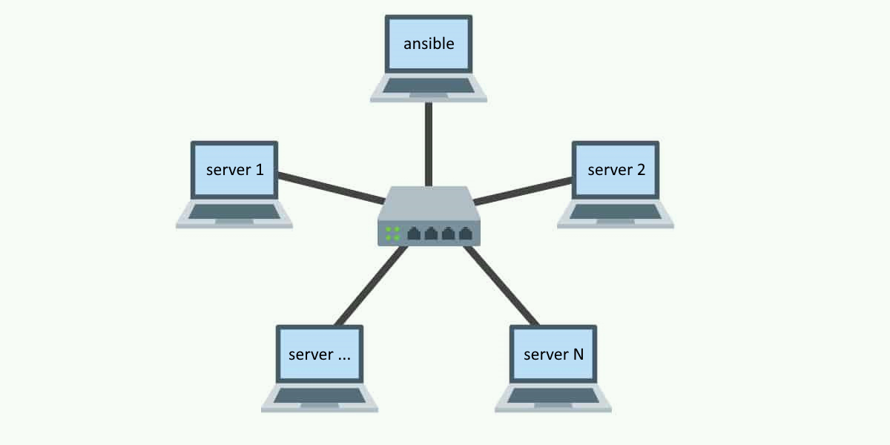
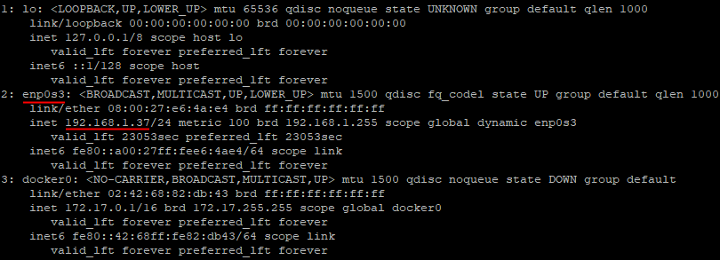
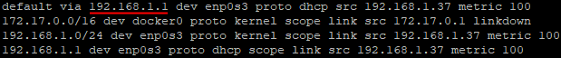
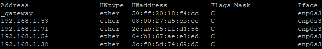

# Ansible. Ручной запуск модулей. Playbook

### Подготовка виртуальных машин

1. Нам понадобится две чистые виртуальные машины. Если у вас дефицит дискового пространства, то ВМ из предыдущих работ можно удалить, здесь они нам не понадобятся.  
   На одной из виртуальных машин будет размещаться ansible, поэтому я её так и назову - "Ansible", а вторая будет просто "коробкой" для других виртуальных машин, которыми мы будем управлять при помощи ansible, поэтому я назову её "Internet" (имена можете выбрать по своему вкусу).  
   По итогу, с точки зрения сети, мы хотим получить такую топологию:
   
   
   
2. Создайте две виртуальные машины с Ubuntu Server . В процессе установки используйте стандартные настройки. Из дополнительного софта понадобится только ssh-сервер.  
   Для машины с именем "Internet" создайте диск большого объёма 50+ГБ.
3. В настройках сети VirtualBox установите "Сетевой мост" для обеих машин.

#### Машина с Ansible

Установим Ansible согласно инструкции с [оф сайта](https://docs.ansible.com/ansible/latest/installation_guide/intro_installation.html).

1. Для удобства дальнейшей работы, подключитесь к машине по ssh.
2. Добавьте в список dns-серверов гугловский (8.8.8.8) и(или) яндексовый (77.88.8.8).
3. Обновите индексы пакетов: `sudo apt-get update`.
4. Проверьте, что в системе установлен python 3: `python3 --version`. Если нет, установите.
5. Проверьте, что в системе установлен pip: `python3 -m pip -V`. Если нет, установите.
6. Установите последнюю доступную версию ansible: `python3 -m pip install --user ansible`.  
   Флаг `--user` установит пакет ansible как локальный, т.е. ansible будет доступен только текущему пользователю.
7. После установки выскочит предупреждение, что запустить ansible по имени не получится, т.к. каталог в который он установился (`~/.local/bin`) не добавлен в `PATH`.   
   Нам не придётся делать это вручную, т.к. путь `~/.local/bin` будет добавлен в `PATH` автоматически после перезагрузки или перелогина. Вместо перезагрузки можно выполнить команду `source ~/.profile`, что вызовет принудительное обновление `PATH`.
8. Теперь убедитесь, что ansible установился: `ansible --version`.  
   В результате вы увидите довольно подробный вывод о самой версии ansible, о путях к конфигам, версии python и т.д.

#### Машина с Docker Compose

Нaстроим вторую виртуальную машину таким образом, чтобы иметь возможность быстро развернуть внутри неё большое количество легковесных виртуальных машин.  Для этих целей удобно использовать docker и docker compose.

Установим docker и docker compose согласно инструкции с [оф сайта](https://docs.docker.com/engine/install/ubuntu/).

1. Для удобства дальнейшей работы, подключитесь к машине по ssh например при помощи KiTTY.

2. Добавьте в список dns-серверов гугловский (8.8.8.8) и(или) яндексовый (77.88.8.8).

3. Обновите индексы пакетов: `sudo apt-get update`.

4. Устанавливать docker и docker compose будем из официальных репозиториев Docker (копируйте команды построчно, до конечного `\`, если он есть):

   - Установим некоторые нужные пакеты:

     ```bash
     sudo apt-get install ca-certificates curl
     ```
     
   - Добавим официальный ключ для доступа к репозиторию Docker:

     ```bash
     sudo install -m 0755 -d /etc/apt/keyrings
     sudo curl -fsSL https://download.docker.com/linux/ubuntu/gpg -o /etc/apt/keyrings/docker.asc
     sudo chmod a+r /etc/apt/keyrings/docker.asc
     ```
     
   - Следующая команда настроит репозиторий:

     ```bash
     echo \
       "deb [arch=$(dpkg --print-architecture) signed-by=/etc/apt/keyrings/docker.asc] https://download.docker.com/linux/ubuntu \
       $(. /etc/os-release && echo "$VERSION_CODENAME") stable" | \
       sudo tee /etc/apt/sources.list.d/docker.list > /dev/null
     ```
     
   - После добавления репозитория обновим индексы пакетов:

     ```bash
     sudo apt-get update
     ```

   - Теперь установим docker и docker compose:

     ```bash
     sudo apt-get install docker-ce docker-ce-cli containerd.io docker-buildx-plugin docker-compose-plugin
     ```

   - Добавьте текущего пользователя в группу docker:
     
     ```bash
     sudo usermod -aG docker $USER
     ```
     
   - Перезагрузите сервер или перелогиньтесь;
     
   - Проверьте, что установка прошла успешно:
     
     ```bash
     docker compose version
     ```
     
     В данном случае мы установили плагин "compose" для docker, но есть и отдельный пакет "docker-compose" (как видно разница в наличии `-`). На данный момент он считается устаревшим.

### Подготовка инфраструктуры

Приложение, которое мы будем разворачивать будет использовать следующую конфигурацию:


В данном случае мы можем, условно, разделить все сервера на 3 группы:

- Сервер с балансировщиком нагрузки. Распределяет пользователей по рабочим серверам, чтобы не перегружать какой-то один;
- Рабочие сервера. На каждом из них присутствует своя копия приложения;
- Сервер с базой данных. По хорошему нагрузку на базу данных тоже нужно балансировать, но это сильно усложнит задачу, т.к. кроме балансировки, нужно ещё и обеспечивать их синхронизацию.

Все сервера будут основаны на Ubuntu и кроме возможности доступа по ssh никакого дополнительного софта на них установлено не будет, по крайней мере в начале.

Вместо реальных серверов или полновесных виртуальных машин воспользуемся возможностями docker и docker compose. Т.е. конфигурация описанная выше будет развёрнута при помощи docker-контейнеров.  
В качестве базового образа воспользуемся [rastasheep/ubuntu-sshd](https://hub.docker.com/r/rastasheep/ubuntu-sshd). Как указано на странице образа ssh-сервер запущен на порту 22, разрешён доступ под root, пароль от пользователя root - root.

#### Создаём сервера

Прежде, чем приступить к созданию серверов, нужно собрать некоторые сведения о сети. Чтобы дать контейнерам доступ наружу (к роутеру) так, как будто каждый из них реальный компьютер, мы создадим docker-сеть с драйвером `ipvlan`. Для настройки этого драйвера, нам нужно знать имя сетевого интерфейса, через который виртуальная машина подключена к роутеру, адрес подсети, к которой мы хотим подключится и gateway, чтобы иметь возможность выйти из сети наружу (например в интернет).

1. Выполните команду `ip a` и найдите **сетевой интерфейс**, который подключён к вашему роутеру.

   

   Здесь же можно определить адрес подсети. После ip-адреса машины указано `/24` - это маска подсети. Она говорит о том, что первые 24 бита ip-адреса фиксированы (т.е. первые 3 числа), а оставшиеся 8 бит (т.е. последнее число) могут изменяться. Очевидно что в такой подсети есть всего 256 различных ip-адресов, два из которых служебные: `192.168.1.255` - занят под broadcast (для отправки пакета всем в подсети) и `192.168.1.0` - который и называется **адресом подсети**.

2. Выполните команду `ip r` и найдите `default`. Этот ip - **gateway** (в нашем случае это ip роутера).

   

3. Теперь нужно посмотреть занятые ip адреса в нашей локальной сети. Это нужно, чтобы выбрать диапазон свободных для наших серверов.  
   Установите утилиту `arp` при помощи команды: `sudo apt install net-tools`, а затем выполните `arp -e`.  IP-адреса из списка заняты.

   

   Список скорее всего будет не полным, т.к. он содержит только те IP к которым обращалась ваша машина или которые обращались к ней.
   
4. Чтобы уточнить список воспользуемся утилитой `nmap`. Установите её (`sudo apt-get install nmap`) и попросите просканировать все ip в сети (`sudo nmap -Pn 192.168.1.0/24`). К сожалению, при помощи `nmap` тоже не всегда можно получить полный список занятых адресов, т.к. некоторые устройства могут временно отключаться от сети для экономии батарее и т.д.  
   Точный способ узнать занятые IP - посмотреть их в web-интерфейсе роутера.

Теперь воспользуемся docker compose чтобы создать сервера. Для начала пропишем в нём только один сервер.

1. На сервере с docker compose создайте файл `compose.yaml` и откройте его в текстовом редакторе.

2. Поместите в него следующий текст (с учётом ваших параметров сети):

   ```yaml
   services:
     test: # Так я назвал сервис
       image: rastasheep/ubuntu-sshd # Тот самый базовый образ
       dns:
         - 77.88.8.8 # Яндексовый
         - 8.8.8.8   # Гугловый
       networks:
         outside:
           ipv4_address: 192.168.1.100 # Свободный ip из нашей подсети
   
   # Здесь создаём docker-сеть
   networks:
     outside: # Так я назвал сеть
       driver: ipvlan
       driver_opts:
         parent: enp0s3 # Сетевой интерфейс
       ipam:
         config:
           - subnet: 192.168.1.0/24 # Адрес подсети и маска
             gateway: 192.168.1.1
   ```
   
   Как видно по описанию создаётся одна машина и одна сеть.
   
3. Наберите в терминале:

   ```bash
   docker compose up -d
   ```

   В результате, docker compose найдёт файл `compose.yaml` в текущей папке, создаст сеть `outside` и запустит машину `test` в фоновом режиме (`-d`), т.е не захватывая терминал и не выводя логи.

4. Проверьте, что к этой машине можно подключится как и к любой другой, например при помощи KiTTY (ip, port и пользователь вам известны).

5. Наберите в терминале:

   ```bash
   docker compose down
   ```

   В результате, docker compose остановит машину и удалит созданные им контейнер и сеть.  
   **Внимание:** после остановки машины будут уничтожены и все изменения, которые в них были сделаны тоже исчезнут. Если хотите приостановить машины на время, без удаления, используйте `docker compose stop` и для последующего возобновления работы `docker compose start`. После остановки все запущенные на машине процессы тоже будут остановлены, но файлы и установленный софт останется.

Модифицируем файл таким образом, чтобы создать 3 машины: одну под - балансировщик нагрузки, вторую под базу данных и третью под приложение (пока одну, затем их будет больше).

1. Откройте файл `compose.yaml` и поместите следующий текст (с учётом ваших параметров сети):

   ```yaml
   services:
     load_balancer: # Балансировщик нагрузки
       image: rastasheep/ubuntu-sshd
       dns:
         - 77.88.8.8
         - 8.8.8.8
       networks:
         outside:
           ipv4_address: 192.168.1.100
           
     db: # База данных
       image: rastasheep/ubuntu-sshd
       dns:
         - 77.88.8.8
         - 8.8.8.8
       networks:
         outside:
           ipv4_address: 192.168.1.200
           
     worker: # Сервер с приложением
       image: rastasheep/ubuntu-sshd
       dns:
         - 77.88.8.8
         - 8.8.8.8
       networks:
         outside:
           ipv4_address: 192.168.1.101
   
   
   networks:
     outside:
       driver: ipvlan
       driver_opts:
         parent: enp0s3
       ipam:
         config:
           - subnet: 192.168.1.0/24
             gateway: 192.168.1.1
   ```
   
   Запомните ip-адреса серверов, они будут нужны ansible.
   
2. Запустите машины командой: `docker compose up -d` и на некоторое время мы перейдём на машину с ansible.

### Соединяем Ansible с управляемыми машинами

Одно из преимуществ ansible заключается в том, что на управляемые сервера не нужно устанавливать дополнительный софт, достаточно просто иметь к ним доступ.

Основным понятием в ansible является инвентарь (inventory). Инвентарь - это список управляемых серверов. По умолчанию файл инвентаря называется "hosts" и полный путь к нему "/etc/ansible/hosts".

1. Выполните команду:

   ```bash
   ansible-inventory --list
   ```

   В результате вы увидите всю информацию по управляемым серверам в текущем инвентаре. Сейчас там пусто.

Изменить стандартный путь к инвентарю можно при помощи конфига ("ansible.cfg"). Файлы конфига могут лежать в разных местах, но тот, что лежит в текущей папке имеет [приоритет](https://docs.ansible.com/ansible/latest/reference_appendices/config.html#generating-a-sample-ansible-cfg-file).

2. Выполните команду:

   ```bash
   ansible --version | grep config
   ```

   Вы увидите, что на данный момент конфиг не задан.

2. Создайте каталог "app" и в нём "ansible", затем перейдите туда. Это не какие-то специальные названия, просто чтобы была понятная структура.

3. Создайте файл "ansible.cfg" содержащий:
   
   ```ini
   [defaults]
   inventory = ./hosts
   ```

   Здесь мы говорим, что инвентарь находится в текущем каталоге в файле "hosts".
   
4. Снова выполните команду:

   ```bash
   ansible --version | grep config
   ```

   Вы увидите, что ansible подхватил наш конфиг. Если создать файл "ansible.cfg" в другой папке и перейти туда, то ansible будет использовать как конфиг уже его.

5. В конфиге мы указали, что файл инвентаря лежит в той же папке, что и конфиг и называется "hosts". Обычно так и поступают, но технически можно было положить инвентарь в другое место.

6. Создайте этот файл и напишите в нём следующее (только ip-адреса укажите свои):

   ```ini
   load_balancer ansible_host=192.168.1.100 ansible_user=root ansible_password=root
   db ansible_host=192.168.1.200 ansible_user=root ansible_password=root
   worker ansible_host=192.168.1.101 ansible_user=root ansible_password=root
   ```

   Здесь перечислены наши управляемые сервера. Сначала название (может быть любым), а затем параметры для подключения.

7. Убедитесь, что ansible подхватил информацию о хостах: `ansible-inventory --list`.

8. Попробуем подключится к ним.  
   Ansible может выполнять команды в двух режимах: одиночная команда (ad hoc) или сценарий (play). Общий вид запуска одиночной команды выглядит так:

   ```bash
   ansible [pattern] -m [module] -a "[module options]"
   ```

   Здесь `[pattern]` - это группа или группы серверов, из текущего инвентаря, для которых нужно запустить команду; ключ `-m` говорит, что нужно запустить модуль (команду) с именем `[module]`; ключ `-a` принимает параметры команды. Параметры могут быть просто текстом, набором значений вида key=value, или json-строкой начинающейся с `{` и заканчивающейся `}`.

   Для того, чтобы проверить соединение и работоспособность сервером используется модуль `ping`. Выполните команду:

   ```
   ansible all -m ping
   ```

9. В итоге вы должны были получить ошибку, т.к. для авторизации по паролю нужен дополнительный пакет: `sshpass`. Установите его при помощи `apt` и повторите `ping`.

10. В этот раз текст ошибки должен измениться. Суть ошибки в том, что мы не подтвердили, что доверяем этим серверам (в работе №2 мы отвечали yes при первом подключении). Для решения этой проблемы есть 2 основных способа:

    - Подключится к каждому серверу по отдельности и подтвердить доверие;
    - Сказать ansble подключатся к серверам без проверки их публичного ключа.  
      Мы выберем этот вариант, т.к. он проще, но в реальных проектах отключать проверку подлинности удалённых серверов не следует.

    Добавьте в "ansible.cfg" строку: `host_key_checking = false` и повторите `ping`.

11. В этот раз подключение должно быть успешно, и все три сервера должны ответить "pong".

На данный момент у нас следующая структура каталогов:

```bash
app
 └── ansible
     ├── ansible.cfg
     └── hosts
```

### Разделение на группы

Как правило количество машин, которыми управляет ansbible гораздо больше 3х, при этом разные машины выполняют различные задачи. Для того, чтобы не запускать команду для каждого сервера по отдельности в ansible существует механизм группировки машин.

Каждая машина может принадлежать любому количеству групп. По умолчанию существует группа `all` куда входят все машины перечисленные в инвентаре и группа `ungrouped` - для всех машин, которые входят только в группу `all`.

1. Откройте файл "hosts" и замените его на (со своими ip):

   ```ini
   load_balancer ansible_host=192.168.1.100 ansible_user=root ansible_password=root
   db ansible_host=192.168.1.200 ansible_user=root ansible_password=root
   
   [workers]
   worker ansible_host=192.168.1.101 ansible_user=root ansible_password=root
   ```

   Теперь сервер "worker" принадлежит к группам: `all` и `workers`, а остальные два к группам: `all` и `ungrouped`.

2. Перейдите на виртуальную машину с docker compos, остановите запущенные машины и добавьте в "compose.yaml" ещё 3 машины. В моём случае это будет выглядеть так:

   ```yaml
   services:
     load_balancer: # Балансировщик нагрузки
       image: rastasheep/ubuntu-sshd
       dns:
         - 77.88.8.8
         - 8.8.8.8
       networks:
         outside:
           ipv4_address: 192.168.1.100
           
     db: # База данных
       image: rastasheep/ubuntu-sshd
       dns:
         - 77.88.8.8
         - 8.8.8.8
       networks:
         outside:
           ipv4_address: 192.168.1.200
           
     worker1: # Сервер с приложением
       image: rastasheep/ubuntu-sshd
       dns:
         - 77.88.8.8
         - 8.8.8.8
       networks:
         outside:
           ipv4_address: 192.168.1.101
           
     worker2: # Сервер с приложением
       image: rastasheep/ubuntu-sshd
       dns:
         - 77.88.8.8
         - 8.8.8.8
       networks:
         outside:
           ipv4_address: 192.168.1.102
   
     worker3: # Сервер с приложением
       image: rastasheep/ubuntu-sshd
       dns:
         - 77.88.8.8
         - 8.8.8.8
       networks:
         outside:
           ipv4_address: 192.168.1.103
           
     worker4: # Сервер с приложением
       image: rastasheep/ubuntu-sshd
       dns:
         - 77.88.8.8
         - 8.8.8.8
       networks:
         outside:
           ipv4_address: 192.168.1.104 
   
   networks:
     outside:
       driver: ipvlan
       driver_opts:
         parent: enp0s3
       ipam:
         config:
           - subnet: 192.168.1.0/24
             gateway: 192.168.1.1
   ```
   
3. Запустите машины и вернитесь на сервер с ansible.

4. Т.к. у нас появилось несколько новых машин, нам нужно добавить их в инвентарь.  
   Снова откройте файл "hosts" и замените его на (со своими ip):

   ```ini
   load_balancer ansible_host=192.168.1.100 ansible_user=root ansible_password=root
   db ansible_host=192.168.1.200 ansible_user=root ansible_password=root
   
   [prod]
   worker1 ansible_host=192.168.1.101 ansible_user=root ansible_password=root
   worker2 ansible_host=192.168.1.102 ansible_user=root ansible_password=root
   worker3 ansible_host=192.168.1.103 ansible_user=root ansible_password=root
   
   [staging]
   worker4 ansible_host=192.168.1.104 ansible_user=root ansible_password=root
   
   [workers:children]
   prod
   staging
   ```

   Теперь машина "worker4" принадлежит к группам: `all`, `staging`, `workers`, а машины "worker1"-"worker3" - к группам `all`, `prod`, `workers`.

5. Проверьте, что машины доступны при помощи модуля ansible `ping`. Прошпигуйте все воркеры и только те, которые находятся в группе "prod".

**Примечание:** вообще говоря, для staging воркера нужна отдельная база данных (чтобы не смешивать экспериментальные данные с реальными), но для упрощения конфигурационных файлов мы не будем её создавать.

### Начальное конфигурирование управляемых машин

#### Заменяем репозитории пакетов

Сервера которыми мы будем в дальнейшем управлять через ansible были созданы из образа "rastasheep/ubuntu-sshd", a там  указаны официальные репозитории пакетов, но т.к. мы под санкциями, официальные репозитории пакетов Ubutnu могут быть не доступны (периодически отваливаться или вообще не отвечать), поэтому заменим их на зеркала от Яндекса.

Для этого достаточно в файле "/etc/apt/sources.list" заменить строки "archive.ubuntu.com" и "security.ubuntu.com" на "mirror.yandex.ru". Выполним это на всех серверах пи помощи модуля [`shell`](https://docs.ansible.com/ansible/latest/collections/ansible/builtin/shell_module.html), который позволяет выполнить любую команду так, как будто вы её набрали в терминале:

```bash
ansible all -m shell -a "cp /etc/apt/sources.list /etc/apt/sources.list~"
ansible all -m shell -a "sed -i 's|archive.ubuntu.com|mirror.yandex.ru|g' /etc/apt/sources.list"
ansible all -m shell -a "sed -i 's|security.ubuntu.com|mirror.yandex.ru|g' /etc/apt/sources.list"
```

Первая команда просто делает копию файла "/etc/apt/sources.list", на случай, если что-то пойдёт не так. Последние 2 команды (`sed`) выполняют поиск и замену текста.

#### Изменяем способ доступа к серверам

Перед выполнением этого пункта создадим копию инвентаря с теми настройками, которые там сейчас есть (т.е. этот инвентарь позволяет подключатся к серверам с дефолтными настройками). Это нужно на случай, если в дальнейшем что-то пойдёт не по плану и придётся начать с начала:

1. Выполните команду:  
   ```bash
   cp hosts hosts_root
   ```

2. Проверьте, что копирование файла прошло успешно. Для этого пропингуйте все сервера командой:

   ```bash
   ansible -i hosts_root all -m ping
   ```

   Здесь ключ `-i` позволяет указать инвентарь который ansible должен использовать для выполнения команды.

На данный момент на все наши сервера можно зайти под root это плохо с точки зрения безопасности. Исправим это, т.е. создадим нового пользователя и запретим вход под root. Для начала выполним это только на одной машине - "worker4" (группа "staging").

3. Обновим индексы apt-пакетов на сервере, для этого будем использовать модуль ansible [`apt`](https://docs.ansible.com/ansible/latest/collections/ansible/builtin/apt_module.html):

   ```bash
   ansible staging -m apt -a "update_cache=yes"
   ```

4. Установим пакет `sudo` (да, это отдельный пакет, а не встроенная команда):

   ```bash
   ansible staging -m apt -a "name=sudo state=latest"
   ```

   Здесь параметр `name` указывает с каким пакетом нужно выполнить действие; параметр `state` указывает, что пакет должен быть установлен (обновлен до последней версии).  Если выполнить эту команду повторно, то вы увидите, что вывод изменился и в нем указано, что никаких изменений команда не вызвала (`"changed": false`).  
   Эту и предыдущую команду можно было выполнить одновременно, просто объединив список параметров.

5. По умолчанию новые пользователи обладают минимальными правами, чтобы дать возможность пользователю повышать свои привилегии при помощи `sudo` он или группа в которой он состоит должны быть записаны в файле "/etc/sudoers" с указанием доступных привилегий.  
   Создадим новую группу с названием "ansible" при помощи модуля [`group`](https://docs.ansible.com/ansible/latest/collections/ansible/builtin/group_module.html):

   ```bash
   ansible staging -m group -a'name=ansible state=present'
   ```

6. Разрешим пользователям из этой группы выполнять любые команды, при этом без необходимости вводить пароль (нужно для ansible).  
   Чтобы случайно не поломать файл "/etc/sudoers" внося в него изменения, мы создадим новый файл в каталоге "/etc/sudoers.d/" (файл "/etc/sudoers" подтягивает все файлы из этого каталога):

   ```bash
   ansible staging -m copy -a"content='%ansible ALL=(ALL:ALL) NOPASSWD:ALL' dest=/etc/sudoers.d/ansible validate='/usr/sbin/visudo -cf %s'"
   ```

   Здесь мы используем модуль [`copy`](https://docs.ansible.com/ansible/latest/collections/ansible/builtin/copy_module.html), который копирует в файл по пути `dest` текст `content` и затем запускает команду указанную в параметре `validate`. Если `validate` завершится ошибкой, то копирование не произойдёт. В данном случае `validate` обращается к специальной программе "visudo", которая предназначена для проверки синтаксиса и безопасного редактирования файла "sudoers" и просит её проверить `-c` содержимое некоторого файла `-f` с именем, который передаст ему модуль `%s` (здесь будет имя временного файла).

7. Теперь настало время создать пользователя под которым в дальнейшем будет работать ansible:

   ```bash
   ansible staging -m user -a"name=ansible shell=/bin/bash groups=ansible append=yes password={{ '123' | password_hash('sha512') }} update_password=on_create"
   ```

   Здесь мы используем модуль [`user`](https://docs.ansible.com/ansible/latest/collections/ansible/builtin/user_module.html) который создаёт пользователя с именем `name`, назначает ему командную оболочку `shell` и добавляет группу(ы) `groups` (`append=yes` иначе будет замена групп). Кроме того, пользователю при создании (`update_password=on_create`) назначается пароль **хэш** которого указан в `password`.  
   Для расчёта хэша здесь используется модуль [`password_hash`](https://docs.ansible.com/ansible/latest/collections/ansible/builtin/password_hash_filter.html), которому на вход, стандартным образом, передаётся строка с паролем. Результат всего этого выражения подставляется как значение параметра `password` (для этого используются двойные фигурные скобки).

8. Настроим на машинах из группы "staging" доступ под пользователем "ansible" по ключу.  
   Для этого первым делом нам нужна пара приватный/публичный ключ которую мы будем использовать для доступа. В принципе на нашем сервере уже есть такая пара (она была создана при установке ssh-сервера), но мы создадим ещё одну.

   - В текущем каталоге ("~/app/ansible") создайте папку "keys" и перейдите в неё.

   - Создайте новый ключ (на все вопросы можно нажимать Enter):

     ```bash
     ssh-keygen -t rsa -b 4096 -f ansible_key
     ```

     В результате, в текущей папке будет сгенерирована пара ключей с именем "ansible_key" и "ansible_key.pub" (`-f` используется для указания пути). Тип ключей: "rsa" длина:  4096 бит.

   - Добавим на сервера группы "staging" наш публичный ключ в файл "~/.ssh/authorized_key" с помощью модуля [`authorized_key`](https://docs.ansible.com/ansible/latest/collections/ansible/posix/authorized_key_module.html):

     ```bash
     ansible staging -m authorized_key -a"user=ansible key=\"{{ lookup('file', '/home/' + lookup('env', 'USER') + '/app/ansible/keys/ansible_key.pub') }}\""
     ```

     Здесь мы добавляем ключ в authorized_key пользователя `user`, указывая путь к нашему публичному ключу при помощи параметра `key`.  
     В параметре `key` можно было бы указать просто полный путь без всяких ухищрений, но в данном примере мы дополнительно используем модуль [`lookup`](https://docs.ansible.com/ansible/latest/plugins/lookup.html), чтобы убедится, что файл существует (`lookup('file', путь_к_файлу)`), кроме того, сам путь к файлу собирается из трёх строк по той причине, что в параметрах модулей ansible не возможно сослаться на домашнюю директорию при помощи тильды (`~`) и нельзя обратиться к переменным окружения (например: `$USER`), поэтому мы снова используем `lookup`, чтобы найти имя текущего пользователя в переменных окружения (`lookup('env', имя_переменной)`).

9. Отключим пользователю "root" пароль, чтобы ни у кого не было возможности залогинится под ним:

   ```bash
   ansible staging -m user -a"name=root password='*' update_password=always"
   ```

   В данном случае, чтобы отключить пароль мы используем зарезервированный пароль `*` или `!`. Параметр `update_password` показываем, что мы хотим менять пароль пользователю всегда, если он отличится (это значение по умолчанию, поэтому данный параметр можно было и не указывать).

10. Подождите несколько минут и запустите пинг **всех** серверов (через ansible). Вы должны увидеть, что сервер из группы "staging" не ответит.

11. Внесём изменения в файл "hosts", чтобы наладить связь с сервером.  
    Откройте "hosts" в текстовом редакторе и для "worker4" (т.к. он один у нас в группе "staging") замените `ansible_user=root` на `ansible_user=ansible` и `ansible_password=root` на `ansible_ssh_private_key_file=keys/ansible_key`.  
    Здесь путь к приватному ключу указан относительно расположения файла "hosts".

12. Убедитесь, что теперь все сервера отвечают на `ping`.

На данный момент у нас следующая структура каталогов:

```bash
app
  └── ansible
      ├── ansible.cfg
      ├── hosts
      ├── hosts_root
      └── keys
          ├── ansible_key
          └── ansible_key.pub
```

#### Пишем сценарий

Более удобная и переиспользуемая альтернатива ручным командам - это сценарии (play). Сценарии размещаются в соответствующих файлах в yaml формате (palybook.yaml).

Как вы увидите дальше, команды в palybook-ах в точности совпадают с ad hoc командами за исключением записи их в yaml-формате.

1. Создайте в каталоге "~/app/ansible" файл "ping.yaml";

2. Добавьте в файл следующие строки:

   ```bash
   - name: Ping all servers
     hosts: all
   ```

   Здесь мы пишем название сценария `name`, затем указываем на каких хостах он должен выполнятся `hosts`.

3. Теперь добавим непосредственно команды:

   ```bash
     tasks:
     - name: Ping all servers
       ping:
   ```

   **Внимание:** элемент `tasks` должен находится на том же уровне отступа, что и `name` и `hosts`, а у самих тасков отступ должен быть больше (они вложены в `tasks`). Для отступов разрешается использовать только пробелы.  
   Здесь, мы указали, что нужно выполнить модуль `ping`. `name` в данном случае не обязателен и если его не указать, то в логах, в качестве названия задачи, будет использовано имя модуля.

4. Запустите palybook при помощи команды:

   ```bash
   ansible-playbook ping.yaml
   ```
   
   Этот palybook будет использовать инвентарь указанный в "ansible.cfg", но при помощи ключа `-i` можно будет указать другой.

Теперь напишем palybook который будет делать ровно тоже, что мы делали руками в предыдущем разделе:

1. Создайте в каталоге "~/app/ansible" файл "setup.yaml";

2. Добавьте в файл следующие строки:

   ```bash
   - name: Change access from root to ansible user and apt-package update servers
     hosts: all
     become: yes
   ```

   Здесь появился новый параметр - `become`. Он говорит, что команды нужно выполнять от имени некоторого пользователя (по умолчанию `root`). Воспринимайте его просто как `sudo`. В ad hoc командах аналогом является флаг `-b`, но мы его не использовали, т.к. и так работали от рута. В дальнейшем мы будем использовать пользователя "ansible", поэтому этот параметр нужен.

3. Теперь добавим непосредственно команды. Сравните ad hoc команды из предыдущего раздела с их вариантами в palybook:

   ```bash
     tasks:
       - name: Change apt-package update servers
         shell: |  # | в yaml означает, что далее многострочный текст
           sed -i 's|archive.ubuntu.com|mirror.yandex.ru|g' /etc/apt/sources.list
           sed -i 's|security.ubuntu.com|mirror.yandex.ru|g' /etc/apt/sources.list
       - name: Install sudo
         apt:
           name: sudo
           state: latest
           update_cache: yes   # Перед установокой зделает update
       - name: Create group ansible
         group:
           name: ansible
           state: present
       - name: Add group to sudoers
         copy:
           content: '%ansible ALL=(ALL:ALL) NOPASSWD:ALL'
           dest: /etc/sudoers.d/ansible
           validate: '/usr/sbin/visudo -cf %s'
       - name: Create user ansible and add to ansible group
         user:
           name: ansible
           shell: /bin/bash
           groups: ansible
           append: yes
           password: "{{ '123' | password_hash('sha512') }}"
           update_password: on_create
       - name: Set ssh authorized key
         authorized_key:
           user: ansible
           key: "{{ lookup('file', '/home/' + lookup('env', 'USER') + '/app/ansible/keys/ansible_key.pub') }}"
       - name: Set empty root password
         user:
           name: root
           password: '*'
           update_password: always
   ```

   Обратите внимание, что большинство параметров указано без кавычек, но если в параметре присутствует `{{ выражение }}`, то его нужно брать в кавычки `"{{ выражение }}"`

4. Запустите palybook и дождитесь его завершения. В логах вы должны увидеть, что на всех серверах кроме "worker4" на каждом этапе происходили изменения (changed), а на "worker4" изменений не было (ok).

5. Подождите несколько минут и запустите "ping.yaml". Теперь, все сервера, кроме "worker4" перестали отвечать, т.к. в hosts указаны данные для пользователя root.

6. Поправьте файл hosts и убедитесь, что теперь все сервера на связи.

### Установка необходимого софта

В этом разделе мы установим на сервера весь необходимый софт и выполним его настройку.

#### Установка софта на сервер базы данных

Установим сервер базы данных masql.

1. Создайте в каталоге "~/app/ansible" файл "install_mysql.yaml";
2. Добавьте в файл следующие строки:

   ```bash
   - name: Install_mysql
     hosts: db
     become: yes
   
     tasks:
       - name: Install pip
         apt:
           name: python3-pip
           state: latest
       - name: Install PyMySQL
         shell:
           cmd: python3 -m pip install PyMySQL
   ```
   
   Здесь параметр `hosts` задан как "db", чтобы ограничить установку только сервером предназначенным для базы данных.  
   На втором шаге используется модуль [`shell`](https://docs.ansible.com/ansible/latest/collections/ansible/builtin/shell_module.html) для запуска команды установки python-пакета "PyMySQL". Этот пакет должен стоять на управляемом сервере для работы ansible-плагина взаимодействующего с базой данных.
   
3. Добавьте в файл следующие строки:

   ```bash
       - name: Install mysql server
         apt:
           name: mysql-server
           state: latest
       - name: Stop mysql server
         sysvinit:
           name: mysql
           state: stopped
   ```
   
   Устанавливаем mysql server, и останавливаем процесс на случай, если он запустился автоматически.
   
4. Добавьте в файл следующие строки:

   ```bash
       - name: Copy credentials file to home directory
         copy:
           src: /etc/mysql/debian.cnf
           remote_src: true
           dest: /home/ansible/.my.cnf
       - name: Create ansible credentials file
         copy:
           src: /etc/mysql/debian.cnf
           remote_src: true
           dest: /home/ansible/.my_ansible.cnf
       - name: Remane user and password items
         shell: |
           sed -i "s/user/login_user/g" /home/ansible/.my_ansible.cnf
           sed -i "s/password/login_password/g" /home/ansible/.my_ansible.cnf
   ```
   
   Здесь мы копируем файл с логином и паролем от пользователя mysql по умолчанию ("debian-sys-maint") в домашнюю директорию пользователя "ansible" под именем ".my.cnf". Исходный файл был создан mysql во время установки.  Данный файл будет использоваться mysql-сервером при попытке подключится к базе данный через mysql-клиент непосредственно с сервера (например если зайти на него по ssh). В работе мы не будем использовать эту возможность, но на практике бывает необходимость заглянуть в базу данных.  
   Дополнительно мы создаём файл ".my_ansible.cnf". Он будет использоваться модулями ansible для доступа к базе данных в том случае, если мы не укажем логин и пароль в playbook-е. Если не указать данные вручную и не создать файл вы получите ошибку, т.к. плагин попытается зайти на БД под "root" и без пароля. В ранних версия mysql так можно было, но в новых изменили правила безопасности.
   
4. Добавьте в файл следующие строки:

   ```yaml
       - name: Allow bind to all hosts
         shell:
           cmd: sed -i -r "s/bind-address\s{1,}= 127.0.0.1/bind-address = 0.0.0.0/" /etc/mysql/mysql.conf.d/mysqld.cnf
       - name: Started and enabled mysql server
         sysvinit:
           name: mysql
           state: started
           enabled: yes
   ```
   
   Изменяем в конфиге "/etc/mysql/mysql.conf.d/mysqld.cnf" значение параметра "bind-address" на `0.0.0.0`, чтобы mysql принимал подключения с любых хостов. По умолчанию указано `127.0.0.1`, чтобы к базе данных можно было подключится только с того компьютера на котором она установлена.
   
5. Добавьте в файл следующие строки:

   ```yaml
       - name: Create database user
         mysql_user:
           config_file: /home/ansible/.my_ansible.cnf # Логин и пароль для входа в БД
           name: db_user_for_app        # Логин нового пользователя
           password: 123                # Пароль нового пользователя
           host: '%'                    # Разрешаем заходить с любых хостов
           priv: '*.*:ALL'              # Даём пользователю все привилегии
           state: present               # Создать
   ```
   
   Здесь мы используем модуль [`mysql_user`](https://docs.ansible.com/ansible/latest/collections/community/mysql/mysql_user_module.html) чтобы создать нового пользователя для доступа к базе данных из нашего будущего приложения.
   
7. Запустите плейбук и дождитесь завершения.

#### Установка софта на рабочие сервера

Теперь установим ПО необходимо для работы приложения. Т.к. приложение написано на python, то нам нужен сам интерпретатор и `pip`. Чтобы не конфликтовать с присутствующей на сервере версией интерпретатора приложение будем запускать в виртуальном окружении (поэтому ещё понадобится `venv`).

1. Создайте в каталоге "~/app/ansible" файл "install_worker_soft.yaml";

2. Добавьте в файл следующие строки (с учётом своих ip-адресов):

   ```bash
   - name: Install worker soft
     hosts: workers
     become: yes
     
     tasks:
       - name: Install python3 pip venv git
         apt:
           name:
             - python3.8
             - python3-pip
             - python3.8-venv
             - git
           state: latest
           update_cache: yes
       - name: Clone Git repository
         git:
           repo: 'https://github.com/VladimirChabanov/url_extender.git'
           dest: /home/ansible/url_extender
           force: yes
       - name: Set data to app config
         shell: |
           sed -i 's/db_host/"192.168.1.200"/' /home/ansible/url_extender/src/config.py
           sed -i 's/user/"db_user_for_app"/' /home/ansible/url_extender/src/config.py
           sed -i 's/passworld/"123"/' /home/ansible/url_extender/src/config.py
           sed -i 's/database/"main"/' /home/ansible/url_extender/src/config.py
           sed -i 's/retries/3/' /home/ansible/url_extender/src/config.py
           sed -i 's/host/"192.168.1.100"/' /home/ansible/url_extender/src/config.py
           sed -i 's/port/80/' /home/ansible/url_extender/src/config.py
       - name: Create virtual env
         shell: python3.8 -m venv venv
       - name: Install requirements into virtual env
         shell: |
           source venv/bin/activate
           pip install --upgrade setuptools wheel pip
           pip install -r /home/ansible/url_extender/requirements.txt
         args:
           executable: /bin/bash
       - name: Run app
         shell: |
           source venv/bin/activate
           if [ -f app_pid ]; then kill -9 `echo app_pid` 2>/dev/null; fi
           nohup python /home/ansible/url_extender/src/run.py </dev/null >/dev/null 2>&1 &
           echo $! > app_pid
         args:
           executable: /bin/bash
   ```
   
   Здесь параметр `hosts` задан как "workers", чтобы playbook исполнялся только на рабочих серверах.  
   Здесь мы клонируем репозиторий на сервер, "в лоб" заменяем данные конфига приложения на свои (да, это костыль),  создаём виртуальное окружение и устанавливаем туда зависимости. Для запуска приложения используется довольно хитрая конструкция, чтобы отключить приложение от терминала, иначе оно закроется, как только ansible закончит playbook. Кроме того, `pid` процесса сохраняется в файл "app_pid", чтобы можно было завершать процесс при перезапуске playbook-a.
   
3. Запустите playbook и дождитесь установки.

#### Установка софта на сервер балансировщика нагрузки

Теперь установим ПО необходимое для распределения запросов по рабочим серверам. В нашем случае, разумеется, в этом нет практической необходимости, но для реального проекта возможность масштабирования может быть критически важной. Балансировщик нагрузки позволит увеличить/уменьшить количество рабочих серверов если это вдруг потребуется или в крайнем случае перенаправить пользователей на сайт заглушку.

1. Создайте в каталоге "~/app/ansible" файл "install_haproxy.yaml";

2. Добавьте в файл следующие строки (с учётом своих ip-адресов):

   ```bash
   - name: Install worker soft
     hosts: load_balancer
     become: yes
     
     tasks:
       - name: Install haproxy
         apt:
           name: haproxy
           state: latest
           update_cache: yes
       - name: Stop haproxy
         sysvinit:
           name: haproxy
           state: stopped
       - name: Backup original config
         copy:
           src: /etc/haproxy/haproxy.cfg
           remote_src: yes  # Говорим, что источник тоже на удалённой машине
           dest: /etc/haproxy/haproxy.cfg_bup
           force: false     # Говорим, что НЕ заменять файл, если уже существует
       - name: Restore original config from backup
         copy:
           src: /etc/haproxy/haproxy.cfg_bup
           remote_src: yes
           dest: /etc/haproxy/haproxy.cfg
       - name: Gen Routing (temporary file)
         copy:
           dest: /etc/haproxy/my_routs.cfg
           content: |     # Всё что дальше - попадёт в файл my_routs.cfg
             listen stats
                 bind *:81
                 stats enable
                 stats uri /haproxy_stats
                 stats auth admin:123
                 stats admin if TRUE
             frontend my-web
                 bind 192.168.1.100:80
                 default_backend my-web
             backend my-web
                 balance roundrobin
                 server myweb1 192.168.1.101:80
                 server myweb2 192.168.1.102:80
                 server myweb3 192.168.1.103:80
       - name: Join haproxy.cfg и my_routs.cfg
         shell: |
           cat /etc/haproxy/my_routs.cfg >> /etc/haproxy/haproxy.cfg
       - name: Start and enabled haproxy
         sysvinit:
           name: haproxy
           state: started
           enabled: yes
   ```
   
   Здесь параметр `hosts` задан как "load_balancer", чтобы playbook исполнялся только на сервере предназначенном для балансировщика. 
   
   Порядок действий такой:
   
   - Устанавливаем балансировщик нагрузки "haproxy";
   - Останавливаем его;
   - Делаем копию исходного (неизменённого) конфига. Параметр `force: false` модуля `copy` запретит копирование в случае, если файл уже существует. Таким образом мы можем перезапускать плейбук любое количество раз не опасаясь, что исходный конфиг будет перезаписан.
   - Следующим же шагом мы перезаписываем текущий "haproxy.cfg" из бекапа. Опять же это нужно на случай перезапуска плейбука, чтобы затереть все изменения которые были внесены во время предыдущего запуска.
   - Генерируем вспомогательный файл "my_routs.cfg". Тут прописывается ip и порт источника трафика (раздел frontend), правило балансировки и сервера-приёмники трафика (раздел backend). Кроме того на порт 81 и роут "/haproxy_stats" привязывается страница статистики доступная по логину "admin" и паролю 123.
   - Затем мы приклеиваем  "my_routs.cfg" в основному конфигу и запускаем "haproxy".

#### Проверка работоспособности приложения

Теперь нужно убедится, что приложение развёрнуто на серверах и корректно работает.

1. Откройте браузер на основной операционной системе, или на другом устройстве подключённом к той же сети, и введите ip-адрес сервера "load_balancer" (у меня это `192.168.1.100`).
2. Обновите несколько раз страницу и попробуйте воспользоваться функционалом приложения.
3. Зайдите на страницу "/haproxy_stats" (порт 81) и введите учётные данные.
4. Изучите статистику распределения запросов к рабочим серверам столбец **Sessions** -> **Total** в нижней таблице. Количество запросов ко всем серверам должно быть примерно одинаковым, т.к. установлена политика балансировки `roundrobin` (карусель).

#### Масштабирование приложения

Теперь увеличим количество рабочих серверов.  

1. Перейдите на виртуальную машину с docker compose и остановите запущенные контейнеры;
2. Добавьте в файл compose.yaml дополнительные сервера, таки образом, чтобы *рабочих* серверов было 8;
3. Запустите их при помощи `docker compose up -d`. Все машины будут чистыми с настройками по умолчанию;
4. Добавьте новые сарваера в файл hosts (учтите, что теперь там снова пользователь root), запустите начальное конфигурирование и установку всего необходимого софта;
5. В конфиге балансировщика, в раздел "backend" добавьте новые рабочие сервера;
6. Протестируйте работоспособность приложения, можно просто обновить вкладку раз 20-30;
7. Зайдите на страницу "/haproxy_stats" и проверьте, что все сервера работают и загружены равномерно.

На данный момент у нас следующая структура каталогов:

```bash
app
  └── ansible
      ├── ansible.cfg
      ├── hosts
      ├── hosts_root
      ├── install_haproxy.yaml
      ├── install_mysql.yaml
      ├── install_worker_soft.yaml
      ├── ping.yaml
      ├── setup.yaml
      └── keys
          ├── ansible_key
          └── ansible_key.pub
```

### Выносим данные в переменные и шаблоны

На данный момент, вся информация в наших playbook-ах прописана явно. Это влечёт за собой как минимум 2-е проблемы:

- При внесении изменений в один файл, нужно просматривать и все остальные на наличие этих же данных;
- Не безопасно хранить такие playbook-и в удалённых системах контроля версий. Даже из приватных репозиториев случаются утечки.

Чтобы решить эти 2 пробелы в ansible встроена возможность выносить данные в переменные и хранить их в отдельных файлах. При необходимости эти файлы можно даже зашифровать паролем при помощи  `ansible-vault`.

В данной работе, по причине ограниченности времени переменные и шифрование рассмотрены не будут, но настоятельно рекомендуется изучить эти темы при помощи материала из раздела "Полезные ссылки"  и официальной документации ansible.  
Кроме того использование модуля [template](https://docs.ansible.com/ansible/latest/collections/ansible/builtin/template_module.html) позволит вынести большие фрагменты текста (например конфиги) в отдельные файлы, а не хардкодить из прямо в playbook. Данный модуль умеет работать с файлами-шаблонами используя синтаксис шаблонизатора Jinja2.

## Полезные ссылки

1. [AWX/Tower. Ansible](https://youtube.com/playlist?list=PLqVeG_R3qMSza1YnuD8owbskkieBx7bcs) - набор видео-роликов демонстрирующих основные операции по работе с Ansible.
2. [Ansible На Русском Языке](https://youtube.com/playlist?list=PLg5SS_4L6LYufspdPupdynbMQTBnZd31N) - набор видео-роликов полнее чем первый, но и смотреть дольше.
3. [08-Docker-COMPOSE. Простой запуск контейнеров](https://youtu.be/p8tNcUIQzZU)  - видео про docker compose. В начале немного теории, затем практика.
4. [06-Docker: Сети в докер. Network: bridge, host, none, macvlan, ipvlan](https://youtu.be/ctJnI43ermQ) - видео про типы сетей docker. В начале немного теории, затем практика.
5. [LoadBalancer - балансировщик нагрузки. Что это? Как работает. HA LoadBalancer](https://youtu.be/OeXeq8SXLmU) - небольшое видео, с теорией.
6. [HAProxy - Бесплатный LoadBalancer - Установка и Конфигурация](https://youtu.be/FmV_GMC_Sw8) - видео с демонстрацией минимальной настройки HAProxy.
7. [Using Variables](https://docs.ansible.com/ansible/latest/playbook_guide/playbooks_variables.html) - документация посвящённая использованию переменных.
8. [Protecting sensitive data with Ansible vault](https://docs.ansible.com/ansible/latest/vault_guide/index.html) - документация посвящённая шифрованию данных в ansible.
