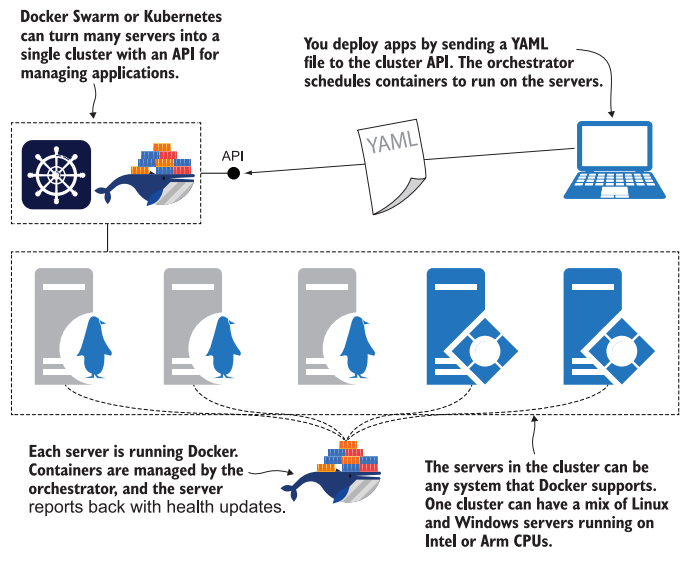
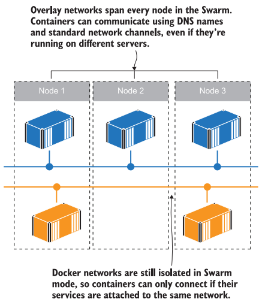

# Практическое задание 8. Знакомство с Docker Swarm

**Цель:** ознакомиться на практике с инструментом оркестрации контейнеризированных приложений Docker Swarm.

<br>

## Что такое оркестратор

Множество реальных или виртуальных машин, сгруппированных вместе в кластер; оркестратор управляет контейнерами, распределяя работу между всеми машинами, балансируя нагрузку сетевого трафика и заменяя любые контейнеры, которые становятся неработоспособными.



Кластер позволяет абстрагироваться от реального железа и управлять приложением, независимо от того запущено оно на одном локальном сервере или это приложение планетарного масштаба работающее на тысячах серверах разбросанных по всему миру.

Оркестратор хранит копию манифеста описывающего состояние приложения развёрнутого в кластере, конфиги, секреты и т.д. Если часть контейнеров будет потеряна или изменится манифест, оркестратор автоматически приведёт приложение к рабочему состоянию.

Оркестратор также предоставляет функции для создания сетей, настройки приложений и хранения данных.  Он скрывает детали отдельных машин, сетей и устройств хранения данных. Вы работаете с кластером как с единым целым, отправляя команды и выполняя запросы выполняются через API, к которому подключается командная строка.


Использование оркестратора позволяет достичь:

- Высокой доступность и отказоустойчивость приложений. Если часть машин кластера перестанут работать, то оркестратор восстановит работоспособность приложения за счёт использования ресурсов остальных. Таким образом приложение по прежнему останется доступно для конечно пользователя;

- Масштабировать приложения. Оркестратор будет добавлять или удалять контейнеры в зависимости от нагрузки;

- Бесшовный деплой и откат. Оркестратор автоматически развернёт новую версию приложения или откатет назад к предыдущей версии не заметно для пользователя.

<br>

## Первичная настройка кластера Docker Swarm

1. Изначально режим Docker Swarm отключён (inactive). Проверьте это выполнив команду:

   ```bash
   docker info | grep Swarm
   ```

2. Чтобы переключиться в режим Docker Swarm и инициализировать текущий узел (node) как менеджер выполите команду:

   ```bash
   docker swarm init
   ```

   В результате вы увидите идентификатор текущего узла и команду позволяющую другим машинам подключиться к текущему кластеру в роли рабочего узла (worker node). Машину так же можно подключить в роли менеджера.
   Как видно, в команде указан токен доступа и сокет для подключения. Любой, у кого есть эта информация, сможет подключиться к кластеру, поэтому токен должен держаться в секрете.

3. Чтобы посмотреть команду подключения позже, введите:

   ```bash
   docker swarm join-token worker
   docker swarm join-token manager
   ```

4. Убедимся, что Docker переключился в режим роя (swarm):

   ```bash
   docker info | grep Swarm
   ```

   Теперь вывод должен показывать: active;

5. Получить информацию по всем подключённым к кластеру узлам можно командой:

   ```bash
   docker node ls
   ```

   На данный момент у нас подключена только одна машина;

6. Чтобы покинуть кластер и выйти из режима Swarm введите:

   ```bash
   docker swarm leave --force
   ```

   Ключ `--force` нам пришлось добавить, т.к. текущий узел является менеджером и кроме того единственным.

   Кластер может содержать несколько менеджеров (обычно не более 5-7), на случай, если какой-то из них станет не доступен. База данных кластера реплицируется между менеджерами, поэтому кластер будет "помнить" конфиги, секреты, и т.д. даже в случае потери некоторого количества менеджеров. 
   
   Узлы диспетчера Swarm используют [Алгоритм консенсуса](https://digitology.tech/docs/docker/engine/swarm/raft.html#engine-swarm-raft) для управления состоянием кластера. Т.е. оставшиеся менеджеры должны образовывать большинство (кворум), чтобы кластер мог корректно обновлять своё состояние иначе он перестанет принимать новые команды. К примеру, если, после экстренного отключения одного из менеджеров, останется два и один из них не успел обновить свою базу данных, то менеджеры будут противоречить друг другу. В случае, если бы их осталось 3 или 1, то актуальное состояние кластера было бы определено в соответствии с "мнением" большинства.

<br>

## Запуск приложения как сервис Docker Swarm

7. Активируйте режим Swarm;

8. Swarm, вместо отдельных контейнеров оперирует сервисами (service). Запустим сервис вручную:

   ```bash
   docker service create --name timecheck --replicas 1 diamol/ch12-timecheck:1.0
   ```

   В пределах сервиса может быть запущена одна или более копий (replicas) контейнеров на основании одного образа. При этом, на каком именно узле будут запущены контейнеры, решает сам Swarm. Обычно контейнеры размещаются случайным образом, равномерно по всем узлам кластера, т.е. если сервис создаёт 10 реплик, и в кластере 5 узлов, то на каждом будет по 2 контейнера. Если один из узлов внезапно отключится, то Swarm запустит 2 новых контейнера на других узлах, чтобы их снова стало 10. После того, как узел снова заработает, Swarm НЕ будет перемещать контейнеры обратно (не сломалось, не чини).

9. Посмотрим список сервисов запущенных в кластере:

   ```bash
   docker service ls
   ```

10. Посмотрим список контейнеров запущенных сервисом `timecheck`:

    ```bash
    docker service ps timecheck
    ```

    Здесь можно увидеть имя контейнера, на каком узле он запущен и т.д.

11. Т.к. в кластере, сейчас присутствует только один узел, то и контейнер запущен на нём. Проверим это при помощи команды, которая покажет список контейнеров работающих на текущей машине:

    ```bash
    docker ps
    ```

12. Принудительно (`-f`) удалим этот контейнер, чтобы проверить, как поведёт себя кластер, в случае внезапного падения контейнера:

    ```bash
    docker rm -f $(docker ps --last 1 -q)
    ```

    Т.к. контейнер последний (`--last 1`), мы получаем его идентификатор (`-q`) и подставляем в команду удаления.

13. Снова проверим контейнеры сервиса `timecheck`:

    ```bash
    docker service ps timecheck
    ```

    Как видно, присутствует **новый** контейнер, который работает несколько секунд и старый отмеченный ошибкой. Таким образом Swarm восстановил работоспособность приложения.
    Такое восстановление, как и горизонтальное масштабирование будет корректно работать, только при условии, что ваше приложение не сохраняет внутренне состояние во время работы (stateless) исключая кеш. Поэтому современные методологии ([Twelve-Factor App](https://habr.com/ru/articles/258739/)) рекомендуют разрабатывать именно такие приложения, а всё, что касается состояния должно быть вынесено в отдельные модули: базу данных, очереди, и т.д;

14. Посмотреть логи сервиса можно командой:

    ```bash
    docker service logs --since 10s timecheck
    ```

    Здесь мы смотрим логи за последние 10 секунд, при этом не имеет значения, где именно запущен контейнер;

15. Получить информацию по сервису можно командой:

    ```bash
    docker service inspect timecheck
    ```

16. В уже запущенный сервис можно вносить изменения:

    ```bash
    docker service update --image diamol/ch12-timecheck:2.0 timecheck
    ```

    Здесь мы заменяем образ для контейнеров сервиса `timecheck` на версию `2.0`

17. Проверим список контейнеров сервиса:

    ```bash
    docker service ps timecheck
    ```

    Как видно, теперь работающий контейнер основан на образе второй версии, а предыдущей контейнер был остановлен.

18. Если заглянуть в логи достаточно далеко назад, то можно обнаружить момент, когда произошла замена контейнера:

    ```bash
    docker service logs --since 200s timecheck
    ```

19. В некоторых случаях возникает необходимость вернуться назад к предыдущей версии. Swarm может это сделать, при этом нет необходимости указывать старую конфигурацию, т.к. она сохранена в базе данных кластера. Достаточно выполнить команду:

    ```bash
    docker service update --rollback timecheck
    ```

20. Снова проверим список контейнеров логи:

    ```bash
    docker service ps timecheck
    docker service logs --since 200s timecheck
    ```

21. Этот сервис нам больше не нужен, поэтому его можно удалить:

    ```bash
    docker service rm timecheck
    ```
    
    При этом будут удалены и **все** контейнеры принадлежащие сервису.
    

<br>

## Маппинг сетевого трафика в кластере

Т.к. Swarm запускает контейнеры случайным образом, на разных узлах кластера, нет никакой гарантии, что контейнеры, которым необходимо общаться по сети окажутся на одной машине. Для обеспечения сетевой доступности, контейнеры кластера можно подключить к сети специального типа - `overlay`. Это виртуальная сеть, которая охватывает все узлы кластера, и когда несколько сервисов подключено к оверлейной сети, они могут взаимодействовать друг с другом, используя имя службы в качестве DNS-имени или ip-адрес (в этой сети ip-адрес получает служба в целом, а не каждый контейнер в отдельности).

Например, сервис `one` запустил 3 контейнера, а сервис `two` - 2. При запросе от контейнера сервиса `two` к сервису `one` можно использовать название сервиса `one` как доменное имя. Swarm получит запрос и перенаправит его на один из трёх контейнеров сервиса `one`, при этом обеспечивая равномерную балансировку нагрузки на все три контейнера.



22. Создадим сеть типа `overlay` вручную:

    ```bash
    docker network create --driver overlay iotd-net
    ```

23. Проверьте, что новая сеть появилась в списке:

     ```bash
     docker network ls
     ```

24. Запустим новый сервис и подключим его к сети с названием `iotd-net`

    ```bash
    docker service create --detach --replicas 3 --network iotd-net --name iotd diamol/ch09-image-of-the-day
    ```

    Здесь сервис `iotd` запустит 3 копии контейнера.

25. Запустим ещё один сервис и назовём его `accesslog`:

    ```bash
    docker service create --detach --replicas 2 --network iotd-net --name accesslog diamol/ch09-access-log
    ```

26. Посмотрим список сервисов:

    ```bash
    docker service ls
    ```

    Сейчас их должно быть два;

27. Зайдём в контейнер сервиса `accesslog`. Точнее в какой-то из его двух контейнеров, который запустился последним:

    ```bash
    docker exec -it $(docker ps --last 1 -q) sh
    ```

28. Находясь в контейнере выполним команду `nslookup`, которая позволит получить список ip адресов соответствующих указанному доменному имени:

    ```bash
    nslookup iotd
    ```

    В нашем случае будет получен ip-адрес соответствующий сервису `iotd`.

29. Отключитесь от контейнера;

30. Запустим третий сервис:

    ```bash
    docker service create --detach --replicas 2 --network iotd-net --publish 8010:80 --name image-gallery diamol/ch09-image-gallery
    ```
    
    Здесь, помимо прочего пробрасывается внешний порт 8010 на внутренний 80;
    
31. Посмотрим список сервисов:

    ```bash
    docker service ls
    ```

32. Откройте браузер на хвостовой машине и введите в строку адреса ip-адрес виртуальной машины и порт 8010. Обновите вкладку несколько раз.  
    В результате вы должны увидеть изображение с серверов NASA на космическую тематику. Изображение обновляется один раз в день.

Только что мы вручную развернули в кластере приложение состоящее из 3х сервисов. Первый сервис `iotd`, состоит из трёх контейнеров которые по запросу обращаются по API NASA и кешируют изображение (чтобы не загружать изображение повторно). Второй сервис `accesslog`, состоит из 2х контейнеров подсчитывающих статистику запросов. Третий сервис `image-gallery` состоит из 2 контейнеров, каждый из которых - это веб-сервер выполняющий запросы на сервис `iotd` и отображающий изображение полученное от него в браузере.

**Продолжение следует ...**

<br>

## Источники

1. DIAMOL 11: Understanding orchestration - Docker Swarm and Kubernetes: https://www.youtube.com/live/zvjr8gmZjkE?si=Nr6sz4qBPkhx7dbH