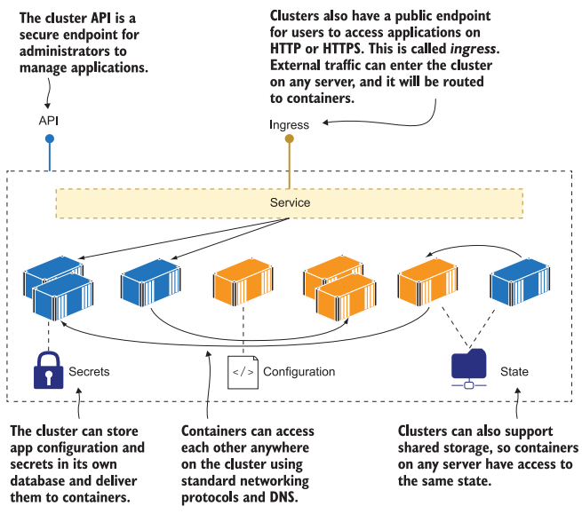
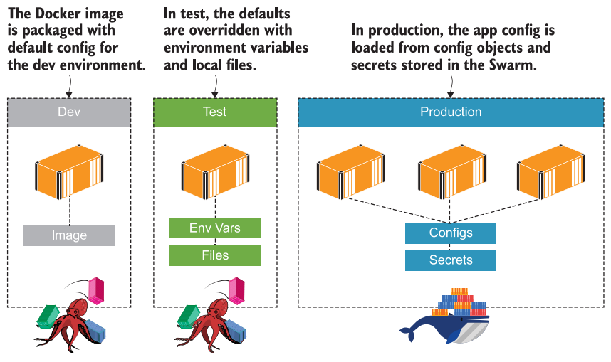

# Практическое задание 8. Знакомство с Docker Swarm

**Цель:** ознакомиться на практике с инструментом оркестрации контейнеризированных приложений Docker Swarm.

<br>

## Что такое оркестратор

Множество реальных или виртуальных машин, сгруппированных вместе в кластер; оркестратор управляет контейнерами, распределяя работу между всеми машинами, балансируя нагрузку сетевого трафика и заменяя любые контейнеры, которые становятся неработоспособными.


Кластер позволяет абстрагироваться от реального железа и управлять приложением, независимо от того запущено оно на одном локальном сервере или это приложение планетарного масштаба работающее на тысячах серверах разбросанных по всему миру.

Оркестратор хранит копию манифеста описывающего состояние приложения развёрнутого в кластере, конфиги, секреты и т.д. Если часть контейнеров будет потеряна или изменится манифест, оркестратор автоматически приведёт приложение к рабочему состоянию.

Оркестратор также предоставляет функции для создания сетей, настройки приложений и хранения данных.  Он скрывает детали отдельных машин, сетей и устройств хранения данных. Вы работаете с кластером как с единым целым, отправляя команды и выполняя запросы выполняются через API, к которому подключается командная строка.



Использование оркестратора позволяет достичь:

- Высокой доступность и отказоустойчивость приложений. Если часть машин кластера перестанут работать, то оркестратор восстановит работоспособность приложения за счёт использования ресурсов остальных. Таким образом приложение по прежнему останется доступно для конечно пользователя;

- Масштабировать приложения. Оркестратор будет добавлять или удалять контейнеры в зависимости от нагрузки;

- Бесшовный деплой и откат. Оркестратор автоматически развернёт новую версию приложения или откатет назад к предыдущей версии не заметно для пользователя.

<br>

## Первичная настройка кластера Docker Swarm

1. Изначально режим Docker Swarm отключён (inactive). Проверьте это выполнив команду:

   ```bash
   docker info | grep Swarm
   ```

2. Чтобы переключиться в режим Docker Swarm и инициализировать текущий узел (node) как менеджер выполите команду:

   ```bash
   docker swarm init
   ```

   В результате вы увидите идентификатор текущего узла и команду позволяющую другим машинам подключиться к текущему кластеру в роли рабочего узла (worker node). Машину так же можно подключить в роли менеджера.
   Как видно, в команде указан токен доступа и сокет для подключения. Любой, у кого есть эта информация, сможет подключиться к кластеру, поэтому токен должен держаться в секрете.

3. Чтобы посмотреть команду подключения позже, введите:

   ```bash
   docker swarm join-token worker
   docker swarm join-token manager
   ```

4. Убедимся, что Docker переключился в режим роя (swarm):

   ```bash
   docker info | grep Swarm
   ```

   Теперь вывод должен показывать: active;

5. Получить информацию по всем подключённым к кластеру узлам можно командой:

   ```bash
   docker node ls
   ```

   На данный момент у нас подключена только одна машина;

6. Чтобы покинуть кластер и выйти из режима Swarm введите:

   ```bash
   docker swarm leave --force
   ```

   Ключ `--force` нам пришлось добавить, т.к. текущий узел является менеджером и кроме того единственным.

   Кластер может содержать несколько менеджеров (обычно не более 5-7), на случай, если какой-то из них станет не доступен. База данных кластера реплицируется между менеджерами, поэтому кластер будет "помнить" конфиги, секреты, и т.д. даже в случае потери некоторого количества менеджеров. 
   
   Узлы диспетчера Swarm используют [Алгоритм консенсуса](https://digitology.tech/docs/docker/engine/swarm/raft.html#engine-swarm-raft) для управления состоянием кластера. Т.е. оставшиеся менеджеры должны образовывать большинство (кворум), чтобы кластер мог корректно обновлять своё состояние иначе он перестанет принимать новые команды. К примеру, если, после экстренного отключения одного из менеджеров, останется два и один из них не успел обновить свою базу данных, то менеджеры будут противоречить друг другу. В случае, если бы их осталось 3 или 1, то актуальное состояние кластера было бы определено в соответствии с "мнением" большинства.

<br>

## Запуск приложения как сервис Docker Swarm

7. Активируйте режим Swarm;

8. Swarm, вместо отдельных контейнеров оперирует сервисами (service). Запустим сервис вручную:

   ```bash
   docker service create --name timecheck --replicas 1 diamol/ch12-timecheck:1.0
   ```

   В пределах сервиса может быть запущена одна или более копий (replicas) контейнеров на основании одного образа. При этом, на каком именно узле будут запущены контейнеры, решает сам Swarm. Обычно контейнеры размещаются случайным образом, равномерно по всем узлам кластера, т.е. если сервис создаёт 10 реплик, и в кластере 5 узлов, то на каждом будет по 2 контейнера. Если один из узлов внезапно отключится, то Swarm запустит 2 новых контейнера на других узлах, чтобы их снова стало 10. После того, как узел снова заработает, Swarm НЕ будет перемещать контейнеры обратно (не сломалось, не чини).

9. Посмотрим список сервисов запущенных в кластере:

   ```bash
   docker service ls
   ```

10. Посмотрим список контейнеров запущенных сервисом `timecheck`:

    ```bash
    docker service ps timecheck
    ```

    Здесь можно увидеть имя контейнера, на каком узле он запущен и т.д.

11. Т.к. в кластере, сейчас присутствует только один узел, то и контейнер запущен на нём. Проверим это при помощи команды, которая покажет список контейнеров работающих на текущей машине:

    ```bash
    docker ps
    ```

12. Принудительно (`-f`) удалим этот контейнер, чтобы проверить, как поведёт себя кластер, в случае внезапного падения контейнера:

    ```bash
    docker rm -f $(docker ps --last 1 -q)
    ```

    Т.к. контейнер последний (`--last 1`), мы получаем его идентификатор (`-q`) и подставляем в команду удаления.

13. Снова проверим контейнеры сервиса `timecheck`:

    ```bash
    docker service ps timecheck
    ```

    Как видно, присутствует **новый** контейнер, который работает несколько секунд и старый отмеченный ошибкой. Таким образом Swarm восстановил работоспособность приложения.
    Такое восстановление, как и горизонтальное масштабирование будет корректно работать, только при условии, что ваше приложение не сохраняет внутренне состояние во время работы (stateless) исключая кеш. Поэтому современные методологии ([Twelve-Factor App](https://habr.com/ru/articles/258739/)) рекомендуют разрабатывать именно такие приложения, а всё, что касается состояния должно быть вынесено в отдельные модули: базу данных, очереди, и т.д;

14. Посмотреть логи сервиса можно командой:

    ```bash
    docker service logs --since 10s timecheck
    ```

    Здесь мы смотрим логи за последние 10 секунд, при этом не имеет значения, где именно запущен контейнер;

15. Получить информацию по сервису можно командой:

    ```bash
    docker service inspect timecheck
    ```

16. В уже запущенный сервис можно вносить изменения:

    ```bash
    docker service update --image diamol/ch12-timecheck:2.0 timecheck
    ```

    Здесь мы заменяем образ для контейнеров сервиса `timecheck` на версию `2.0`

17. Проверим список контейнеров сервиса:

    ```bash
    docker service ps timecheck
    ```

    Как видно, теперь работающий контейнер основан на образе второй версии, а предыдущей контейнер был остановлен.

18. Если заглянуть в логи достаточно далеко назад, то можно обнаружить момент, когда произошла замена контейнера:

    ```bash
    docker service logs --since 200s timecheck
    ```

19. В некоторых случаях возникает необходимость вернуться назад к предыдущей версии. Swarm может это сделать, при этом нет необходимости указывать старую конфигурацию, т.к. она сохранена в базе данных кластера. Достаточно выполнить команду:

    ```bash
    docker service update --rollback timecheck
    ```

20. Снова проверим список контейнеров логи:

    ```bash
    docker service ps timecheck
    docker service logs --since 200s timecheck
    ```

21. Этот сервис нам больше не нужен, поэтому его можно удалить:

    ```bash
    docker service rm timecheck
    ```
    
    При этом будут удалены и **все** контейнеры принадлежащие сервису.
    

<br>

## Маппинг сетевого трафика в кластере

Т.к. Swarm запускает контейнеры случайным образом, на разных узлах кластера, нет никакой гарантии, что контейнеры, которым необходимо общаться по сети, окажутся на одной машине. Для обеспечения сетевой доступности, контейнеры кластера можно подключить к сети специального типа - `overlay`. Это виртуальная сеть, которая охватывает все узлы кластера, и когда несколько сервисов подключено к оверлейной сети, они могут взаимодействовать друг с другом, используя имя сервиса в качестве DNS-имени или ip-адрес (в этой сети ip-адрес получает служба в целом, а не каждый контейнер в отдельности).

Например, сервис `one` запустил 3 контейнера, а сервис `two` - 2. При запросе от контейнера сервиса `two` к сервису `one` можно использовать название сервиса `one` как доменное имя. Swarm получит запрос и перенаправит его на один из трёх контейнеров сервиса `one`, при этом обеспечивая равномерную балансировку нагрузки на все три контейнера.


Будучи подключёнными к одной сети, сервисы могут общаться друг с другом. Чтобы сервис мог общаться с внешним миром и обрабатывать входящий (ingress) трафик нужно пробросить порт при помощи ключа:

```bash
--publish published=<HOST-PORT>,target=<CONTAINER-PORT>
-p 8080:80 # тоже работает
```

Если требуется пробросить порт уже запущенного сервиса:

```bash
docker service update \
--publish-add published=<PUBLISHED-PORT>,target=<CONTAINER-PORT> SERVICE
```

По умолчанию, проброшенный порт открывается **на всех** машинах подключённых к кластеру. Когда вы подключаетесь к такому порту на любом узле swarm (независимо от того, запущен ли на нем данный сервис или нет), вы прозрачно перенаправляетесь на узел, на котором запущен этот сервис. По сути, Docker выполняет функцию балансировщика нагрузки для ваших сервисов.


22. Создадим сеть типа `overlay` вручную:

    ```bash
    docker network create --driver overlay iotd-net
    ```

23. Проверьте, что новая сеть появилась в списке:

     ```bash
     docker network ls
     ```

24. Запустим новый сервис и подключим его к сети с названием `iotd-net`

    ```bash
    docker service create --detach --replicas 3 --network iotd-net --name iotd diamol/ch09-image-of-the-day
    ```

    Здесь сервис `iotd` запустит 3 копии контейнера.

25. Запустим ещё один сервис и назовём его `accesslog`:

    ```bash
    docker service create --detach --replicas 2 --network iotd-net --name accesslog diamol/ch09-access-log
    ```

26. Посмотрим список сервисов:

    ```bash
    docker service ls
    ```

    Сейчас их должно быть два;

27. Зайдём в контейнер сервиса `accesslog`. Точнее в какой-то из его двух контейнеров, который запустился последним:

    ```bash
    docker exec -it $(docker ps --last 1 -q) sh
    ```

28. Находясь в контейнере выполним команду `nslookup`, которая позволит получить список ip адресов соответствующих указанному доменному имени:

    ```bash
    nslookup iotd
    ```

    В нашем случае будет получен ip-адрес соответствующий сервису `iotd`.

29. Отключитесь от контейнера;

30. Запустим третий сервис:

    ```bash
    docker service create --detach --replicas 2 --network iotd-net --publish 8010:80 --name image-gallery diamol/ch09-image-gallery
    ```

    Здесь, помимо прочего пробрасывается внешний порт 8010 на внутренний 80;

31. Посмотрим список сервисов:

    ```bash
    docker service ls
    ```

32. Откройте браузер на хостовой машине и введите в строку адреса ip-адрес виртуальной машины и порт 8010. Обновите вкладку несколько раз.  
    В результате вы должны увидеть изображение с серверов NASA на космическую тематику. Изображение обновляется один раз в день.

33. Остановите все запущенные сервисы.

Только что мы вручную развернули в кластере приложение состоящее из 3х сервисов. Первый сервис `iotd`, состоит из трёх контейнеров которые по запросу обращаются по API NASA и кешируют изображение (чтобы не загружать изображение повторно). Второй сервис `accesslog`, состоит из 2х контейнеров подсчитывающих статистику запросов. Третий сервис `image-gallery` состоит из 2 контейнеров, каждый из которых - это веб-сервер выполняющий запросы на сервис `iotd` и отображающий изображение полученное от него в браузере.

<br>

## Использование Docker Compose для развёртывания приложения

Ранее мы вручную развернули приложение в кластере Swarm, но обычно так никто не делает. Как правило, оркестратору передаётся файл (манифест) описывающей требуемое состояние кластера: сервисы, сети, тома и т.д., и сам оркестратор создаёт все требуемые объекты.

Формат манифеста Swarm является расширением формата Docker Compose. Например, такой файл является корректным как для Compose, так и для Swarm:

```yaml
version: "3.7"

services:
  todo-web:
    image: diamol/ch06-todo-list
    ports:
      - 8080:80
```

Большинство ключей использующихся Compose будут работать и для Swarm. Если Compose встретит в файле ключ относящиеся к режиму Swarm, он проигнорирует его (хотя и покажет предупреждение). Если Swarm встретит ключ специфичный для Compose, он тоже проигнорирует его.


34. Сохраните приведённый выше текст в файл "v1.yaml".

35. Чтобы развернуть описанное данным манифестом приложение в кластере выполните команду:

    ```bash
    docker stack deploy -c ./v1.yaml todo
    ```

    Стеком называется приложение развёрнутое в Swarm кластере, т.е. набор сервисов, сетей, томов и т.д. относящихся к одному приложению. В нашем случае, используется манифест из файла "v1.yaml" и название стека будет "todo";

36. Посмотрим список стеков:

    ```bash
    docker stack ls
    ```

37. Посмотрим список сервисов работающих в кластере:

    ```bash
    docker service ls
    ```

    На данный момент, у нас есть один стек, который создал один сервис;

38. Откройте браузер на хостовой машине и введите в строку адреса ip-адрес виртуальной машины и порт 8080. Вы должны увидеть веб интерфейс приложения;

39. Создайте файл "v2.yaml" содержащий:

    ```yaml
    version: "3.7"
    
    services:
      todo-web:
        image: diamol/ch06-todo-list
        ports:
          - 8080:80
        deploy:
          replicas: 2
          resources:
            limits:
              cpus: "0.50"
              memory: 100M
    ```

    Этот файл дополнен новым ключом `deploy`, который определяет, что сервис должен запустить 2 контейнера (`replicas`) и при этом каждый контейнер будет ограничен половиной процессорной мощности и 100 мегабайтами оперативной памяти;

40. Выполните команду:

    ```bash
    docker stack deploy -c ./v2.yaml todo
    ```

    Т.к. стек с именем "todo" уже существует, произойдёт его обновление, таким образом, чтобы он соответствовал манифесту "v2.yaml" . Обычно файл-манифеста берётся из репозитория и его название не меняется для разных версий приложения;

41. Чтобы посмотреть список сервисов стека воспользуемся командой:

    ```bash
    docker stack services todo
    ```

    Как видно, стек "todo" содержит только один сервис с именем "todo_todo-web";

42. Посмотрим на список контейнеров этого сервиса:

    ```bash
    docker service ps todo_todo-web
    ```

    Как видно, у нас есть один остановленный контейнер (остался от версии v1) и два работающих контейнера (т.к. в версии v2 указано создать две реплики).  
    Если посмотреть на столбец состояния контейнеров, то можно заметить, что сначала был запущен контейнер версии v2 и только после этого остановлен контейнер версии v1, а затем запущен второй контейнер версии v2. Такое постепенное обновление стека НЕ приведёт, к ситуации, при которой пользователь потеряет доступ к приложению. Особенно это важно, если остановка и запуск контейнеров занимает продолжительное время;

43. Удалим стек "todo":

    ```
    docker stack rm todo
    ```

    В результате будут удалены все контейнеры, сервисы, сети и т.д. созданные во время развёртывания данного стека.

### Подключение к кластеру файла-конфигурации и секретов

Часто одно и тоже приложение (стек) должно быть развёрнуто в разных средах: dev, test, prod и т.д. В этом случае общая структура приложения, как правило, сохраняется, но часть параметров (режим логирования, вид базы данных, имена пользователей, пароли и т.д.) меняется в зависимости от окружения.



Передавать всю необходимую приложению информацию через переменные окружения не всегда удобно и безопасно, поэтому Docker Swarm, дополнительно, поддерживает два вида сущностей: конфигурации и секреты.

44. Создайте каталог "configs" и в нем файл "config.json" содержащий:

    ```json
    {
      "Logging": {
        "LogLevel": {
          "Default": "Information",
          "Microsoft": "Warning",
          "Microsoft.Hosting.Lifetime": "Warning"
        }
      },
      "AllowedHosts": "*",
      "Database": {
        "Provider": "Postgres"
      }
    }
    ```

45. Создадим объект конфигурации Docker:

    ```bash
    docker config create todo-list-config ./congif.json
    ```

    Здесь создаётся конфигурационный объект "todo-list-config" на основе файла "config.json". Содержимое файла и его расширение может быть любым;

46. Посмотрим список доступных конфигов:

    ```bash
    docker config ls
    ```

47. Посмотрим содержимое конфига:

    ```bash
    docker config inspect --pretty todo-list-config
    ```

    Как видно, содержимое файла конфигурации, который был использован для создания конфига, полностью отображается на экране. По этой причине здесь нельзя хранить секретную информацию, а только общедоступные данные;

48. Выйдите из каталога "configs" и создайте файл "v3.yaml" содержащий:

    ```yaml
    version: "3.7"
    
    services:
      todo-web:
        image: diamol/ch06-todo-list
        ports:
          - 8080:80
        configs:
          - source: todo-list-config
            target: /app/config/config.json
        deploy:
          replicas: 1
          resources:
            limits:
              cpus: "0.50"
              memory: 100M
        networks:
          - app-net
    
      todo-db:
        image: diamol/postgres:11.5
        deploy:
          replicas: 1
          resources:
            limits:
              cpus: "0.50"
              memory: 500M
        networks:
          - app-net
    
    configs:
      todo-list-config:
        external: true
    
    networks:
      app-net:
    ```

    В данном файле, описание сервиса "todo-web" дополнено блоком:

    ```yaml
    configs:
      - source: todo-list-config
        target: /app/config/config.json
    ```

    Таким образом, в каждом контейнере этого сервиса будет создан файл по пути "/app/config/config.json", а его содержимое будет взято из объекта конфигурации с именем "todo-list-config". Если в контейнере был такой файл, то он будет заменён.

    Также в файле-манифеста добавлен корневой ключ `configs`:

    ```yaml
    configs:
      todo-list-config:
        external: true
    ```

    Он объявляет, что нужно использовать уже существующий (`external: true`) объект конфигурации с именем `todo-list-config`;

49. Обновим приложение:

    ```bash
    docker stack deploy -c ./v3.yaml todo
    ```

50. Убедитесь, что оба сервиса запущены и в каждом работает по одному контейнеру:

    ```bash
    docker stack services todo
    ```

51. Откройте браузер на хостовой машине и введите в строку адреса ip-адрес виртуальной машины и порт 8080. Сейчас приложение должно быть не доступно;

52. Если изучить логи приложения (сервис "todo_todo-web"):

    ```bash
    docker service logs todo_todo-web
    ```

    то можно заметить, что приложение не может подключиться к базе данных. Это происходит, потому что мы не передали ему данные, необходимые для подключения;

53. Создайте каталог "secrets" и в нём файл "secret.json" содержащий:

    ```json
    {
        "ConnectionStrings": {
          "ToDoDb": "Server=todo-db;Database=todo;User Id=postgres;Password=postgres;"
        }
    }
    ```

    Здесь указана конфиденциальная информация необходимая для подключения к базе данных;

54. Создадим объект секрета Docker:

    ```bash
    docker secret create todo-list-secret ./secret.json
    ```

    Здесь создаётся секрет "todo-list-secret" на основе файла "secret.json". Содержимое файла и его расширение может быть любым;

55. Посмотрим список доступных секретов:

    ```bash
    docker secret ls
    ```

56. Посмотрим содержимое секрета:

    ```bash
    docker secret inspect --pretty todo-list-secret
    ```

    Как видно, содержимое файла секрета не отображается. По этой причине конфиденциальные данные лучше хранить здесь.  
    Секрет хранится и передаётся в целевой контейнер в зашифрованном виде и только внутри контейнера он будет расшифрован;

57. Выйдите из каталога "secrets" и создайте файл "v4.yaml" содержащий:

    ```yaml
    version: "3.7"
    
    services:
      todo-web:
        image: diamol/ch06-todo-list
        ports:
          - 8080:80
        configs:
          - source: todo-list-config
            target: /app/config/config.json
        secrets:
          - source: todo-list-secret
            target: /app/config/secrets.json
        deploy:
          replicas: 1
          resources:
            limits:
              cpus: "0.50"
              memory: 100M
        networks:
          - app-net
    
      todo-db:
        image: diamol/postgres:11.5
        deploy:
          replicas: 1
          resources:
            limits:
              cpus: "0.50"
              memory: 500M
        networks:
          - app-net
    
    configs:
      todo-list-config:
        external: true
    
    secrets:
      todo-list-secret:
        external: true
    
    networks:
      app-net:
    ```

    В данном файле, описание сервиса "todo-web" дополнено блоком:

    ```yaml
    secrets:
      - source: todo-list-secret
        target: /app/config/secrets.json
    ```

    Таким образом, в каждом контейнере этого сервиса будет создан файл по пути "/app/config/secrets.json", а его содержимое будет взято из секрета с именем "todo-list-secret". Если в контейнере был такой файл, то он будет заменён.

    Также в файле-манифеста добавлен корневой ключ `secrets`:

    ```yaml
    secrets:
      todo-list-secret:
        external: true
    ```

    Он объявляет, что нужно использовать уже существующий (`external: true`) секрет с именем `todo-list-secret`;

58. Обновим приложение:

    ```bash
    docker stack deploy -c ./v4.yaml todo
    ```

59. Посмотрим контейнеры стека "todo":

    ```bash
    docker stack ps todo
    ```

    Контейнер с базой данных присутствует в одном экземпляре и работает уже достаточно долго, а контейнер с веб-интерфейсом был запущен совсем недавно, кроме того, есть второй, остановленный, контейнер. Так получилось, потому-что в манифесте "v4.yaml" было обновлено описание только сервиса "todo-web", а сервис с базой данных остался без изменения. Всякий раз, когда описание сервиса меняется (даже незначительно), старые контейнеры будут остановлены и заменены новыми;

60. Откройте браузер на хостовой машине и введите в строку адреса ip-адрес виртуальной машины и порт 8080. Теперь приложение работает корректно и описывается схемой представленной на рисунке.


### Работа с томами

Рассмотрим ситуацию: приложение запускается в кластере из 2х машин. Приложение содержит сервис с базой данных, которая хранит свои данных в томе, для того, чтобы при перезапуске контейнера не потерять информацию. При первом запуске Swarm разместил контейнер с базой данных на машине №1 и создал на ней том. После некоторого периода работы, приложение было перезапущено и в этот раз Swarm разместил контейнер с базой данных на машине №2. Т.к. на этой машине тома нет, будет создан новый, пустой, том и база данных снова будет пуста.

Этот пример показывает, что данные томов не копируются по всем машинам кластера, а хранятся на каждом узле локально. 

В качестве одного из возможных решений могут быть использованы метки. Можно добавить определённым узлам кластера метку и заставить оркестратор запускать контейнеры определённого сервиса, только на узлах отмеченных указанной меткой.

61. Выполните команду:

    ```bash
    docker node update --label-add storage=raid $(docker node ls -q)
    ```

    Здесь, всем узлам в списке (у нас только один) будет добавлена метка `storage=raid`. Как видно, метка - это произвольная пара ключ-значение;

62. Список меток узла можно найти в разделе "Spec" -> "Labels":

    ```bash
    docker node inspect $(docker node ls -q)
    ```

63. Создайте файл "v5.yaml" содержащий:

    ```yaml
    version: "3.7"
    
    services:
      todo-web:
        image: diamol/ch06-todo-list
        ports:
          - 8080:80
        configs:
          - source: todo-list-config
            target: /app/config/config.json
        secrets:
          - source: todo-list-secret
            target: /app/config/secrets.json
        deploy:
          replicas: 1
          resources:
            limits:
              cpus: "0.50"
              memory: 100M
        networks:
          - app-net
    
      todo-db:
        image: diamol/postgres:11.5
        environment:
          PGDATA: "/var/lib/postgresql/data/pgdata"
        volumes:
          - todo-db-data:/var/lib/postgresql/data
        deploy:
          replicas: 1
          resources:
            limits:
              cpus: "0.50"
              memory: 500M
          placement:
            constraints:
              - node.labels.storage == raid
        networks:
          - app-net
    
    configs:
      todo-list-config:
        external: true
    
    secrets:
      todo-list-secret:
        external: true
    
    networks:
      app-net:
    
    volumes:
      todo-db-data:
    ```

    В данном файле описание сервиса "todo-db" дополнено блоком:

    ```yaml
    volumes:
      - todo-db-data:/var/lib/postgresql/data
    ```

    который подключает к контейнеру том "todo-db-data" и блоком:

    ```yaml
    deploy:
      ...
      placement:
        constraints:
          - node.labels.storage == raid
    ```

    который ограничивает размещение (`placement`) контейнеров сервиса только на узлах, у которых метка "storage" равна "raid". Если в кластере не будет узла с такой меткой, сервис тоже запущен не будет;

64. Посмотрите на имена томов, которые у вас уже существуют:

    ```bash
    docker volume ls -q
    ```

    Ключ `-q` - показать только имена. Тома "todo-db-data" среди них быть не должно;

65. Обновите приложение и снова проверьте список томов:

    ```bash
    docker stack deploy -c ./v5.yaml todo
    docker volume ls -q
    ```

    Теперь, том "todo-db-data" должен появиться;

66. Перейдите в браузер и добавьте несколько элементов в список дел;

67. На сервере создайте файл "v6.yaml" содержащий:

    ```yaml
    version: "3.7"
    
    services:
      todo-web:
        image: diamol/ch06-todo-list
        ports:
          - 8080:80
        configs:
          - source: todo-list-config
            target: /app/config/config.json
        secrets:
          - source: todo-list-secret
            target: /app/config/secrets.json
        deploy:
          replicas: 1
          resources:
            limits:
              cpus: "0.50"
              memory: 100M
        networks:
          - app-net
    
      todo-db:
        image: diamol/postgres:11.6
        environment:
          PGDATA: "/var/lib/postgresql/data/pgdata"
        volumes:
          - todo-db-data:/var/lib/postgresql/data
        deploy:
          replicas: 1
          resources:
            limits:
              cpus: "0.50"
              memory: 500M
          placement:
            constraints:
              - node.labels.storage == raid
        networks:
          - app-net
    
    configs:
      todo-list-config:
        external: true
    
    secrets:
      todo-list-secret:
        external: true
    
    networks:
      app-net:
    
    volumes:
      todo-db-data:
    ```

    Данная версия приложение во всём идентична v5, кроме версии базы данных. Было postgres:11.5, а теперь postgres:11.6. Т.е., мы хотим заменить базу данных на более свежую версию, но при этом не потерять имеющиеся данные;

68. Обновите приложение:

    ```bash
    docker stack deploy -c ./v6.yaml todo
    ```

69. Перейдите в браузер и проверьте, что составленный вами список дел всё ещё на месте. Даже если бы в кластере было больше одного узла, контейнер с базой данных всё равно запустился бы на этом, т.к. только у него есть метка `storage=raid`.  
    Текущая версия приложения описывается схемой представленной на рисунке.

    

70. Удалите стек и проверьте список томов:

    ```bash
    docker stack rm todo
    docker volume ls -q
    ```
    
    Как видно, том всё ещё существует. При удалении стека или сервиса Docker не удаляет **именованные** тома. Анонимные тома, удалены будут.
    

<br>

## Автоматизация развёртывания с обновлениями и откатами

Обычно, приложение обновляется несколько раз в месяц, даже если само приложение не развивается. Этом может быть связано с выпуском обновлений операционной системы и зависимостей приложения, например закрывающих критические уязвимости. Активно развивающееся приложение может обновляться несколько раз в неделю.

Далее рассмотрим процесс эволюции приложения для генерации случайных чисел и его обновление на серверах. Приложение состоит из двух сервисов: "numbers-api" - бэкенд и "numbers-web" - фронтенд.

71. Создайте файл "stack.yaml" содержащий:

    ```yaml
    version: "3.7"
    
    services:
      numbers-api:
        image: diamol/ch08-numbers-api
        deploy:
          replicas: 6
          resources:
            limits:
              cpus: "0.50"
              memory: 75M
        networks:
          - app-net
    
      numbers-web:
        image: diamol/ch08-numbers-web
        environment:
          - RngApi__Url=http://numbers-api/rng
        ports:
          - target: 80
            published: 80
            mode: host
        deploy:
          mode: global
          resources:
            limits:
              cpus: "0.75"
              memory: 150M
        networks:
          - app-net
          
    networks:
      app-net:
        name: numbers-prod
    ```

72. Запустите приложение и проверьте состояние сервисов текущего стека:

    ```bash
    docker stack deploy -c ./stack.yaml numbers
    docker stack services numbers
    ```

    У сервиса "numbers-api" должно быть запущено 6 реплик, а у сервиса "numbers-web" - одна;

73. Откройте браузер на хостовой машине и введите в строку адреса ip-адрес виртуальной машины и порт 80. Нажмите несколько раз на кнопку генерации случайных чисел, пока не получите сообщение "RNG service unavailable!". Теперь, сколько бы вы ни нажимали кнопку сообщение не изменится;

74. Посмотрите список контейнеров стека:

    ```bash
    docker stack ps numbers
    ```

    Как видно, в списке присутствует 7 контейнеров в состоянии Running. Т.е. несмотря на то, что приложение "сломалось" и больше не показывает случайные числа, контейнеры работают в штатном режиме.  
    Оркестратор способен автоматически перезапустить неисправные контейнеры, но в нашем случае неисправность относится не к самому контейнеру, а к **логике** его работы. Чтобы нарушение логики тоже считалось неисправностью существует healthcheck. Healthcheck - заключается в периодическом запуске скрипта, который занимается проверкой критичной для работы приложения логики (доступность; правильность кода ответа; время ответа; и т.д.). Если healthcheck не пройден, контейнер признаётся неисправным. Всё, что будет происходить дальше - забота оркестратора;

75. Откройте файл "stack.yaml" и замените его содержимое на:

    ```yaml
    version: "3.7"
    
    services:
      numbers-api:
        image: diamol/ch08-numbers-api:v2
        deploy:
          replicas: 6
          resources:
            limits:
              cpus: "0.50"
              memory: 75M
        healthcheck:
          interval: 2s
          timeout: 3s
          retries: 2
          start_period: 5s
        networks:
          - app-net
    
      numbers-web:
        image: diamol/ch08-numbers-web:v2
        environment:
          - RngApi__Url=http://numbers-api/rng
        ports:
          - target: 80
            published: 80
            mode: host
        deploy:
          mode: global
          resources:
            limits:
              cpus: "0.75"
              memory: 150M
        healthcheck:
          interval: 20s
          timeout: 10s
          retries: 3
          start_period: 30s
        networks:
          - app-net
          
    networks:
      app-net:
        name: numbers-prod
    ```

    Здесь сервисам "numbers-api" и "numbers-web" был добавлен блок `healthcheck`, который будет проверять работоспособности контейнера с точки зрения логики его работы.  
    Блок `healthcheck` содержит описание интервала проверки, количество попыток и т.д., но не сам скрипт (хотя его можно добавить). Чтобы от данного блока была польза, нужно добавить тестирующий скрипт и команду его запуска в сам контейнер, т.е. на этапе сборки образа, в "Dockerfile", нужно прописать параметр `HEALTHCHECK`.  
    Т.к. для первой версии приложения образы были собраны без этого параметра, поэтому в текущей версии манифеста используются образы v2. В "Dockerfile" образа `diamol/ch08-numbers-api:v2` была добавлена строка:

    ```dockerfile
    HEALTHCHECK CMD curl --fail http://localhost/health
    ```

    В "Dockerfile" образа `diamol/ch08-numbers-web:v2` ничего добавлено не было, поэтому присутствие в манифесте блока `healthcheck` для сервиса "numbers-web" на самом деле - бесполезно;

76. Обновите приложение:

    ```bash
    docker stack deploy -c ./stack.yaml numbers
    ```

77. Выполните команду:

    ```bash
    docker stack services numbers
    ```

    Перезапускайте команду несколько раз, пока сервисы не запустят все реплики;

78. Посмотрите список контейнеров стека:

    ```bash
    docker stack ps numbers
    ```

    Как видно, контейнеры, основанные на версии образов с тегом `latest` остановлены, а те, что с тегом `v2` работают;

79. Перейдите в браузер, обновите страницу и снова понажимайте на кнопку "Get a random number" до тех пор, пока не получите сообщение "RNG service unavailable!". После этого нажмите на эту кнопку ещё 6+ раз.  
    После небольшого ожидания снова начните нажимать на кнопку генерации случайных чисел. Вы увидите, что приложение опять работает нормально;

80. Снова посмотрите список контейнеров стека:

    ```bash
    docker stack ps numbers | grep numbers_numbers-api.1
    ```

    Здесь мы фильтруем вывод по имени контейнера "numbers_numbers-api.1", для наглядности; 
    Как видно, количество остановленных контейнеров стало больше, при этом в нем появились контейнеры с тегом `v2`. В процессе нажимания на кнопку, наступал момент, когда контейнер переставал отвечать корректно и очередной healthcheck проваливался. Swarm, обнаружив неисправный контейнер, запускал его новую версию и останавливал старую, чтобы восстановить работоспособность приложения. Если продолжить нажимать на кнопку, количество остановленных контейнеров будет продолжать увеличиваться;

81. Откройте файл "stack.yaml" и замените его содержимое на:

    ```yaml
    version: "3.7"
    
    services:
      numbers-api:
        image: diamol/ch08-numbers-api:v3
        deploy:
          replicas: 6
          resources:
            limits:
              cpus: "0.50"
              memory: 75M
          update_config:
            parallelism: 3
            monitor: 60s
            failure_action: rollback
            order: start-first
        healthcheck:
          interval: 2s
          timeout: 3s
          retries: 2
          start_period: 5s
        networks:
          - app-net
    
      numbers-web:
        image: diamol/ch08-numbers-web:v3
        environment:
          - RngApi__Url=http://numbers-api/rng
        ports:
          - target: 80
            published: 80
            mode: host
        deploy:
          mode: global
          resources:
            limits:
              cpus: "0.75"
              memory: 150M
        healthcheck:
          interval: 20s
          timeout: 10s
          retries: 3
          start_period: 30s
        networks:
          - app-net
          
    networks:
      app-net:
        name: numbers-prod
    ```

    В данной версии приложения, сервису "numbers-api" был добавлен блок:

    ```yaml
    deploy:
      ...
      update_config:
        failure_action: rollback
        monitor: 30s
        order: start-first
        parallelism: 3
    ```

    Этот блок определяет стратегию обновления сервиса:

    - `parallelism` - это количество реплик, которые заменяются параллельно. Значение по умолчанию
      равно 1, поэтому обновления будут выполняться по одному контейнеру за раз. Приведенный здесь параметр будет обновлять три контейнера одновременно. Это ускоряет развертывание и повышает вероятность обнаружения сбоев, поскольку запускается больше новых реплик;
    - `monitor` - это период времени, в течение которого Swarm должен отслеживать новые реплики, прежде чем продолжить развертывание. Значение по умолчанию равно 0. Если у ваших образов есть проверка healthcheck, то правильным будет выставить monitor так, чтобы healthcheck успел отработать хотя бы один раз. Это повышает надежность развертывания, но замедляет его;
    - `failure_action` - это действие, которое необходимо выполнить, если развертывание завершается сбоем из-за того, что контейнеры не запускаются или не проходят healthcheck в течение периода мониторинга. По умолчанию, развертывание приостанавливается. Здесь установлен автоматический откат к предыдущей версии;
    - `order` - это порядок замены реплик. По умолчанию используется режим stop-first ("сначала остановка"), который гарантирует, что количество запущенных реплик никогда не превысит требуемого, но если ваше приложение может работать с дополнительными репликами, лучше установить режим start-first ("сначала запуск"), потому что новые контейнеры будут созданы и проверены перед удалением старых.

    Кроме нового блока в этой версии стека заменены базовые образы сервисов на v3;

82. Выполните команды:

    ```bash
    docker stack deploy -c ./stack.yaml numbers
    docker stack services numbers
    ```

    Как видно по столбцу `IMAGE`, теперь сервисы используют образы версии `v3`;

83. Примерно через 3 минуты после начала обновления выполните команду:

    ```bash
    docker service inspect numbers_numbers-api | jq '.[0].UpdateStatus'
    ```

    Здесь мы смотрим информацию о сервисе "numbers_numbers-api" и фильтруем её по ключу `UpdateStatus`. Как видно, состояние обновления: `completed`, т.е. обновление прошло успешно;

84. Откройте файл "stack.yaml" и замените его содержимое на:

    ```yaml
    version: "3.7"
    
    services:
      numbers-api:
        image: diamol/ch14-numbers-api:v5
        deploy:
          replicas: 6
          resources:
            limits:
              cpus: "0.50"
              memory: 75M
          update_config:
            parallelism: 3
            monitor: 30s
            failure_action: rollback
            order: start-first
        healthcheck:
          interval: 2s
          timeout: 3s
          retries: 2
          start_period: 5s
        networks:
          - app-net
    
      numbers-web:
        image: diamol/ch14-numbers-web:v5
        environment:
          - RngApi__Url=http://numbers-api/rng
        ports:
          - target: 80
            published: 80
            mode: host
        deploy:
          mode: global
          resources:
            limits:
              cpus: "0.75"
              memory: 150M
        healthcheck:
          interval: 20s
          timeout: 10s
          retries: 3
          start_period: 30s
        networks:
          - app-net
          
    networks:
      app-net:
        name: numbers-prod
    ```

    В данной версии приложения образы были заменены на `diamol/ch14-numbers-api:v5` и `diamol/ch14-numbers-web:v5`. Образ `diamol/ch14-numbers-api:v5` намеренно не проходит проверку `healthcheck`.

85. Выполните команды:

    ```bash
    docker stack deploy -c ./stack.yaml numbers
    watch -n 0.5 "docker service inspect numbers_numbers-api | jq '.[0].UpdateStatus'"
    ```

    Вы должны пронаблюдать, как обновление сервиса "numbers_numbers-api" сначала начнётся, затем запуститься откат и откат завершится;

86. Выполните команду:

    ```bash
    docker stack services numbers
    ```

    Вы должны увидеть, что сервис "numbers_numbers-web" теперь использует образ v5, а сервис "numbers_numbers-api" по прежнему v3;

Настройки отката, как и на стройки обновления, можно изменить в манифесте, добавив:

```yaml
deploy:
  ...
  rollback_config:
    parallelism: 6
    monitor: 0s
    failure_action: continue
    order: start-first
```

Теперь процесс развертывания сервиса "numbers-api" может быть описан схемой:


87. Откройте файл "stack.yaml" и замените его содержимое на:

    ```yaml
    version: "3.7"
    
    services:
      numbers-api:
        image: diamol/ch14-numbers-api:v5
        environment:
          - Broken=false
        deploy:
          replicas: 6
          resources:
            limits:
              cpus: "0.50"
              memory: 75M
          update_config:
            parallelism: 3
            monitor: 30s
            failure_action: rollback
            order: start-first
          rollback_config:
            parallelism: 6
            monitor: 0s
            failure_action: continue
            order: start-first
        healthcheck:
          interval: 2s
          timeout: 3s
          retries: 2
          start_period: 5s
        networks:
          - app-net
    
      numbers-web:
        image: diamol/ch14-numbers-web:v5
        environment:
          - RngApi__Url=http://numbers-api/rng
        ports:
          - target: 80
            published: 80
            mode: host
        deploy:
          mode: global
          resources:
            limits:
              cpus: "0.75"
              memory: 150M
        healthcheck:
          interval: 20s
          timeout: 10s
          retries: 3
          start_period: 30s
        networks:
          - app-net
          
    networks:
      app-net:
        name: numbers-prod
    ```

    Здесь, для сервиса "numbers-api" добавлены настройки отката, показанные ранее и установлена переменная среды `Broken=false`. Теперь, `diamol/ch14-numbers-api:v5` будет проходить `healthcheck`;

88. Выполните команды:

    ```bash
    docker stack deploy -c ./stack.yaml numbers
    watch -n 0.5 "docker service inspect numbers_numbers-api | jq '.[0].UpdateStatus'"
    ```

    Вы должны пронаблюдать, как обновление сервиса "numbers_numbers-api" начнётся и успешно завершится;

89. Выполните команду:

    ```bash
    docker stack services numbers
    ```

    Теперь оба сервиса перешли на версию образов v5.

<br>

## Кластер из нескольких машин

90. Перейдите на сайт: https://labs.play-with-docker.com/ и залогиньтесь (нужен VPN, хотя бы в браузере).  
    Нажмите на кнопку "Start" и получите 4ч часовую сессию в "песочнице" и до пяти виртуальных машин с docker;

91. Создайте 5 виртуальных машин;

92. У меня в браузере не работала функция копирования/вставки поэтому я подключался по ssh, если у вас работает, то эти пункты можете пропустить:

    - Выберете нужную машину и, сверху, в поле ssh будет строка подключения;

    - **Windows**: из PowerShell или CMD подключается как обычно, просто вставляете строку подключения и все;
    - **Linux**: потребуется несколько дополнительных действий:
      1. В любом каталоге создайте ключ: `ssh-keygen -f PWD`;
      2. Дополните строку подключения параметрами: ` -o PubkeyAcceptedAlgorithms=+ssh-rsa -i PWD`

93. На первом узле ("node1") инициализируйте swarm режим. Т.к. у машин несколько сетевых адаптеров, нужно будет указать ip адресу вручную:

    ```bash
    ip=$(hostname -i)
    docker swarm init --advertise-addr $ip
    ```

94. Получите токен для менеджера:

    ```bash
    docker swarm join-token manager
    ```

95. Подключите узлы "node2" и "node3" к кластеру в качестве менеджеров;

96. Получите токен для воркера (через любого из менеджеров):

    ```bash
    docker swarm join-token worker
    ```

97. Подключите узлы "node4" и "node5" к кластеру в качестве воркеров;

98. На любом менеджере введите команду:

    ```bash
    docker node ls
    ```

99. На узле "node1" выполните команды:

    ```bash
    docker node update --availability drain node3
    docker node update --availability drain node5
    docker node ls
    ```

    Узлы перешли в режим технического обслуживания. Если бы на них были запущены контейнеры, то они были бы остановлены и запущены на других узлах. Машины по прежнему остаются частью кластера. Режим drain для менеджера означает, что он не запускает контейнеры, но принимает участие в управлении как и другие менеджеры.
    Кроме режима `drain`, аvailability может быть `active` и`pause`;

100. На узле "node1" выполните команды:

     ```bash
     docker swarm leave --force
     ```

     Теперь узел перестал быть частью кластера и отключил режим Swarm. Кластер при этом не получил никаких уведомлений и продолжает считать "node1" своей частью;

101. На втором узле выполните команду:

     ```bash
     docker node ls
     ```

     Как видно "node1" всё ещё присутствует в списке, хотя и со статусом "Unreachable";

102. На втором узле выполните команды:

     ```bash
     docker node promote node5
     docker node update --availability active node5
     docker node ls
     ```

     Теперь "node5" повышен до менеджера и переведён из состояния обслуживания в активное;

103. На "node5" выполните команду:

     ```bash
     docker node demote node2
     ```

     Теперь "node2" понижен до воркера;

104. На "node5" выполните команду:

     ```bash
     docker node rm node1
     ```

     В результате получим ошибку, которая говорит, что нельзя удалить менеджера, сначала его нужно понизить до воркера;

105. На "node5" выполните команды:

     ```bash
     docker node demote node1
     docker node rm node1
     docker node ls
     ```
     
     Теперь "node1" окончательно исключён из кластера.
     

Дальнейшая работа с кластером заключается в развёртывании приложений и выполняется точно также как мы это делали ранее своём кластере с одним узлом.

<br>

## Источники

1. DIAMOL 11: Understanding orchestration - Docker Swarm and Kubernetes: https://www.youtube.com/live/zvjr8gmZjkE?si=Nr6sz4qBPkhx7dbH;

2. DIAMOL 12: Deploying distributed applications as stacks in Docker Swarm: https://www.youtube.com/live/JUEDHPNCs0U?si=crir7vLxS1z9KTeY;

3. DIAMOL 13: Automating releases with upgrades and rollbacks: https://www.youtube.com/live/XWUfb08qDYg?si=X2RvvryaQHUwVsk5
