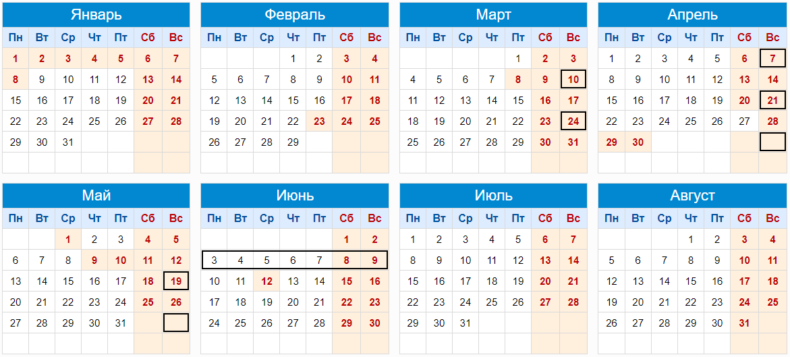

# Экзаменационный проект

 

## Календарный план

### До 10 марта: 

1. Зарегистрировать состав команды заполнив [форму](https://docs.google.com/forms/d/e/1FAIpQLScOmJrAvI0zobbgGKYbiUmzFCK82wUjiVQF2K_feD2p-7fWog/viewform?usp=sf_link). Форму заполняет лидер команды;

2. Определиться с темой и согласовать "Техническое задание" с заказчиком проекта. Итоговый вариант ТЗ залить в мудл. Шаблон можно посмотреть [тут](./files/Техническое_задание.docx);

3. Составить и согласовать с заказчиком проекта "Календарный план работ по проекту". Итоговый вариант плана залить в мудл. Шаблон можно посмотреть [тут](./files/placeholder.md);

4. Составить и согласовать с заказчиком проекта "Матрицу распределения ответственности по проекту". Итоговый вариант матрицы залить в мудл. Шаблон можно посмотреть [тут](./files/placeholder.md);

   - каждая задача назначается только одному участнику;

   - видео про стори поинты: [общая информация](https://youtu.be/IcyX43CAdiI), [пример](https://youtu.be/LlLK03gpiOg) (начиная с 12-й минуты по 21-ю);

### До 24 марта, 7 апреля, 21 апреля, 5 мая, 19 мая, 2 июня:

Лидеры команды формируют и предоставляют заказчику отчёт о ходе выполнения проекта в виде диаграммы Ганта ([шаблон](https://docs.google.com/spreadsheets/d/1egvx2-A2q6I3pHd7qAfH6RzyPLEFBW6E8dORmIuFveA/edit?usp=sharing)). Этот же отчёт загружается в мудл **в виде excel файла**.

### На последней неделе, до даты защиты:

1. Сформировать и оформить пояснительную записку в соответствии с требованиями к [оформлению ВКР ФТИ](./files/Oformlenie-VKR-FTI-2019.pdf). Итоговый вариант пояснительной записки залить в мудл. Шаблон можно посмотреть [тут](./files/Шаблон_пояснительной_записки_2023.docx);

2. Записать видео-демонстрацию работы итогового продукта. Видео должно быть предоставлено на проверку заказчику до защиты и залито в мудл. На видео нужно показать основные сценарии взаимодействия пользователя с вашим продуктом. Продолжительность ~ 5 мин.;

3. Подготовить Презентацию и доклад для выступления на защите. Презентация в формате pdf должна быть предоставлена заказчику до защиты и залита в мудл. Продолжительность доклада ~ 7 мин.;

4. Получить от заказчика АКТ о выполнении работ по проекту. АКТ залить в мудл. Шаблон можно посмотреть [тут](./files/placeholder.md);

 

## Чек-лист

**Разработка:**

- [ ] Техническое задание на выполнение работ по проекту;

- [ ] Календарный план работ по проекту;

- [ ] Матрица распределения ответственности по проекту;

- [ ] Диаграммы Ганта - 6 шт;

- [ ] АКТ о выполнении работ по проекту.

**Защита:**

- [ ] Пояснительная записка к проекту;

- [ ] Видео-демонстрация работы программного продукта;

- [ ] Презентационные материалы.

\* *каждый член команды загружает в Moodle полный комплект документов.*
