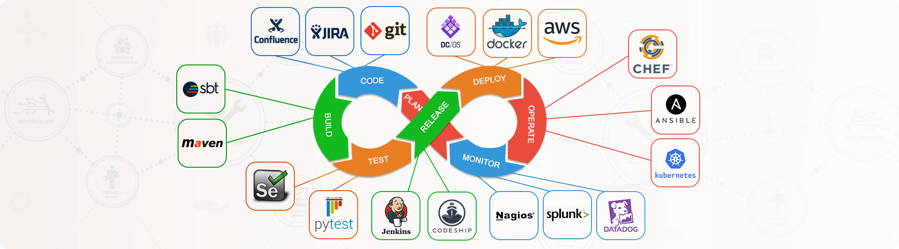

## Современные технологии программирования

Методические материалы по курсу "Современные технологии программирования" для студентов 2022 года поступления.

- [О курсе](01_О_курсе.md)
- [О преподавателях](02_О_преподавателях.md)
- [Лекционные занятия](./01_lectures/ReadMe.md)
- [Практические занятия](./02_practice/ReadMe.md)
- [Экзамен](./03_exam)
- [Рекомендуемые источники](./04_sources/ReadMe.md)

